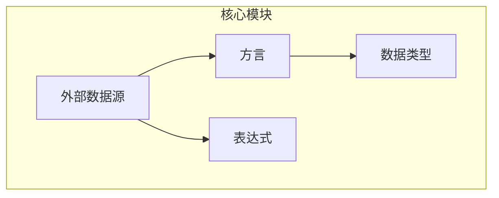
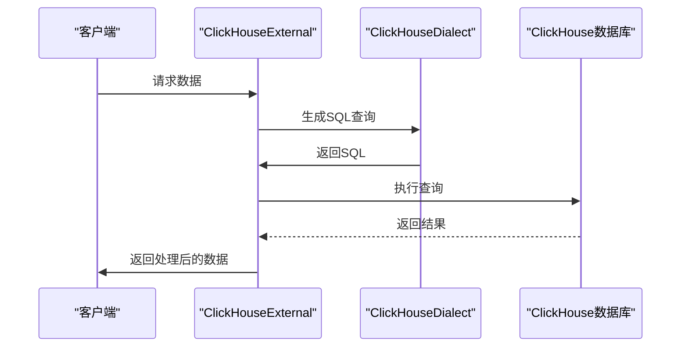
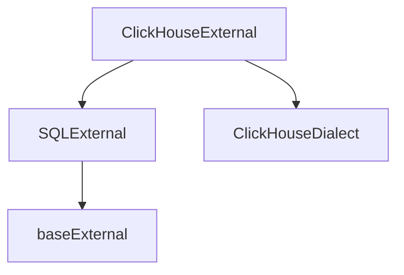

# ClickHouse数据源API

<cite>
**本文档引用的文件**   
- [clickHouseExternal.ts](file://src/external/clickHouseExternal.ts)
- [clickHouseDialect.ts](file://src/dialect/clickHouseDialect.ts)
- [sqlExternal.ts](file://src/external/sqlExternal.ts)
- [baseExternal.ts](file://src/external/baseExternal.ts)
</cite>

## 目录
1. [简介](#简介)
2. [项目结构](#项目结构)
3. [核心组件](#核心组件)
4. [架构概述](#架构概述)
5. [详细组件分析](#详细组件分析)
6. [依赖分析](#依赖分析)
7. [性能考虑](#性能考虑)
8. [故障排除指南](#故障排除指南)
9. [结论](#结论)

## 简介
本文档详细介绍了ClickHouse数据源API，重点分析了ClickHouseExternal类的配置选项和性能调优参数。文档还解释了ClickHouse特有的查询优化技术，如数据采样和近似聚合，并展示了如何利用其列式存储特性构建高效查询。此外，文档提供了物化视图和合并树引擎等高级功能的集成指南，以及处理大规模数据集的最佳实践。

## 项目结构
项目结构清晰地组织了各个模块，主要包括数据类型、方言、执行器、表达式、外部数据源等。核心文件位于`src/external/`目录下，其中`clickHouseExternal.ts`和`clickHouseDialect.ts`是实现ClickHouse数据源的关键文件。



**图表来源**
- [clickHouseExternal.ts](file://src/external/clickHouseExternal.ts#L1-L106)
- [clickHouseDialect.ts](file://src/dialect/clickHouseDialect.ts#L1-L163)

**章节来源**
- [clickHouseExternal.ts](file://src/external/clickHouseExternal.ts#L1-L106)
- [clickHouseDialect.ts](file://src/dialect/clickHouseDialect.ts#L1-L163)

## 核心组件
`ClickHouseExternal`类是ClickHouse数据源的核心，继承自`SQLExternal`，并实现了特定于ClickHouse的功能。该类负责处理数据源的配置、查询生成和结果处理。

**章节来源**
- [clickHouseExternal.ts](file://src/external/clickHouseExternal.ts#L13-L103)

## 架构概述
`ClickHouseExternal`通过`ClickHouseDialect`与ClickHouse数据库进行交互，利用其列式存储和高性能查询能力。架构设计允许灵活的查询优化和数据处理。

```mermaid
classDiagram
class ClickHouseExternal {
+static engine : string
+static type : string
+fromJS(parameters, requester) : ClickHouseExternal
+postProcessIntrospect(columns) : Attributes
+getSourceList(requester) : Promise~string[]~
+getVersion(requester) : Promise~string~
+constructor(parameters)
+getIntrospectAttributes() : Promise~Attributes~
+capability(cap) : boolean
}
class ClickHouseDialect {
+static TIME_BUCKETING : Record~string, string~
+static DATE_TIME_FN : Record~string, string~
+static TIME_PART_TO_FUNCTION : Record~string, string~
+static CAST_TO_FUNCTION : {[outputType : string] : {[inputType : string] : string}}
+escapeName(name) : string
+escapeLiteral(name) : string
+timeToSQL(date) : string
+concatExpression(a, b) : string
+containsExpression(a, b) : string
+isNotDistinctFromExpression(a, b) : string
+castExpression(inputType, operand, cast) : string
+utcToWalltime(operand, timezone) : string
+walltimeToUTC(operand, timezone) : string
+timeFloorExpression(operand, duration, timezone) : string
+timeBucketExpression(operand, duration, timezone) : string
+timePartExpression(operand, part, timezone) : string
+timeShiftExpression(operand, duration, timezone) : string
+extractExpression(operand, regexp) : string
+indexOfExpression(str, substr) : string
}
ClickHouseExternal --> ClickHouseDialect : "使用"
ClickHouseExternal --> SQLExternal : "继承"
SQLExternal --> baseExternal : "继承"
```

**图表来源**
- [clickHouseExternal.ts](file://src/external/clickHouseExternal.ts#L13-L103)
- [clickHouseDialect.ts](file://src/dialect/clickHouseDialect.ts#L4-L161)

## 详细组件分析

### ClickHouseExternal分析
`ClickHouseExternal`类提供了与ClickHouse数据库交互的接口，包括获取数据源列表、版本信息和属性描述。

#### 类分析
```mermaid
classDiagram
ClickHouseExternal : +static engine : string
ClickHouseExternal : +static type : string
ClickHouseExternal : +fromJS(parameters, requester) : ClickHouseExternal
ClickHouseExternal : +postProcessIntrospect(columns) : Attributes
ClickHouseExternal : +getSourceList(requester) : Promise~string[]~
ClickHouseExternal : +getVersion(requester) : Promise~string~
ClickHouseExternal : +constructor(parameters)
ClickHouseExternal : +getIntrospectAttributes() : Promise~Attributes~
ClickHouseExternal : +capability(cap) : boolean
```

**图表来源**
- [clickHouseExternal.ts](file://src/external/clickHouseExternal.ts#L13-L103)

#### 查询流程分析


**图表来源**
- [clickHouseExternal.ts](file://src/external/clickHouseExternal.ts#L13-L103)
- [clickHouseDialect.ts](file://src/dialect/clickHouseDialect.ts#L4-L161)

**章节来源**
- [clickHouseExternal.ts](file://src/external/clickHouseExternal.ts#L13-L103)
- [clickHouseDialect.ts](file://src/dialect/clickHouseDialect.ts#L4-L161)

## 依赖分析
`ClickHouseExternal`依赖于`SQLExternal`和`ClickHouseDialect`，并通过`baseExternal`提供基础功能。这种设计使得代码模块化，易于维护和扩展。



**图表来源**
- [clickHouseExternal.ts](file://src/external/clickHouseExternal.ts#L13-L103)
- [sqlExternal.ts](file://src/external/sqlExternal.ts#L41-L198)
- [baseExternal.ts](file://src/external/baseExternal.ts#L345-L892)

**章节来源**
- [clickHouseExternal.ts](file://src/external/clickHouseExternal.ts#L13-L103)
- [sqlExternal.ts](file://src/external/sqlExternal.ts#L41-L198)
- [baseExternal.ts](file://src/external/baseExternal.ts#L345-L892)

## 性能考虑
ClickHouse的列式存储和向量化执行引擎使其在处理大规模数据集时表现出色。通过合理使用数据采样、近似聚合和物化视图，可以进一步提升查询性能。

## 故障排除指南
在使用ClickHouse数据源时，可能会遇到连接问题、查询性能问题等。建议检查网络连接、查询语句优化和数据库配置。

**章节来源**
- [clickHouseExternal.ts](file://src/external/clickHouseExternal.ts#L13-L103)
- [clickHouseDialect.ts](file://src/dialect/clickHouseDialect.ts#L4-L161)

## 结论
本文档详细介绍了ClickHouse数据源API的各个方面，包括核心组件、架构设计、依赖关系和性能优化。通过合理利用这些功能，可以构建高效、可扩展的数据分析应用。