# Druid数据源API

<cite>
**本文档中引用的文件**   
- [druidExternal.ts](file://src/external/druidExternal.ts)
- [druidFilterBuilder.ts](file://src/external/utils/druidFilterBuilder.ts)
- [druidAggregationBuilder.ts](file://src/external/utils/druidAggregationBuilder.ts)
- [druidExpressionBuilder.ts](file://src/external/utils/druidExpressionBuilder.ts)
- [druidTypes.ts](file://src/external/utils/druidTypes.ts)
</cite>

## 目录
1. [简介](#简介)
2. [DruidExternal类实现](#druidexternal类实现)
3. [配置选项详解](#配置选项详解)
4. [查询构建器工作机制](#查询构建器工作机制)
5. [查询优化技巧](#查询优化技巧)
6. [复杂查询构建](#复杂查询构建)
7. [性能调优建议](#性能调优建议)
8. [常见问题解决方案](#常见问题解决方案)

## 简介

Druid数据源API提供了与Apache Druid数据库交互的完整功能，支持复杂的查询构建、数据聚合和过滤操作。该API通过DruidExternal类实现，提供了丰富的配置选项和查询构建工具，使开发者能够高效地从Druid数据源中提取和分析数据。

## DruidExternal类实现

DruidExternal类是Druid数据源API的核心实现，继承自External基类，专门用于处理与Druid数据库的交互。该类提供了从数据源获取、查询构建到结果处理的完整功能链。

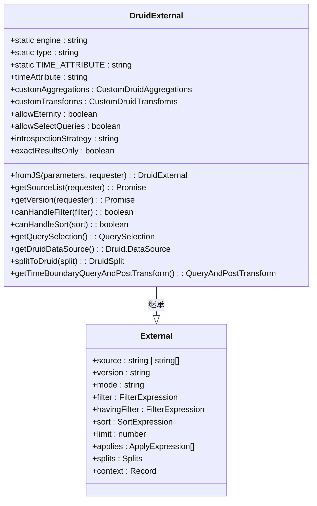
```mermaid
classDiagram
class DruidExternal {
+static engine : string
+static type : string
+static TIME_ATTRIBUTE : string
+timeAttribute : string
+customAggregations : CustomDruidAggregations
+customTransforms : CustomDruidTransforms
+allowEternity : boolean
+allowSelectQueries : boolean
+introspectionStrategy : string
+exactResultsOnly : boolean
+fromJS(parameters, requester) : DruidExternal
+getSourceList(requester) : Promise<string[]>
+getVersion(requester) : Promise<string>
+canHandleFilter(filter) : boolean
+canHandleSort(sort) : boolean
+getQuerySelection() : QuerySelection
+getDruidDataSource() : Druid.DataSource
+splitToDruid(split) : DruidSplit
+getTimeBoundaryQueryAndPostTransform() : QueryAndPostTransform<Druid.Query>
}
class External {
+source : string | string[]
+version : string
+mode : string
+filter : FilterExpression
+havingFilter : FilterExpression
+sort : SortExpression
+limit : number
+applies : ApplyExpression[]
+splits : Splits
+context : Record<string, any>
}
DruidExternal --|> External : 继承
```

**图源**
- [druidExternal.ts](file://src/external/druidExternal.ts#L136-L2087)

**本节源**
- [druidExternal.ts](file://src/external/druidExternal.ts#L136-L2087)

## 配置选项详解

DruidExternal类提供了多个特有的配置选项，用于定制数据源的行为和查询特性。

### timeAttribute配置

`timeAttribute`配置指定了数据源中时间维度的属性名称。默认情况下，Druid使用`__time`作为时间属性，但可以通过此配置进行自定义。

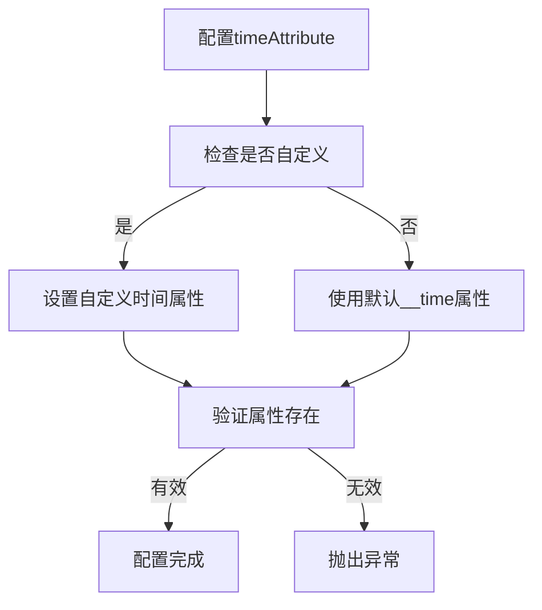
```mermaid
flowchart TD
Start["配置timeAttribute"] --> CheckCustom["检查是否自定义"]
CheckCustom --> |是| SetCustom["设置自定义时间属性"]
CheckCustom --> |否| SetDefault["使用默认__time属性"]
SetCustom --> Validate["验证属性存在"]
SetDefault --> Validate
Validate --> |有效| Complete["配置完成"]
Validate --> |无效| Error["抛出异常"]
```

**图源**
- [druidExternal.ts](file://src/external/druidExternal.ts#L150-L155)

**本节源**
- [druidExternal.ts](file://src/external/druidExternal.ts#L150-L155)

### customAggregations配置

`customAggregations`配置允许定义自定义的聚合函数，这些函数可以在查询中使用。自定义聚合可以包含多个聚合操作和后聚合操作。

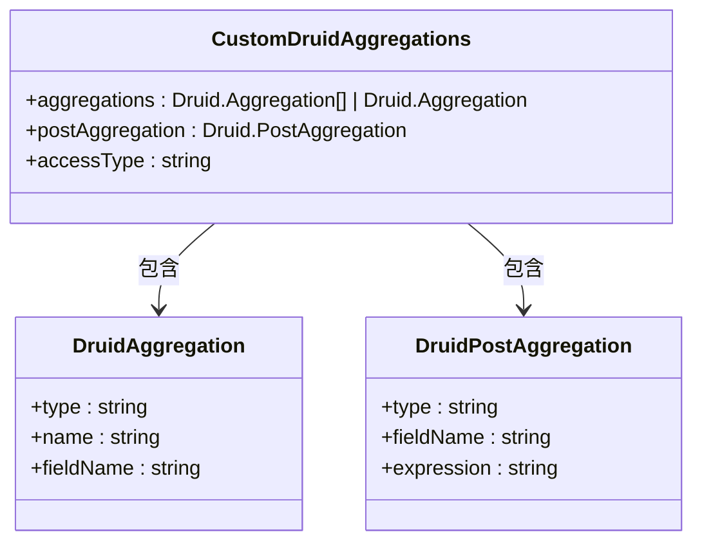
```mermaid
classDiagram
class CustomDruidAggregations {
+aggregations : Druid.Aggregation[] | Druid.Aggregation
+postAggregation : Druid.PostAggregation
+accessType : string
}
class DruidAggregation {
+type : string
+name : string
+fieldName : string
}
class DruidPostAggregation {
+type : string
+fieldName : string
+expression : string
}
CustomDruidAggregations --> DruidAggregation : 包含
CustomDruidAggregations --> DruidPostAggregation : 包含
```

**图源**
- [druidTypes.ts](file://src/external/utils/druidTypes.ts)
- [druidAggregationBuilder.ts](file://src/external/utils/druidAggregationBuilder.ts#L100-L150)

**本节源**
- [druidTypes.ts](file://src/external/utils/druidTypes.ts)
- [druidAggregationBuilder.ts](file://src/external/utils/druidAggregationBuilder.ts#L100-L150)

### customTransforms配置

`customTransforms`配置用于定义自定义的转换函数，这些函数可以在查询中对数据进行预处理。转换函数可以是JavaScript函数或其他Druid支持的提取函数。

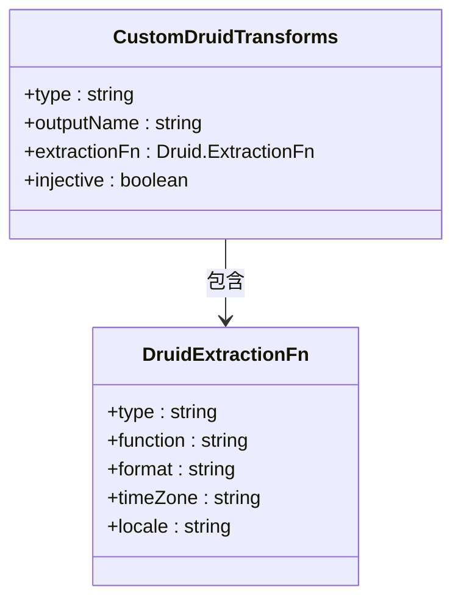
```mermaid
classDiagram
class CustomDruidTransforms {
+type : string
+outputName : string
+extractionFn : Druid.ExtractionFn
+injective : boolean
}
class DruidExtractionFn {
+type : string
+function : string
+format : string
+timeZone : string
+locale : string
}
CustomDruidTransforms --> DruidExtractionFn : 包含
```

**图源**
- [druidTypes.ts](file://src/external/utils/druidTypes.ts)
- [druidExtractionFnBuilder.ts](file://src/external/utils/druidExtractionFnBuilder.ts)

**本节源**
- [druidTypes.ts](file://src/external/utils/druidTypes.ts)
- [druidExtractionFnBuilder.ts](file://src/external/utils/druidExtractionFnBuilder.ts)

### exactResultsOnly配置

`exactResultsOnly`配置控制查询是否允许近似结果。当设置为`true`时，系统会拒绝任何可能产生近似结果的查询，确保结果的精确性。

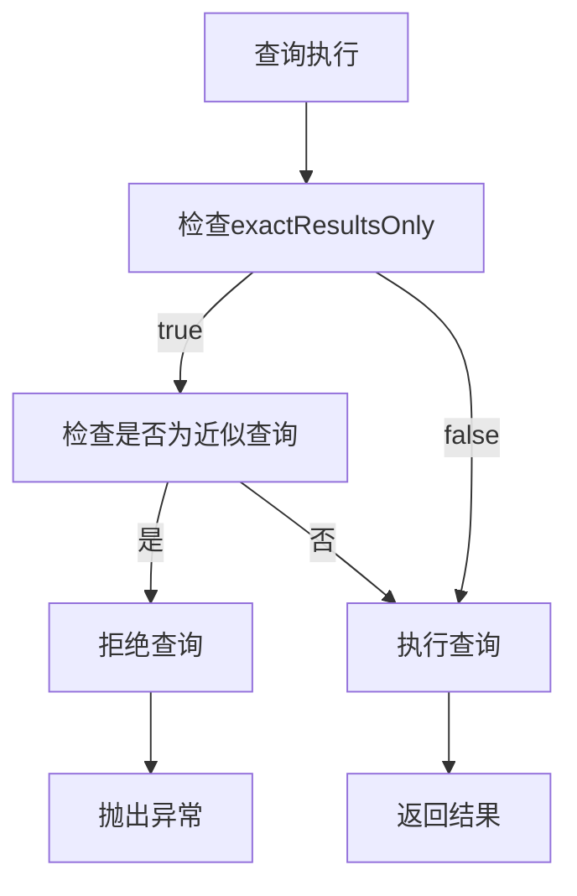
```mermaid
flowchart TD
Start["查询执行"] --> CheckExact["检查exactResultsOnly"]
CheckExact --> |true| CheckApproximate["检查是否为近似查询"]
CheckExact --> |false| Execute["执行查询"]
CheckApproximate --> |是| Reject["拒绝查询"]
CheckApproximate --> |否| Execute
Execute --> Complete["返回结果"]
Reject --> Error["抛出异常"]
```

**图源**
- [druidAggregationBuilder.ts](file://src/external/utils/druidAggregationBuilder.ts#L350-L370)
- [druidExternal.ts](file://src/external/druidExternal.ts#L190-L195)

**本节源**
- [druidAggregationBuilder.ts](file://src/external/utils/druidAggregationBuilder.ts#L350-L370)
- [druidExternal.ts](file://src/external/druidExternal.ts#L190-L195)

## 查询构建器工作机制

Druid查询构建器是一组工具类，负责将高级查询表达式转换为Druid原生查询格式。

### druidFilterBuilder工作机制

`druidFilterBuilder`负责将过滤表达式转换为Druid的过滤器结构。它支持多种过滤类型，包括选择器、范围、正则表达式等。

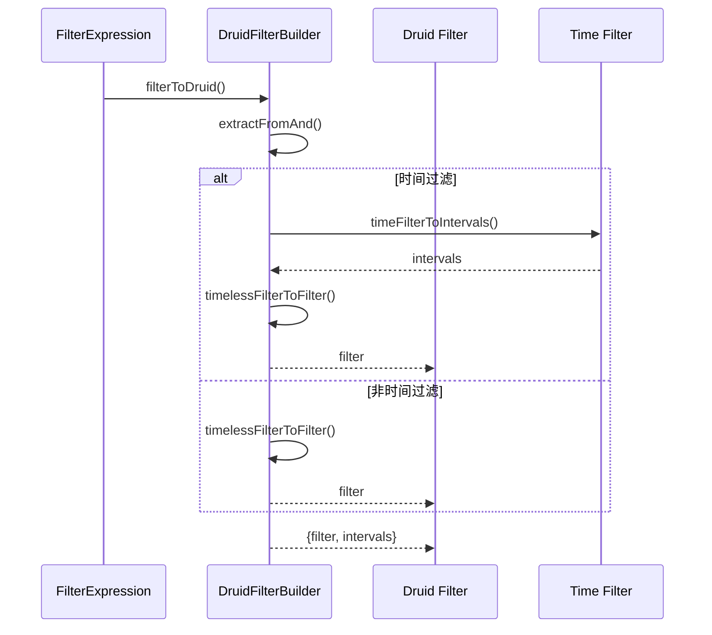
```mermaid
sequenceDiagram
participant Filter as FilterExpression
participant Builder as DruidFilterBuilder
participant Druid as Druid Filter
participant Time as Time Filter
Filter->>Builder : filterToDruid()
Builder->>Builder : extractFromAnd()
alt 时间过滤
Builder->>Time : timeFilterToIntervals()
Time-->>Builder : intervals
Builder->>Builder : timelessFilterToFilter()
Builder-->>Druid : filter
else 非时间过滤
Builder->>Builder : timelessFilterToFilter()
Builder-->>Druid : filter
end
Builder-->>Druid : {filter, intervals}
```

**图源**
- [druidFilterBuilder.ts](file://src/external/utils/druidFilterBuilder.ts#L50-L200)

**本节源**
- [druidFilterBuilder.ts](file://src/external/utils/druidFilterBuilder.ts#L50-L200)

### druidAggregationBuilder工作机制

`druidAggregationBuilder`负责将聚合表达式转换为Druid的聚合结构。它处理各种聚合类型，包括计数、求和、最小值、最大值等。

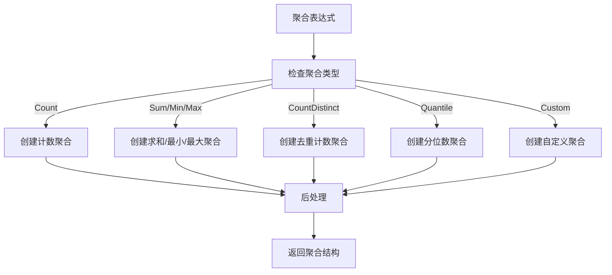
```mermaid
flowchart TD
Start["聚合表达式"] --> TypeCheck["检查聚合类型"]
TypeCheck --> |Count| CountAgg["创建计数聚合"]
TypeCheck --> |Sum/Min/Max| SumMinMaxAgg["创建求和/最小/最大聚合"]
TypeCheck --> |CountDistinct| CountDistinctAgg["创建去重计数聚合"]
TypeCheck --> |Quantile| QuantileAgg["创建分位数聚合"]
TypeCheck --> |Custom| CustomAgg["创建自定义聚合"]
CountAgg --> PostProcess["后处理"]
SumMinMaxAgg --> PostProcess
CountDistinctAgg --> PostProcess
QuantileAgg --> PostProcess
CustomAgg --> PostProcess
PostProcess --> Complete["返回聚合结构"]
```

**图源**
- [druidAggregationBuilder.ts](file://src/external/utils/druidAggregationBuilder.ts#L200-L500)

**本节源**
- [druidAggregationBuilder.ts](file://src/external/utils/druidAggregationBuilder.ts#L200-L500)

## 查询优化技巧

### rollup处理

Rollup是Druid中一种重要的数据预聚合技术，可以显著提高查询性能。在查询中正确处理rollup数据是优化的关键。

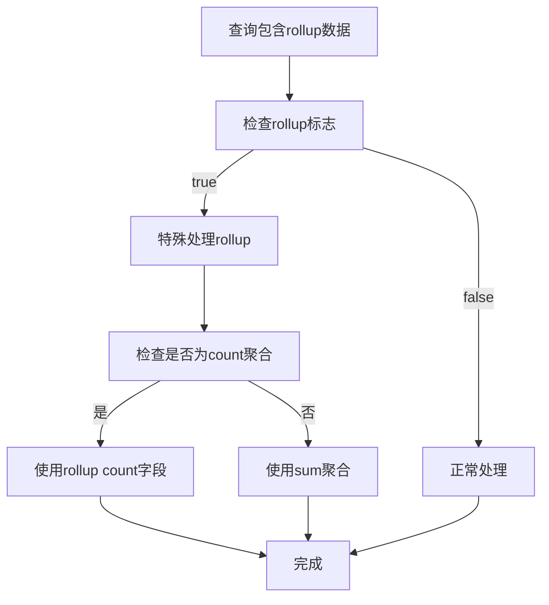
```mermaid
flowchart TD
Start["查询包含rollup数据"] --> CheckRollup["检查rollup标志"]
CheckRollup --> |true| HandleRollup["特殊处理rollup"]
CheckRollup --> |false| NormalProcess["正常处理"]
HandleRollup --> CountCheck["检查是否为count聚合"]
CountCheck --> |是| UseRollupCount["使用rollup count字段"]
CountCheck --> |否| UseSum["使用sum聚合"]
UseRollupCount --> Complete["完成"]
UseSum --> Complete
NormalProcess --> Complete
```

**图源**
- [druidAggregationBuilder.ts](file://src/external/utils/druidAggregationBuilder.ts#L650-L700)
- [druidExternalRollup.mocha.js](file://test/external/druidExternalRollup.mocha.js)

**本节源**
- [druidAggregationBuilder.ts](file://src/external/utils/druidAggregationBuilder.ts#L650-L700)
- [druidExternalRollup.mocha.js](file://test/external/druidExternalRollup.mocha.js)

### exactResultsOnly配置的影响

`exactResultsOnly`配置对查询性能有重要影响。当启用时，系统会避免使用近似算法，确保结果精确但可能降低性能。

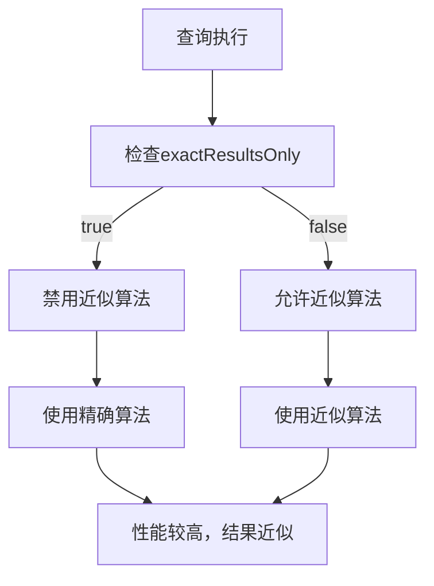
```mermaid
flowchart TD
Start["查询执行"] --> CheckExact["检查exactResultsOnly"]
CheckExact --> |true| DisableApproximate["禁用近似算法"]
CheckExact --> |false| EnableApproximate["允许近似算法"]
DisableApproximate --> UseExact["使用精确算法"]
EnableApproximate --> UseApproximate["使用近似算法"]
UseExact --> Performance["性能较低，结果精确"]
UseApproximate --> Performance["性能较高，结果近似"]
```

**图源**
- [druidAggregationBuilder.ts](file://src/external/utils/druidAggregationBuilder.ts#L350-L370)
- [druidExternal.ts](file://src/external/druidExternal.ts#L190-L195)

**本节源**
- [druidAggregationBuilder.ts](file://src/external/utils/druidAggregationBuilder.ts#L350-L370)
- [druidExternal.ts](file://src/external/druidExternal.ts#L190-L195)

## 复杂查询构建

### 聚合查询构建

构建复杂的聚合查询需要理解各种聚合函数的组合方式和后聚合处理。

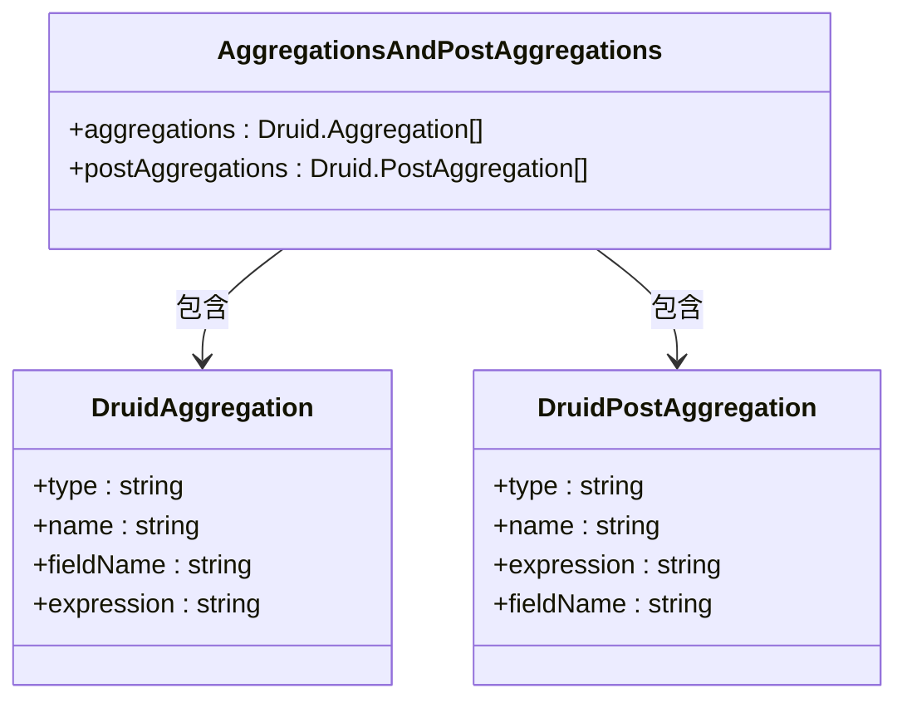
```mermaid
classDiagram
class AggregationsAndPostAggregations {
+aggregations : Druid.Aggregation[]
+postAggregations : Druid.PostAggregation[]
}
class DruidAggregation {
+type : string
+name : string
+fieldName : string
+expression : string
}
class DruidPostAggregation {
+type : string
+name : string
+expression : string
+fieldName : string
}
AggregationsAndPostAggregations --> DruidAggregation : 包含
AggregationsAndPostAggregations --> DruidPostAggregation : 包含
```

**图源**
- [druidAggregationBuilder.ts](file://src/external/utils/druidAggregationBuilder.ts#L50-L100)

**本节源**
- [druidAggregationBuilder.ts](file://src/external/utils/druidAggregationBuilder.ts#L50-L100)

### 过滤查询构建

复杂的过滤查询可以组合多个条件，包括时间过滤、维度过滤和后过滤。

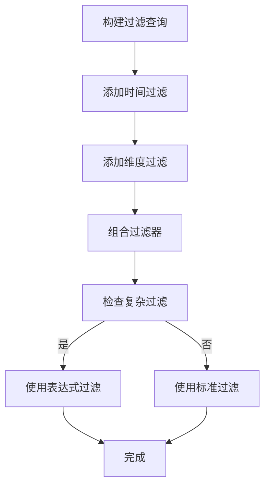
```mermaid
flowchart TD
Start["构建过滤查询"] --> TimeFilter["添加时间过滤"]
TimeFilter --> DimensionFilter["添加维度过滤"]
DimensionFilter --> Combine["组合过滤器"]
Combine --> CheckComplex["检查复杂过滤"]
CheckComplex --> |是| UseExpression["使用表达式过滤"]
CheckComplex --> |否| UseStandard["使用标准过滤"]
UseExpression --> Complete["完成"]
UseStandard --> Complete
```

**图源**
- [druidFilterBuilder.ts](file://src/external/utils/druidFilterBuilder.ts)

**本节源**
- [druidFilterBuilder.ts](file://src/external/utils/druidFilterBuilder.ts)

### 后处理查询构建

后处理查询用于在聚合后对结果进行进一步计算和转换。

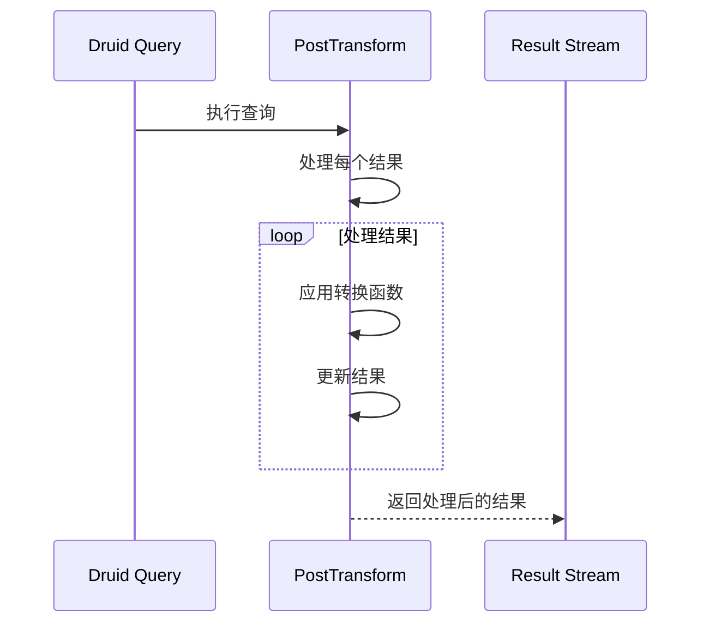
```mermaid
sequenceDiagram
participant Query as Druid Query
participant PostProcess as PostTransform
participant Result as Result Stream
Query->>PostProcess : 执行查询
PostProcess->>PostProcess : 处理每个结果
loop 处理结果
PostProcess->>PostProcess : 应用转换函数
PostProcess->>PostProcess : 更新结果
end
PostProcess-->>Result : 返回处理后的结果
```

**图源**
- [druidExternal.ts](file://src/external/druidExternal.ts#L500-L600)

**本节源**
- [druidExternal.ts](file://src/external/druidExternal.ts#L500-L600)

## 性能调优建议

### 查询选择策略

合理选择查询类型可以显著提高性能。Druid支持多种查询类型，包括timeseries、topN和groupBy。

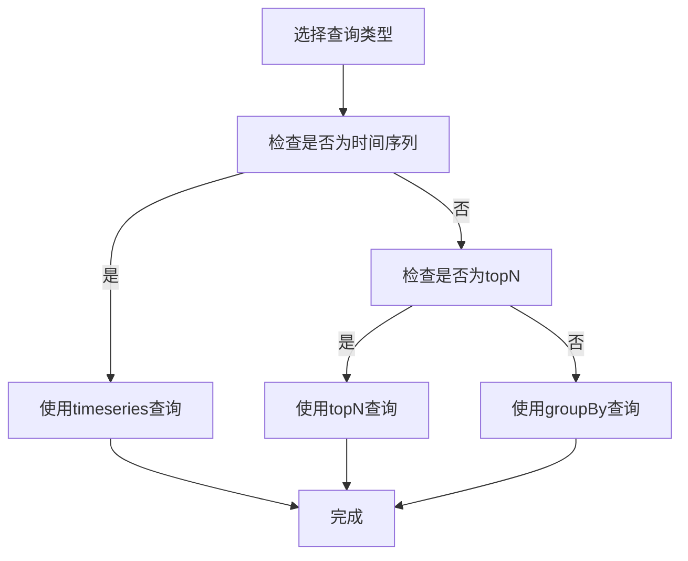
```mermaid
flowchart TD
Start["选择查询类型"] --> CheckTimeSeries["检查是否为时间序列"]
CheckTimeSeries --> |是| UseTimeseries["使用timeseries查询"]
CheckTimeSeries --> |否| CheckTopN["检查是否为topN"]
CheckTopN --> |是| UseTopN["使用topN查询"]
CheckTopN --> |否| UseGroupBy["使用groupBy查询"]
UseTimeseries --> Complete["完成"]
UseTopN --> Complete
UseGroupBy --> Complete
```

**图源**
- [druidExternal.ts](file://src/external/druidExternal.ts#L800-L900)

**本节源**
- [druidExternal.ts](file://src/external/druidExternal.ts#L800-L900)

### 资源限制配置

合理配置资源限制可以防止查询消耗过多系统资源。

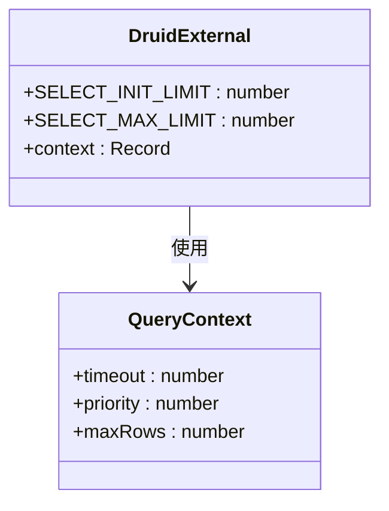
```mermaid
classDiagram
class DruidExternal {
+SELECT_INIT_LIMIT : number
+SELECT_MAX_LIMIT : number
+context : Record<string, any>
}
class QueryContext {
+timeout : number
+priority : number
+maxRows : number
}
DruidExternal --> QueryContext : 使用
```

**图源**
- [druidExternal.ts](file://src/external/druidExternal.ts#L160-L170)

**本节源**
- [druidExternal.ts](file://src/external/druidExternal.ts#L160-L170)

## 常见问题解决方案

### 处理未分割的度量

当尝试对未分割的度量进行过滤或分割时，会抛出异常。解决方案是避免对这些度量进行此类操作。

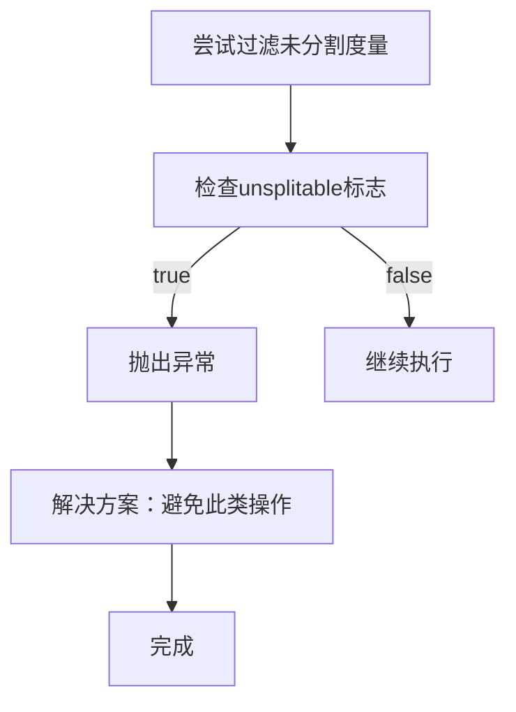
```mermaid
flowchart TD
Start["尝试过滤未分割度量"] --> CheckUnsplitable["检查unsplitable标志"]
CheckUnsplitable --> |true| ThrowError["抛出异常"]
CheckUnsplitable --> |false| Proceed["继续执行"]
ThrowError --> Solution["解决方案：避免此类操作"]
Solution --> Complete["完成"]
```

**图源**
- [druidFilterBuilder.ts](file://src/external/utils/druidFilterBuilder.ts#L400-L450)
- [druidExternal.ts](file://src/external/druidExternal.ts#L950-L1000)

**本节源**
- [druidFilterBuilder.ts](file://src/external/utils/druidFilterBuilder.ts#L400-L450)
- [druidExternal.ts](file://src/external/druidExternal.ts#L950-L1000)

### 处理近似查询限制

当`exactResultsOnly`设置为true时，近似查询会被拒绝。解决方案是根据需求调整此配置。

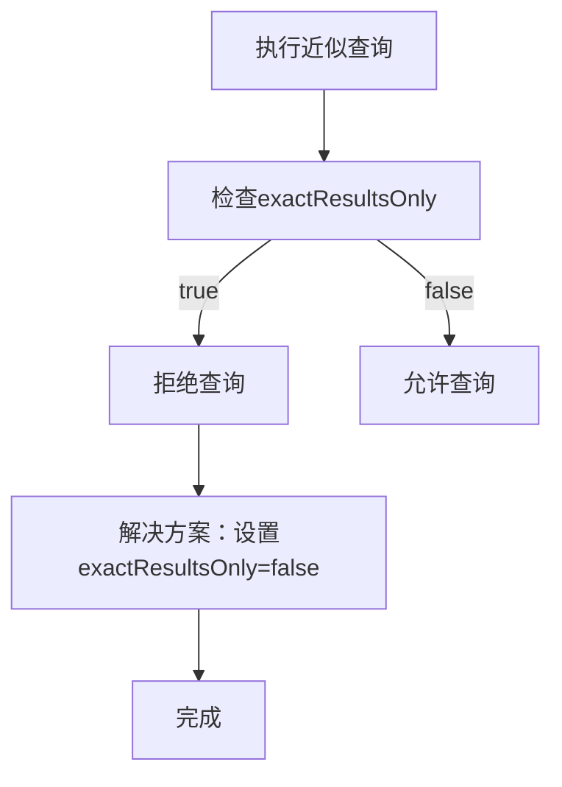
```mermaid
flowchart TD
Start["执行近似查询"] --> CheckExact["检查exactResultsOnly"]
CheckExact --> |true| RejectQuery["拒绝查询"]
CheckExact --> |false| AllowQuery["允许查询"]
RejectQuery --> Solution["解决方案：设置exactResultsOnly=false"]
Solution --> Complete["完成"]
```

**图源**
- [druidAggregationBuilder.ts](file://src/external/utils/druidAggregationBuilder.ts#L350-L370)

**本节源**
- [druidAggregationBuilder.ts](file://src/external/utils/druidAggregationBuilder.ts#L350-L370)