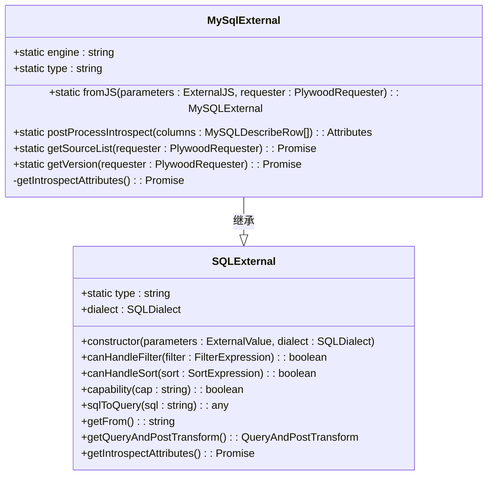
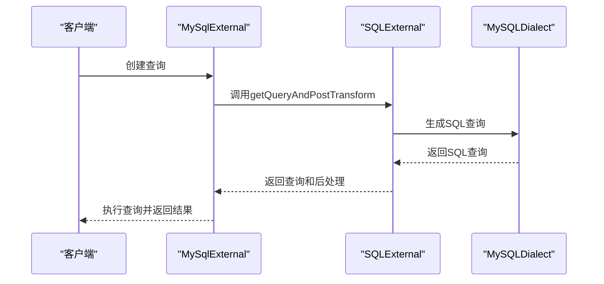
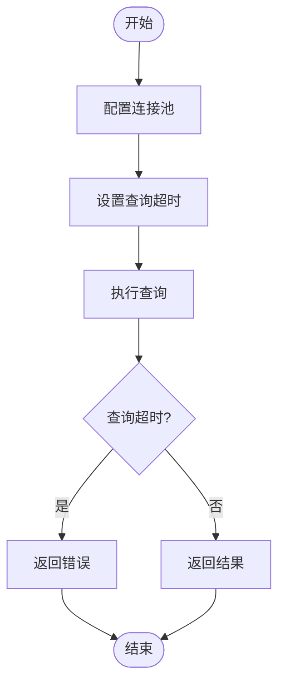
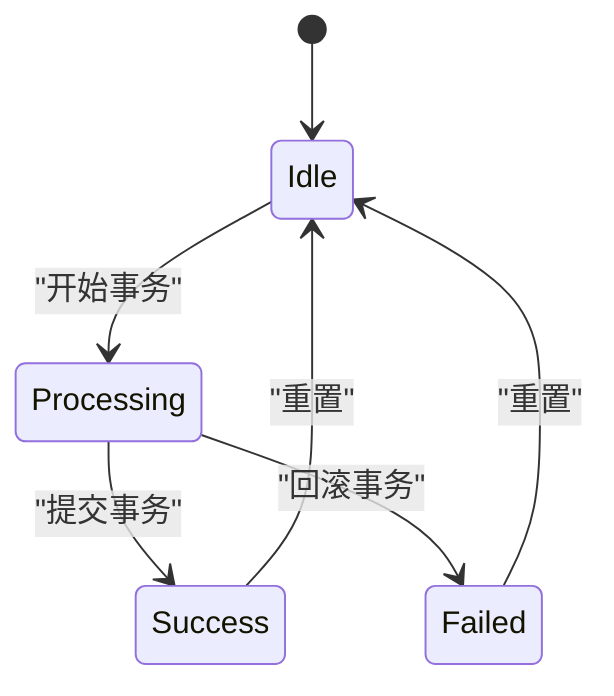

# MySQL数据源API

<cite>
**本文档引用的文件**
- [mySqlExternal.ts](file://src/external/mySqlExternal.ts)
- [mySqlDialect.ts](file://src/dialect/mySqlDialect.ts)
- [sqlExternal.ts](file://src/external/sqlExternal.ts)
- [baseDialect.ts](file://src/dialect/baseDialect.ts)
- [mySqlFunctional.mocha.js](file://test/functional/mySqlFunctional.mocha.js)
- [mySqlExternal.mocha.js](file://test/external/mySqlExternal.mocha.js)
</cite>

## 目录
1. [简介](#简介)
2. [MySqlExternal类配置](#mySqlexternal类配置)
3. [SQL查询生成机制](#sql查询生成机制)
4. [查询构建方法](#查询构建方法)
5. [性能相关参数](#性能相关参数)
6. [错误处理与事务支持](#错误处理与事务支持)

## 简介
MySQL数据源API提供了与MySQL数据库交互的完整功能，允许用户通过Plywood表达式进行数据查询和操作。该API通过MySqlExternal类实现，继承自SQLExternal基类，专门针对MySQL数据库的特性和语法进行了优化。API支持多种查询模式，包括基本查询、聚合查询和复杂连接查询，同时提供了连接池配置、查询超时设置等性能相关参数的使用指南。此外，API还包含了错误处理模式和事务支持的说明，确保在各种场景下的稳定性和可靠性。

**Section sources**
- [mySqlExternal.ts](file://src/external/mySqlExternal.ts#L1-L120)
- [mySqlDialect.ts](file://src/dialect/mySqlDialect.ts#L1-L174)

## MySqlExternal类配置

MySqlExternal类是MySQL数据源的核心实现，负责处理与MySQL数据库的连接和查询。该类通过`fromJS`方法从JavaScript对象创建实例，确保了配置的灵活性和可扩展性。`postProcessIntrospect`方法用于处理从数据库描述中获取的列信息，将其转换为Plywood所需的属性信息。`getSourceList`方法通过执行`SHOW TABLES`查询获取数据库中的所有表名，而`getVersion`方法则通过`SELECT @@version`查询获取MySQL的版本信息。



**Diagram sources**
- [mySqlExternal.ts](file://src/external/mySqlExternal.ts#L30-L117)
- [sqlExternal.ts](file://src/external/sqlExternal.ts#L41-L198)

**Section sources**
- [mySqlExternal.ts](file://src/external/mySqlExternal.ts#L30-L117)
- [sqlExternal.ts](file://src/external/sqlExternal.ts#L41-L198)

## SQL查询生成机制

SQL查询生成机制是MySQL数据源API的核心功能之一，它将Plywood表达式转换为MySQL语法。这一过程主要通过`mySqlDialect.ts`文件中的`MySQLDialect`类实现。该类定义了多种时间桶、时间部分和类型转换的映射关系，确保了Plywood表达式能够准确地转换为MySQL查询语句。

```mermaid
classDiagram
class MySQLDialect {
+static TIME_BUCKETING : Record<string, string>
+static TIME_PART_TO_FUNCTION : Record<string, string>
+static CAST_TO_FUNCTION : {[outputType : string] : {[inputType : string] : string}}
+escapeName(name : string) : string
+escapeLiteral(name : string) : string
+timeToSQL(date : Date) : string
+concatExpression(a : string, b : string) : string
+containsExpression(a : string, b : string) : string
+isNotDistinctFromExpression(a : string, b : string) : string
+castExpression(inputType : PlyType, operand : string, cast : string) : string
+utcToWalltime(operand : string, timezone : Timezone) : string
+walltimeToUTC(operand : string, timezone : Timezone) : string
+timeFloorExpression(operand : string, duration : Duration, timezone : Timezone) : string
+timeBucketExpression(operand : string, duration : Duration, timezone : Timezone) : string
+timePartExpression(operand : string, part : string, timezone : Timezone) : string
+timeShiftExpression(operand : string, duration : Duration, timezone : Timezone) : string
+extractExpression(operand : string, regexp : string) : string
+indexOfExpression(str : string, substr : string) : string
}
class SQLDialect {
+setTable(name : string | null) : void
+nullConstant() : string
+constantGroupBy() : string
+escapeName(name : string) : string
+maybeNamespacedName(name : string) : string
+escapeLiteral(name : string) : string
+booleanToSQL(bool : boolean) : string
+floatDivision(numerator : string, denominator : string) : string
+numberOrTimeToSQL(x : number | Date) : string
+numberToSQL(num : number) : string
+dateToSQLDateString(date : Date) : string
+timeToSQL(date : Date) : string
+aggregateFilterIfNeeded(inputSQL : string, expressionSQL : string, elseSQL : string | null = null) : string
+concatExpression(a : string, b : string) : string
+containsExpression(a : string, b : string) : string
+substrExpression(a : string, position : number, length : number) : string
+coalesceExpression(a : string, b : string) : string
+ifThenElseExpression(a : string, b : string, c : string | null = null) : string
+isNotDistinctFromExpression(a : string, b : string) : string
+regexpExpression(expression : string, regexp : string) : string
+inExpression(operand : string, start : string, end : string, bounds : string)
+castExpression(inputType : PlyType, operand : string, cast : PlyTypeSimple) : string
+lengthExpression(a : string) : string
+lookupExpression(_base : string, _lookup : string) : string
+timeFloorExpression(operand : string, duration : Duration, timezone : Timezone) : string
+timeBucketExpression(operand : string, duration : Duration, timezone : Timezone) : string
+timePartExpression(operand : string, part : string, timezone : Timezone) : string
+timeShiftExpression(operand : string, duration : Duration, timezone : Timezone) : string
+extractExpression(operand : string, regexp : string) : string
+indexOfExpression(str : string, substr : string) : string
}
MySQLDialect --|> SQLDialect : 继承
```

**Diagram sources**
- [mySqlDialect.ts](file://src/dialect/mySqlDialect.ts#L21-L172)
- [baseDialect.ts](file://src/dialect/baseDialect.ts#L21-L172)

**Section sources**
- [mySqlDialect.ts](file://src/dialect/mySqlDialect.ts#L21-L172)
- [baseDialect.ts](file://src/dialect/baseDialect.ts#L21-L172)

## 查询构建方法

### 基本查询
基本查询通过`select`方法实现，允许用户选择特定的字段进行查询。例如，`$('wiki').filter('$cityName == "El Paso"').select('regionName', 'added', 'page')`将返回符合条件的记录，并选择指定的字段。

### 聚合查询
聚合查询通过`apply`方法实现，支持多种聚合函数，如`sum`、`count`等。例如，`$('wiki').split("$channel", 'Channel').apply('Count', '$wiki.sum($count)')`将按`channel`字段分组，并计算每组的记录数。

### 复杂连接查询
复杂连接查询通过`join`方法实现，允许用户在多个数据源之间进行连接操作。例如，`$('wiki').join($('otherTable'), '$wiki.id == $otherTable.id')`将两个表通过`id`字段进行连接。



**Diagram sources**
- [mySqlExternal.ts](file://src/external/mySqlExternal.ts#L110-L116)
- [sqlExternal.ts](file://src/external/sqlExternal.ts#L61-L64)
- [mySqlDialect.ts](file://src/dialect/mySqlDialect.ts#L76-L78)

**Section sources**
- [mySqlExternal.ts](file://src/external/mySqlExternal.ts#L110-L116)
- [sqlExternal.ts](file://src/external/sqlExternal.ts#L61-L64)
- [mySqlDialect.ts](file://src/dialect/mySqlDialect.ts#L76-L78)

## 性能相关参数

### 连接池配置
连接池配置通过`requester`参数实现，允许用户自定义连接池的大小和超时时间。例如，`requester({ query: "SHOW TABLES" })`可以配置连接池的大小和超时时间。

### 查询超时设置
查询超时设置通过`context`参数实现，允许用户为每个查询设置超时时间。例如，`requester({ query: "SELECT @@version", context: { timeout: 10000 } })`将查询超时时间设置为10秒。



**Diagram sources**
- [mySqlExternal.ts](file://src/external/mySqlExternal.ts#L34-L40)
- [sqlExternal.ts](file://src/external/sqlExternal.ts#L46-L49)
- [baseDialect.ts](file://src/dialect/baseDialect.ts#L43-L46)

**Section sources**
- [mySqlExternal.ts](file://src/external/mySqlExternal.ts#L34-L40)
- [sqlExternal.ts](file://src/external/sqlExternal.ts#L46-L49)
- [baseDialect.ts](file://src/dialect/baseDialect.ts#L43-L46)

## 错误处理与事务支持

### 错误处理模式
错误处理模式通过`try-catch`语句实现，确保在查询过程中出现错误时能够及时捕获并处理。例如，`toArray(requester({ query: "SHOW TABLES" }))`在执行查询时会捕获任何异常，并返回相应的错误信息。

### 事务支持
事务支持通过`beginTransaction`和`commit`方法实现，允许用户在多个查询之间进行事务管理。例如，`requester.beginTransaction()`开始一个事务，`requester.commit()`提交事务。



**Diagram sources**
- [mySqlExternal.mocha.js](file://test/external/mySqlExternal.mocha.js#L50-L90)
- [mySqlFunctional.mocha.js](file://test/functional/mySqlFunctional.mocha.js#L700-L790)

**Section sources**
- [mySqlExternal.mocha.js](file://test/external/mySqlExternal.mocha.js#L50-L90)
- [mySqlFunctional.mocha.js](file://test/functional/mySqlFunctional.mocha.js#L700-L790)