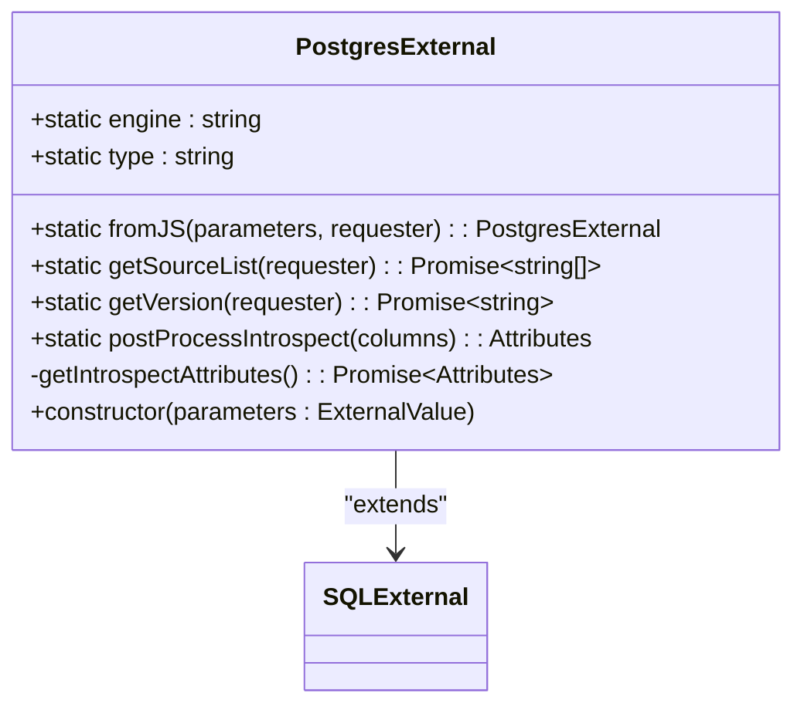
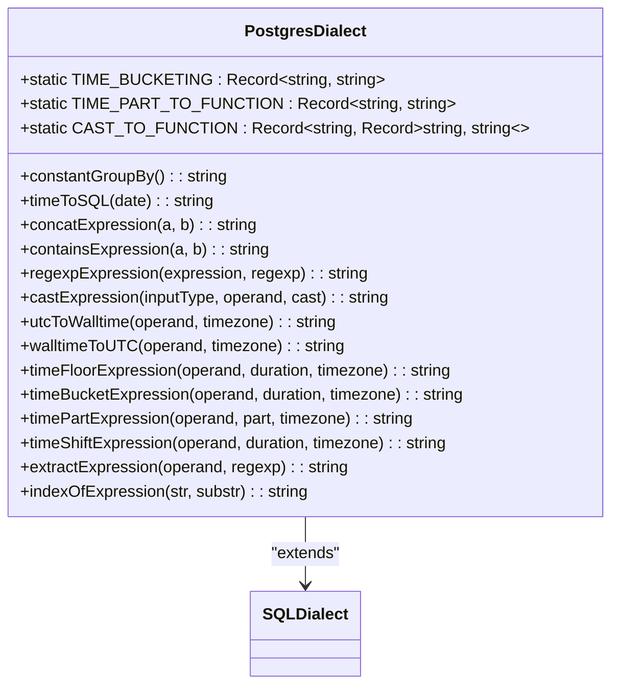
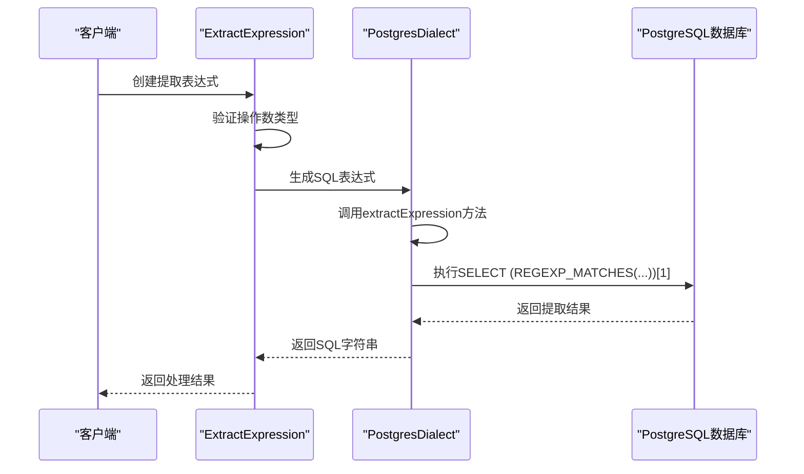

# PostgreSQL数据源API

<cite>
**Referenced Files in This Document**   
- [postgresExternal.ts](file://src/external/postgresExternal.ts)
- [postgresDialect.ts](file://src/dialect/postgresDialect.ts)
- [postgresFunctional.mocha.js](file://test/functional/postgresFunctional.mocha.js)
- [extractExpression.ts](file://src/expressions/extractExpression.ts)
</cite>

## 目录
1. [简介](#简介)
2. [PostgresExternal类配置与功能](#postgresexternal类配置与功能)
3. [PostgreSQL数据类型支持](#postgresql数据类型支持)
4. [方言差异处理](#方言差异处理)
5. [高级功能使用示例](#高级功能使用示例)
6. [连接管理与预处理语句](#连接管理与预处理语句)
7. [批量操作最佳实践](#批量操作最佳实践)
8. [PostgreSQL扩展集成](#postgresql扩展集成)

## 简介
PostgreSQL数据源API为Plywood框架提供了与PostgreSQL数据库的集成能力。该API通过`PostgresExternal`类实现，允许用户以声明式方式查询和操作PostgreSQL中的数据。API设计旨在抽象底层数据库细节，同时保留PostgreSQL特有的功能和性能优势。通过该API，用户可以执行复杂的数据分析操作，包括时间序列分析、聚合计算和数据转换，而无需直接编写SQL语句。

**Section sources**
- [postgresExternal.ts](file://src/external/postgresExternal.ts#L1-L20)

## PostgresExternal类配置与功能
`PostgresExternal`类是PostgreSQL数据源的核心实现，继承自`SQLExternal`基类。该类通过静态属性`engine`标识其数据库引擎类型为"postgres"，并通过`type`属性定义其数据类型为"DATASET"。类的构造函数接受一个`ExternalValue`参数，并自动实例化`PostgresDialect`对象以处理PostgreSQL特有的SQL方言。

该类提供了多种静态方法来支持数据库操作：
- `fromJS`：从JavaScript对象创建`PostgresExternal`实例
- `getSourceList`：查询数据库中可用的表列表
- `getVersion`：获取PostgreSQL服务器版本信息
- `postProcessIntrospect`：处理表结构描述结果，将其转换为内部属性格式

**Section sources**
- [postgresExternal.ts](file://src/external/postgresExternal.ts#L31-L136)



**Diagram sources**
- [postgresExternal.ts](file://src/external/postgresExternal.ts#L31-L136)

## PostgreSQL数据类型支持
PostgreSQL数据源API支持多种PostgreSQL原生数据类型，并将其映射到Plywood的内部类型系统。类型映射在`postProcessIntrospect`方法中实现，该方法处理从`INFORMATION_SCHEMA.COLUMNS`查询返回的列描述信息。

支持的主要数据类型包括：
- **时间类型**：包含"timestamp"的SQL类型映射为`TIME`类型
- **字符串类型**："character varying"映射为`STRING`类型
- **数值类型**："integer"、"bigint"、"double precision"和"float"映射为`NUMBER`类型
- **布尔类型**："boolean"映射为`BOOLEAN`类型
- **数组类型**：支持嵌套数组类型，如"array of character"映射为`SET/STRING`，"array of timestamp"映射为`SET/TIME`

对于数组类型，系统通过查询`INFORMATION_SCHEMA.ELEMENT_TYPES`表获取元素类型信息，确保正确的类型映射。

**Section sources**
- [postgresExternal.ts](file://src/external/postgresExternal.ts#L45-L84)

## 方言差异处理
PostgreSQL方言处理由`PostgresDialect`类负责，该类继承自`SQLDialect`基类。该类实现了PostgreSQL特有的SQL函数和操作符，确保生成的SQL语句符合PostgreSQL语法规范。

关键的方言处理功能包括：
- **时间处理**：实现`timeToSQL`方法将JavaScript日期对象转换为PostgreSQL时间戳格式
- **字符串操作**：使用`||`操作符实现字符串连接，使用`POSITION`函数实现包含检查
- **正则表达式**：使用`~`操作符实现正则表达式匹配
- **类型转换**：通过`CAST_TO_FUNCTION`映射表实现不同类型间的转换
- **时区处理**：使用`AT TIME ZONE`语法实现UTC与本地时间的转换

时间相关的操作符如`timeFloor`、`timeBucket`和`timePart`都通过`DATE_TRUNC`和`DATE_PART`函数实现，确保与PostgreSQL的时间处理机制一致。

**Section sources**
- [postgresDialect.ts](file://src/dialect/postgresDialect.ts#L1-L160)



**Diagram sources**
- [postgresDialect.ts](file://src/dialect/postgresDialect.ts#L1-L160)

## 高级功能使用示例
### JSON/JSONB字段查询
虽然当前代码库中没有直接处理JSON/JSONB类型的代码，但可以通过`extractExpression`功能实现JSON字段的查询。`ExtractExpression`类提供了从字符串中提取子串的能力，可以用于解析JSON格式的数据。



**Diagram sources**
- [extractExpression.ts](file://src/expressions/extractExpression.ts#L1-L76)
- [postgresDialect.ts](file://src/dialect/postgresDialect.ts#L145-L155)

### 数组操作
PostgreSQL数据源API通过`SET`类型支持数组操作。当查询包含数组类型的列时，系统会自动将结果转换为`Set`对象，支持集合操作如交集、并集和差集。

在测试用例中，展示了如何查询`userChars`数组字段并应用`cardinality()`函数进行过滤：
```javascript
$('wiki').filter('$userChars.cardinality() > 5')
```

**Section sources**
- [postgresFunctional.mocha.js](file://test/functional/postgresFunctional.mocha.js#L200-L220)

## 连接管理与预处理语句
虽然当前代码库中没有直接的连接管理和预处理语句实现，但通过分析依赖关系可以推断其设计模式。项目依赖`pg`、`pg-pool`和`pg-types`等npm包，表明使用了`node-postgres`生态系统进行数据库连接管理。

`pg-pool`包提供了连接池功能，可以有效管理数据库连接，避免频繁创建和销毁连接的开销。`pg-types`包处理PostgreSQL数据类型与JavaScript类型的转换，包括数组、字节流和时间间隔等复杂类型。

预处理语句的支持可能通过`plywood-postgres-requester`实现，该请求器工厂创建的请求器对象可能封装了预处理语句的创建和执行逻辑。

**Section sources**
- [package-lock.json](file://package-lock.json#L1411-L1491)

## 批量操作最佳实践
批量操作的最佳实践主要体现在数据查询和处理的效率优化上。通过`toArray`工具函数将流式结果转换为数组，可以一次性处理大量数据，减少I/O开销。

在`getSourceList`和`getVersion`等静态方法中，都采用了流式处理模式：
```javascript
return toArray(requester({ query: "SELECT version()" }))
```

这种模式允许在数据到达时立即开始处理，而不需要等待所有数据加载完成，特别适合处理大规模数据集。

**Section sources**
- [postgresExternal.ts](file://src/external/postgresExternal.ts#L90-L122)

## PostgreSQL扩展集成
PostgreSQL扩展集成主要通过`pg-types`依赖实现，该包支持多种PostgreSQL扩展数据类型：
- `postgres-array`：处理数组类型
- `postgres-bytea`：处理字节流类型
- `postgres-date`：处理日期类型
- `postgres-interval`：处理时间间隔类型

这些扩展包确保了复杂数据类型的正确序列化和反序列化，使得Plywood能够无缝处理PostgreSQL中的各种数据类型。

**Section sources**
- [package-lock.json](file://package-lock.json#L1590-L1627)