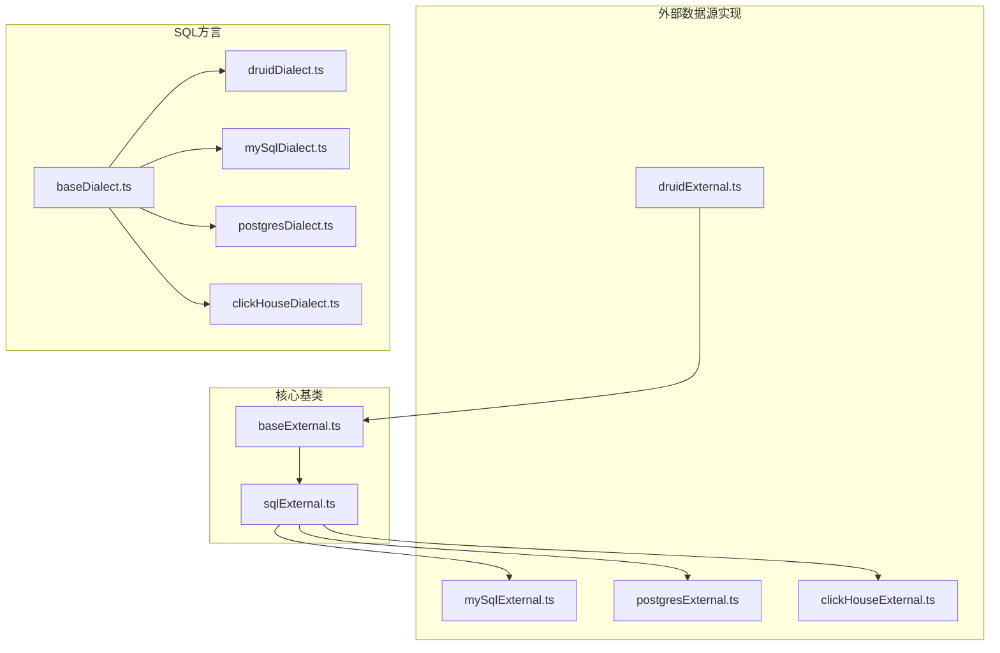
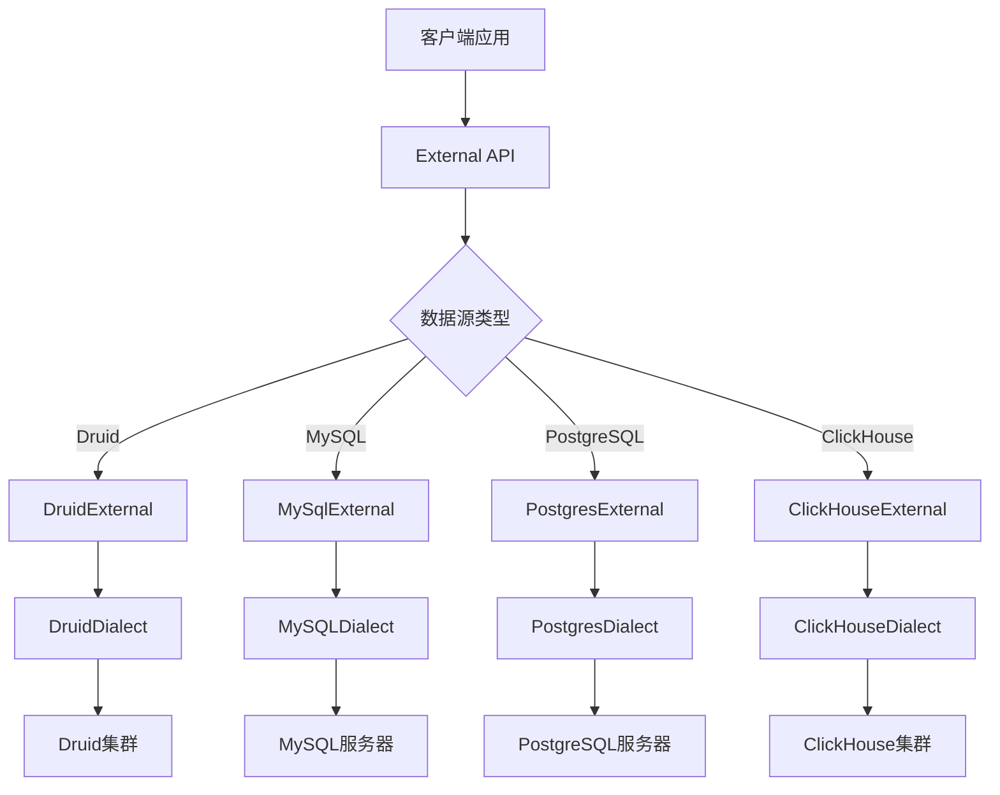
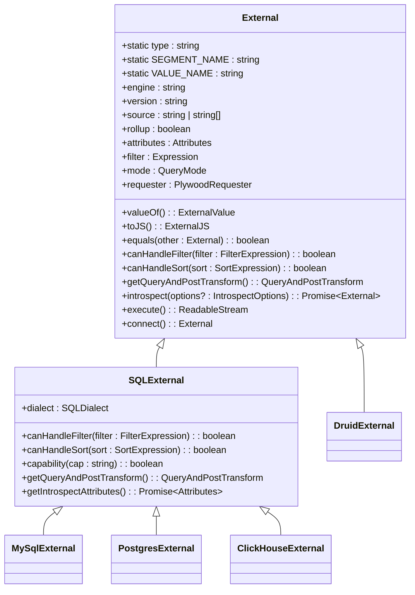
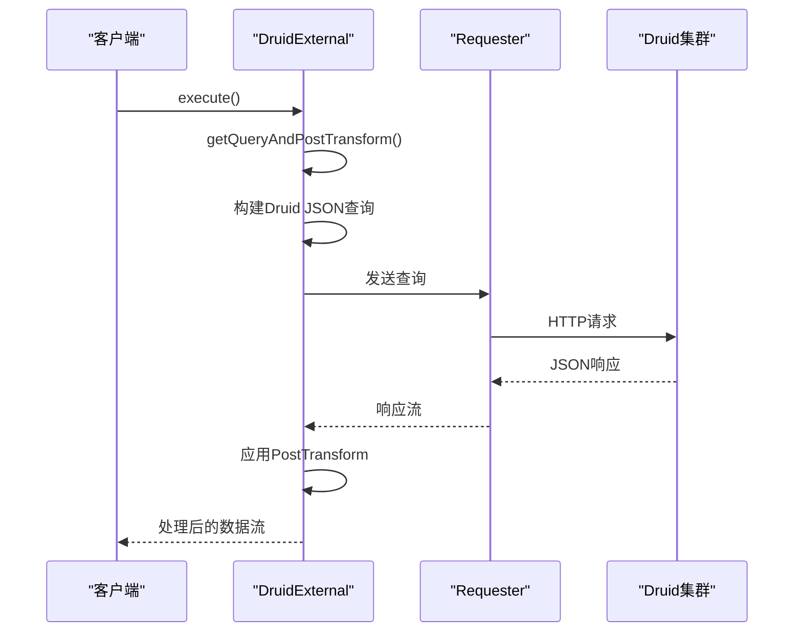
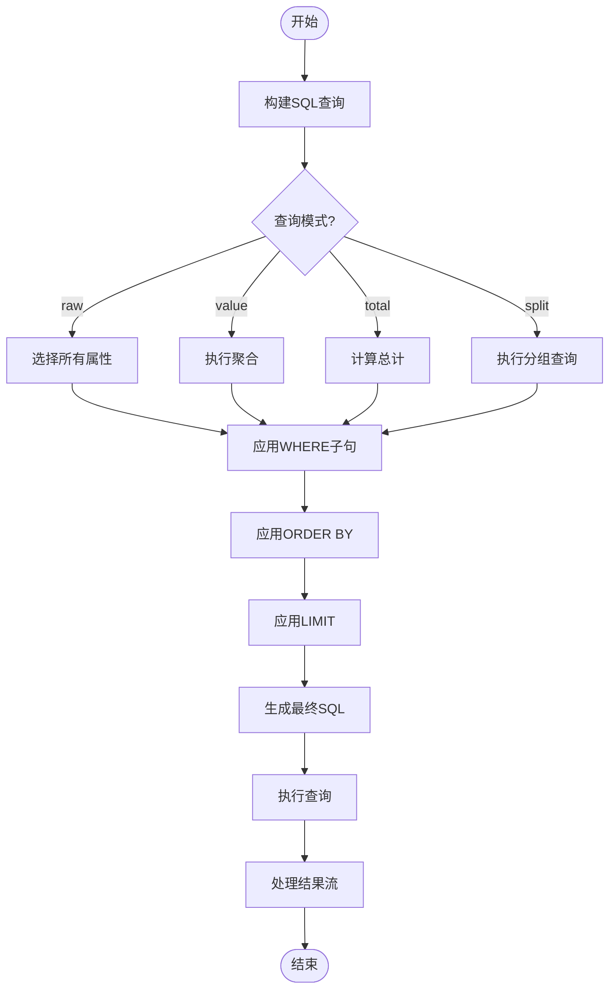
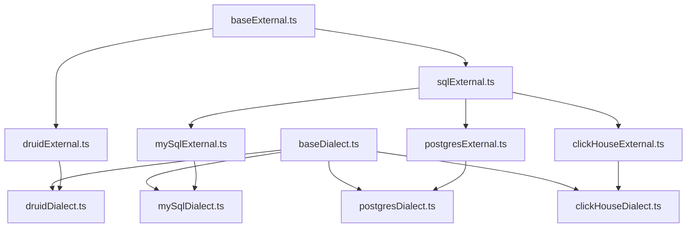

# 外部数据源API

<cite>
**本文档引用的文件**
- [baseExternal.ts](file://src/external/baseExternal.ts)
- [druidExternal.ts](file://src/external/druidExternal.ts)
- [mySqlExternal.ts](file://src/external/mySqlExternal.ts)
- [postgresExternal.ts](file://src/external/postgresExternal.ts)
- [clickHouseExternal.ts](file://src/external/clickHouseExternal.ts)
- [sqlExternal.ts](file://src/external/sqlExternal.ts)
- [baseDialect.ts](file://src/dialect/baseDialect.ts)
- [clickHouseDialect.ts](file://src/dialect/clickHouseDialect.ts)
- [druidDialect.ts](file://src/dialect/druidDialect.ts)
- [mySqlDialect.ts](file://src/dialect/mySqlDialect.ts)
- [postgresDialect.ts](file://src/dialect/postgresDialect.ts)
</cite>

## 目录
1. [简介](#简介)
2. [项目结构](#项目结构)
3. [核心组件](#核心组件)
4. [架构概述](#架构概述)
5. [详细组件分析](#详细组件分析)
6. [依赖分析](#依赖分析)
7. [性能考虑](#性能考虑)
8. [故障排除指南](#故障排除指南)
9. [结论](#结论)
10. [附录](#附录)（如有必要）

## 简介
本文档详细介绍了Plywood框架中外部数据源API的设计与实现。重点阐述了`External`类的公共接口，包括`connect`、`introspect`、`execute`等核心方法。文档对比了`DruidExternal`、`MySqlExternal`、`PostgresExternal`和`ClickHouseExternal`四种具体实现的差异和配置选项，并解释了`baseExternal.ts`中定义的通用行为和生命周期管理。通过配置示例和代码模式，为开发者提供连接不同数据库和执行查询的完整参考。

## 项目结构
Plywood项目的外部数据源功能主要集中在`src/external`目录下，该目录包含了所有与外部数据源交互的核心类和工具。`baseExternal.ts`定义了所有外部数据源的基类和通用接口，而`druidExternal.ts`、`mySqlExternal.ts`、`postgresExternal.ts`和`clickHouseExternal.ts`则分别实现了针对不同数据库的具体逻辑。`sqlExternal.ts`为所有基于SQL的数据库提供了共享的抽象层。`src/dialect`目录下的文件定义了不同数据库的SQL方言，确保生成的查询语句符合特定数据库的语法要求。

**图示来源**
- [baseExternal.ts](file://src/external/baseExternal.ts)
- [sqlExternal.ts](file://src/external/sqlExternal.ts)
- [druidExternal.ts](file://src/external/druidExternal.ts)
- [mySqlExternal.ts](file://src/external/mySqlExternal.ts)
- [postgresExternal.ts](file://src/external/postgresExternal.ts)
- [clickHouseExternal.ts](file://src/external/clickHouseExternal.ts)
- [baseDialect.ts](file://src/dialect/baseDialect.ts)
- [druidDialect.ts](file://src/dialect/druidDialect.ts)
- [mySqlDialect.ts](file://src/dialect/mySqlDialect.ts)
- [postgresDialect.ts](file://src/dialect/postgresDialect.ts)
- [clickHouseDialect.ts](file://src/dialect/clickHouseDialect.ts)

**本节来源**
- [src/external](file://src/external)
- [src/dialect](file://src/dialect)

## 核心组件
外部数据源API的核心是`External`抽象类，它定义了所有数据源实现必须遵循的公共接口。该类提供了`connect`、`introspect`和`execute`等核心方法，用于建立连接、获取元数据和执行查询。`External`类通过`value`和`toJS`方法支持序列化和反序列化，确保配置可以在不同环境间传递。`canHandleFilter`和`canHandleSort`方法用于查询优化，判断特定的过滤和排序操作是否可以由底层数据源直接处理。`getQueryAndPostTransform`方法是执行查询的核心，它将Plywood表达式转换为底层数据源的查询语言，并设置结果流的后处理转换器。

**本节来源**
- [baseExternal.ts](file://src/external/baseExternal.ts#L1-L799)

## 架构概述
外部数据源API采用分层架构，上层是通用的`External`接口，中层是针对特定数据库类型的抽象（如`SQLExternal`），下层是具体的数据库实现（如`MySqlExternal`）。这种设计实现了代码的高复用性和良好的扩展性。`External`类负责管理通用的生命周期和状态，`SQLExternal`类为所有SQL数据库提供了共享的查询构建逻辑，而具体的实现类则专注于处理特定数据库的细节，如元数据获取和方言差异。`Dialect`类的引入进一步解耦了查询生成逻辑与具体数据库的语法，使得添加新的数据库支持变得更加容易。

**图示来源**
- [baseExternal.ts](file://src/external/baseExternal.ts)
- [druidExternal.ts](file://src/external/druidExternal.ts)
- [mySqlExternal.ts](file://src/external/mySqlExternal.ts)
- [postgresExternal.ts](file://src/external/postgresExternal.ts)
- [clickHouseExternal.ts](file://src/external/clickHouseExternal.ts)
- [druidDialect.ts](file://src/dialect/druidDialect.ts)
- [mySqlDialect.ts](file://src/dialect/mySqlDialect.ts)
- [postgresDialect.ts](file://src/dialect/postgresDialect.ts)
- [clickHouseDialect.ts](file://src/dialect/clickHouseDialect.ts)

## 详细组件分析
本节将深入分析`External`类及其各个具体实现，探讨它们的接口、行为差异和配置选项。

### External类分析
`External`类是所有外部数据源的基类，它定义了通用的行为和生命周期。该类通过抽象方法`getIntrospectAttributes`强制子类实现元数据获取逻辑。`getQueryAndPostTransform`方法根据当前的查询模式（raw, value, total, split）生成相应的查询和结果处理流。`inflateArrays`和`getInteligentInflater`等静态方法负责将原始查询结果转换为Plywood内部的数据结构。

**图示来源**
- [baseExternal.ts](file://src/external/baseExternal.ts#L1-L799)
- [sqlExternal.ts](file://src/external/sqlExternal.ts#L1-L199)

**本节来源**
- [baseExternal.ts](file://src/external/baseExternal.ts#L1-L799)
- [sqlExternal.ts](file://src/external/sqlExternal.ts#L1-L199)

### DruidExternal实现分析
`DruidExternal`类专门用于与Apache Druid数据存储进行交互。它通过`segment-metadata`和`datasource-get`等Druid特有的查询来获取元数据。该实现支持Druid的`topN`和`groupBy`查询模式，并通过`DruidAggregationBuilder`和`DruidFilterBuilder`等工具类将Plywood表达式转换为Druid JSON查询。`allowSelectQueries`配置选项允许或禁止生成Druid的`scan`查询。

**图示来源**
- [druidExternal.ts](file://src/external/druidExternal.ts#L1-L799)

**本节来源**
- [druidExternal.ts](file://src/external/druidExternal.ts#L1-L799)

### MySqlExternal、PostgresExternal和ClickHouseExternal实现分析
`MySqlExternal`、`PostgresExternal`和`ClickHouseExternal`都继承自`SQLExternal`，共享大部分SQL查询构建逻辑。它们的主要区别在于使用的`Dialect`实例不同，这导致了生成的SQL语句在语法上的差异。例如，`MySQLDialect`使用反引号(`)来转义标识符，而`PostgresDialect`使用双引号(")。`ClickHouseExternal`通过重写`capability`方法，明确表示不支持`filter-on-attribute`和`shortcut-group-by`功能。

**图示来源**
- [mySqlExternal.ts](file://src/external/mySqlExternal.ts#L1-L120)
- [postgresExternal.ts](file://src/external/postgresExternal.ts#L1-L139)
- [clickHouseExternal.ts](file://src/external/clickHouseExternal.ts#L1-L106)
- [sqlExternal.ts](file://src/external/sqlExternal.ts#L1-L199)

**本节来源**
- [mySqlExternal.ts](file://src/external/mySqlExternal.ts#L1-L120)
- [postgresExternal.ts](file://src/external/postgresExternal.ts#L1-L139)
- [clickHouseExternal.ts](file://src/external/clickHouseExternal.ts#L1-L106)
- [sqlExternal.ts](file://src/external/sqlExternal.ts#L1-L199)

## 依赖分析
外部数据源API的依赖关系清晰，形成了一个稳定的层次结构。`External`类是整个模块的基石，被所有具体实现所依赖。`SQLExternal`作为`External`的子类，为所有基于SQL的数据库提供了共享功能，减少了代码重复。`Dialect`类的继承体系（`baseDialect.ts`为基类）确保了SQL生成逻辑的可扩展性。`requester`对象作为外部依赖，负责实际的网络通信，实现了与具体HTTP客户端的解耦。

**图示来源**
- [baseExternal.ts](file://src/external/baseExternal.ts)
- [druidExternal.ts](file://src/external/druidExternal.ts)
- [sqlExternal.ts](file://src/external/sqlExternal.ts)
- [mySqlExternal.ts](file://src/external/mySqlExternal.ts)
- [postgresExternal.ts](file://src/external/postgresExternal.ts)
- [clickHouseExternal.ts](file://src/external/clickHouseExternal.ts)
- [baseDialect.ts](file://src/dialect/baseDialect.ts)
- [druidDialect.ts](file://src/dialect/druidDialect.ts)
- [mySqlDialect.ts](file://src/dialect/mySqlDialect.ts)
- [postgresDialect.ts](file://src/dialect/postgresDialect.ts)
- [clickHouseDialect.ts](file://src/dialect/clickHouseDialect.ts)

**本节来源**
- [src/external](file://src/external)
- [src/dialect](file://src/dialect)

## 性能考虑
在使用外部数据源API时，应考虑以下性能因素。首先，`introspect`操作可能会产生昂贵的元数据查询，应尽量缓存其结果。其次，对于大规模数据集，应避免使用`raw`模式获取所有数据，而应使用`split`或`value`模式进行聚合。`DruidExternal`的`topN`查询在处理高基数维度时性能较差，应谨慎使用。最后，`requester`的配置（如超时和重试策略）对整体性能有显著影响，应根据网络环境进行优化。

## 故障排除指南
当遇到外部数据源连接问题时，首先检查`requester`配置是否正确。对于查询失败，应查看生成的底层查询（如SQL或Druid JSON）是否符合预期。元数据获取失败通常与数据库权限或网络连接有关。如果结果数据类型不正确，可能是`Inflater`配置有误，需要检查`postTransform`链。使用`performQueryAndPostTransform`方法中的`rawQueries`参数可以方便地捕获和调试实际发送的查询。

**本节来源**
- [baseExternal.ts](file://src/external/baseExternal.ts#L1-L799)
- [druidExternal.ts](file://src/external/druidExternal.ts#L1-L799)

## 结论
Plywood的外部数据源API提供了一个强大且灵活的框架，用于与多种后端数据存储进行交互。通过清晰的分层设计和抽象，它在保证功能丰富性的同时，也实现了代码的高复用性和可维护性。开发者可以根据具体需求选择合适的实现，并利用其丰富的配置选项进行优化。未来的工作可以集中在增加对更多数据库的支持和进一步优化查询性能上。