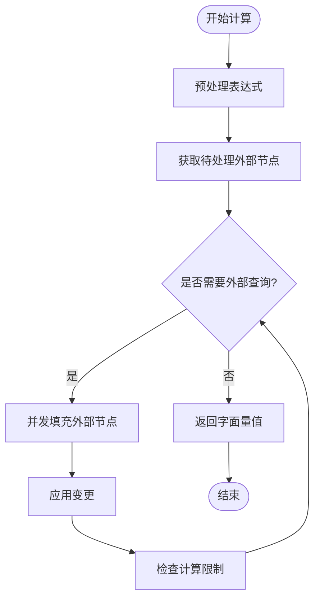

# 执行器API

<cite>
**本文档引用的文件**   
- [basicExecutor.ts](file://src/executor/basicExecutor.ts)
- [baseExpression.ts](file://src/expressions/baseExpression.ts)
- [dataset.ts](file://src/datatypes/dataset.ts)
- [baseExternal.ts](file://src/external/baseExternal.ts)
</cite>

## 目录
1. [简介](#简介)
2. [Executor接口设计](#executor接口设计)
3. [BasicExecutor实现](#basicexecutor实现)
4. [表达式计算流程](#表达式计算流程)
5. [错误与超时处理](#错误与超时处理)
6. [自定义执行器创建指南](#自定义执行器创建指南)
7. [外部数据源集成模式](#外部数据源集成模式)
8. [compute函数工作原理](#compute函数工作原理)
9. [性能调优建议](#性能调优建议)
10. [结论](#结论)

## 简介
执行器模块是Plywood系统的核心组件，负责接收表达式并返回计算结果。该模块通过Executor接口定义了统一的调用契约，允许系统以一致的方式处理各种数据操作。BasicExecutor作为默认实现，提供了基础的执行能力，支持从简单计算到复杂数据查询的多种场景。本文档详细说明了执行器的设计理念、实现细节以及最佳实践，为开发者提供全面的API参考。

## Executor接口设计
Executor接口定义了执行表达式计算的核心契约，采用函数式编程范式，将执行器本身设计为可调用的函数对象。该接口接收表达式和计算选项作为参数，返回一个Promise，以支持异步计算。设计上强调了简洁性和灵活性，允许执行器在不同上下文中复用。接口的泛型设计确保了类型安全，同时通过可选的计算选项参数提供了扩展能力，支持超时、并发限制等高级功能。

**Section sources**
- [basicExecutor.ts](file://src/executor/basicExecutor.ts#L20-L22)

## BasicExecutor实现
BasicExecutor通过basicExecutorFactory工厂函数创建，接收包含数据集和数据立方体名称的参数对象。实现中将这些参数闭包在返回的执行函数中，确保每次执行都能访问到正确的上下文。执行器在调用时会自动将数据立方体名称注入计算选项，为后续的查询处理提供必要的元数据。这种设计模式实现了配置与执行的分离，提高了代码的可测试性和可维护性。

**Section sources**
- [basicExecutor.ts](file://src/executor/basicExecutor.ts#L29-L42)

## 表达式计算流程
表达式计算流程始于compute方法的调用，该方法首先对表达式进行预处理，包括环境定义、引用检查和上下文解析。处理后的表达式进入计算循环，通过getReadyExternals识别需要外部查询的节点，并使用fillExpressionExternalAlterationAsync并发填充这些节点。计算循环在达到最大计算周期、查询限制或超时条件时终止，最终返回解析后的字面量值。整个流程采用流式处理，支持大数据集的高效计算。



**Diagram sources **
- [baseExpression.ts](file://src/expressions/baseExpression.ts#L2334-L2336)
- [baseExpression.ts](file://src/expressions/baseExpression.ts#L2022-L2042)

## 错误与超时处理
系统通过多层机制处理错误和超时。在计算循环中，每个外部查询都设置了独立的超时检查，当总执行时间超过指定阈值时，会立即终止并拒绝Promise。错误处理采用标准的Promise拒绝模式，将超时错误和其他查询异常统一抛出。此外，系统还提供了beforePerSplitRequestFn和afterSplitRequestFn钩子函数，允许在查询前后进行自定义的错误监控和日志记录，增强了系统的可观测性。

**Section sources**
- [baseExpression.ts](file://src/expressions/baseExpression.ts#L2321-L2324)

## 自定义执行器创建指南
创建自定义执行器需要实现Executor接口，通常通过扩展BasicExecutor或直接实现计算逻辑。关键步骤包括：定义执行上下文、实现表达式解析逻辑、处理外部数据源查询以及管理计算资源。建议使用工厂模式创建执行器实例，以便在运行时注入不同的配置。对于复杂的执行需求，可以重写compute方法，添加自定义的预处理或后处理逻辑，同时保持与现有API的兼容性。

## 外部数据源集成模式
外部数据源集成通过External抽象类实现，支持多种数据库和数据存储系统。集成模式基于查询计划的生成和执行，首先通过getReadyExternals识别表达式中的外部引用，然后使用requester组件发送实际查询。系统支持并发查询限制和查询分页，通过next函数实现大数据集的流式处理。对于不支持的查询类型，系统会自动降级或抛出异常，确保了集成的健壮性。

**Section sources**
- [baseExternal.ts](file://src/external/baseExternal.ts#L1702-L1709)

## compute函数工作原理
compute函数是表达式计算的核心，采用Promise链式调用实现异步处理。函数首先解析上下文中的数据引用，然后准备表达式进行计算。计算过程由promiseWhile循环驱动，持续处理外部节点直到满足终止条件。每个计算周期都会并发执行多个外部查询，并将结果应用回表达式。最终，当表达式完全解析为字面量时，返回计算结果。该设计平衡了性能和资源消耗，适用于各种规模的数据处理。

```mermaid
sequenceDiagram
participant Client as "客户端"
participant Compute as "compute函数"
participant Loop as "计算循环"
participant External as "外部查询"
Client->>Compute : 调用compute(context, options)
Compute->>Compute : 解析上下文
Compute->>Compute : 准备表达式
Compute->>Loop : 开始计算循环
Loop->>External : 获取待处理外部节点
External-->>Loop : 返回节点列表
Loop->>External : 并发填充节点
External-->>Loop : 返回填充结果
Loop->>Compute : 应用变更并检查限制
alt 达到限制
Loop-->>Compute : 终止循环
else 继续
Loop->>Loop : 下一周期
end
Compute-->>Client : 返回最终结果
```

**Diagram sources **
- [baseExpression.ts](file://src/expressions/baseExpression.ts#L2334-L2336)
- [baseExpression.ts](file://src/expressions/baseExpression.ts#L2058-L2081)

## 性能调优建议
为优化执行器性能，建议采取以下措施：合理设置maxComputeCycles和maxQueries限制，避免无限循环和资源耗尽；利用concurrentQueryLimit控制并发度，平衡吞吐量和系统负载；对于大数据集，启用maxRows限制以防止内存溢出；在生产环境中配置适当的超时时间，确保服务的响应性。此外，通过分析simulateQueryPlan输出的查询计划，可以识别性能瓶颈并进行针对性优化。

## 结论
执行器模块通过清晰的接口设计和灵活的实现，为Plywood系统提供了强大的数据处理能力。其基于Promise的异步计算模型、流式处理架构和健壮的错误处理机制，确保了在各种应用场景下的高效和可靠。通过理解其内部工作原理和遵循最佳实践，开发者可以充分利用该模块的功能，构建高性能的数据分析应用。