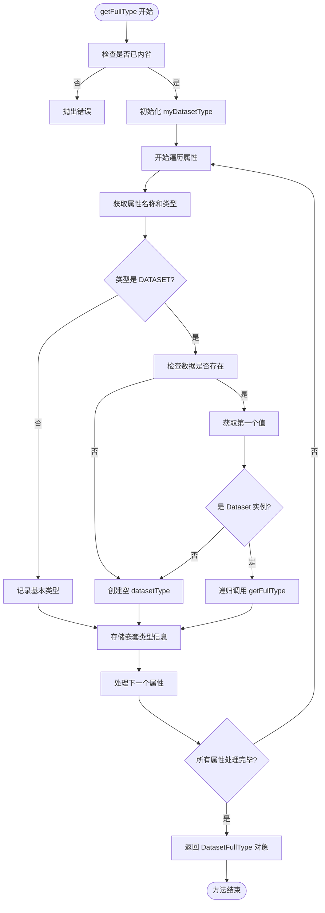
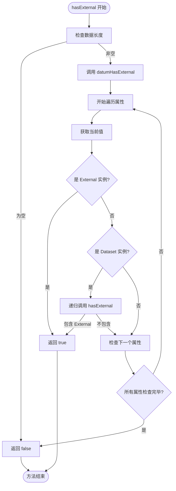
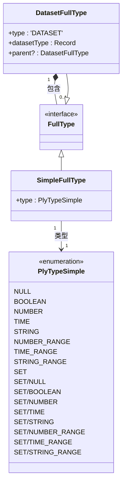

# 类型系统集成

<cite>
**本文档中引用的文件**  
- [dataset.ts](file://src/datatypes/dataset.ts)
- [common.ts](file://src/datatypes/common.ts)
- [baseExternal.ts](file://src/external/baseExternal.ts)
- [types.ts](file://src/types.ts)
</cite>

## 目录
1. [引言](#引言)
2. [getFullType 方法详解](#getfulltype-方法详解)
3. [hasExternal 方法分析](#hasexternal-方法分析)
4. [类型系统集成与端到端类型安全](#类型系统集成与端到端类型安全)
5. [结论](#结论)

## 引言
Plywood 是一个用于处理大型数据集的 JavaScript 库，其核心特性之一是强大的类型推断系统。该系统通过 `getFullType` 和 `hasExternal` 等关键方法，确保在查询规划和执行阶段的数据类型安全。本文档重点讲解 `getFullType` 方法如何递归分析 Dataset 结构并生成完整的类型签名，以及 `hasExternal` 方法如何检测 External 引用并影响查询执行路径。

## getFullType 方法详解

`getFullType` 方法是 Plywood 类型推断系统的核心，它负责生成包含嵌套数据类型的完整类型签名。该方法通过递归遍历 Dataset 的属性结构，为每个属性确定其精确的类型信息。

该方法首先检查 Dataset 是否已被内省（introspected），若未内省则抛出错误。然后，它遍历所有属性，对每个属性进行类型分析：

- 对于非 Dataset 类型的属性，直接记录其基本类型
- 对于 Dataset 类型的属性，递归调用 `getFullType` 方法获取其嵌套类型信息
- 对于空数据集或无法确定类型的 Dataset 属性，创建一个空的 datasetType 结构

返回的 `DatasetFullType` 对象包含一个 `datasetType` 字段，该字段是一个映射，将属性名映射到其对应的 `FullType`。这种递归的类型结构在查询规划阶段至关重要，因为它为表达式解析、类型检查和查询优化提供了完整的类型上下文。

**图源**
- [dataset.ts](file://src/datatypes/dataset.ts#L555-L587)

**节源**
- [dataset.ts](file://src/datatypes/dataset.ts#L555-L587)
- [common.ts](file://src/datatypes/common.ts#L60-L63)

## hasExternal 方法分析

`hasExternal` 方法用于检测数据集中是否包含 External 引用，这对于确定后续查询执行路径至关重要。该方法通过检查数据集的第一个数据项（datum）来判断是否存在 External 引用。

方法的实现依赖于 `datumHasExternal` 辅助函数，该函数会递归检查数据项中的每个值：

- 如果值是 External 实例，直接返回 true
- 如果值是 Dataset 实例，则递归调用其 `hasExternal` 方法
- 否则继续检查其他属性

此信息在查询执行阶段具有重要影响：
- 如果数据集包含 External 引用，查询引擎需要准备与外部数据源（如 Druid、MySQL）进行交互
- 如果不包含 External 引用，查询可以在内存中直接执行，提高性能
- 该检测结果影响查询规划器选择最优的执行策略

**图源**
- [dataset.ts](file://src/datatypes/dataset.ts#L550-L553)
- [common.ts](file://src/datatypes/common.ts#L176-L183)

**节源**
- [dataset.ts](file://src/datatypes/dataset.ts#L550-L553)
- [common.ts](file://src/datatypes/common.ts#L176-L183)

## 类型系统集成与端到端类型安全

Plywood 的类型系统通过 `getFullType` 和 `hasExternal` 等方法的协同工作，实现了端到端的类型安全。这些方法在查询生命周期的不同阶段发挥关键作用：

在查询规划阶段，`getFullType` 生成的 `DatasetFullType` 对象为表达式解析提供了完整的类型上下文。这使得系统能够：
- 验证表达式中引用的属性是否存在
- 检查操作符与操作数的类型兼容性
- 优化查询计划基于类型信息

在查询执行准备阶段，`hasExternal` 方法的检测结果决定了查询的执行路径：
- 包含 External 的查询需要生成针对特定数据源的查询语句
- 不包含 External 的查询可以直接在内存数据上执行
- 这种区分确保了查询执行的效率和正确性

类型系统的完整性还体现在类型定义的层次结构上。`DatasetFullType` 接口定义了递归的类型结构，而 `FullType` 联合类型涵盖了所有可能的值类型，包括基本类型和嵌套的 Dataset 类型。这种设计使得类型推断系统能够处理任意复杂度的数据结构。

**图源**
- [types.ts](file://src/types.ts#L24-L34)

**节源**
- [types.ts](file://src/types.ts#L24-L34)
- [dataset.ts](file://src/datatypes/dataset.ts#L555-L587)
- [common.ts](file://src/datatypes/common.ts#L60-L63)

## 结论
`getFullType` 和 `hasExternal` 方法是 Plywood 类型推断系统的关键组成部分。`getFullType` 通过递归分析 Dataset 结构生成完整的类型签名，为查询规划提供了必要的类型信息；而 `hasExternal` 方法通过检测 External 引用来指导查询执行路径的选择。这两个方法的协同工作确保了从查询解析到执行的端到端类型安全，使 Plywood 能够高效、正确地处理复杂的嵌套数据结构和外部数据源集成。