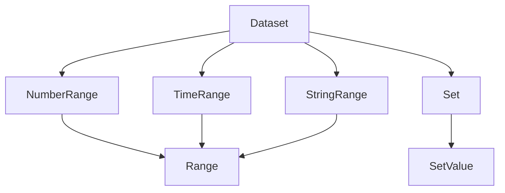
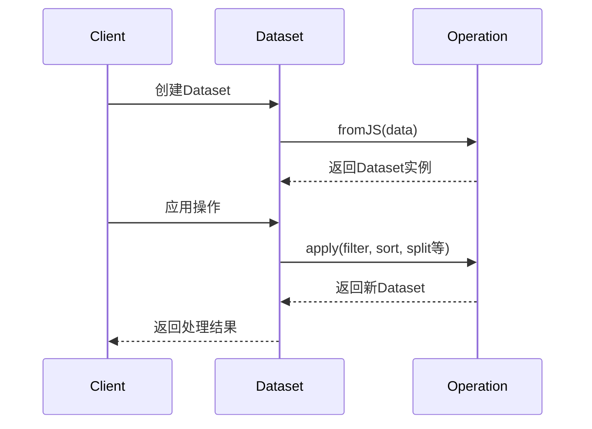
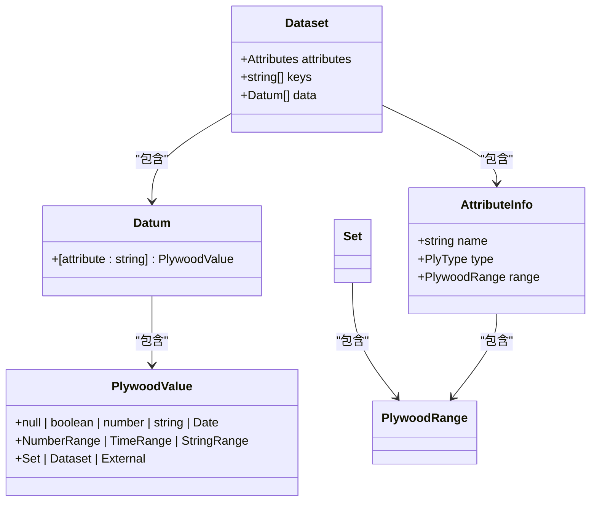

# 数据类型API

<cite>
**本文档引用的文件**   
- [index.ts](file://src/datatypes/index.ts)
- [dataset.ts](file://src/datatypes/dataset.ts)
- [range.ts](file://src/datatypes/range.ts)
- [numberRange.ts](file://src/datatypes/numberRange.ts)
- [timeRange.ts](file://src/datatypes/timeRange.ts)
- [stringRange.ts](file://src/datatypes/stringRange.ts)
- [set.ts](file://src/datatypes/set.ts)
- [common.ts](file://src/datatypes/common.ts)
- [attributeInfo.ts](file://src/datatypes/attributeInfo.ts)
- [types.ts](file://src/types.ts)
</cite>

## 目录
1. [简介](#简介)
2. [核心数据类型](#核心数据类型)
3. [Dataset结构与操作](#dataset结构与操作)
4. [范围类型（Range）](#范围类型range)
5. [集合类型（Set）](#集合类型set)
6. [类型继承与组合关系](#类型继承与组合关系)
7. [实际应用场景](#实际应用场景)

## 简介
本API文档详细介绍了Plywood库中的核心数据类型，包括`Dataset`、`NumberRange`、`TimeRange`、`StringRange`和`Set`等。这些数据类型构成了数据分析和处理的基础，支持复杂的数据操作和转换。通过`index.ts`的导出结构，可以清晰地看到各类型之间的关系和依赖。

**Section sources**
- [index.ts](file://src/datatypes/index.ts#L1-L25)

## 核心数据类型
Plywood提供了多种核心数据类型来支持不同类型的数据处理需求。主要类型包括：
- `Dataset`：数据集，包含多行数据和属性信息
- `NumberRange`：数值范围，表示数值的区间
- `TimeRange`：时间范围，表示时间的区间
- `StringRange`：字符串范围，表示字符串的区间
- `Set`：集合，包含相同类型元素的集合

这些类型通过`index.ts`文件统一导出，形成了完整的数据类型体系。



**Diagram sources **
- [index.ts](file://src/datatypes/index.ts#L1-L25)
- [dataset.ts](file://src/datatypes/dataset.ts#L313-L1425)

**Section sources**
- [index.ts](file://src/datatypes/index.ts#L1-L25)
- [dataset.ts](file://src/datatypes/dataset.ts#L313-L1425)

## Dataset结构与操作
`Dataset`是Plywood中最核心的数据结构，用于表示和操作数据集。它包含数据行、属性信息和各种操作方法。

### Dataset结构
`Dataset`由以下部分组成：
- `attributes`：属性信息数组，描述每个字段的类型
- `keys`：键字段，用于标识数据行
- `data`：数据行数组，每行是一个`Datum`对象
- `suppress`：是否隐藏标记

### 创建与操作
`Dataset`支持多种创建和操作方法：

#### 创建Dataset
可以通过`fromJS`静态方法从JavaScript对象创建`Dataset`：
```typescript
static fromJS(parameters: DatasetJS | any[]): Dataset
```

#### 数据操作
`Dataset`提供了丰富的数据操作方法：
- `select(attrs: string[])`: 选择指定属性
- `apply(name: string, ex: Expression)`: 应用表达式创建新字段
- `filter(ex: Expression)`: 过滤数据行
- `sort(ex: Expression, direction: Direction)`: 排序数据
- `limit(limit: number)`: 限制返回行数

#### 聚合操作
`Dataset`支持多种聚合操作：
- `count()`: 计算行数
- `sum(ex: Expression)`: 求和
- `average(ex: Expression)`: 计算平均值
- `min(ex: Expression)`: 最小值
- `max(ex: Expression)`: 最大值
- `countDistinct(ex: Expression)`: 去重计数
- `collect(ex: Expression)`: 收集值到集合

#### 分组操作
`split`方法用于数据分组：
```typescript
public split(splits: Record<string, Expression>, datasetName: string): Dataset
```
该方法根据指定的表达式对数据进行分组，并将结果存储在新的`Dataset`字段中。



**Diagram sources **
- [dataset.ts](file://src/datatypes/dataset.ts#L313-L1425)

**Section sources**
- [dataset.ts](file://src/datatypes/dataset.ts#L313-L1425)

## 范围类型（Range）
范围类型用于表示数据的区间，支持数值、时间和字符串范围。

### 基础范围类
`Range<T>`是所有范围类型的基类，定义了范围的基本属性和方法：
- `start`: 起始值
- `end`: 结束值
- `bounds`: 边界类型（如'[)'表示左闭右开）

### NumberRange
`NumberRange`表示数值范围，支持以下操作：
- `numberBucket(num: number, size: number, offset: number)`: 创建数值桶
- `fromNumber(n: number)`: 从单个数值创建范围
- `midpoint()`: 计算中点值
- `rebaseOnStart(newStart: number)`: 以新起点重新计算范围

### TimeRange
`TimeRange`表示时间范围，支持以下操作：
- `timeBucket(date: Date, duration: Duration, timezone: Timezone)`: 创建时间桶
- `fromTime(t: Date)`: 从单个时间点创建范围
- `toInterval()`: 转换为时间间隔字符串
- `isAligned(duration: Duration, timezone: Timezone)`: 检查是否对齐
- `changeToNumber()`: 转换为数值范围

### StringRange
`StringRange`表示字符串范围，支持以下操作：
- `fromString(s: string)`: 从单个字符串创建范围
- 不支持`midpoint()`方法，因为字符串范围没有中点概念

```mermaid
classDiagram
class Range~T~ {
+T start
+T end
+string bounds
+contains(val : T | Range~T~) : boolean
+intersects(other : Range~T~) : boolean
+union(other : Range~T~) : Range~T~
+intersect(other : Range~T~) : Range~T~ | null
}
Range~number~ <|-- NumberRange
Range~Date~ <|-- TimeRange
Range~string~ <|-- StringRange
NumberRange : +static numberBucket(num : number, size : number, offset : number)
NumberRange : +static fromNumber(n : number)
NumberRange : +midpoint() : number
TimeRange : +static timeBucket(date : Date, duration : Duration, timezone : Timezone)
TimeRange : +static fromTime(t : Date)
TimeRange : +toInterval() : string
TimeRange : +isAligned(duration : Duration, timezone : Timezone) : boolean
TimeRange : +changeToNumber() : NumberRange
StringRange : +static fromString(s : string)
```

**Diagram sources **
- [range.ts](file://src/datatypes/range.ts#L30-L348)
- [numberRange.ts](file://src/datatypes/numberRange.ts#L37-L111)
- [timeRange.ts](file://src/datatypes/timeRange.ts#L61-L184)
- [stringRange.ts](file://src/datatypes/stringRange.ts#L32-L95)

**Section sources**
- [range.ts](file://src/datatypes/range.ts#L30-L348)
- [numberRange.ts](file://src/datatypes/numberRange.ts#L37-L111)
- [timeRange.ts](file://src/datatypes/timeRange.ts#L61-L184)
- [stringRange.ts](file://src/datatypes/stringRange.ts#L32-L95)

## 集合类型（Set）
`Set`类型用于表示元素的集合，支持数学运算和集合操作。

### Set结构
`Set`由以下部分组成：
- `setType`: 集合元素的类型
- `elements`: 元素数组
- `hash`: 元素哈希表，用于快速查找

### 集合操作
`Set`支持多种集合操作：
- `union(other: Set)`: 并集
- `intersect(other: Set)`: 交集
- `overlap(other: Set)`: 检查是否有重叠
- `add(value: any)`: 添加元素
- `remove(value: any)`: 移除元素
- `toggle(value: any)`: 切换元素存在状态
- `contains(value: any)`: 检查是否包含元素

### 类型转换
`Set`支持类型升级和降级：
- `upgradeType()`: 将原子类型升级为范围类型（如`NUMBER`升级为`NUMBER_RANGE`）
- `downgradeType()`: 将范围类型降级为原子类型（如果范围是退化的）

### 数学运算
`Set`支持跨集合的数学运算：
- `crossBinary(as: any, bs: any, fn: (a: any, b: any) => any)`: 二元运算
- `crossUnary(as: any, fn: (a: any) => any)`: 一元运算
- `cartesianProductOf(...args: T[][])`: 计算笛卡尔积

```mermaid
classDiagram
class Set {
+PlyType setType
+Array<any> elements
+add(value : any) : Set
+remove(value : any) : Set
+toggle(value : any) : Set
+contains(value : any) : boolean
+union(other : Set) : Set
+intersect(other : Set) : Set
+overlap(other : Set) : boolean
+upgradeType() : Set
+downgradeType() : Set
}
Set : +static fromJS(parameters : Array<any>) : Set
Set : +static fromJS(parameters : SetJS) : Set
Set : +static unionCover(a : any, b : any) : any
Set : +static intersectCover(a : any, b : any) : any
Set : +static crossBinary(as : any, bs : any, fn : (a : any, b : any) => any) : any
Set : +static crossUnary(as : any, fn : (a : any) => any) : any
```

**Diagram sources **
- [set.ts](file://src/datatypes/set.ts#L53-L475)

**Section sources**
- [set.ts](file://src/datatypes/set.ts#L53-L475)

## 类型继承与组合关系
通过`index.ts`的导出结构，可以清晰地看到各数据类型之间的继承和组合关系。

### 继承关系
- `Range<T>`是所有范围类型的基类
- `NumberRange`、`TimeRange`、`StringRange`都继承自`Range<T>`
- 所有类型最终都实现`Instance`接口

### 组合关系
- `Dataset`包含`Datum`对象，每个`Datum`可以包含其他数据类型
- `Set`可以包含`Range`类型的元素
- `AttributeInfo`用于描述`Dataset`中字段的元信息



**Diagram sources **
- [index.ts](file://src/datatypes/index.ts#L1-L25)
- [dataset.ts](file://src/datatypes/dataset.ts#L313-L1425)
- [set.ts](file://src/datatypes/set.ts#L53-L475)
- [attributeInfo.ts](file://src/datatypes/attributeInfo.ts#L53-L231)

**Section sources**
- [index.ts](file://src/datatypes/index.ts#L1-L25)
- [dataset.ts](file://src/datatypes/dataset.ts#L313-L1425)
- [set.ts](file://src/datatypes/set.ts#L53-L475)
- [attributeInfo.ts](file://src/datatypes/attributeInfo.ts#L53-L231)

## 实际应用场景
### 数据过滤与分组
使用范围类型进行数据过滤和分组：

```typescript
// 创建时间范围进行过滤
const timeRange = TimeRange.fromJS({
  start: '2023-01-01T00:00:00Z',
  end: '2023-12-31T23:59:59Z'
});

// 在Dataset中使用范围进行过滤
const filteredDataset = dataset.filter(
  $('timestamp').in(timeRange)
);

// 使用split进行分组
const groupedDataset = dataset.split({
  year: $('timestamp').timePart('YEAR'),
  month: $('timestamp').timePart('MONTH')
}, 'data');
```

### 集合运算
使用Set进行数学运算和集合操作：

```typescript
// 创建数值集合
const numbers = Set.fromJS([1, 2, 3, 4, 5]);

// 创建数值范围集合
const ranges = Set.fromJS([
  new NumberRange({ start: 1, end: 3 }),
  new NumberRange({ start: 4, end: 6 })
]);

// 集合并集
const unionSet = numbers.union(ranges);

// 集合交集
const intersectSet = numbers.intersect(ranges);
```

### 复杂数据处理
结合多种类型进行复杂数据处理：

```typescript
// 创建包含多种类型的Dataset
const complexDataset = new Dataset({
  attributes: [
    new AttributeInfo({ name: 'id', type: 'NUMBER' }),
    new AttributeInfo({ name: 'name', type: 'STRING' }),
    new AttributeInfo({ name: 'ageRange', type: 'NUMBER_RANGE' }),
    new AttributeInfo({ name: 'tags', type: 'SET/STRING' })
  ],
  data: [
    {
      id: 1,
      name: 'Alice',
      ageRange: new NumberRange({ start: 25, end: 30 }),
      tags: Set.fromJS(['developer', 'javascript'])
    },
    {
      id: 2,
      name: 'Bob',
      ageRange: new NumberRange({ start: 30, end: 35 }),
      tags: Set.fromJS(['designer', 'ui'])
    }
  ]
});

// 使用apply创建新字段
const processedDataset = complexDataset.apply(
  'ageMidpoint',
  $('ageRange').midpoint()
);

// 使用collect收集标签
const allTags = processedDataset.collect($('tags'));
```

**Section sources**
- [dataset.ts](file://src/datatypes/dataset.ts#L313-L1425)
- [set.ts](file://src/datatypes/set.ts#L53-L475)
- [range.ts](file://src/datatypes/range.ts#L30-L348)