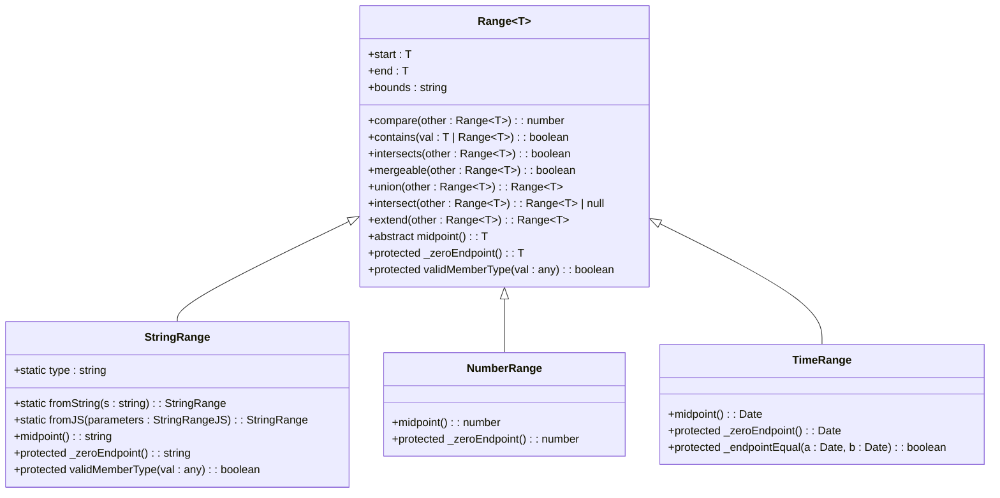
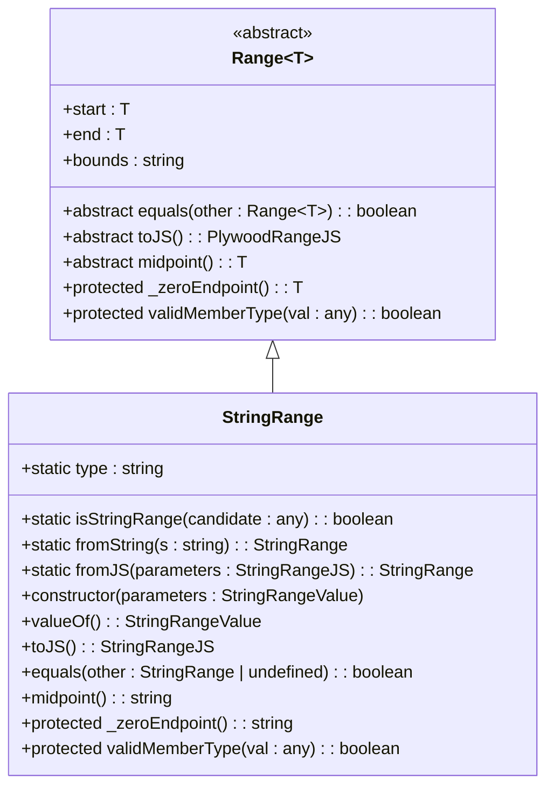

# 字符串范围API

<cite>
**Referenced Files in This Document**   
- [stringRange.ts](file://src/datatypes/stringRange.ts)
- [range.ts](file://src/datatypes/range.ts)
- [stringRange.mocha.js](file://test/datatypes/stringRange.mocha.js)
- [numberRange.ts](file://src/datatypes/numberRange.ts)
- [timeRange.ts](file://src/datatypes/timeRange.ts)
</cite>

## 目录
1. [简介](#简介)
2. [核心组件](#核心组件)
3. [架构概述](#架构概述)
4. [详细组件分析](#详细组件分析)
5. [依赖分析](#依赖分析)
6. [性能考虑](#性能考虑)
7. [故障排除指南](#故障排除指南)
8. [结论](#结论)

## 简介
字符串范围API提供了一种处理字符串区间数据的机制，特别适用于字典序范围操作。该API通过`StringRange`类实现`Range<string>`接口，为字符串数据提供了范围创建、包含性检查、合并和交集等操作。与数值和时间范围不同，字符串范围在排序和比较语义上采用字典序而非数值或时间顺序。本文档详细描述了`StringRange`类的实现细节，包括`fromString`静态方法、类型验证机制、不支持的中点计算以及空字符串端点的实现逻辑。

## 核心组件
`StringRange`类是字符串范围API的核心实现，继承自通用的`Range<T>`基类并专门化为字符串类型。该类实现了字符串范围的所有基本操作，包括范围创建、序列化、相等性比较和成员验证。`StringRange`通过重写基类方法来适应字符串特有的行为，如使用字典序进行比较和限制成员类型为字符串。该类还定义了`fromString`静态方法，用于创建单个字符串的范围，这在处理精确字符串匹配时非常有用。

**Section sources**
- [stringRange.ts](file://src/datatypes/stringRange.ts#L32-L95)

## 架构概述
字符串范围API采用继承架构，`StringRange`类扩展了通用的`Range<T>`基类。这种设计允许共享范围操作的通用逻辑，同时为特定数据类型提供定制行为。`Range<T>`基类定义了范围的基本结构和操作，如包含性检查、相交检测、合并和交集计算。`StringRange`类通过重写特定方法来适应字符串数据的特性，包括类型验证、端点相等性检查和字符串特定的序列化。这种分层架构确保了代码的可重用性和类型安全性，同时允许为不同数据类型（如数值、时间和字符串）提供优化的实现。



**Diagram sources**
- [range.ts](file://src/datatypes/range.ts#L30-L348)
- [stringRange.ts](file://src/datatypes/stringRange.ts#L32-L95)
- [numberRange.ts](file://src/datatypes/numberRange.ts#L32-L114)
- [timeRange.ts](file://src/datatypes/timeRange.ts#L32-L187)

## 详细组件分析

### StringRange类分析
`StringRange`类实现了`Range<string>`接口，为字符串数据提供了完整的范围操作功能。该类通过继承`Range<T>`基类获得了通用的范围操作逻辑，同时通过重写特定方法来适应字符串数据的特性。`StringRange`确保所有操作都遵循字典序语义，这对于处理文本数据的范围查询至关重要。

#### 类关系图


**Diagram sources**
- [stringRange.ts](file://src/datatypes/stringRange.ts#L32-L95)
- [range.ts](file://src/datatypes/range.ts#L30-L348)

### 静态方法分析
`StringRange`类提供了多个静态方法用于创建和验证字符串范围实例。`fromString`方法是创建单字符串范围的便捷方式，特别适用于精确匹配场景。`fromJS`方法则用于从JavaScript对象反序列化字符串范围，支持JSON格式的数据交换。这些静态方法确保了字符串范围的创建过程既灵活又类型安全。

#### fromString方法流程
```mermaid
flowchart TD
Start([fromString(s: string)]) --> ValidateInput["验证输入参数"]
ValidateInput --> InputValid{"输入是否为字符串?"}
InputValid --> |否| ThrowError["抛出类型错误"]
InputValid --> |是| CreateRange["创建新StringRange实例"]
CreateRange --> SetEndpoints["设置start和end为s"]
SetEndpoints --> SetBounds["设置bounds为'[]'"]
SetBounds --> ReturnRange["返回新创建的范围"]
ThrowError --> End([方法结束])
ReturnRange --> End
```

**Diagram sources**
- [stringRange.ts](file://src/datatypes/stringRange.ts#L39-L41)

### 类型验证机制
`StringRange`类通过重写`validMemberType`方法来限制成员类型为字符串。该方法在范围操作中被调用，以确保只有字符串类型的值才能被包含在字符串范围内。这种类型检查机制增强了API的类型安全性，防止了意外的类型错误。

#### 类型验证流程
```mermaid
flowchart TD
Start([validMemberType(val: any)]) --> CheckType["检查val的类型"]
CheckType --> IsString{"typeof val === 'string'?"}
IsString --> |是| ReturnTrue["返回true"]
IsString --> |否| ReturnFalse["返回false"]
ReturnTrue --> End([方法结束])
ReturnFalse --> End
```

**Diagram sources**
- [stringRange.ts](file://src/datatypes/stringRange.ts#L80-L82)

### 中点计算限制
`StringRange`类的`midpoint`方法被实现为抛出异常，因为字符串范围不支持中点计算。与数值或时间范围不同，字符串没有自然的中点概念，特别是在字典序上下文中。这种设计选择明确地传达了字符串范围的局限性，防止了不正确的使用。

#### 中点方法行为
```mermaid
flowchart TD
Start([midpoint()]) --> ThrowException["抛出错误: 'midpoint not supported in string range'"]
ThrowException --> End([方法结束])
```

**Diagram sources**
- [stringRange.ts](file://src/datatypes/stringRange.ts#L71-L75)

### 空字符串端点实现
`_zeroEndpoint`方法返回空字符串，作为字符串范围的零端点值。这个实现用于处理空范围的情况，当范围的开始和结束相等但边界不包含时，范围被规范化为空范围。空字符串作为零值在字符串上下文中是合理的，因为它表示最小的可能字符串值。

#### 零端点方法逻辑
```mermaid
flowchart TD
Start([_zeroEndpoint()]) --> ReturnEmptyString["返回空字符串\"\""]
ReturnEmptyString --> End([方法结束])
```

**Diagram sources**
- [stringRange.ts](file://src/datatypes/stringRange.ts#L77-L78)

## 依赖分析
`StringRange`类依赖于`Range<T>`基类提供的核心范围功能，同时与`numberRange.ts`和`timeRange.ts`文件中的其他范围实现共享相同的架构模式。这种依赖关系通过继承实现，确保了代码的可重用性和一致性。`StringRange`还依赖于TypeScript的泛型类型系统来确保类型安全，并使用`immutable-class`库来保证实例的不可变性。

```mermaid
graph TD
subgraph "字符串范围模块"
StringRange[stringRange.ts]
Range[range.ts]
end
subgraph "其他范围实现"
NumberRange[numberRange.ts]
TimeRange[timeRange.ts]
end
StringRange --> Range : "继承"
NumberRange --> Range : "继承"
TimeRange --> Range : "继承"
Range --> ImmutableClass["immutable-class"]
```

**Diagram sources**
- [stringRange.ts](file://src/datatypes/stringRange.ts)
- [range.ts](file://src/datatypes/range.ts)
- [numberRange.ts](file://src/datatypes/numberRange.ts)
- [timeRange.ts](file://src/datatypes/timeRange.ts)

## 性能考虑
字符串范围操作的性能主要受字符串比较操作的影响，因为所有范围操作都依赖于字典序比较。对于长字符串或大量范围操作，性能可能成为考虑因素。建议在性能关键路径中缓存频繁使用的范围实例，并避免在循环中创建临时范围对象。与数值范围相比，字符串范围的比较操作通常更昂贵，因为它们涉及逐字符比较而不是简单的数值比较。

## 故障排除指南
当使用字符串范围API时，常见的问题包括类型错误和范围边界问题。如果遇到`start`或`end`必须是字符串的错误，确保传递给构造函数或`fromJS`方法的值确实是字符串类型。对于范围操作返回意外结果的情况，检查范围边界设置是否正确，特别是开闭边界对包含性检查的影响。当处理空范围时，注意`intersect`操作可能返回一个开始和结束都为空字符串的范围，这表示空交集。

**Section sources**
- [stringRange.ts](file://src/datatypes/stringRange.ts#L56-L61)
- [stringRange.mocha.js](file://test/datatypes/stringRange.mocha.js#L147-L159)

## 结论
字符串范围API通过`StringRange`类提供了一套完整的字符串区间操作功能。该API巧妙地平衡了通用性和特异性，通过继承`Range<T>`基类复用通用逻辑，同时为字符串数据提供了定制行为。关键特性包括`fromString`静态方法的便捷创建、严格的字符串类型验证、明确的中点计算限制以及合理的空字符串端点实现。与数值和时间范围相比，字符串范围在排序和比较语义上采用字典序，这使其特别适用于文本数据的范围查询。开发者在使用此API时应注意字符串比较的性能影响，并正确处理边界情况以确保正确的范围操作结果。