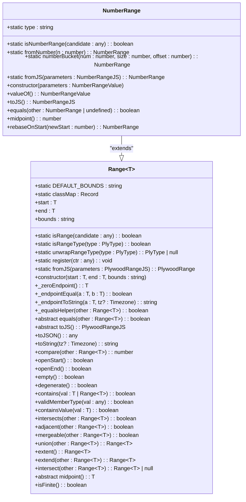
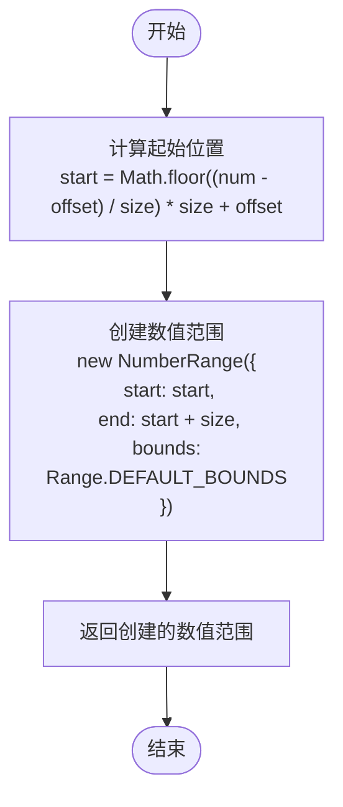
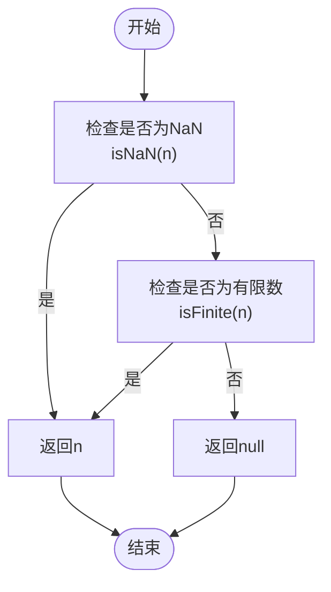
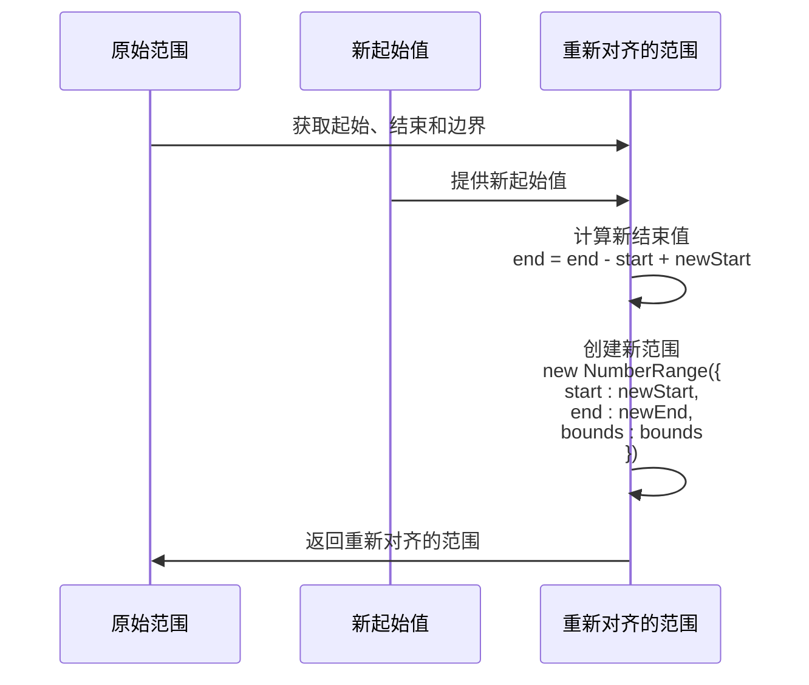

# 数值范围API

<cite>
**Referenced Files in This Document**   
- [numberRange.ts](file://src/datatypes/numberRange.ts)
- [range.ts](file://src/datatypes/range.ts)
- [common.ts](file://src/datatypes/common.ts)
- [numberRange.mocha.js](file://test/datatypes/numberRange.mocha.js)
</cite>

## 目录
1. [简介](#简介)
2. [核心组件](#核心组件)
3. [NumberRange类实现细节](#numberrange类实现细节)
4. [数值分桶功能](#数值分桶功能)
5. [辅助函数处理](#辅助函数处理)
6. [时间序列对齐应用](#时间序列对齐应用)
7. [数值区间操作示例](#数值区间操作示例)
8. [与其他范围类型的对比](#与其他范围类型的对比)

## 简介
数值范围API提供了对数值区间进行创建、查询和操作的完整功能。该API的核心是`NumberRange`类，它实现了`Range<number>`接口，为数值范围的处理提供了类型安全和丰富的操作方法。通过这个API，开发者可以轻松地创建数值区间、执行范围查询、进行区间合并等操作，同时还能处理特殊数值如NaN和无穷大值。

## 核心组件

`NumberRange`类是数值范围API的核心实现，它继承自`Range<number>`基类并实现了`Instance<NumberRangeValue, NumberRangeJS>`接口。该类提供了创建单点范围、数值分桶、范围合并等多种功能，同时还包含处理边界条件和特殊数值的辅助方法。

**Section sources**
- [numberRange.ts](file://src/datatypes/numberRange.ts#L37-L111)
- [range.ts](file://src/datatypes/range.ts#L30-L348)

## NumberRange类实现细节

`NumberRange`类作为`Range<number>`的具体实现，提供了数值范围的完整功能。该类通过继承`Range`基类获得了基本的范围操作能力，并在此基础上添加了数值特有的功能。类的构造函数确保了起始值和结束值必须是有效的数字，同时处理了边界条件的规范化。

`fromNumber`静态方法是创建单点范围的关键，它接受一个数值参数并返回一个起始值和结束值相等的`NumberRange`实例，边界设置为闭区间'[]'。这种单点范围在数据查询和匹配场景中非常有用，可以精确匹配特定数值。



**Diagram sources **
- [numberRange.ts](file://src/datatypes/numberRange.ts#L37-L111)
- [range.ts](file://src/datatypes/range.ts#L30-L348)

**Section sources**
- [numberRange.ts](file://src/datatypes/numberRange.ts#L37-L111)
- [range.ts](file://src/datatypes/range.ts#L30-L348)

## 数值分桶功能

`numberBucket`静态方法实现了数值分桶功能，这是数值范围API的重要特性之一。该方法接受三个参数：要分桶的数值、桶的大小和偏移量。它通过数学计算确定数值所属的桶的起始位置，然后创建一个从该起始位置开始、长度等于桶大小的数值范围。

分桶算法的核心是使用`Math.floor((num - offset) / size) * size + offset`公式来计算起始位置。这种方法确保了数值被正确地分配到相应的桶中，同时保持了桶的连续性和无重叠性。分桶功能在数据聚合、直方图生成和范围查询优化等场景中非常有用。



**Diagram sources **
- [numberRange.ts](file://src/datatypes/numberRange.ts#L44-L51)

**Section sources**
- [numberRange.ts](file://src/datatypes/numberRange.ts#L44-L51)

## 辅助函数处理

`finiteOrNull`辅助函数在处理数值范围时扮演着重要角色，特别是在处理从外部数据源解析的数值时。该函数接受一个数值参数，如果该数值是NaN或有限数，则直接返回该数值；如果该数值是无穷大，则返回null。这种处理方式确保了数值范围的边界值始终是有效的JavaScript数值或null，避免了无穷大值可能引起的计算错误。

该函数在`NumberRange.fromJS`方法中被调用，用于处理从JSON对象解析的起始值和结束值。通过这种方式，API能够安全地处理各种输入情况，包括可能包含无穷大值的数据源。



**Diagram sources **
- [numberRange.ts](file://src/datatypes/numberRange.ts#L32-L34)

**Section sources**
- [numberRange.ts](file://src/datatypes/numberRange.ts#L32-L34)
- [numberRange.ts](file://src/datatypes/numberRange.ts#L64-L65)

## 时间序列对齐应用

`rebaseOnStart`方法在时间序列对齐场景中具有重要应用价值。该方法接受一个新的起始值作为参数，返回一个将原范围重新对齐到新起始值的数值范围。具体来说，它保持原范围的长度不变，但将整个范围平移到以新起始值开始的位置。

在时间序列分析中，这个方法可以用于将不同时间段的数据对齐到统一的时间基准上。例如，在比较不同年份的销售数据时，可以使用`rebaseOnStart`方法将各年的数据都对齐到同一年的起始时间，从而进行更直观的比较分析。



**Diagram sources **
- [numberRange.ts](file://src/datatypes/numberRange.ts#L102-L110)

**Section sources**
- [numberRange.ts](file://src/datatypes/numberRange.ts#L102-L110)

## 数值区间操作示例

数值范围API提供了丰富的操作方法，包括创建数值区间、执行范围查询和进行区间合并等。以下是一些典型的操作示例：

1. **创建数值区间**：使用`new NumberRange()`构造函数或`fromJS()`静态方法创建数值区间。
2. **执行范围查询**：使用`contains()`方法检查某个数值是否在范围内，或使用`intersects()`方法检查两个范围是否相交。
3. **进行区间合并**：使用`union()`方法尝试合并两个相交或相邻的范围，如果无法合并则返回null。
4. **计算区间交集**：使用`intersect()`方法计算两个范围的交集，如果无交集则返回null。
5. **扩展区间范围**：使用`extend()`方法计算两个范围的并集，无论它们是否相交。

这些操作方法为数值范围的处理提供了完整的功能集，使得开发者能够轻松地实现复杂的数值分析逻辑。

**Section sources**
- [numberRange.mocha.js](file://test/datatypes/numberRange.mocha.js#L0-L241)
- [range.ts](file://src/datatypes/range.ts#L30-L348)

## 与其他范围类型的对比

`NumberRange`与其他范围类型（如`TimeRange`和`StringRange`）在`midpoint`计算和边界处理上存在一些差异。在`midpoint`计算方面，`NumberRange`直接使用算术平均值`(start + end) / 2`来计算中点，而`TimeRange`需要将时间值转换为毫秒进行计算，`StringRange`则不支持中点计算。

在边界处理方面，`NumberRange`遵循标准的数学区间表示法，支持开区间、闭区间和半开半闭区间。与其他数值类型相比，`NumberRange`特别处理了NaN和无穷大值，确保这些特殊数值不会导致计算错误。此外，`NumberRange`的比较操作基于数值大小，而`StringRange`基于字符串的字典序，`TimeRange`基于时间戳。

```mermaid
classDiagram
class NumberRange {
+midpoint() : number
}
class TimeRange {
+midpoint() : Date
}
class StringRange {
+midpoint() : string
}
NumberRange --|> Range : "extends"
TimeRange --|> Range : "extends"
StringRange --|> Range : "extends"
class Range~T~ {
+abstract midpoint() : T
}
note right of NumberRange
使用算术平均值计算中点
(start + end) / 2
end note
note right of TimeRange
将时间转换为毫秒后计算中点
new Date((start.valueOf() + end.valueOf()) / 2)
end note
note right of StringRange
不支持中点计算
抛出错误
end note
```

**Diagram sources **
- [numberRange.ts](file://src/datatypes/numberRange.ts#L98-L100)
- [timeRange.ts](file://src/datatypes/timeRange.ts#L158-L160)
- [stringRange.ts](file://src/datatypes/stringRange.ts#L84-L86)

**Section sources**
- [numberRange.ts](file://src/datatypes/numberRange.ts#L98-L100)
- [timeRange.ts](file://src/datatypes/timeRange.ts#L158-L160)
- [stringRange.ts](file://src/datatypes/stringRange.ts#L84-L86)