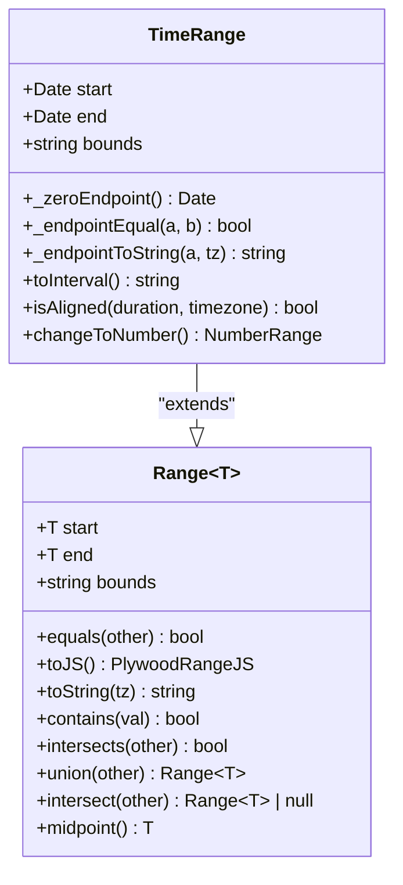
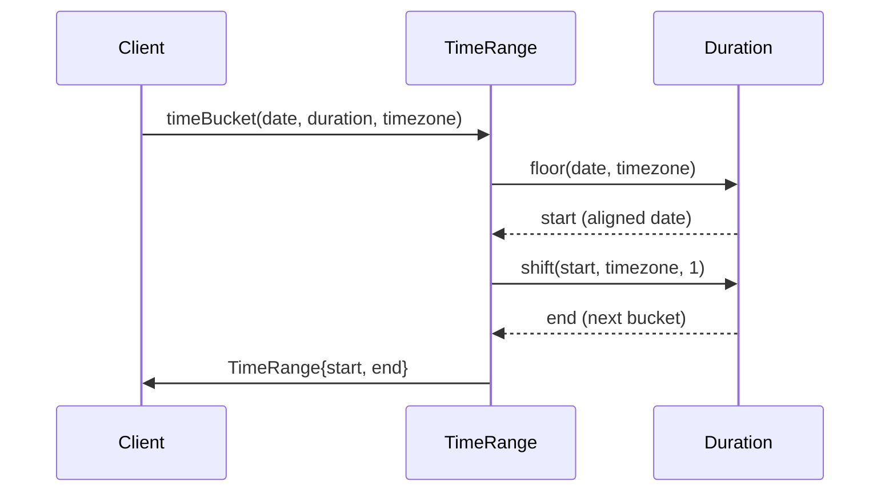
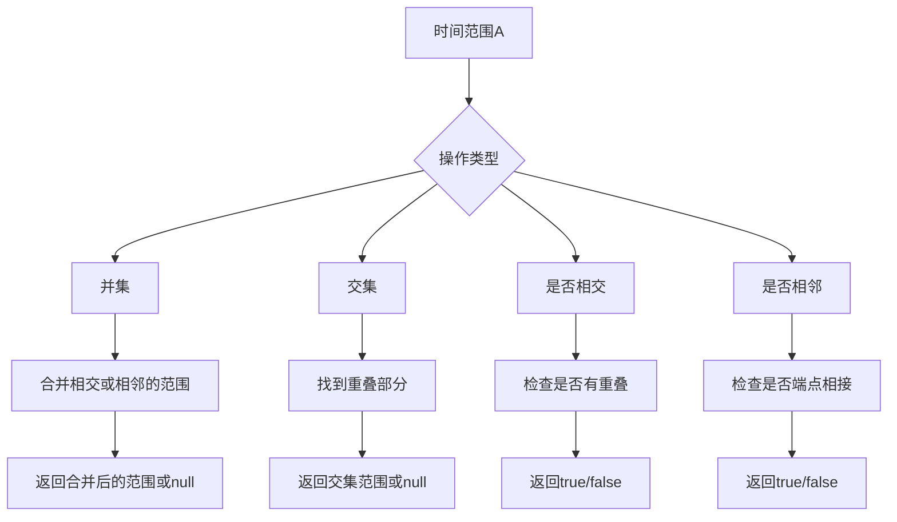

# 时间范围API

<cite>
**Referenced Files in This Document**  
- [timeRange.ts](file://src/datatypes/timeRange.ts)
- [range.ts](file://src/datatypes/range.ts)
- [timeRange.mocha.js](file://test/datatypes/timeRange.mocha.js)
</cite>

## 目录
1. [简介](#简介)
2. [核心实现](#核心实现)
3. [时间范围创建](#时间范围创建)
4. [时间分桶功能](#时间分桶功能)
5. [区间格式转换](#区间格式转换)
6. [对齐验证](#对齐验证)
7. [时间戳转换](#时间戳转换)
8. [时间范围操作](#时间范围操作)
9. [时区处理](#时区处理)

## 简介
`TimeRange`类是Plywood库中用于表示时间范围的核心组件，它继承自通用的`Range<Date>`类，专门用于处理日期时间区间。该API提供了丰富的功能来创建、操作和转换时间范围，支持ISO字符串解析、时间分桶、区间格式转换等高级功能。`TimeRange`在数据分析和时间序列处理场景中扮演着重要角色，为时间范围查询和聚合操作提供了坚实的基础。

**Section sources**
- [timeRange.ts](file://src/datatypes/timeRange.ts#L1-L187)

## 核心实现
`TimeRange`类实现了`Range<Date>`的泛型特化，通过重写基类的抽象方法来提供日期时间特定的行为。该类实现了`Instance<TimeRangeValue, TimeRangeJS>`接口，确保了类型安全和序列化能力。核心实现包括端点相等性检查、端点字符串转换和零值端点定义等方法，这些方法确保了时间范围在各种操作下的正确行为。

**Diagram sources**
- [timeRange.ts](file://src/datatypes/timeRange.ts#L61-L184)
- [range.ts](file://src/datatypes/range.ts#L30-L348)

**Section sources**
- [timeRange.ts](file://src/datatypes/timeRange.ts#L61-L184)
- [range.ts](file://src/datatypes/range.ts#L30-L348)

## 时间范围创建
`TimeRange`提供了多种创建时间范围实例的方法。`fromJS`静态方法支持从JavaScript对象创建时间范围，能够解析ISO格式的日期字符串和时间戳。`fromTime`方法用于创建单点时间范围，而`timeBucket`方法则用于根据指定的持续时间和时区创建时间分桶。这些创建方法为不同场景下的时间范围初始化提供了灵活的接口。

**Section sources**
- [timeRange.ts](file://src/datatypes/timeRange.ts#L72-L84)

## 时间分桶功能
`timeBucket`静态方法实现了时间分桶功能，它接受一个日期、持续时间和时区作为参数，返回一个与指定持续时间对齐的时间范围。该方法首先使用`duration.floor`将日期向下舍入到最近的持续时间边界，然后使用`duration.shift`计算结束时间。时间分桶在数据聚合和时间序列分析中非常有用，可以将连续的时间数据划分为离散的、可管理的区间。

**Diagram sources**
- [timeRange.ts](file://src/datatypes/timeRange.ts#L72-L80)
- [duration.d.ts](file://node_modules/@topgames/chronoshift/build/duration/duration.d.ts#L12-L38)

**Section sources**
- [timeRange.ts](file://src/datatypes/timeRange.ts#L72-L80)

## 区间格式转换
`toInterval`方法将时间范围转换为ISO 8601区间格式的字符串表示。该方法处理开闭区间的时间偏移，对于开区间端点会添加1毫秒以确保正确的区间表示。例如，一个左开右闭的区间`(2023-01-01, 2023-01-02]`会被转换为`2023-01-01T00:00:00.001Z/2023-01-02T00:00:00.001Z`。这种转换在与支持ISO 8601区间的系统进行交互时非常有用。

**Section sources**
- [timeRange.ts](file://src/datatypes/timeRange.ts#L134-L148)

## 对齐验证
`isAligned`方法用于验证时间范围是否与指定的`Duration`和`Timezone`对齐。该方法检查时间范围的开始和结束时间是否都与持续时间的边界对齐。对齐验证在时间序列分析中非常重要，确保数据聚合和查询操作在正确的时间边界上进行，避免数据偏差和不一致。

**Section sources**
- [timeRange.ts](file://src/datatypes/timeRange.ts#L175-L183)

## 时间戳转换
`changeToNumber`方法将时间范围转换为`NumberRange`，其中时间点被转换为对应的时间戳（毫秒数）。该方法在需要将时间范围与其他数值范围进行比较或操作时非常有用，例如在执行跨类型范围查询或进行数值计算时。转换后的`NumberRange`保留了原始时间范围的边界信息。

**Section sources**
- [timeRange.ts](file://src/datatypes/timeRange.ts#L160-L173)

## 时间范围操作
`TimeRange`类继承了`Range`基类的多种操作方法，包括并集(`union`)、交集(`intersect`)、是否相交(`intersects`)和是否相邻(`adjacent`)等。这些操作方法允许对时间范围进行复杂的组合和分析。例如，`union`方法可以合并两个相交或相邻的时间范围，而`intersect`方法可以找到两个时间范围的重叠部分。

**Diagram sources**
- [timeRange.ts](file://src/datatypes/timeRange.ts#L61-L184)
- [range.ts](file://src/datatypes/range.ts#L30-L348)

**Section sources**
- [timeRange.ts](file://src/datatypes/timeRange.ts#L61-L184)
- [range.ts](file://src/datatypes/range.ts#L30-L348)

## 时区处理
`TimeRange`类通过`Timezone`对象支持时区处理。`_endpointToString`方法使用`Timezone.formatDateWithTimezone`来格式化日期字符串，确保在不同时区下的正确显示。`isAligned`和`timeBucket`方法也接受时区参数，确保时间对齐和分桶操作在正确的时区上下文中进行。时区处理在处理跨时区数据和用户界面显示时至关重要。

**Section sources**
- [timeRange.ts](file://src/datatypes/timeRange.ts#L119-L132)
- [timezone.d.ts](file://node_modules/@topgames/chronoshift/build/timezone/timezone.d.ts#L1-L14)
</>