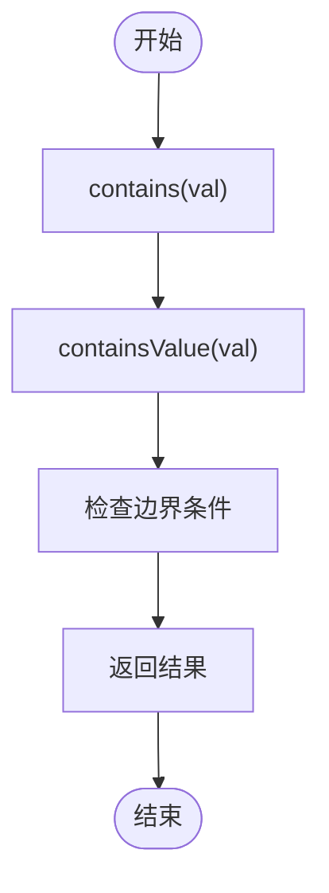
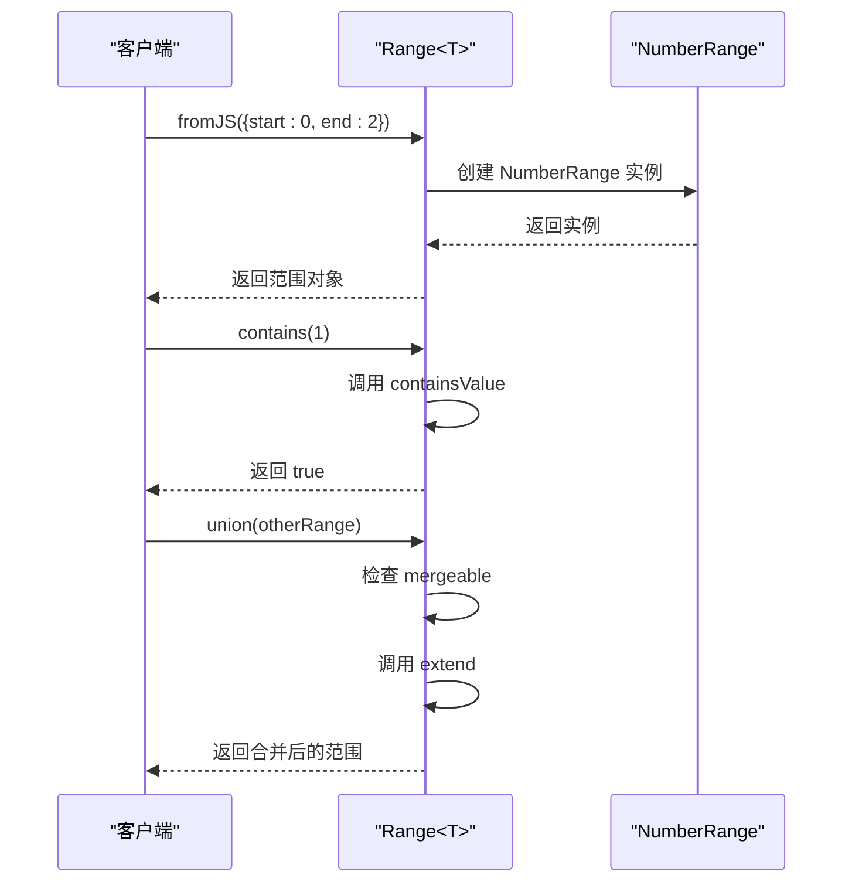

# 范围基类API

<cite>
**本文档中引用的文件**  
- [range.ts](file://src/datatypes/range.ts)
- [numberRange.ts](file://src/datatypes/numberRange.ts)
- [timeRange.ts](file://src/datatypes/timeRange.ts)
- [numberRange.mocha.js](file://test/datatypes/numberRange.mocha.js)
- [timeRange.mocha.js](file://test/datatypes/timeRange.mocha.js)
</cite>

## 目录
1. [简介](#简介)
2. [核心设计与抽象基类](#核心设计与抽象基类)
3. [范围边界与空集表示](#范围边界与空集表示)
4. [集合运算方法详解](#集合运算方法详解)
5. [工厂方法与类型实例化](#工厂方法与类型实例化)
6. [范围边界组合形式](#范围边界组合形式)
7. [区间连续性判断](#区间连续性判断)
8. [代码示例](#代码示例)

## 简介
`Range<T>` 是一个泛型抽象基类，用于表示数值、时间或字符串的区间范围。该类提供了丰富的集合运算方法，支持多种边界组合形式，并通过工厂方法实现动态类型实例化。本文档详细描述了其核心设计、方法实现和使用方式。

## 核心设计与抽象基类
`Range<T>` 抽象基类定义了范围的核心结构和行为，包括起点、终点和边界属性。该类通过泛型参数 `T` 支持不同类型的数据范围，如数值范围（`NumberRange`）和时间范围（`TimeRange`）。子类必须实现 `equals` 和 `toJS` 方法以确保一致性。

**Section sources**
- [range.ts](file://src/datatypes/range.ts#L30-L348)

## 范围边界与空集表示
`Range<T>` 类定义了 `DEFAULT_BOUNDS` 静态属性，默认值为 `[)`，表示左闭右开区间。当范围的起点和终点相等且边界不为 `[]` 时，系统会将其规范化为 `[0, 0)` 表示空集。这种设计确保了空集的唯一性和一致性。

**Section sources**
- [range.ts](file://src/datatypes/range.ts#L66-L66)

## 集合运算方法详解
`Range<T>` 提供了多种集合运算方法，包括 `contains`、`intersects`、`union`、`intersect` 和 `extend`。这些方法支持对单个值或另一个范围进行操作，返回布尔值或新的范围实例。例如，`union` 方法在两个范围可合并时返回它们的并集，否则返回 `null`。

**Diagram sources**
- [range.ts](file://src/datatypes/range.ts#L113-L118)

**Section sources**
- [range.ts](file://src/datatypes/range.ts#L113-L118)

## 工厂方法与类型实例化
`fromJS` 工厂方法根据输入数据的类型动态实例化具体的范围类型。如果输入包含数值，则创建 `NumberRange`；如果包含字符串，则创建 `StringRange`；否则创建 `TimeRange`。这种方法简化了范围对象的创建过程，提高了代码的灵活性。

**Section sources**
- [range.ts](file://src/datatypes/range.ts#L69-L99)

## 范围边界组合形式
范围边界有四种组合形式：`[)`（左闭右开）、`[]`（闭区间）、`()`（开区间）和 `(]`（左开右闭）。每种形式都有其数学含义，影响范围的包含性和连续性判断。例如，`[)` 表示包含起点但不包含终点，而 `[]` 表示包含起点和终点。

**Section sources**
- [range.ts](file://src/datatypes/range.ts#L65-L65)

## 区间连续性判断
`adjacent` 和 `mergeable` 方法用于判断两个范围是否相邻或可合并。`adjacent` 方法检查两个范围的端点是否相等且边界开闭性相反，而 `mergeable` 方法则结合 `intersects` 和 `adjacent` 的结果来确定是否可以合并。这些方法在处理连续区间时非常有用。

**Section sources**
- [range.ts](file://src/datatypes/range.ts#L113-L118)

## 代码示例
以下代码示例展示了如何创建基础范围实例、执行范围包含性检查和范围合并操作：

**Diagram sources**
- [numberRange.mocha.js](file://test/datatypes/numberRange.mocha.js#L0-L241)

**Section sources**
- [numberRange.mocha.js](file://test/datatypes/numberRange.mocha.js#L0-L241)