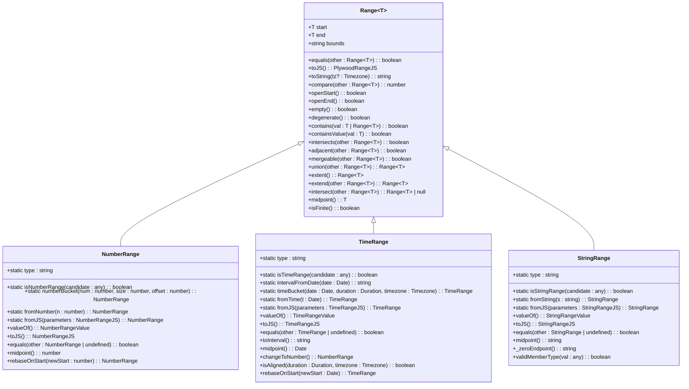
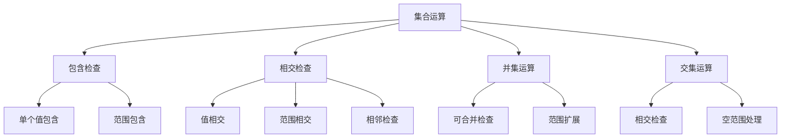
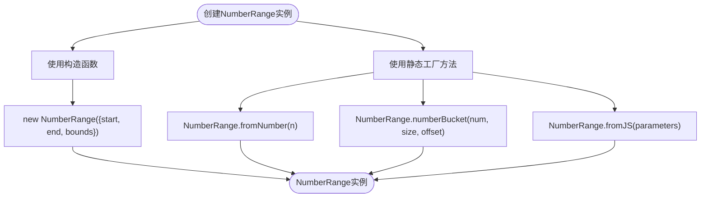
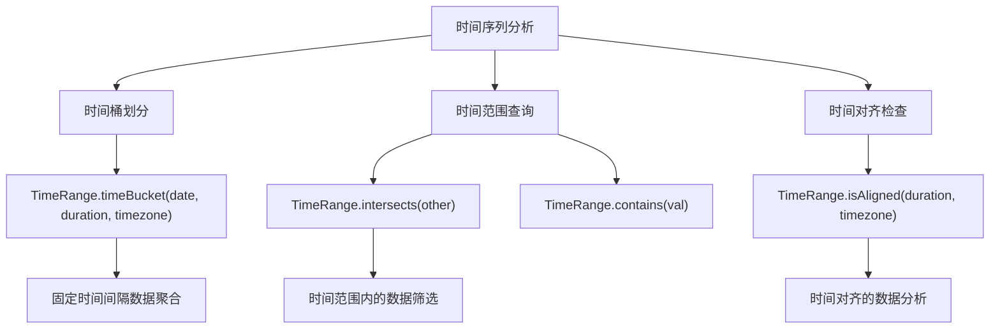
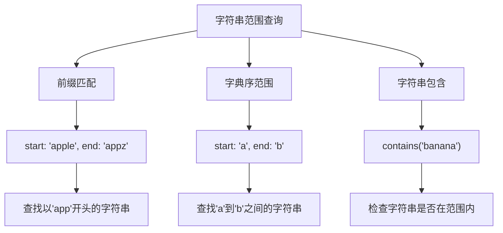

# 范围类型API

<cite>
**本文档中引用的文件**   
- [range.ts](file://src/datatypes/range.ts)
- [numberRange.ts](file://src/datatypes/numberRange.ts)
- [timeRange.ts](file://src/datatypes/timeRange.ts)
- [stringRange.ts](file://src/datatypes/stringRange.ts)
</cite>

## 目录
1. [简介](#简介)
2. [核心组件](#核心组件)
3. [架构概述](#架构概述)
4. [详细组件分析](#详细组件分析)
5. [依赖分析](#依赖分析)

## 简介
范围类型API提供了一套抽象基类和具体实现，用于处理数值、时间和字符串范围。该API支持各种集合运算，如包含、相交、并集和交集操作，并提供了灵活的边界表示方式。这些功能在时间序列分析和数值区间查询中具有重要应用。

## 核心组件
范围类型API的核心是`Range<T>`抽象基类，它定义了所有范围类型的基本行为和方法。该类通过泛型参数T支持不同类型的数据范围，包括数值、时间和字符串。`Range<T>`类提供了`contains`、`intersects`、`union`和`intersect`等核心方法，用于执行各种集合运算。具体的实现类`NumberRange`、`TimeRange`和`StringRange`继承自这个基类，并针对各自的数据类型提供了特定的功能。

**Section sources**
- [range.ts](file://src/datatypes/range.ts#L1-L350)

## 架构概述
范围类型API采用抽象基类与具体实现分离的设计模式。`Range<T>`作为抽象基类定义了所有范围类型共有的属性和方法，而具体的实现类则负责处理特定数据类型的细节。这种设计使得API既具有良好的扩展性，又能保证类型安全。



**Diagram sources **
- [range.ts](file://src/datatypes/range.ts#L1-L350)
- [numberRange.ts](file://src/datatypes/numberRange.ts#L1-L115)
- [timeRange.ts](file://src/datatypes/timeRange.ts#L1-L188)
- [stringRange.ts](file://src/datatypes/stringRange.ts#L1-L99)

## 详细组件分析

### 抽象基类Range<T>分析
`Range<T>`抽象基类是整个范围类型API的核心，它定义了所有范围类型共有的属性和方法。该类通过泛型参数T支持不同类型的数据范围，并提供了丰富的集合运算功能。

#### 核心属性
- `start`: 范围的起始值
- `end`: 范围的结束值
- `bounds`: 边界表示方式，支持'[)'、'[]'、'(]'和'()'四种形式

#### 边界表示方式
边界表示方式使用两个字符的字符串来描述范围的开闭状态：
- `[`: 左闭合（包含起始值）
- `]`: 右闭合（包含结束值）
- `(`: 左开放（不包含起始值）
- `)`: 右开放（不包含结束值）

默认边界为'[)'，表示左闭右开区间。边界的有效性通过正则表达式`/^[\[(][\])]$/`进行验证。

#### 集合运算方法


**Diagram sources **
- [range.ts](file://src/datatypes/range.ts#L1-L350)

### NumberRange实现分析
`NumberRange`类实现了数值范围的具体功能，继承自`Range<number>`基类。它提供了针对数值类型的特殊方法和验证逻辑。

#### 数值范围特性
- 支持有限和无限边界（使用null表示无限）
- 提供数值桶（bucket）功能，用于将数值分配到固定大小的区间
- 实现了数值范围的中点计算

#### 创建实例方法


**Diagram sources **
- [numberRange.ts](file://src/datatypes/numberRange.ts#L1-L115)

### TimeRange实现分析
`TimeRange`类实现了时间范围的具体功能，继承自`Range<Date>`基类。它提供了针对时间类型的特殊方法和时区处理能力。

#### 时间范围特性
- 支持ISO格式的日期字符串解析
- 提供时间桶功能，用于将时间点分配到固定时长的区间
- 支持时区转换和对齐检查
- 可以转换为Druid兼容的时间间隔格式

#### 时间序列应用


**Diagram sources **
- [timeRange.ts](file://src/datatypes/timeRange.ts#L1-L188)

### StringRange实现分析
`StringRange`类实现了字符串范围的具体功能，继承自`Range<string>`基类。它提供了针对字符串类型的特殊方法和比较逻辑。

#### 字符串范围特性
- 基于字典序进行字符串比较
- 不支持中点计算（抛出异常）
- 提供字符串范围的包含检查

#### 字符串范围查询


**Diagram sources **
- [stringRange.ts](file://src/datatypes/stringRange.ts#L1-L99)

## 依赖分析
范围类型API的依赖关系清晰，主要依赖于外部库`@topgames/chronoshift`提供的时间处理功能。`TimeRange`类依赖于`Duration`、`parseISODate`和`Timezone`等类来处理时间相关的操作。所有范围类型都依赖于`immutable-class`库提供的不可变类功能。

```mermaid
graph TD
A[Range<T>] --> B[NumberRange]
A --> C[TimeRange]
A --> D[StringRange]
C --> E[@topgames/chronoshift]
E --> F[Duration]
E --> G[parseISODate]
E --> H[Timezone]
A --> I[immutable-class]
B --> I
C --> I
D --> I
```

**Diagram sources **
- [range.ts](file://src/datatypes/range.ts#L1-L350)
- [numberRange.ts](file://src/datatypes/numberRange.ts#L1-L115)
- [timeRange.ts](file://src/datatypes/timeRange.ts#L1-L188)
- [stringRange.ts](file://src/datatypes/stringRange.ts#L1-L99)

**Section sources**
- [range.ts](file://src/datatypes/range.ts#L1-L350)
- [numberRange.ts](file://src/datatypes/numberRange.ts#L1-L115)
- [timeRange.ts](file://src/datatypes/timeRange.ts#L1-L188)
- [stringRange.ts](file://src/datatypes/stringRange.ts#L1-L99)