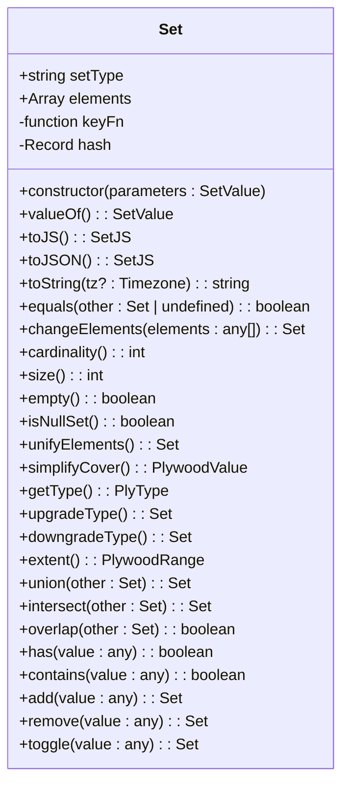

# 集合类型API

<cite>
**本文档中引用的文件**  
- [set.ts](file://src/datatypes/set.ts)
- [range.ts](file://src/datatypes/range.ts)
- [common.ts](file://src/datatypes/common.ts)
- [numberRange.ts](file://src/datatypes/numberRange.ts)
- [timeRange.ts](file://src/datatypes/timeRange.ts)
- [stringRange.ts](file://src/datatypes/stringRange.ts)
- [set.mocha.js](file://test/datatypes/set.mocha.js)
</cite>

## 目录
1. [简介](#简介)
2. [核心设计与功能](#核心设计与功能)
3. [集合运算](#集合运算)
4. [类型转换](#类型转换)
5. [交叉运算方法](#交叉运算方法)
6. [范围合并与优化](#范围合并与优化)
7. [代码示例](#代码示例)

## 简介
`Set` 类是 Plywood 库中的核心数据结构之一，用于表示和操作元素集合。该类支持多种数据类型（如字符串、数字、时间等）的集合操作，并提供了丰富的功能，包括元素去重、集合运算、类型转换和嵌套数据结构处理。`Set` 类的设计旨在高效地处理复杂的数据分析任务，同时保持代码的简洁性和可读性。

**Section sources**
- [set.ts](file://src/datatypes/set.ts#L53-L475)

## 核心设计与功能
`Set` 类的核心设计围绕元素去重和集合运算展开。当创建一个 `Set` 实例时，构造函数会自动对输入的元素进行去重处理，确保集合中每个元素的唯一性。这一过程通过哈希表实现，提高了查找和插入操作的效率。



**Diagram sources**
- [set.ts](file://src/datatypes/set.ts#L53-L475)

**Section sources**
- [set.ts](file://src/datatypes/set.ts#L53-L475)

## 集合运算
`Set` 类提供了多种集合运算方法，包括并集（union）、交集（intersect）和重叠检测（overlap）。这些方法允许用户对两个集合执行基本的数学运算，从而实现复杂的数据分析逻辑。

### 并集运算
`union` 方法用于计算两个集合的并集。如果两个集合的类型不同，则抛出类型错误。否则，将两个集合的元素合并，并调用 `unifyElements` 方法进行去重处理。

**Section sources**
- [set.ts](file://src/datatypes/set.ts#L384-L389)

### 交集运算
`intersect` 方法用于计算两个集合的交集。对于非范围类型的集合，该方法遍历一个集合的元素，检查其是否存在于另一个集合中。对于范围类型的集合（如 `NUMBER_RANGE`、`TIME_RANGE` 和 `STRING_RANGE`），则使用 `Set.intersectElements` 方法进行更复杂的交集计算。

**Section sources**
- [set.ts](file://src/datatypes/set.ts#L391-L413)

### 重叠检测
`overlap` 方法用于检测两个集合是否存在重叠。该方法遍历一个集合的元素，检查其是否存在于另一个集合中。如果找到至少一个共同元素，则返回 `true`；否则返回 `false`。

**Section sources**
- [set.ts](file://src/datatypes/set.ts#L415-L429)

## 类型转换
`Set` 类支持在不同类型之间进行转换，主要通过 `upgradeType` 和 `downgradeType` 方法实现。

### 升级类型
`upgradeType` 方法将集合中的元素从基本类型升级为范围类型。例如，将 `NUMBER` 类型的集合升级为 `NUMBER_RANGE` 类型的集合，或将 `TIME` 类型的集合升级为 `TIME_RANGE` 类型的集合。这在需要处理连续区间数据时非常有用。

**Section sources**
- [set.ts](file://src/datatypes/set.ts#L335-L354)

### 降级类型
`downgradeType` 方法将集合中的元素从范围类型降级为基本类型。只有当范围是退化的（即起始点和结束点相同）时，才能成功降级。否则，该方法返回原始集合。

**Section sources**
- [set.ts](file://src/datatypes/set.ts#L356-L368)

## 交叉运算方法
`Set` 类提供了 `crossBinary` 和 `crossUnary` 方法，用于处理集合与原子值之间的运算。

### 二元交叉运算
`crossBinary` 方法接受两个参数和一个函数，如果任一参数是集合，则将其元素与另一个参数的所有可能组合应用给定的函数。结果是一个新的集合，包含所有运算结果。

**Section sources**
- [set.ts](file://src/datatypes/set.ts#L118-L127)

### 一元交叉运算
`crossUnary` 方法接受一个集合和一个函数，将函数应用于集合中的每个元素，返回一个新的集合，包含所有运算结果。

**Section sources**
- [set.ts](file://src/datatypes/set.ts#L140-L147)

## 范围合并与优化
`Set` 类提供了 `unifyElements` 和 `simplifyCover` 方法，用于合并范围集合中的重叠或相邻区间，并优化结果。

### 合并元素
`unifyElements` 方法通过调用 `Set.unifyElements` 静态方法，合并集合中所有可以合并的范围。这在处理时间序列数据或数值区间时特别有用。

**Section sources**
- [set.ts](file://src/datatypes/set.ts#L321-L323)

### 简化覆盖
`simplifyCover` 方法首先调用 `unifyElements` 方法合并重叠或相邻的范围，然后尝试降级类型。如果简化后的集合只有一个元素，则直接返回该元素；否则返回简化后的集合。

**Section sources**
- [set.ts](file://src/datatypes/set.ts#L325-L329)

## 代码示例
以下是一些使用 `Set` 类的代码示例，展示了如何创建集合实例、执行集合运算和处理嵌套数据结构。

### 创建集合实例
```javascript
const stringSet = Set.fromJS(['A', 'B', 'C']);
const numberSet = Set.fromJS([1, 2, 3]);
const timeSet = Set.fromJS([new Date('2015-02-20T00:00:00Z'), new Date('2015-02-21T00:00:00Z')]);
```

### 执行集合运算
```javascript
const set1 = Set.fromJS(['A', 'B']);
const set2 = Set.fromJS(['B', 'C']);
const unionSet = set1.union(set2); // ['A', 'B', 'C']
const intersectSet = set1.intersect(set2); // ['B']
const overlap = set1.overlap(set2); // true
```

### 处理嵌套数据结构
```javascript
const rangeSet = Set.fromJS({
  setType: 'NUMBER_RANGE',
  elements: [
    { start: 1, end: 3 },
    { start: 4, end: 7 }
  ]
});
const upgradedSet = rangeSet.upgradeType();
const simplifiedSet = upgradedSet.simplifyCover();
```

**Section sources**
- [set.mocha.js](file://test/datatypes/set.mocha.js#L24-L609)