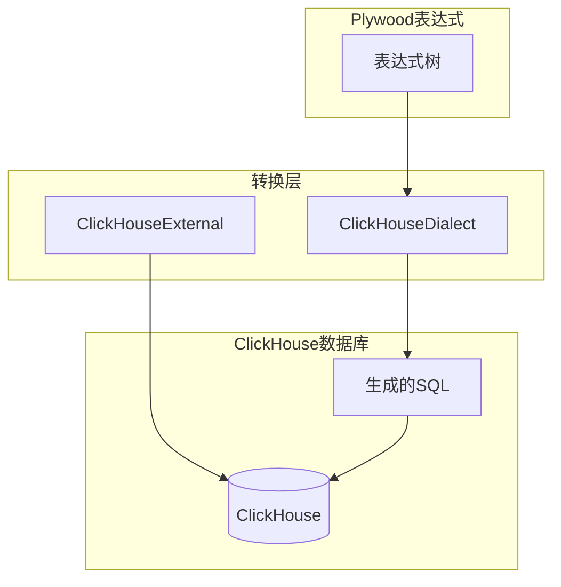
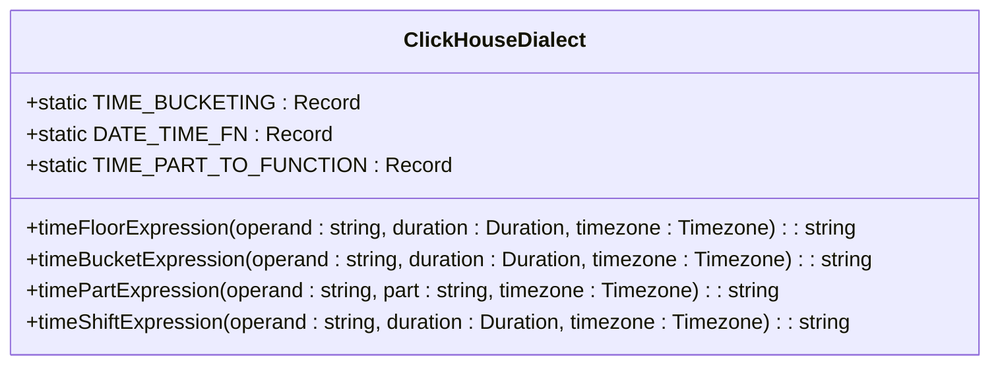
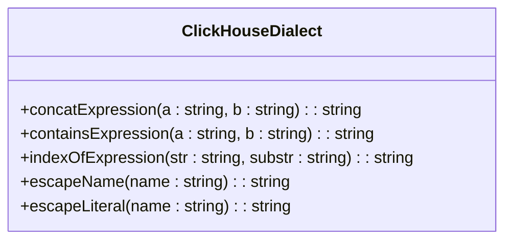
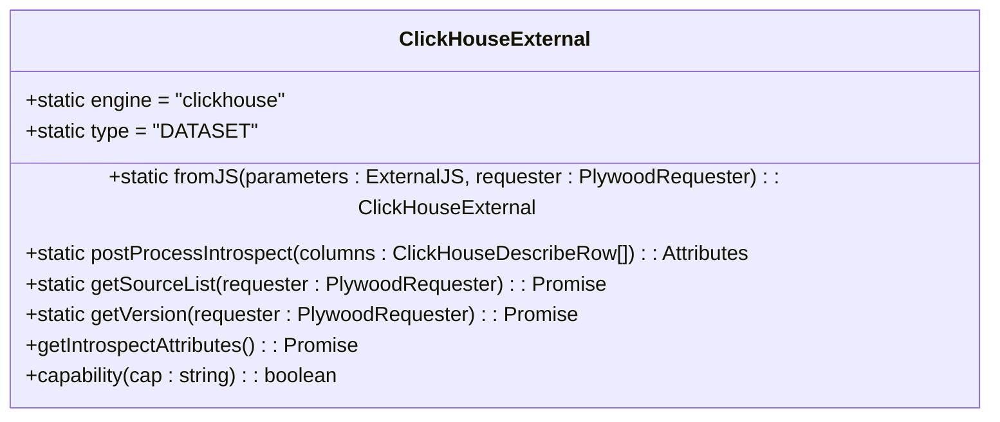
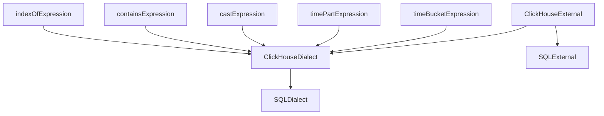

# ClickHouse方言API

<cite>
**本文档中引用的文件**   
- [clickHouseDialect.ts](file://src/dialect/clickHouseDialect.ts)
- [clickHouseExternal.ts](file://src/external/clickHouseExternal.ts)
- [baseDialect.ts](file://src/dialect/baseDialect.ts)
- [sqlExternal.ts](file://src/external/sqlExternal.ts)
- [timeBucketExpression.ts](file://src/expressions/timeBucketExpression.ts)
- [timePartExpression.ts](file://src/expressions/timePartExpression.ts)
- [castExpression.ts](file://src/expressions/castExpression.ts)
- [containsExpression.ts](file://src/expressions/containsExpression.ts)
- [indexOfExpression.ts](file://src/expressions/indexOfExpression.ts)
</cite>

## 目录
1. [简介](#简介)
2. [核心组件](#核心组件)
3. [架构概述](#架构概述)
4. [详细组件分析](#详细组件分析)
5. [依赖分析](#依赖分析)
6. [性能考虑](#性能考虑)
7. [故障排除指南](#故障排除指南)
8. [结论](#结论)

## 简介
本文档详细介绍了ClickHouse方言的API，系统说明了ClickHouseDialect如何适配ClickHouse列式数据库的独特语法和性能特性。文档详细解释了ClickHouse特有函数的映射实现，包括近似聚合函数、时间序列函数和嵌套类型操作符的处理逻辑。同时描述了ClickHouse方言在处理大规模数据聚合、稀疏数据填充和物化视图查询时的特殊优化策略。

## 核心组件
ClickHouse方言的核心组件包括ClickHouseDialect和ClickHouseExternal类。ClickHouseDialect类继承自SQLDialect，实现了ClickHouse特有的SQL语法转换逻辑，包括时间处理、类型转换和字符串操作等。ClickHouseExternal类则负责与ClickHouse数据库的交互，提供了数据查询和元数据获取的功能。

**核心组件**
- [clickHouseDialect.ts](file://src/dialect/clickHouseDialect.ts#L4-L161)
- [clickHouseExternal.ts](file://src/external/clickHouseExternal.ts#L13-L103)

## 架构概述
ClickHouse方言的架构基于Plywood的表达式系统，通过Dialect和External组件实现从Plywood表达式到ClickHouse SQL的转换。Dialect组件负责语法转换，而External组件负责执行查询和处理结果。



**图源**
- [clickHouseDialect.ts](file://src/dialect/clickHouseDialect.ts#L4-L161)
- [clickHouseExternal.ts](file://src/external/clickHouseExternal.ts#L13-L103)

## 详细组件分析

### ClickHouseDialect分析
ClickHouseDialect类实现了ClickHouse特有的SQL语法转换功能，包括时间处理、类型转换和字符串操作等。

#### 时间处理功能
ClickHouseDialect提供了完善的时间处理功能，包括时间分桶、时间部分提取和时间偏移等操作。



**图源**
- [clickHouseDialect.ts](file://src/dialect/clickHouseDialect.ts#L4-L161)

#### 类型转换功能
ClickHouseDialect实现了不同类型之间的转换逻辑，支持时间、数字和字符串类型之间的相互转换。

```mermaid
classDiagram
class ClickHouseDialect {
+static CAST_TO_FUNCTION : {[outputType : string] : {[inputType : string] : string}}
+castExpression(inputType : PlyType, operand : string, cast : string) : string
+utcToWalltime(operand : string, timezone : Timezone) : string
+walltimeToUTC(operand : string, timezone : Timezone) : string
}
```

**图源**
- [clickHouseDialect.ts](file://src/dialect/clickHouseDialect.ts#L4-L161)

#### 字符串操作功能
ClickHouseDialect提供了字符串连接、包含检查和索引查找等字符串操作功能。



**图源**
- [clickHouseDialect.ts](file://src/dialect/clickHouseDialect.ts#L4-L161)

### ClickHouseExternal分析
ClickHouseExternal类负责与ClickHouse数据库的交互，提供了数据查询和元数据获取的功能。



**图源**
- [clickHouseExternal.ts](file://src/external/clickHouseExternal.ts#L13-L103)

## 依赖分析
ClickHouse方言依赖于多个核心组件，包括基础方言类、表达式系统和外部请求器等。



**图源**
- [clickHouseDialect.ts](file://src/dialect/clickHouseDialect.ts#L4-L161)
- [clickHouseExternal.ts](file://src/external/clickHouseExternal.ts#L13-L103)
- [timeBucketExpression.ts](file://src/expressions/timeBucketExpression.ts#L1-L97)
- [timePartExpression.ts](file://src/expressions/timePartExpression.ts#L1-L168)
- [castExpression.ts](file://src/expressions/castExpression.ts#L1-L139)
- [containsExpression.ts](file://src/expressions/containsExpression.ts#L1-L141)
- [indexOfExpression.ts](file://src/expressions/indexOfExpression.ts#L1-L49)

## 性能考虑
ClickHouse方言在设计时充分考虑了性能优化，通过以下方式提高查询效率：
1. 直接使用ClickHouse原生函数进行时间处理
2. 优化类型转换逻辑，减少不必要的计算
3. 利用ClickHouse的列式存储特性，提高数据读取效率
4. 支持物化视图查询，减少实时计算开销

## 故障排除指南
在使用ClickHouse方言时可能遇到以下常见问题：

**核心组件**
- [clickHouseDialect.ts](file://src/dialect/clickHouseDialect.ts#L4-L161)
- [clickHouseExternal.ts](file://src/external/clickHouseExternal.ts#L13-L103)

## 结论
ClickHouse方言为Plywood提供了完整的ClickHouse数据库支持，通过精心设计的Dialect和External组件，实现了高效的SQL生成和查询执行。方言充分利用了ClickHouse的性能特性，为大规模数据分析提供了强大的支持。
</>