# Druid方言API

<cite>
**本文档中引用的文件**   
- [druidDialect.ts](file://src/dialect/druidDialect.ts)
- [baseDialect.ts](file://src/dialect/baseDialect.ts)
- [druidExternal.ts](file://src/external/druidExternal.ts)
- [druidExpressionBuilder.ts](file://src/external/utils/druidExpressionBuilder.ts)
- [druidAggregationBuilder.ts](file://src/external/utils/druidAggregationBuilder.ts)
- [druidFilterBuilder.ts](file://src/external/utils/druidFilterBuilder.ts)
- [druidTypes.ts](file://src/external/utils/druidTypes.ts)
- [timeFloorExpression.ts](file://src/expressions/timeFloorExpression.ts)
- [timeShiftExpression.ts](file://src/expressions/timeShiftExpression.ts)
</cite>

## 目录
1. [简介](#简介)
2. [DruidDialect类继承与实现](#druiddialect类继承与实现)
3. [时间函数转换规则](#时间函数转换规则)
4. [聚合函数转换规则](#聚合函数转换规则)
5. [复杂表达式转换规则](#复杂表达式转换规则)
6. [Plywood表达式到Druid JSON查询的映射](#plywood表达式到druid-json查询的映射)
7. [Druid方言性能考量](#druid方言性能考量)
8. [查询规划阶段的方言作用](#查询规划阶段的方言作用)
9. [结论](#结论)

## 简介
Druid方言是Plywood库中用于生成Druid特定查询逻辑的重要组件。它通过继承BaseDialect类并实现Druid特有的查询生成逻辑，为Druid数据源提供了完整的SQL方言支持。本API文档详细说明了DruidDialect类如何继承BaseDialect并实现Druid特定的查询生成逻辑，重点分析时间函数、聚合函数和复杂表达式的转换规则，以及从Plywood表达式到Druid JSON查询的完整映射过程。

**Section sources**
- [druidDialect.ts](file://src/dialect/druidDialect.ts#L1-L20)

## DruidDialect类继承与实现
DruidDialect类继承自BaseDialect抽象类，实现了Druid特定的SQL方言功能。BaseDialect定义了SQL方言的通用接口，而DruidDialect则提供了Druid数据库特有的实现。

DruidDialect类通过静态属性定义了时间分桶、时间部分和类型转换的映射关系：
- `TIME_BUCKETING`：定义了持续时间到时间分桶格式的映射
- `TIME_PART_TO_FUNCTION`：定义了时间部分到SQL函数的映射
- `CAST_TO_FUNCTION`：定义了类型转换的SQL函数

这些静态属性为Druid特定的查询生成提供了基础支持，确保了时间函数、类型转换等操作能够正确映射到Druid的SQL语法。

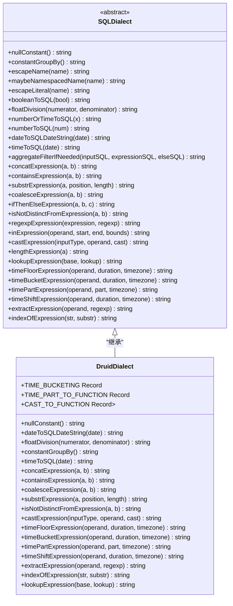

**Diagram sources**
- [druidDialect.ts](file://src/dialect/druidDialect.ts#L20-L175)
- [baseDialect.ts](file://src/dialect/baseDialect.ts#L20-L174)

**Section sources**
- [druidDialect.ts](file://src/dialect/druidDialect.ts#L20-L175)
- [baseDialect.ts](file://src/dialect/baseDialect.ts#L20-L174)

## 时间函数转换规则
DruidDialect类实现了多种时间函数的转换规则，这些规则将Plywood表达式中的时间操作转换为Druid SQL中的相应函数。

### TIME_FLOOR函数
`timeFloorExpression`方法实现了TIME_FLOOR函数的转换。该方法根据持续时间将时间值向下取整到指定的时间间隔。实现逻辑如下：
1. 通过`TIME_BUCKETING`静态属性查找对应的时间分桶格式
2. 如果不支持该持续时间，则抛出错误
3. 生成FLOOR函数的SQL表达式

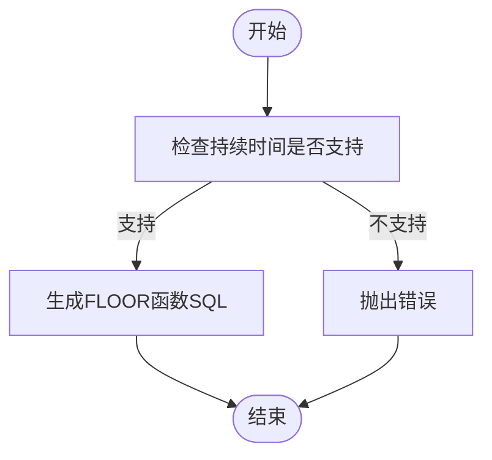

**Diagram sources**
- [druidDialect.ts](file://src/dialect/druidDialect.ts#L120-L130)

### TIME_SHIFT函数
`timeShiftExpression`方法实现了时间偏移功能。该方法根据指定的持续时间和步长对时间值进行偏移。实现逻辑如下：
1. 根据持续时间的组成部分（周、年/月、天/小时/分钟/秒）分别处理
2. 使用DATE_ADD函数生成相应的时间偏移SQL
3. 对于周偏移，直接生成INTERVAL WEEK表达式
4. 对于年/月偏移，生成INTERVAL YEAR_MONTH表达式
5. 对于天/小时/分钟/秒偏移，生成INTERVAL DAY_SECOND表达式

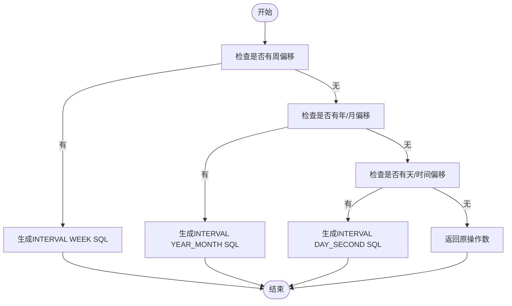

**Diagram sources**
- [druidDialect.ts](file://src/dialect/druidDialect.ts#L132-L155)

### 时间部分提取
`timePartExpression`方法实现了时间部分的提取功能。该方法根据指定的时间部分（如秒、分钟、小时等）从时间值中提取相应的数值。实现逻辑如下：
1. 通过`TIME_PART_TO_FUNCTION`静态属性查找对应的时间部分函数
2. 如果不支持该时间部分，则抛出错误
3. 将函数模板中的占位符替换为实际的操作数

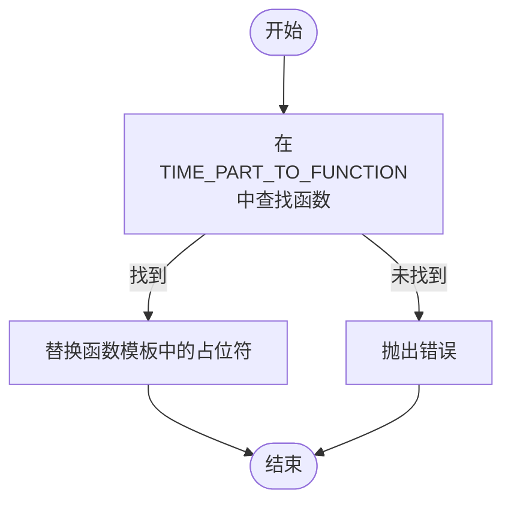

**Diagram sources**
- [druidDialect.ts](file://src/dialect/druidDialect.ts#L110-L118)

**Section sources**
- [druidDialect.ts](file://src/dialect/druidDialect.ts#L110-L155)
- [timeFloorExpression.ts](file://src/expressions/timeFloorExpression.ts#L1-L134)
- [timeShiftExpression.ts](file://src/expressions/timeShiftExpression.ts#L1-L125)

## 聚合函数转换规则
Druid方言通过DruidAggregationBuilder类实现了聚合函数的转换规则，将Plywood表达式中的聚合操作转换为Druid的聚合查询。

### APPROX_COUNT_DISTINCT函数
APPROX_COUNT_DISTINCT函数的转换通过`countDistinctToAggregation`方法实现。该方法根据数据类型的原生类型选择不同的近似计数算法：
- 对于hyperUnique类型，使用hyperUnique聚合器
- 对于thetaSketch类型，使用thetaSketch聚合器
- 对于HLLSketch类型，使用HLLSketchMerge聚合器
- 对于其他类型，使用cardinality聚合器

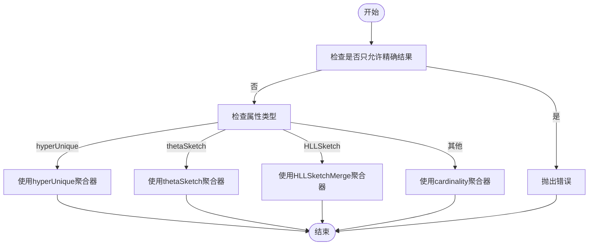

**Diagram sources**
- [druidAggregationBuilder.ts](file://src/external/utils/druidAggregationBuilder.ts#L200-L280)

### 其他聚合函数
除了APPROX_COUNT_DISTINCT外，Druid方言还支持多种其他聚合函数的转换：
- COUNT：转换为count聚合器
- SUM/MIN/MAX：根据数据类型转换为longSum/doubleSum/longMin/doubleMin/longMax/doubleMax聚合器
- QUANTILE：根据数据类型和调优参数选择approxHistogram或quantilesDoublesSketch聚合器

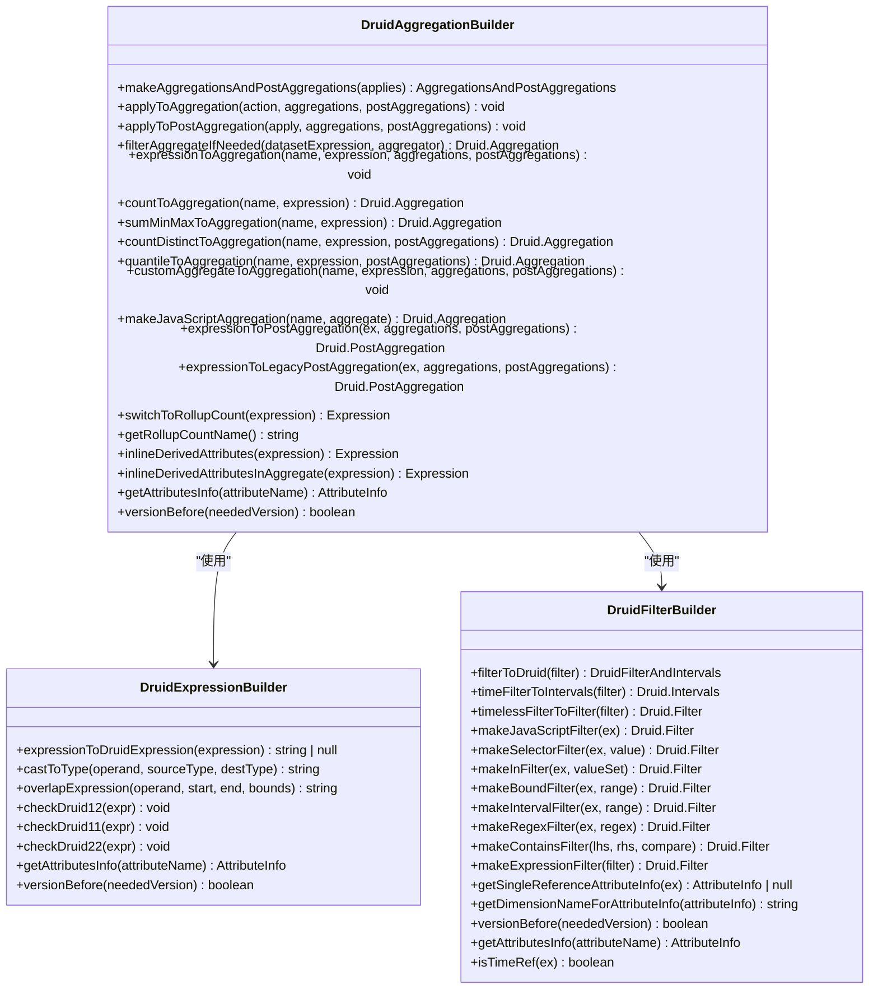

**Diagram sources**
- [druidAggregationBuilder.ts](file://src/external/utils/druidAggregationBuilder.ts#L74-L741)
- [druidExpressionBuilder.ts](file://src/external/utils/druidExpressionBuilder.ts#L69-L445)
- [druidFilterBuilder.ts](file://src/external/utils/druidFilterBuilder.ts#L69-L490)

**Section sources**
- [druidAggregationBuilder.ts](file://src/external/utils/druidAggregationBuilder.ts#L74-L741)
- [countDistinctExpression.ts](file://src/expressions/countDistinctExpression.ts#L1-L45)

## 复杂表达式转换规则
Druid方言通过DruidExpressionBuilder类实现了复杂表达式的转换规则，将Plywood表达式中的各种操作转换为Druid的表达式语言。

### 类型转换
`castExpression`方法实现了类型转换功能。该方法根据源类型和目标类型选择相应的转换函数：
- TIME到NUMBER：使用TO_TIMESTAMP函数
- NUMBER到TIME：使用CAST函数转换为BIGINT
- NUMBER到STRING：使用CAST函数转换为FLOAT
- STRING到NUMBER：使用CAST函数转换为VARCHAR

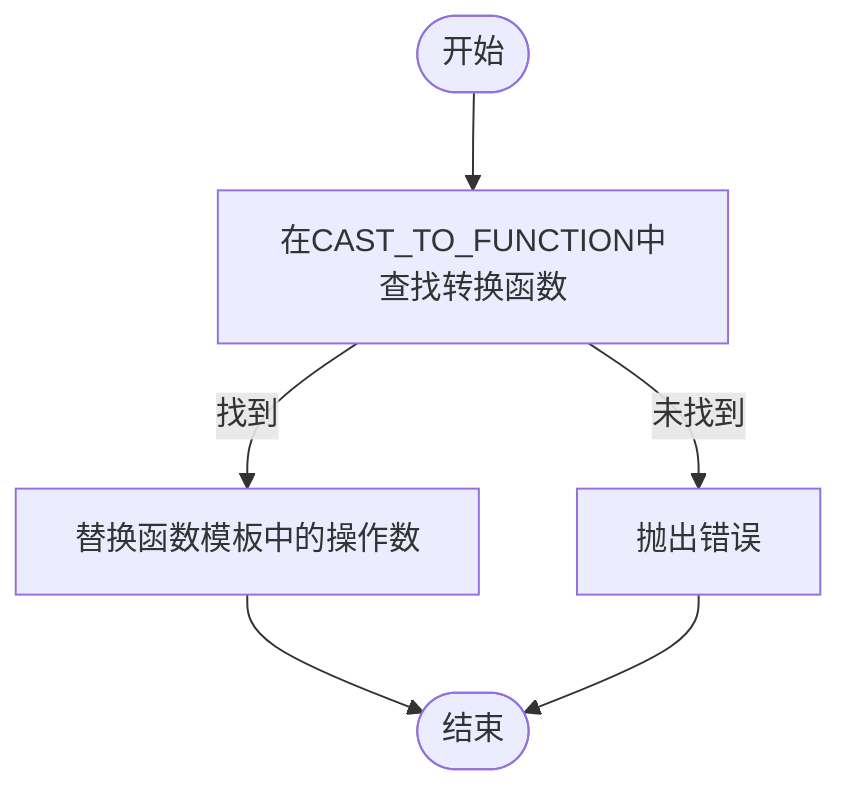

**Diagram sources**
- [druidDialect.ts](file://src/dialect/druidDialect.ts#L100-L108)

### 字符串操作
Druid方言实现了多种字符串操作的转换：
- `concatExpression`：使用||操作符连接字符串
- `containsExpression`：使用POSITION函数检查子字符串是否存在
- `substrExpression`：使用SUBSTRING函数提取子字符串
- `indexOfExpression`：使用POSITION函数查找子字符串位置

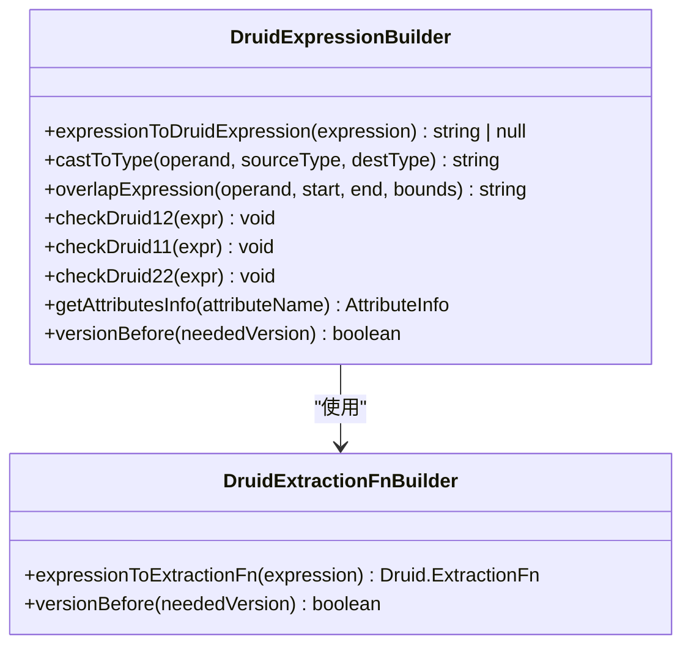

**Diagram sources**
- [druidDialect.ts](file://src/dialect/druidDialect.ts#L80-L100)
- [druidExpressionBuilder.ts](file://src/external/utils/druidExpressionBuilder.ts#L69-L445)

### 逻辑操作
Druid方言实现了逻辑操作的转换：
- `andExpression`：使用&&操作符
- `orExpression`：使用||操作符
- `notExpression`：使用!操作符
- `isNotDistinctFromExpression`：使用=操作符（Druid中NULL值比较的特殊处理）

**Section sources**
- [druidDialect.ts](file://src/dialect/druidDialect.ts#L80-L108)
- [druidExpressionBuilder.ts](file://src/external/utils/druidExpressionBuilder.ts#L69-L445)

## Plywood表达式到Druid JSON查询的映射
Druid方言通过druidExternal.ts文件中的执行流程，将Plywood表达式映射为Druid JSON查询。这个过程涉及多个组件的协同工作。

### 查询生成流程
查询生成的主要流程如下：
1. DruidExternal类接收Plywood表达式
2. 根据表达式类型选择相应的查询类型（groupBy、topN、timeseries等）
3. 使用DruidAggregationBuilder生成聚合和后聚合
4. 使用DruidFilterBuilder生成过滤条件
5. 使用DruidExpressionBuilder生成表达式
6. 构建最终的Druid JSON查询

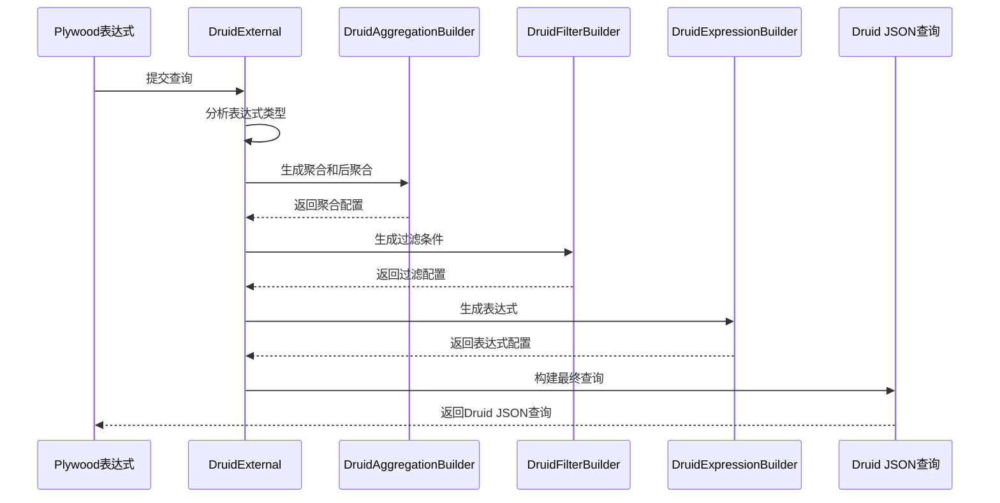

**Diagram sources**
- [druidExternal.ts](file://src/external/druidExternal.ts#L1-L2091)

### 数据类型处理
在查询映射过程中，数据类型处理是一个重要环节。DruidExpressionBuilder类的`expressionTypeToOutputType`方法负责将Plywood类型映射为Druid输出类型：
- TIME和TIME_RANGE：映射为LONG
- NUMBER和NUMBER_RANGE：映射为FLOAT
- 其他类型：映射为STRING

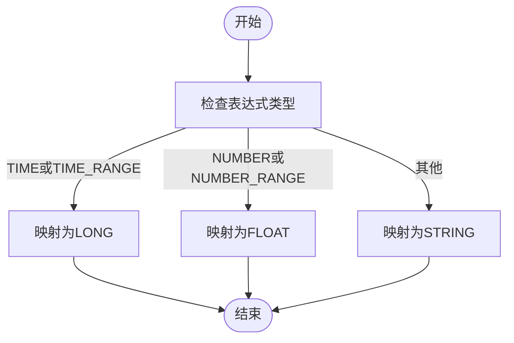

**Diagram sources**
- [druidExpressionBuilder.ts](file://src/external/utils/druidExpressionBuilder.ts#L100-L115)

### 过滤条件生成
过滤条件的生成由DruidFilterBuilder类负责。该类将Plywood表达式中的各种过滤操作转换为Druid的过滤器：
- `isExpression`：转换为selector过滤器
- `overlapExpression`：根据范围类型转换为bound或interval过滤器
- `matchExpression`：转换为regex过滤器
- `containsExpression`：转换为search过滤器

**Section sources**
- [druidExternal.ts](file://src/external/druidExternal.ts#L1-L2091)
- [druidExpressionBuilder.ts](file://src/external/utils/druidExpressionBuilder.ts#L69-L445)
- [druidFilterBuilder.ts](file://src/external/utils/druidFilterBuilder.ts#L69-L490)

## Druid方言性能考量
Druid方言在设计时充分考虑了性能优化，特别是在rollup配置和查询优化方面。

### Rollup配置的影响
Rollup配置对查询结果有重要影响。当数据已经按特定维度rollup时，某些查询操作会受到限制：
- 无法对已rollup的度量进行过滤
- 无法对已rollup的度量进行分割
- COUNT聚合会被转换为SUM聚合，使用rollup计数字段

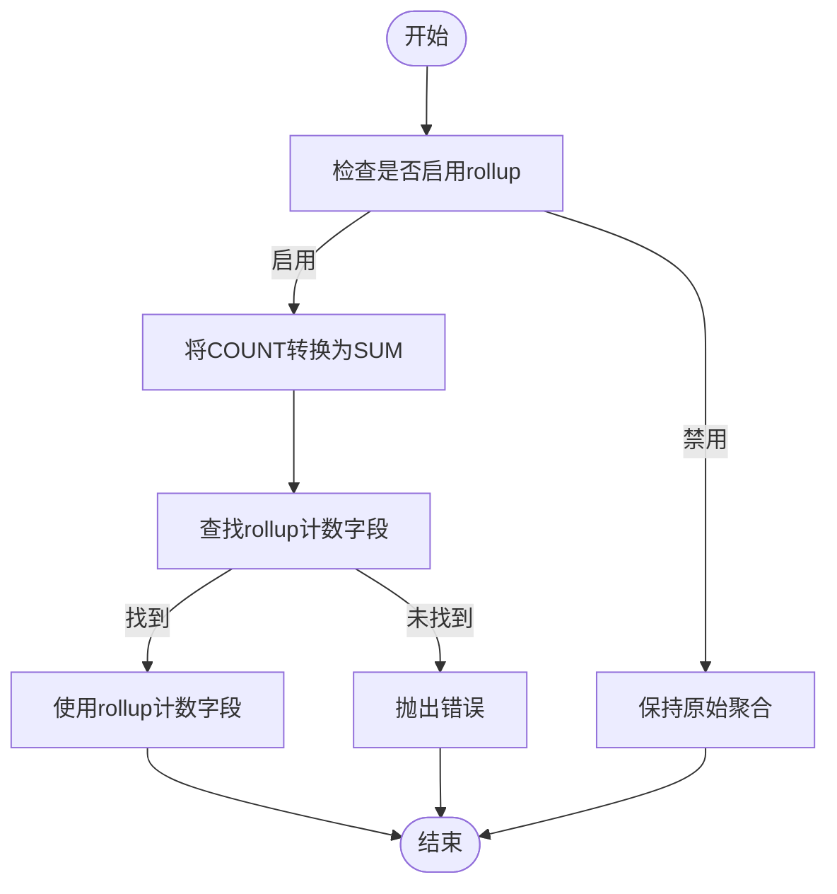

**Diagram sources**
- [druidAggregationBuilder.ts](file://src/external/utils/druidAggregationBuilder.ts#L500-L530)

### 聚合阶段优化
Druid方言通过多种方式优化聚合阶段的性能：
- 使用原生聚合器而非JavaScript聚合器
- 将多个聚合操作合并为单个查询
- 利用Druid的后聚合功能减少数据传输
- 根据Druid版本选择最优的表达式函数

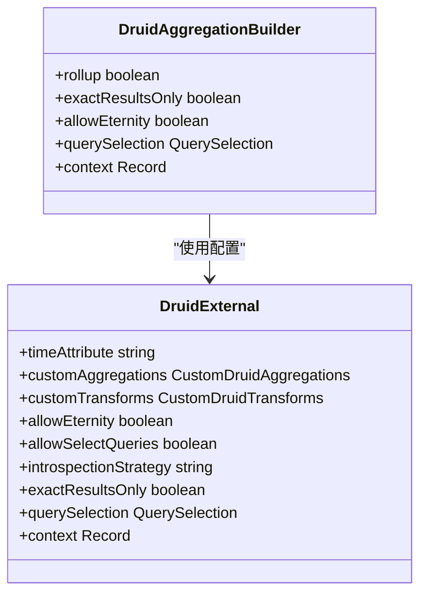

**Diagram sources**
- [druidAggregationBuilder.ts](file://src/external/utils/druidAggregationBuilder.ts#L60-L72)
- [druidExternal.ts](file://src/external/druidExternal.ts#L1-L2091)

**Section sources**
- [druidAggregationBuilder.ts](file://src/external/utils/druidAggregationBuilder.ts#L60-L72)
- [druidExternal.ts](file://src/external/druidExternal.ts#L1-L2091)

## 查询规划阶段的方言作用
在查询规划阶段，Druid方言通过druidExternal.ts中的执行流程发挥关键作用。方言不仅负责语法转换，还参与查询优化和执行策略的制定。

### 查询类型选择
DruidExternal类根据查询特征选择最优的查询类型：
- 时间序列查询：使用timeseries查询
- 顶级N查询：使用topN查询
- 分组查询：使用groupBy查询
- 扫描查询：使用scan查询

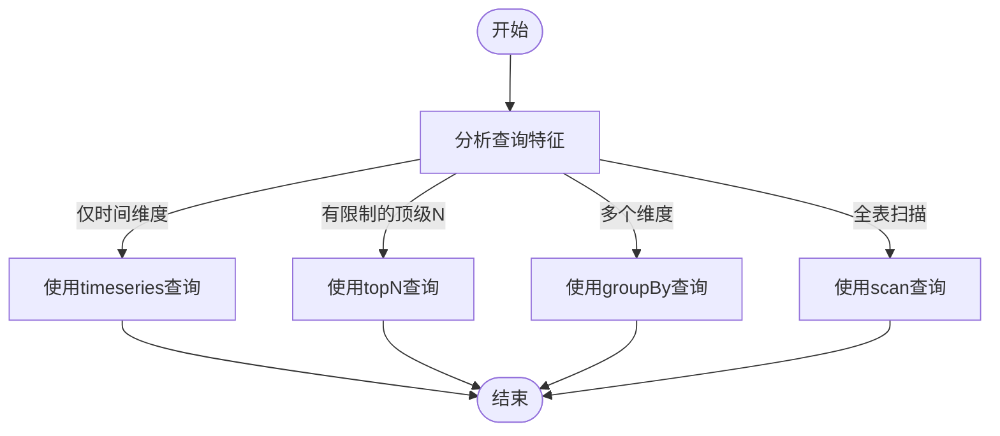

**Diagram sources**
- [druidExternal.ts](file://src/external/druidExternal.ts#L1-L2091)

### 执行策略优化
Druid方言还优化了查询的执行策略：
- 对于大结果集，使用分页查询
- 根据排序方向调整分页标识符
- 限制单次查询的结果数量
- 合并多个小查询为单个大查询

**Section sources**
- [druidExternal.ts](file://src/external/druidExternal.ts#L1-L2091)

## 结论
Druid方言通过继承BaseDialect类并实现Druid特定的查询生成逻辑，为Plywood库提供了完整的Druid查询支持。它不仅实现了时间函数、聚合函数和复杂表达式的转换规则，还通过druidExternal.ts中的执行流程，在查询规划阶段发挥了重要作用。Druid方言充分考虑了性能优化，特别是在rollup配置和聚合阶段优化方面，充分利用了Druid的原生能力实现高效查询。通过从Plywood表达式到Druid JSON查询的完整映射，Druid方言为开发者提供了简洁而强大的查询接口。