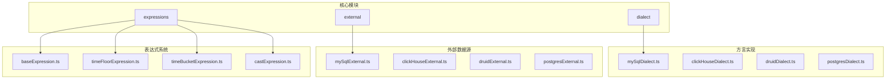
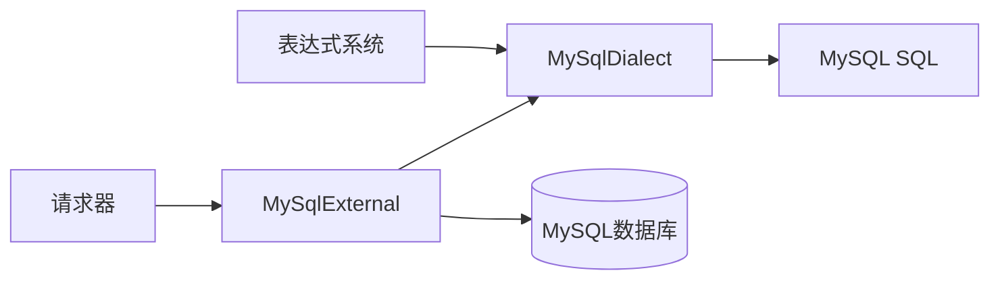
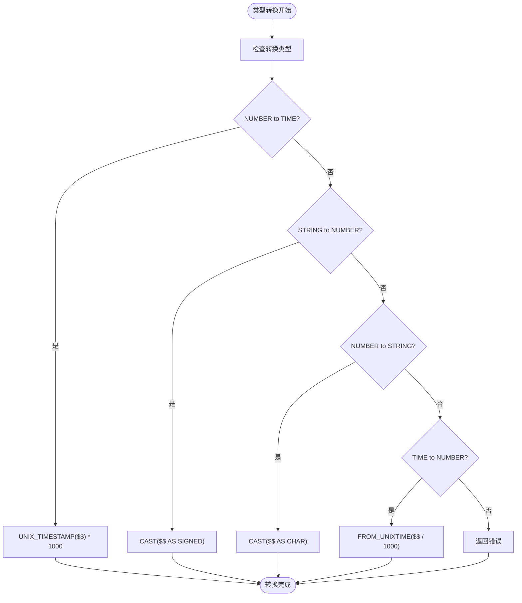
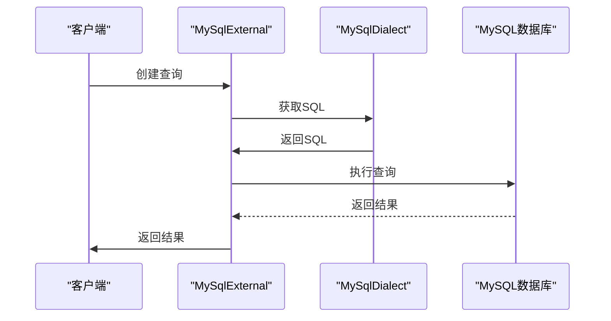
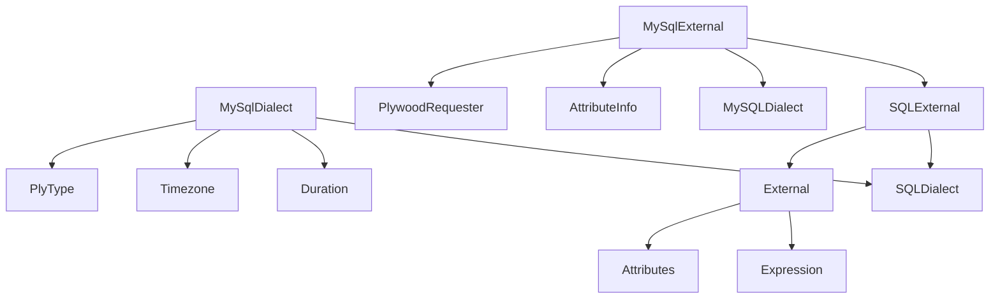

# MySQL方言API

<cite>
**本文档引用的文件**   
- [mySqlDialect.ts](file://src/dialect/mySqlDialect.ts)
- [mySqlExternal.ts](file://src/external/mySqlExternal.ts)
- [baseDialect.ts](file://src/dialect/baseDialect.ts)
- [sqlExternal.ts](file://src/external/sqlExternal.ts)
- [types.ts](file://src/types.ts)
</cite>

## 目录
1. [简介](#简介)
2. [项目结构](#项目结构)
3. [核心组件](#核心组件)
4. [架构概述](#架构概述)
5. [详细组件分析](#详细组件分析)
6. [依赖分析](#依赖分析)
7. [性能考虑](#性能考虑)
8. [故障排除指南](#故障排除指南)
9. [结论](#结论)

## 简介
本文档详细阐述了Plywood框架中MySQL方言的实现机制，重点分析了MySqlDialect如何将通用表达式转换为符合MySQL语法的SQL查询。文档深入探讨了MySQL特有函数的映射机制，包括时间处理函数、字符串函数和聚合函数的实现方式，以及MySQL方言在处理类型转换、NULL值语义和字符集兼容性方面的特殊处理逻辑。

## 项目结构
项目结构清晰地展示了Plywood框架的模块化设计，其中`src/dialect`目录包含了针对不同数据库的方言实现，`src/external`目录包含了外部数据源的实现，`src/expressions`目录包含了各种表达式的实现。



**Diagram sources**
- [mySqlDialect.ts](file://src/dialect/mySqlDialect.ts)
- [mySqlExternal.ts](file://src/external/mySqlExternal.ts)
- [baseExpression.ts](file://src/expressions/baseExpression.ts)

**Section sources**
- [mySqlDialect.ts](file://src/dialect/mySqlDialect.ts)
- [mySqlExternal.ts](file://src/external/mySqlExternal.ts)

## 核心组件
MySQL方言的核心组件包括MySqlDialect类和MySqlExternal类。MySqlDialect类继承自SQLDialect基类，实现了MySQL特有的SQL生成逻辑。MySqlExternal类继承自SQLExternal类，提供了与MySQL数据库交互的具体实现。

**Section sources**
- [mySqlDialect.ts](file://src/dialect/mySqlDialect.ts#L21-L172)
- [mySqlExternal.ts](file://src/external/mySqlExternal.ts#L30-L117)

## 架构概述
MySQL方言的架构基于Plywood的表达式系统和外部数据源系统。表达式系统负责构建和操作查询逻辑，外部数据源系统负责与具体数据库交互。MySqlDialect作为桥梁，将通用表达式转换为MySQL特定的SQL语法。



**Diagram sources**
- [mySqlDialect.ts](file://src/dialect/mySqlDialect.ts)
- [mySqlExternal.ts](file://src/external/mySqlExternal.ts)

## 详细组件分析

### MySqlDialect分析
MySqlDialect类是MySQL方言的核心，它实现了SQLDialect抽象类中的各种方法，将通用表达式转换为MySQL特定的SQL语法。

#### 时间处理函数映射
MySqlDialect通过静态常量TIME_PART_TO_FUNCTION定义了时间部分到MySQL函数的映射关系。这些映射允许将通用的时间部分表达式转换为相应的MySQL函数调用。

```mermaid
classDiagram
class MySQLDialect {
+static TIME_BUCKETING : Record<string, string>
+static TIME_PART_TO_FUNCTION : Record<string, string>
+static CAST_TO_FUNCTION : {[outputType : string] : {[inputType : string] : string}}
+timeToSQL(date : Date) : string
+concatExpression(a : string, b : string) : string
+containsExpression(a : string, b : string) : string
+isNotDistinctFromExpression(a : string, b : string) : string
+castExpression(inputType : PlyType, operand : string, cast : string) : string
+utcToWalltime(operand : string, timezone : Timezone) : string
+walltimeToUTC(operand : string, timezone : Timezone) : string
+timeFloorExpression(operand : string, duration : Duration, timezone : Timezone) : string
+timeBucketExpression(operand : string, duration : Duration, timezone : Timezone) : string
+timePartExpression(operand : string, part : string, timezone : Timezone) : string
+timeShiftExpression(operand : string, duration : Duration, timezone : Timezone) : string
+extractExpression(operand : string, regexp : string) : string
+indexOfExpression(str : string, substr : string) : string
}
class SQLDialect {
<<abstract>>
+nullConstant() : string
+constantGroupBy() : string
+escapeName(name : string) : string
+maybeNamespacedName(name : string) : string
+escapeLiteral(name : string) : string
+booleanToSQL(bool : boolean) : string
+floatDivision(numerator : string, denominator : string) : string
+numberOrTimeToSQL(x : number | Date) : string
+numberToSQL(num : number) : string
+dateToSQLDateString(date : Date) : string
+abstract timeToSQL(date : Date) : string
+aggregateFilterIfNeeded(inputSQL : string, expressionSQL : string, elseSQL : string | null = null) : string
+abstract concatExpression(a : string, b : string) : string
+abstract containsExpression(a : string, b : string) : string
+abstract substrExpression(a : string, position : number, length : number) : string
+abstract coalesceExpression(a : string, b : string) : string
+abstract ifThenElseExpression(a : string, b : string, c : string | null = null) : string
+abstract isNotDistinctFromExpression(a : string, b : string) : string
+abstract regexpExpression(expression : string, regexp : string) : string
+abstract inExpression(operand : string, start : string, end : string, bounds : string)
+abstract castExpression(inputType : PlyType, operand : string, cast : PlyTypeSimple) : string
+abstract lengthExpression(a : string) : string
+abstract lookupExpression(_base : string, _lookup : string) : string
+abstract timeFloorExpression(operand : string, duration : Duration, timezone : Timezone) : string
+abstract timeBucketExpression(operand : string, duration : Duration, timezone : Timezone) : string
+abstract timePartExpression(operand : string, part : string, timezone : Timezone) : string
+abstract timeShiftExpression(operand : string, duration : Duration, timezone : Timezone) : string
+abstract extractExpression(operand : string, regexp : string) : string
+abstract indexOfExpression(str : string, substr : string) : string
}
MySQLDialect --|> SQLDialect : 继承
```

**Diagram sources**
- [mySqlDialect.ts](file://src/dialect/mySqlDialect.ts#L21-L172)
- [baseDialect.ts](file://src/dialect/baseDialect.ts#L21-L172)

#### 类型转换机制
MySqlDialect通过CAST_TO_FUNCTION静态常量定义了类型转换的映射关系。这些映射允许在不同数据类型之间进行转换，例如将数字转换为时间，或将字符串转换为数字。



**Diagram sources**
- [mySqlDialect.ts](file://src/dialect/mySqlDialect.ts#L76-L84)

### MySqlExternal分析
MySqlExternal类是MySQL外部数据源的实现，它继承自SQLExternal类，提供了与MySQL数据库交互的具体方法。

#### 执行上下文分析
MySqlExternal的执行上下文包括请求器、数据源、属性信息等。这些上下文信息在查询执行过程中起着关键作用。



**Diagram sources**
- [mySqlExternal.ts](file://src/external/mySqlExternal.ts#L30-L117)
- [mySqlDialect.ts](file://src/dialect/mySqlDialect.ts)

## 依赖分析
MySQL方言的实现依赖于多个核心模块，包括表达式系统、数据类型系统和外部数据源系统。这些模块之间的依赖关系确保了查询的正确生成和执行。



**Diagram sources**
- [mySqlDialect.ts](file://src/dialect/mySqlDialect.ts)
- [mySqlExternal.ts](file://src/external/mySqlExternal.ts)
- [sqlExternal.ts](file://src/external/sqlExternal.ts)

**Section sources**
- [mySqlDialect.ts](file://src/dialect/mySqlDialect.ts)
- [mySqlExternal.ts](file://src/external/mySqlExternal.ts)
- [sqlExternal.ts](file://src/external/sqlExternal.ts)

## 性能考虑
MySQL方言在设计时考虑了性能因素，通过优化SQL生成和查询执行来提高查询效率。例如，MySqlDialect中的timeFloorExpression方法通过缓存时间桶格式来减少重复计算。

## 故障排除指南
在使用MySQL方言时，可能会遇到一些常见问题，如类型转换错误、时间处理函数不支持等。这些问题通常可以通过检查表达式类型、验证时间格式等方式解决。

**Section sources**
- [mySqlDialect.ts](file://src/dialect/mySqlDialect.ts)
- [mySqlExternal.ts](file://src/external/mySqlExternal.ts)

## 结论
MySQL方言通过MySqlDialect和MySqlExternal两个核心组件，实现了Plywood框架与MySQL数据库的无缝集成。通过详细的函数映射和类型转换机制，MySQL方言能够将通用表达式准确地转换为符合MySQL语法的SQL查询，同时在性能和可靠性方面也进行了充分考虑。