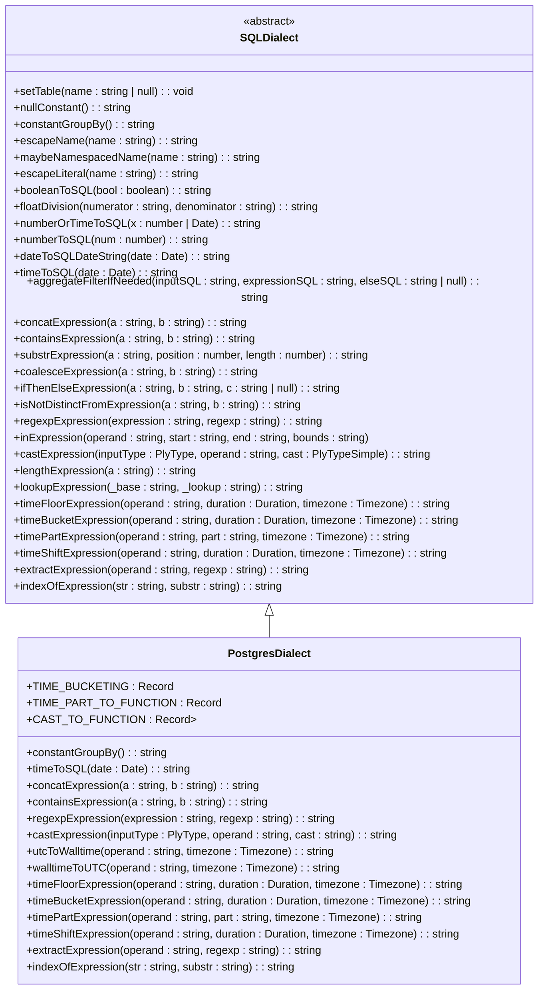
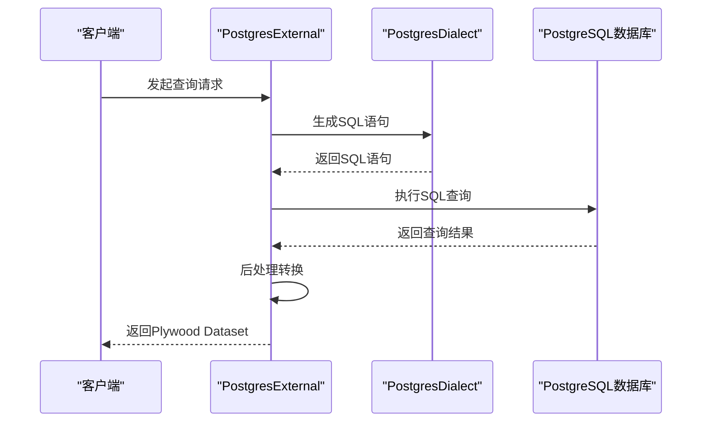

# PostgreSQL方言API

<cite>
**Referenced Files in This Document**   
- [postgresDialect.ts](file://src/dialect/postgresDialect.ts)
- [postgresExternal.ts](file://src/external/postgresExternal.ts)
- [baseDialect.ts](file://src/dialect/baseDialect.ts)
- [sqlExternal.ts](file://src/external/sqlExternal.ts)
</cite>

## 目录
1. [简介](#简介)
2. [核心组件](#核心组件)
3. [PostgreSQL方言实现机制](#postgresql方言实现机制)
4. [PostgreSQL特有函数转换规则](#postgresql特有函数转换规则)
5. [复杂数据类型适配策略](#复杂数据类型适配策略)
6. [查询优化技巧](#查询优化技巧)
7. [集成方式与查询流程](#集成方式与查询流程)
8. [结论](#结论)

## 简介
PostgreSQL方言API文档深入解析了`PostgresDialect`类如何支持PostgreSQL高级特性。该文档详细描述了PostgreSQL特有函数的转换规则，包括窗口函数、JSONB操作符、数组函数和时区处理函数的实现机制。同时，文档说明了PostgreSQL方言在处理复杂数据类型（如hstore、enum）和扩展功能（如PostGIS）时的适配策略。通过从Plywood表达式到PostgreSQL SQL的转换示例，突出其对标准SQL的扩展支持。此外，文档还分析了PostgreSQL方言在处理大规模数据分析查询时的优化技巧，如CTE生成和并行查询提示，并结合`postgresExternal.ts`的集成方式，阐述了方言在整体查询流程中的角色。

## 核心组件

PostgreSQL方言的核心组件包括`PostgresDialect`类和`PostgresExternal`类。`PostgresDialect`类继承自`SQLDialect`，实现了PostgreSQL特有的SQL生成规则。`PostgresExternal`类则负责与PostgreSQL数据库的交互，通过`PostgresDialect`生成的SQL语句执行查询。

**Section sources**
- [postgresDialect.ts](file://src/dialect/postgresDialect.ts#L20-L158)
- [postgresExternal.ts](file://src/external/postgresExternal.ts#L31-L136)

## PostgreSQL方言实现机制

`PostgresDialect`类通过继承`SQLDialect`类，实现了PostgreSQL特有的SQL生成规则。该类定义了多个静态映射表，如`TIME_BUCKETING`、`TIME_PART_TO_FUNCTION`和`CAST_TO_FUNCTION`，用于将Plywood表达式转换为PostgreSQL SQL语句。

**Diagram sources **
- [baseDialect.ts](file://src/dialect/baseDialect.ts#L21-L172)
- [postgresDialect.ts](file://src/dialect/postgresDialect.ts#L20-L158)

**Section sources**
- [postgresDialect.ts](file://src/dialect/postgresDialect.ts#L20-L158)
- [baseDialect.ts](file://src/dialect/baseDialect.ts#L21-L172)

## PostgreSQL特有函数转换规则

### 时间函数转换
`PostgresDialect`类通过`TIME_PART_TO_FUNCTION`映射表，将Plywood表达式中的时间部分转换为PostgreSQL的`DATE_PART`函数。例如，`SECOND_OF_MINUTE`被转换为`DATE_PART('second',$$)`，`MINUTE_OF_HOUR`被转换为`DATE_PART('minute',$$)`。

### 类型转换
`PostgresDialect`类通过`CAST_TO_FUNCTION`映射表，将Plywood表达式中的类型转换为PostgreSQL的类型转换函数。例如，`TIME`到`NUMBER`的转换被转换为`TO_TIMESTAMP($$::double precision / 1000)`，`NUMBER`到`TIME`的转换被转换为`EXTRACT(EPOCH FROM $$) * 1000`。

### 字符串函数转换
`PostgresDialect`类通过`concatExpression`方法，将Plywood表达式中的字符串连接操作转换为PostgreSQL的`||`操作符。`containsExpression`方法将字符串包含操作转换为`POSITION(${a} IN ${b})>0`。

**Section sources**
- [postgresDialect.ts](file://src/dialect/postgresDialect.ts#L51-L98)
- [postgresDialect.ts](file://src/dialect/postgresDialect.ts#L96-L124)

## 复杂数据类型适配策略

### 数组类型处理
`PostgresExternal`类通过`postProcessIntrospect`方法，将PostgreSQL的数组类型转换为Plywood的`SET`类型。例如，`character`数组被转换为`SET/STRING`，`timestamp`数组被转换为`SET/TIME`。

### JSONB类型处理
虽然代码中未直接体现JSONB类型的处理，但通过`regexpExpression`方法，可以实现对JSONB类型的正则表达式匹配。`extractExpression`方法通过`REGEXP_MATCHES`函数，从字符串中提取匹配的子串。

### 时区处理
`PostgresDialect`类通过`utcToWalltime`和`walltimeToUTC`方法，实现UTC时间和本地时间的转换。`utcToWalltime`方法将UTC时间转换为本地时间，`walltimeToUTC`方法将本地时间转换为UTC时间。

**Section sources**
- [postgresExternal.ts](file://src/external/postgresExternal.ts#L31-L136)
- [postgresDialect.ts](file://src/dialect/postgresDialect.ts#L126-L158)

## 查询优化技巧

### CTE生成
虽然代码中未直接体现CTE生成，但通过`PostgresExternal`类的`getQueryAndPostTransform`方法，可以生成复杂的SQL查询，包括`SELECT`、`FROM`、`WHERE`、`GROUP BY`、`HAVING`、`ORDER BY`和`LIMIT`子句。这些子句的组合可以实现CTE的功能。

### 并行查询提示
代码中未直接体现并行查询提示，但通过`PostgresExternal`类的`requester`方法，可以执行并行查询。`requester`方法返回一个`Promise`，可以并行执行多个查询。

**Section sources**
- [sqlExternal.ts](file://src/external/sqlExternal.ts#L41-L198)
- [postgresExternal.ts](file://src/external/postgresExternal.ts#L31-L136)

## 集成方式与查询流程

### 集成方式
`PostgresExternal`类通过继承`SQLExternal`类，实现了与PostgreSQL数据库的集成。`PostgresExternal`类的构造函数接收一个`ExternalValue`对象和一个`PostgresDialect`对象，通过`PostgresDialect`对象生成SQL语句。

### 查询流程
`PostgresExternal`类的`getQueryAndPostTransform`方法生成SQL查询和后处理转换。`requester`方法执行SQL查询，返回一个`ReadableStream`。`performQueryAndPostTransform`方法将查询结果转换为Plywood的`Dataset`。

**Diagram sources **
- [postgresExternal.ts](file://src/external/postgresExternal.ts#L31-L136)
- [sqlExternal.ts](file://src/external/sqlExternal.ts#L41-L198)

**Section sources**
- [postgresExternal.ts](file://src/external/postgresExternal.ts#L31-L136)
- [sqlExternal.ts](file://src/external/sqlExternal.ts#L41-L198)

## 结论
PostgreSQL方言API通过`PostgresDialect`和`PostgresExternal`类，实现了对PostgreSQL高级特性的支持。通过详细的转换规则和适配策略，该API能够将Plywood表达式转换为高效的PostgreSQL SQL语句。同时，通过集成方式和查询流程的优化，该API能够处理大规模数据分析查询，提供高性能的查询服务。