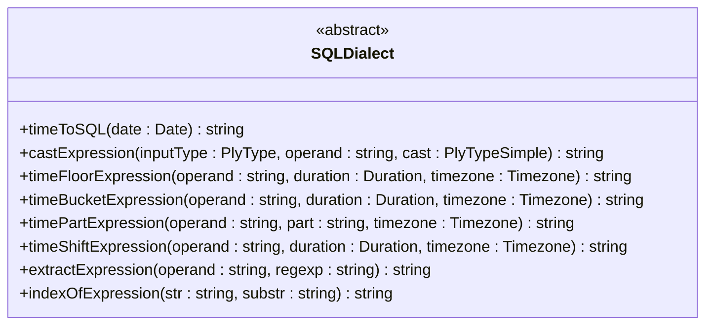
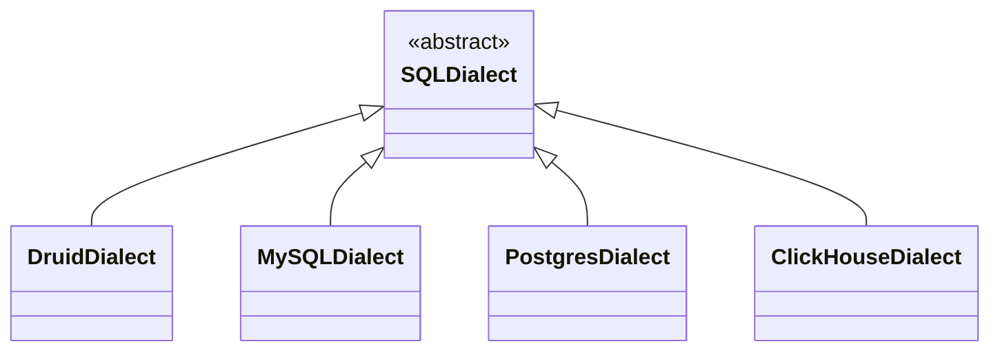
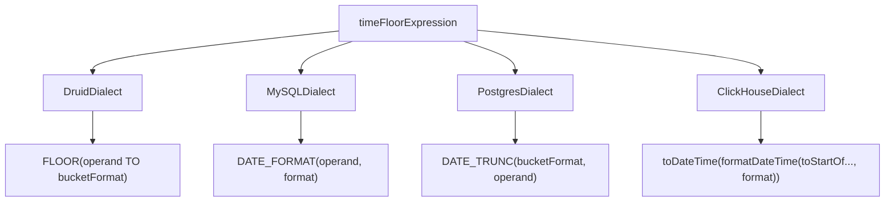
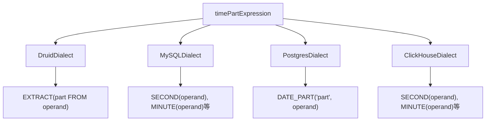
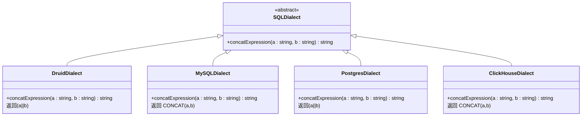
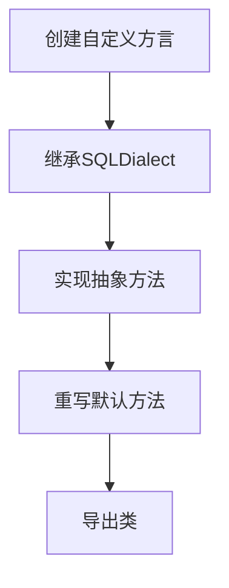

# 查询方言API

<cite>
**本文档中引用的文件**   
- [baseDialect.ts](file://src/dialect/baseDialect.ts)
- [druidDialect.ts](file://src/dialect/druidDialect.ts)
- [mySqlDialect.ts](file://src/dialect/mySqlDialect.ts)
- [postgresDialect.ts](file://src/dialect/postgresDialect.ts)
- [clickHouseDialect.ts](file://src/dialect/clickHouseDialect.ts)
- [index.ts](file://src/dialect/index.ts)
</cite>

## 目录
1. [引言](#引言)
2. [核心抽象类设计](#核心抽象类设计)
3. [方言实现对比](#方言实现对比)
4. [时间函数实现差异](#时间函数实现差异)
5. [聚合与字符串处理差异](#聚合与字符串处理差异)
6. [自定义方言扩展指南](#自定义方言扩展指南)
7. [方言选择对查询性能的影响](#方言选择对查询性能的影响)

## 引言
查询方言系统是Plywood框架的核心组件，负责将通用表达式转换为特定数据库的查询语言。该系统通过抽象类`SQLDialect`定义了统一的接口契约，并为Druid、MySQL、PostgreSQL和ClickHouse等不同数据库提供了具体的实现。本文档详细解释了该系统的设计原理、实现差异和扩展方法。

## 核心抽象类设计

`SQLDialect`抽象类定义了查询方言系统的基础接口和默认实现，为所有具体方言提供了统一的方法契约。该类通过抽象方法强制子类实现关键功能，同时提供了一些通用的默认实现。

**Section sources**
- [baseDialect.ts](file://src/dialect/baseDialect.ts#L21-L172)

### 抽象方法契约
`SQLDialect`类定义了多个必须由子类实现的抽象方法，这些方法构成了方言转换的核心功能：

**Diagram sources **
- [baseDialect.ts](file://src/dialect/baseDialect.ts#L21-L172)

### 默认实现方法
除了抽象方法外，`SQLDialect`还提供了一些具有默认实现的方法，这些方法可以在子类中被重写以适应特定数据库的需求：

- `escapeName(name: string)`: 使用双引号转义标识符名称
- `escapeLiteral(name: string)`: 使用单引号转义字面量并处理特殊字符
- `ifThenElseExpression(a: string, b: string, c: string | null)`: 生成CASE WHEN语句
- `inExpression(operand: string, start: string, end: string, bounds: string)`: 生成范围查询条件
- `lengthExpression(a: string)`: 生成字符长度计算表达式

这些默认实现为所有方言提供了基础功能，确保了系统的一致性和可扩展性。

**Section sources**
- [baseDialect.ts](file://src/dialect/baseDialect.ts#L21-L172)

## 方言实现对比

Plywood框架为四种主要数据库系统提供了具体的方言实现：`DruidDialect`、`MySQLDialect`、`PostgresDialect`和`ClickHouseDialect`。这些实现类继承自`SQLDialect`抽象类，并根据各自数据库的语法特性重写了相应的方法。

**Diagram sources **
- [baseDialect.ts](file://src/dialect/baseDialect.ts#L21-L172)
- [druidDialect.ts](file://src/dialect/druidDialect.ts#L20-L175)
- [mySqlDialect.ts](file://src/dialect/mySqlDialect.ts#L21-L172)
- [postgresDialect.ts](file://src/dialect/postgresDialect.ts#L20-L158)
- [clickHouseDialect.ts](file://src/dialect/clickHouseDialect.ts#L4-L161)

### 实现类结构
每个方言实现类都遵循相似的结构模式：
1. 定义静态常量映射表（如`TIME_BUCKETING`、`TIME_PART_TO_FUNCTION`）
2. 重写构造函数（通常只需调用父类构造函数）
3. 实现或重写抽象方法以适应特定数据库语法
4. 提供数据库特有的辅助方法

这种设计模式确保了代码的一致性和可维护性，同时允许每个实现针对特定数据库进行优化。

**Section sources**
- [druidDialect.ts](file://src/dialect/druidDialect.ts#L20-L175)
- [mySqlDialect.ts](file://src/dialect/mySqlDialect.ts#L21-L172)
- [postgresDialect.ts](file://src/dialect/postgresDialect.ts#L20-L158)
- [clickHouseDialect.ts](file://src/dialect/clickHouseDialect.ts#L4-L161)

## 时间函数实现差异

不同数据库在时间处理函数的语法和功能上存在显著差异，各方言实现类针对这些差异提供了相应的转换逻辑。

### 时间取整函数对比
`timeFloorExpression`方法在不同方言中的实现展示了明显的语法差异：

**Diagram sources **
- [druidDialect.ts](file://src/dialect/druidDialect.ts#L20-L175)
- [mySqlDialect.ts](file://src/dialect/mySqlDialect.ts#L21-L172)
- [postgresDialect.ts](file://src/dialect/postgresDialect.ts#L20-L158)
- [clickHouseDialect.ts](file://src/dialect/clickHouseDialect.ts#L4-L161)

#### 具体实现差异
- **DruidDialect**: 使用`FLOOR`函数配合`TO`关键字进行时间取整
- **MySQLDialect**: 使用`DATE_FORMAT`函数配合预定义的格式字符串
- **PostgresDialect**: 使用`DATE_TRUNC`函数直接截断时间
- **ClickHouseDialect**: 组合使用`toStartOf*`系列函数和`formatDateTime`函数

### 时间部分提取对比
`timePartExpression`方法在不同方言中的实现也各具特色：

**Diagram sources **
- [druidDialect.ts](file://src/dialect/druidDialect.ts#L20-L175)
- [mySqlDialect.ts](file://src/dialect/mySqlDialect.ts#L21-L172)
- [postgresDialect.ts](file://src/dialect/postgresDialect.ts#L20-L158)
- [clickHouseDialect.ts](file://src/dialect/clickHouseDialect.ts#L4-L161)

**Section sources**
- [druidDialect.ts](file://src/dialect/druidDialect.ts#L20-L175)
- [mySqlDialect.ts](file://src/dialect/mySqlDialect.ts#L21-L172)
- [postgresDialect.ts](file://src/dialect/postgresDialect.ts#L20-L158)
- [clickHouseDialect.ts](file://src/dialect/clickHouseDialect.ts#L4-L161)

## 聚合与字符串处理差异

除了时间函数外，各方言在聚合函数和字符串处理方面也存在显著差异。

### 字符串连接实现
不同数据库对字符串连接操作的支持方式不同：

**Diagram sources **
- [druidDialect.ts](file://src/dialect/druidDialect.ts#L20-L175)
- [mySqlDialect.ts](file://src/dialect/mySqlDialect.ts#L21-L172)
- [postgresDialect.ts](file://src/dialect/postgresDialect.ts#L20-L158)
- [clickHouseDialect.ts](file://src/dialect/clickHouseDialect.ts#L4-L161)

### 包含性检查实现
`containsExpression`方法在不同方言中的实现反映了数据库特性的差异：

- **DruidDialect** 和 **PostgresDialect**: 使用`POSITION(a IN b)>0`
- **MySQLDialect** 和 **ClickHouseDialect**: 使用`LOCATE(a,b)>0`

这种差异源于不同数据库系统对字符串搜索函数的命名约定。

### 空值处理差异
各方言在空值处理上也有所不同：

- **DruidDialect**: `nullConstant()`返回`''`（空字符串）
- **其他方言**: `nullConstant()`返回标准的`NULL`

这种设计考虑了Druid数据库对空字符串和NULL值的特殊处理方式。

**Section sources**
- [druidDialect.ts](file://src/dialect/druidDialect.ts#L20-L175)
- [mySqlDialect.ts](file://src/dialect/mySqlDialect.ts#L21-L172)
- [postgresDialect.ts](file://src/dialect/postgresDialect.ts#L20-L158)
- [clickHouseDialect.ts](file://src/dialect/clickHouseDialect.ts#L4-L161)

## 自定义方言扩展指南

要创建自定义方言，需要继承`SQLDialect`抽象类并实现所有抽象方法。以下是扩展指南：

### 基本步骤
1. 创建新的方言类并继承`SQLDialect`
2. 实现所有抽象方法以适应目标数据库的语法
3. 重写必要的默认方法以优化特定功能
4. 在`index.ts`中导出新方言类

**Diagram sources **
- [baseDialect.ts](file://src/dialect/baseDialect.ts#L21-L172)

### 推荐实现模式
建议采用与现有实现类似的模式：
1. 定义静态常量映射表用于存储函数名映射
2. 使用模板字符串构建SQL表达式
3. 处理时区转换的辅助方法
4. 错误处理和边界情况检查

这种模式确保了代码的一致性和可维护性。

**Section sources**
- [baseDialect.ts](file://src/dialect/baseDialect.ts#L21-L172)

## 方言选择对查询性能的影响

选择合适的方言对查询性能有重要影响，主要体现在以下几个方面：

### SQL生成效率
不同的方言实现生成的SQL语句在执行效率上可能有显著差异：
- 更接近原生语法的转换通常性能更好
- 减少函数嵌套可以提高执行速度
- 利用数据库特有优化函数能提升性能

### 类型转换开销
类型转换的实现方式直接影响查询性能：
- 高效的类型转换函数减少CPU开销
- 避免不必要的类型转换可以提升性能
- 利用数据库内置转换函数通常比表达式转换更快

### 索引利用
方言实现影响查询计划和索引利用：
- 正确的时间函数使用有助于索引扫描
- 适当的表达式转换保持查询可优化性
- 避免在索引列上使用复杂表达式

选择与目标数据库最匹配的方言可以最大化查询性能，建议根据实际数据库系统选择相应的方言实现。

**Section sources**
- [druidDialect.ts](file://src/dialect/druidDialect.ts#L20-L175)
- [mySqlDialect.ts](file://src/dialect/mySqlDialect.ts#L21-L172)
- [postgresDialect.ts](file://src/dialect/postgresDialect.ts#L20-L158)
- [clickHouseDialect.ts](file://src/dialect/clickHouseDialect.ts#L4-L161)