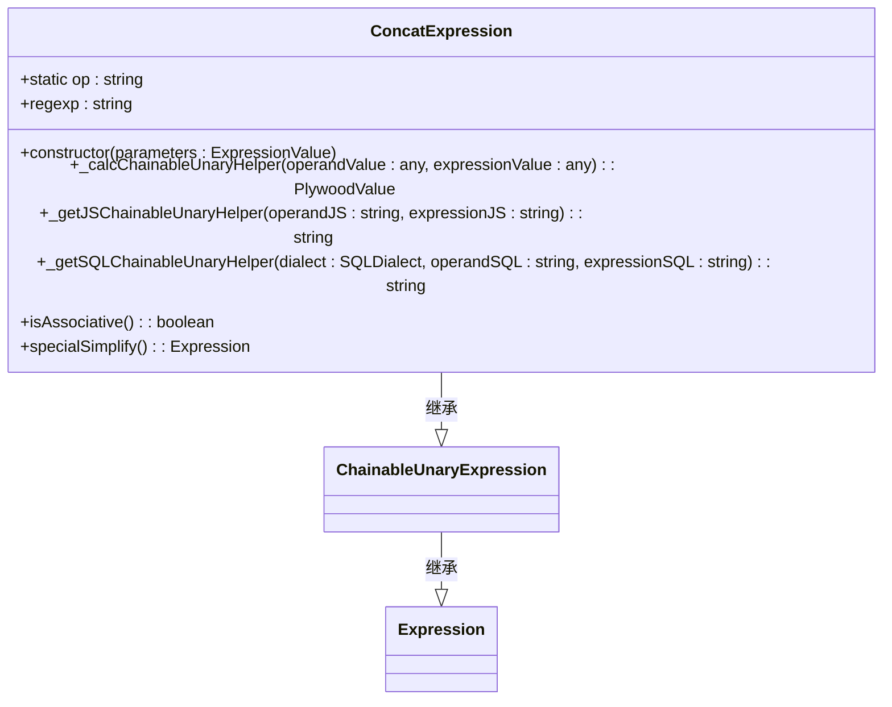
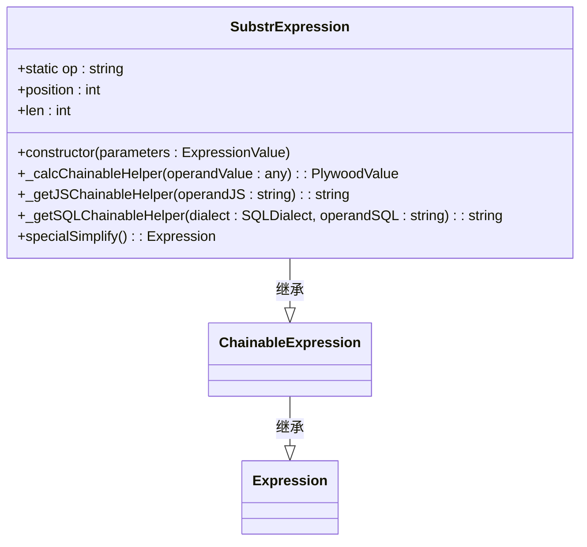
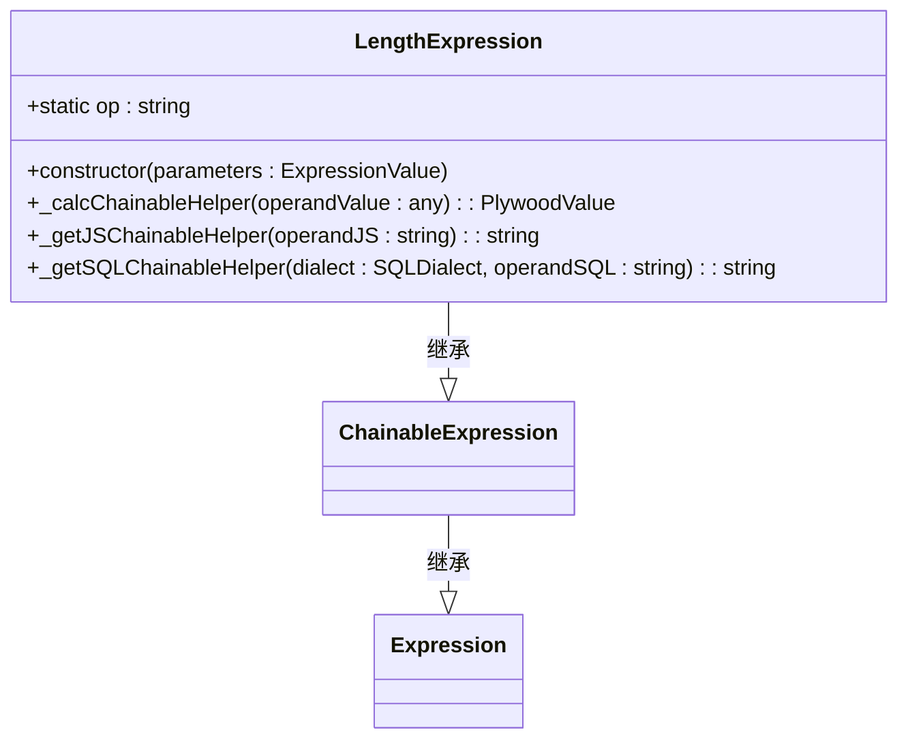
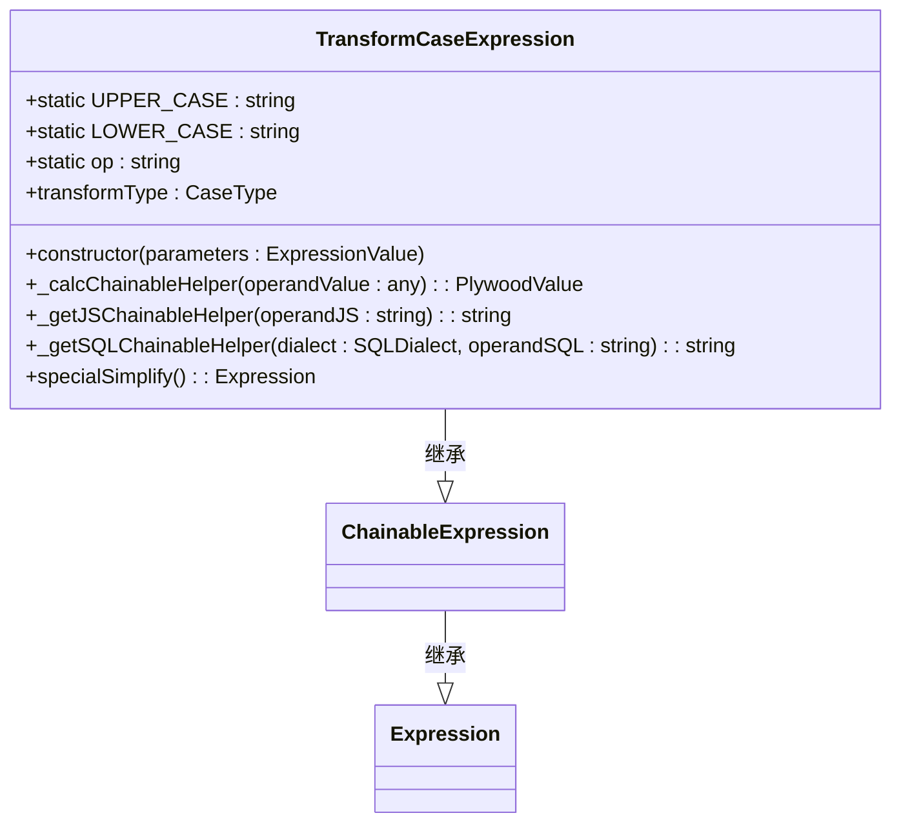
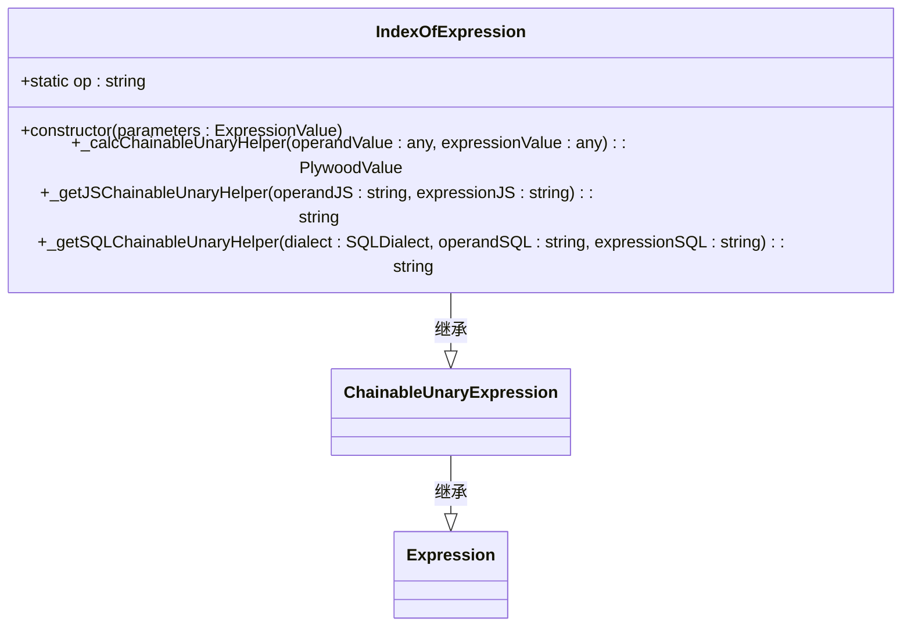
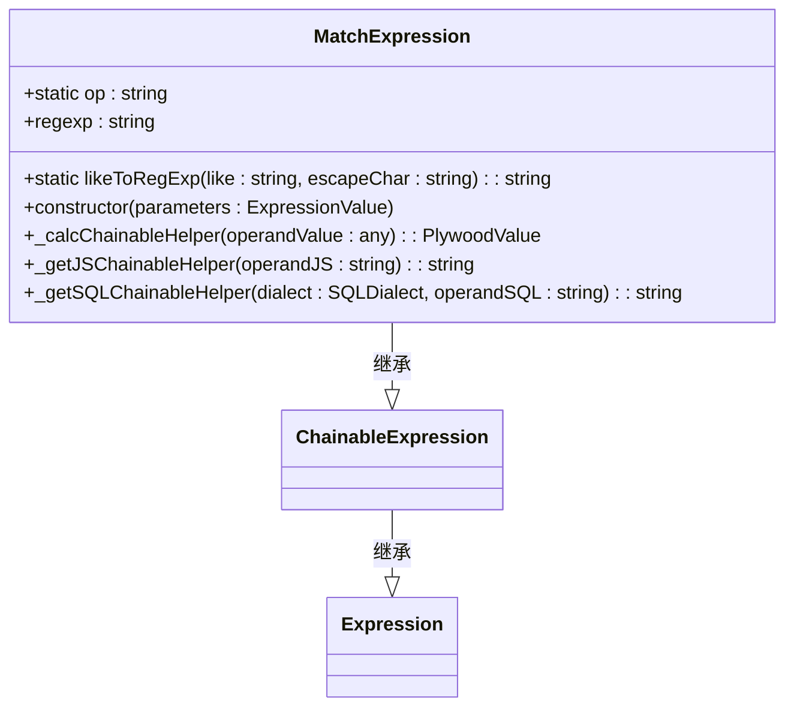
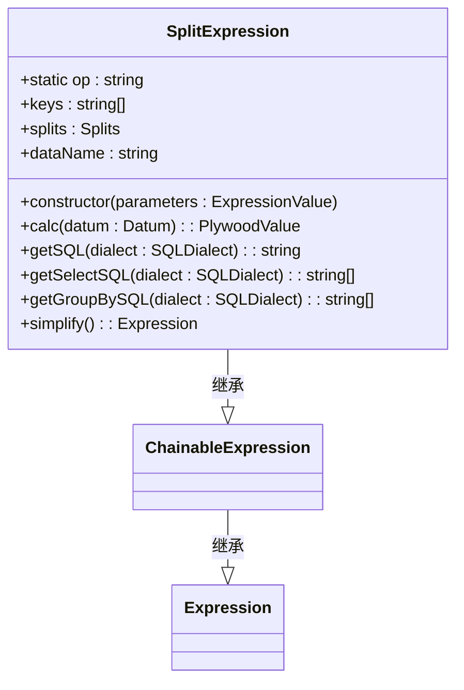
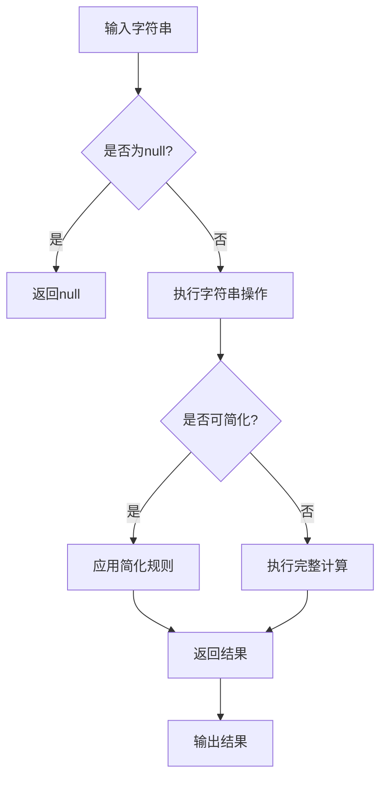
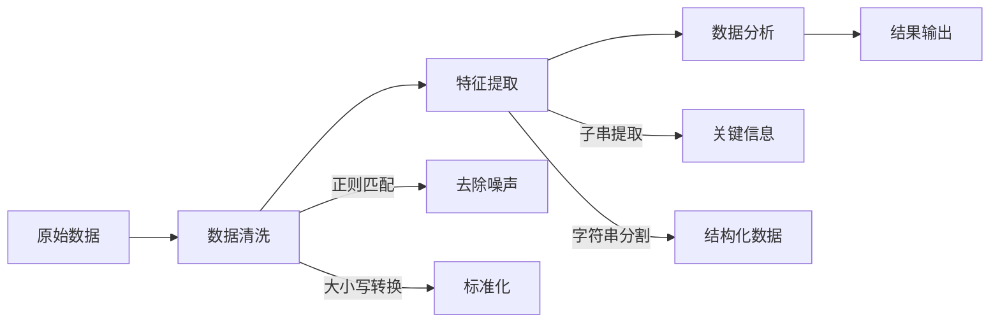

# 字符串表达式

<cite>
**本文档中引用的文件**   
- [concatExpression.ts](file://src/expressions/concatExpression.ts)
- [matchExpression.ts](file://src/expressions/matchExpression.ts)
- [substrExpression.ts](file://src/expressions/substrExpression.ts)
- [lengthExpression.ts](file://src/expressions/lengthExpression.ts)
- [transformCaseExpression.ts](file://src/expressions/transformCaseExpression.ts)
- [indexOfExpression.ts](file://src/expressions/indexOfExpression.ts)
- [splitExpression.ts](file://src/expressions/splitExpression.ts)
- [baseExpression.ts](file://src/expressions/baseExpression.ts)
- [baseDialect.ts](file://src/dialect/baseDialect.ts)
- [stringRange.ts](file://src/datatypes/stringRange.ts)
- [common.ts](file://src/datatypes/common.ts)
</cite>

## 目录
1. [简介](#简介)
2. [核心字符串操作](#核心字符串操作)
   1. [字符串连接](#字符串连接)
   2. [子串提取](#子串提取)
   3. [长度计算](#长度计算)
   4. [大小写转换](#大小写转换)
   5. [位置查找](#位置查找)
   6. [正则匹配](#正则匹配)
   7. [字符串分割](#字符串分割)
3. [编码处理与性能特征](#编码处理与性能特征)
4. [数据清洗与特征提取应用](#数据清洗与特征提取应用)
5. [高级特性](#高级特性)

## 简介
字符串表达式API提供了一套完整的字符串操作功能，支持字符串连接、子串提取、长度计算、大小写转换、位置查找、正则匹配和字符串分割等核心操作。该API设计用于数据处理和分析场景，能够高效地处理各种字符串操作需求。API通过链式调用方式实现，每个操作都返回一个新的表达式对象，便于构建复杂的字符串处理逻辑。

**Section sources**
- [concatExpression.ts](file://src/expressions/concatExpression.ts#L1-L65)
- [matchExpression.ts](file://src/expressions/matchExpression.ts#L1-L106)

## 核心字符串操作

### 字符串连接
字符串连接操作通过`concatExpression`类实现，支持将多个字符串连接成一个新字符串。该操作具有结合性，可以高效地处理多个字符串的连接。

**Diagram sources**
- [concatExpression.ts](file://src/expressions/concatExpression.ts#L20-L62)

**Section sources**
- [concatExpression.ts](file://src/expressions/concatExpression.ts#L20-L62)
- [baseExpression.ts](file://src/expressions/baseExpression.ts#L633-L673)

### 子串提取
子串提取操作通过`substrExpression`类实现，支持从指定位置开始提取指定长度的子串。该操作可以处理各种边界情况，包括空字符串和超出范围的索引。

**Diagram sources**
- [substrExpression.ts](file://src/expressions/substrExpression.ts#L20-L89)

**Section sources**
- [substrExpression.ts](file://src/expressions/substrExpression.ts#L20-L89)
- [baseDialect.ts](file://src/dialect/baseDialect.ts#L110-L112)

### 长度计算
长度计算操作通过`lengthExpression`类实现，支持计算字符串的字符长度。该操作可以正确处理各种字符编码，包括多字节字符。

**Diagram sources**
- [lengthExpression.ts](file://src/expressions/lengthExpression.ts#L21-L45)

**Section sources**
- [lengthExpression.ts](file://src/expressions/lengthExpression.ts#L21-L45)
- [baseDialect.ts](file://src/dialect/baseDialect.ts#L153-L155)

### 大小写转换
大小写转换操作通过`transformCaseExpression`类实现，支持将字符串转换为大写或小写。该操作使用`toLocaleUpperCase`和`toLocaleLowerCase`方法，确保正确的区域设置处理。

**Diagram sources**
- [transformCaseExpression.ts](file://src/expressions/transformCaseExpression.ts#L20-L84)

**Section sources**
- [transformCaseExpression.ts](file://src/expressions/transformCaseExpression.ts#L20-L84)
- [baseExpression.ts](file://src/expressions/baseExpression.ts#L1393-L1444)

### 位置查找
位置查找操作通过`indexOfExpression`类实现，支持查找子串在字符串中的位置。该操作返回子串首次出现的位置索引，如果未找到则返回-1。

**Diagram sources**
- [indexOfExpression.ts](file://src/expressions/indexOfExpression.ts#L21-L46)

**Section sources**
- [indexOfExpression.ts](file://src/expressions/indexOfExpression.ts#L21-L46)
- [baseDialect.ts](file://src/dialect/baseDialect.ts#L171-L171)

### 正则匹配
正则匹配操作通过`matchExpression`类实现，支持使用正则表达式进行模式匹配。该操作可以处理LIKE语法转换和复杂的正则表达式模式。

**Diagram sources**
- [matchExpression.ts](file://src/expressions/matchExpression.ts#L24-L103)

**Section sources**
- [matchExpression.ts](file://src/expressions/matchExpression.ts#L24-L103)
- [baseDialect.ts](file://src/dialect/baseDialect.ts#L130-L132)

### 字符串分割
字符串分割操作通过`splitExpression`类实现，支持将字符串按指定分隔符分割成多个部分。该操作可以处理复杂的分割逻辑和多级分割。

**Diagram sources**
- [splitExpression.ts](file://src/expressions/splitExpression.ts#L35-L292)

**Section sources**
- [splitExpression.ts](file://src/expressions/splitExpression.ts#L35-L292)
- [baseExpression.ts](file://src/expressions/baseExpression.ts#L441-L755)

## 编码处理与性能特征
字符串表达式API在处理编码和性能方面具有以下特征：

1. **多字节字符处理**：API正确处理UTF-8编码的多字节字符，确保在各种语言环境下都能正确工作。
2. **null值处理**：所有字符串操作都包含null值安全检查，避免在处理null值时出现异常。
3. **性能优化**：通过结合性优化和特殊简化规则，减少不必要的计算开销。
4. **跨平台一致性**：在JavaScript和SQL后端之间保持一致的行为，确保在不同环境下结果相同。

**Diagram sources**
- [concatExpression.ts](file://src/expressions/concatExpression.ts#L50-L62)
- [matchExpression.ts](file://src/expressions/matchExpression.ts#L81-L84)
- [substrExpression.ts](file://src/expressions/substrExpression.ts#L76-L78)

**Section sources**
- [concatExpression.ts](file://src/expressions/concatExpression.ts#L50-L62)
- [matchExpression.ts](file://src/expressions/matchExpression.ts#L81-L84)
- [substrExpression.ts](file://src/expressions/substrExpression.ts#L76-L78)

## 数据清洗与特征提取应用
字符串表达式API在数据清洗和特征提取场景中有广泛的应用：

1. **数据清洗**：使用正则匹配和替换功能清理脏数据，如去除特殊字符、标准化格式等。
2. **特征提取**：从原始文本中提取有用的特征，如从URL中提取域名、从日志中提取时间戳等。
3. **文本分析**：进行文本分词、关键词提取、情感分析等高级文本处理任务。

**Diagram sources**
- [matchExpression.ts](file://src/expressions/matchExpression.ts#L43-L105)
- [transformCaseExpression.ts](file://src/expressions/transformCaseExpression.ts#L74-L77)
- [substrExpression.ts](file://src/expressions/substrExpression.ts#L55-L59)

**Section sources**
- [matchExpression.ts](file://src/expressions/matchExpression.ts#L43-L105)
- [transformCaseExpression.ts](file://src/expressions/transformCaseExpression.ts#L74-L77)
- [substrExpression.ts](file://src/expressions/substrExpression.ts#L55-L59)

## 高级特性

### 正则表达式语法支持
API支持完整的正则表达式语法，包括：
- 基本字符匹配
- 量词（*, +, ?）
- 字符类（[abc], [^abc]）
- 分组和捕获（()）
- 锚点（^, $）
- 转义字符（\）

### 多字节字符处理
API正确处理各种Unicode字符，包括：
- 中文、日文、韩文等东亚字符
- 阿拉伯文、希伯来文等从右到左书写的字符
- 各种表情符号和特殊符号

### 模式匹配优化
通过以下方式优化模式匹配性能：
- 预编译正则表达式
- 使用高效的字符串搜索算法
- 缓存常用模式的匹配结果

### 类型转换规则
API支持与其他数据类型的转换，包括：
- 字符串与数字的相互转换
- 字符串与日期的相互转换
- 字符串与布尔值的相互转换

**Section sources**
- [stringRange.ts](file://src/datatypes/stringRange.ts#L39-L97)
- [common.ts](file://src/datatypes/common.ts#L1-L215)
- [castExpression.ts](file://src/expressions/castExpression.ts#L48-L138)