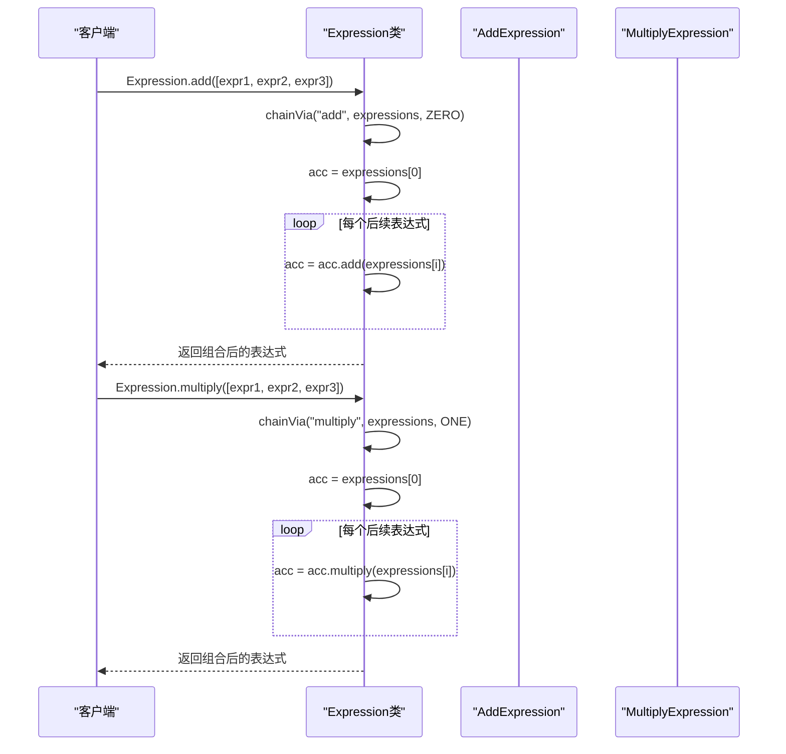
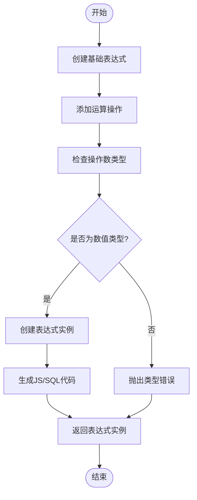
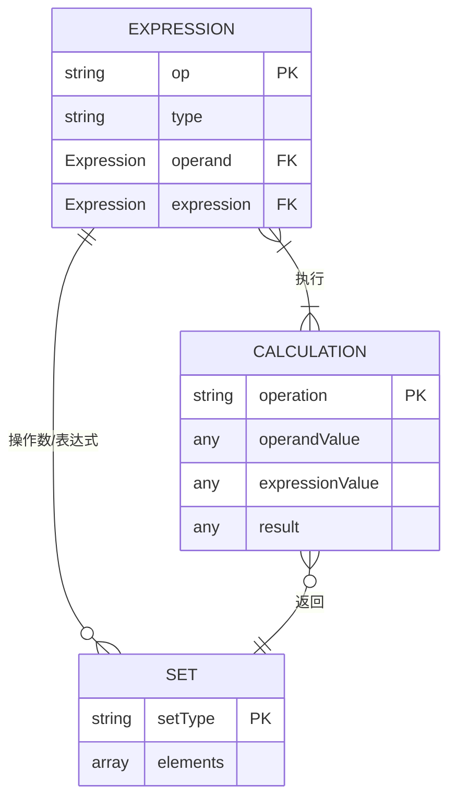
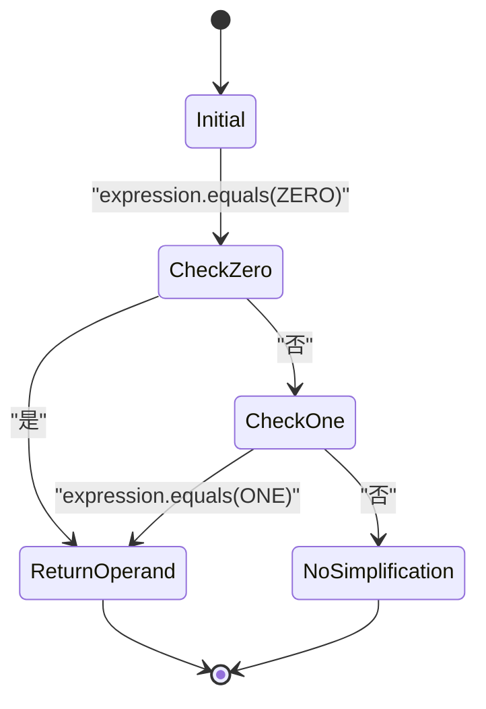
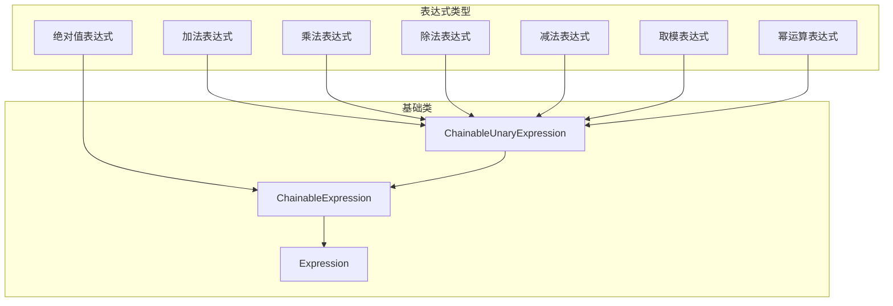

# 数学表达式

<cite>
**本文档中引用的文件**  
- [absoluteExpression.ts](file://src/expressions/absoluteExpression.ts)
- [addExpression.ts](file://src/expressions/addExpression.ts)
- [multiplyExpression.ts](file://src/expressions/multiplyExpression.ts)
- [divideExpression.ts](file://src/expressions/divideExpression.ts)
- [subtractExpression.ts](file://src/expressions/subtractExpression.ts)
- [modExpression.ts](file://src/expressions/modExpression.ts)
- [powerExpression.ts](file://src/expressions/powerExpression.ts)
- [baseExpression.ts](file://src/expressions/baseExpression.ts)
- [set.ts](file://src/datatypes/set.ts)
</cite>

## 目录
1. [简介](#简介)
2. [核心数学表达式类](#核心数学表达式类)
3. [构造函数与类型检查](#构造函数与类型检查)
4. [静态组合方法](#静态组合方法)
5. [链式运算构建机制](#链式运算构建机制)
6. [数值运算与精度处理](#数值运算与精度处理)
7. [简化与优化](#简化与优化)
8. [与其他表达式类型的兼容性](#与其他表达式类型的兼容性)

## 简介
本文档详细记录了Plywood库中数学表达式类的实现，涵盖加法、减法、乘法、除法、取模、幂运算和绝对值等核心数学运算。文档解释了每个表达式类的构造函数参数、核心方法（如apply、simplify）及其在查询构建中的作用。通过分析addExpression.ts和multiplyExpression.ts中的实现，说明了链式数学运算的构建机制。同时提供了Expression.add()和Expression.multiply()等静态方法的使用示例，展示如何组合多个数学表达式。文档还涵盖了数值运算的类型推断规则、精度处理以及与其他表达式类型的兼容性。

## 核心数学表达式类

Plywood库中的数学表达式类均继承自ChainableUnaryExpression，实现了基本的算术运算。每个表达式类都遵循统一的设计模式，包含类型检查、计算逻辑和SQL/JS代码生成等功能。

**Section sources**
- [addExpression.ts](file://src/expressions/addExpression.ts#L20-L60)
- [multiplyExpression.ts](file://src/expressions/multiplyExpression.ts#L22-L68)
- [divideExpression.ts](file://src/expressions/divideExpression.ts#L20-L64)
- [subtractExpression.ts](file://src/expressions/subtractExpression.ts#L20-L57)
- [modExpression.ts](file://src/expressions/modExpression.ts#L20-L59)
- [powerExpression.ts](file://src/expressions/powerExpression.ts#L20-L60)
- [absoluteExpression.ts](file://src/expressions/absoluteExpression.ts#L20-L54)

## 构造函数与类型检查

所有数学表达式类的构造函数都执行严格的类型检查，确保操作数和表达式都是数值类型。构造函数调用父类的super方法，并验证操作数和表达式的类型。

```mermaid
classDiagram
class ChainableUnaryExpression {
+expression Expression
+_checkExpressionTypes(...neededTypes)
+_checkOperandTypes(...neededTypes)
+changeExpression(expression)
}
class AddExpression {
+_calcChainableUnaryHelper(operandValue, expressionValue)
+_getJSChainableUnaryHelper(operandJS, expressionJS)
+_getSQLChainableUnaryHelper(dialect, operandSQL, expressionSQL)
+isCommutative()
+isAssociative()
+specialSimplify()
}
class MultiplyExpression {
+_calcChainableUnaryHelper(operandValue, expressionValue)
+_getJSChainableUnaryHelper(operandJS, expressionJS)
+_getSQLChainableUnaryHelper(dialect, operandSQL, expressionSQL)
+isCommutative()
+isAssociative()
+specialSimplify()
}
class DivideExpression {
+_calcChainableUnaryHelper(operandValue, expressionValue)
+_getJSChainableUnaryHelper(operandJS, expressionJS)
+_getSQLChainableUnaryHelper(dialect, operandSQL, expressionSQL)
+specialSimplify()
}
class SubtractExpression {
+_calcChainableUnaryHelper(operandValue, expressionValue)
+_getJSChainableUnaryHelper(operandJS, expressionJS)
+_getSQLChainableUnaryHelper(dialect, operandSQL, expressionSQL)
+specialSimplify()
}
class ModExpression {
+_calcChainableUnaryHelper(operandValue, expressionValue)
+_getJSChainableUnaryHelper(operandJS, expressionJS)
+_getSQLChainableUnaryHelper(dialect, operandSQL, expressionSQL)
+specialSimplify()
}
class PowerExpression {
+_calcChainableUnaryHelper(operandValue, expressionValue)
+_getJSChainableUnaryHelper(operandJS, expressionJS)
+_getSQLChainableUnaryHelper(dialect, operandSQL, expressionSQL)
+specialSimplify()
}
class AbsoluteExpression {
+_calcChainableHelper(operandValue)
+_getJSChainableHelper(operandJS)
+_getSQLChainableHelper(dialect, operandSQL)
+specialSimplify()
}
ChainableUnaryExpression <|-- AddExpression
ChainableUnaryExpression <|-- MultiplyExpression
ChainableUnaryExpression <|-- DivideExpression
ChainableUnaryExpression <|-- SubtractExpression
ChainableUnaryExpression <|-- ModExpression
ChainableUnaryExpression <|-- PowerExpression
ChainableExpression <|-- AbsoluteExpression
```

**Diagram sources**
- [addExpression.ts](file://src/expressions/addExpression.ts#L20-L60)
- [multiplyExpression.ts](file://src/expressions/multiplyExpression.ts#L22-L68)
- [baseExpression.ts](file://src/expressions/baseExpression.ts#L441-L2189)

**Section sources**
- [addExpression.ts](file://src/expressions/addExpression.ts#L20-L60)
- [multiplyExpression.ts](file://src/expressions/multiplyExpression.ts#L22-L68)
- [baseExpression.ts](file://src/expressions/baseExpression.ts#L441-L2189)

## 静态组合方法

Expression类提供了多个静态方法用于组合数学表达式，这些方法通过chainVia函数实现，能够将多个表达式组合成一个链式表达式。

**Diagram sources**
- [baseExpression.ts](file://src/expressions/baseExpression.ts#L633-L673)
- [baseExpression.ts](file://src/expressions/baseExpression.ts#L1247-L1303)

**Section sources**
- [baseExpression.ts](file://src/expressions/baseExpression.ts#L633-L673)
- [baseExpression.ts](file://src/expressions/baseExpression.ts#L1247-L1303)

## 链式运算构建机制

链式数学运算的构建机制基于_addChain方法，该方法允许在现有表达式基础上链式添加新的运算。这种设计模式使得复杂的数学表达式可以以直观的方式构建。

**Diagram sources**
- [baseExpression.ts](file://src/expressions/baseExpression.ts#L1247-L1303)
- [addExpression.ts](file://src/expressions/addExpression.ts#L20-L60)
- [multiplyExpression.ts](file://src/expressions/multiplyExpression.ts#L22-L68)

**Section sources**
- [baseExpression.ts](file://src/expressions/baseExpression.ts#L1247-L1303)
- [addExpression.ts](file://src/expressions/addExpression.ts#L20-L60)
- [multiplyExpression.ts](file://src/expressions/multiplyExpression.ts#L22-L68)

## 数值运算与精度处理

数学表达式在执行数值运算时，会处理null值和特殊数值情况。对于集合类型的运算，使用Set.crossBinary方法进行笛卡尔积计算。

**Diagram sources**
- [set.ts](file://src/datatypes/set.ts#L53-L475)
- [addExpression.ts](file://src/expressions/addExpression.ts#L20-L60)
- [multiplyExpression.ts](file://src/expressions/multiplyExpression.ts#L22-L68)

**Section sources**
- [set.ts](file://src/datatypes/set.ts#L53-L475)
- [addExpression.ts](file://src/expressions/addExpression.ts#L20-L60)
- [multiplyExpression.ts](file://src/expressions/multiplyExpression.ts#L22-L68)

## 简化与优化

每个数学表达式类都实现了specialSimplify方法，用于在特定情况下简化表达式。例如，任何数乘以1等于其本身，任何数加0等于其本身等。

**Diagram sources**
- [addExpression.ts](file://src/expressions/addExpression.ts#L55-L60)
- [multiplyExpression.ts](file://src/expressions/multiplyExpression.ts#L55-L68)
- [divideExpression.ts](file://src/expressions/divideExpression.ts#L55-L64)

**Section sources**
- [addExpression.ts](file://src/expressions/addExpression.ts#L55-L60)
- [multiplyExpression.ts](file://src/expressions/multiplyExpression.ts#L55-L68)
- [divideExpression.ts](file://src/expressions/divideExpression.ts#L55-L64)

## 与其他表达式类型的兼容性

数学表达式与其他表达式类型兼容，可以通过Expression.register方法注册到全局表达式映射中。这使得数学表达式可以与其他类型的表达式无缝集成。

**Diagram sources**
- [baseExpression.ts](file://src/expressions/baseExpression.ts#L633-L673)
- [absoluteExpression.ts](file://src/expressions/absoluteExpression.ts#L20-L54)
- [addExpression.ts](file://src/expressions/addExpression.ts#L20-L60)

**Section sources**
- [baseExpression.ts](file://src/expressions/baseExpression.ts#L633-L673)
- [absoluteExpression.ts](file://src/expressions/absoluteExpression.ts#L20-L54)
- [addExpression.ts](file://src/expressions/addExpression.ts#L20-L60)