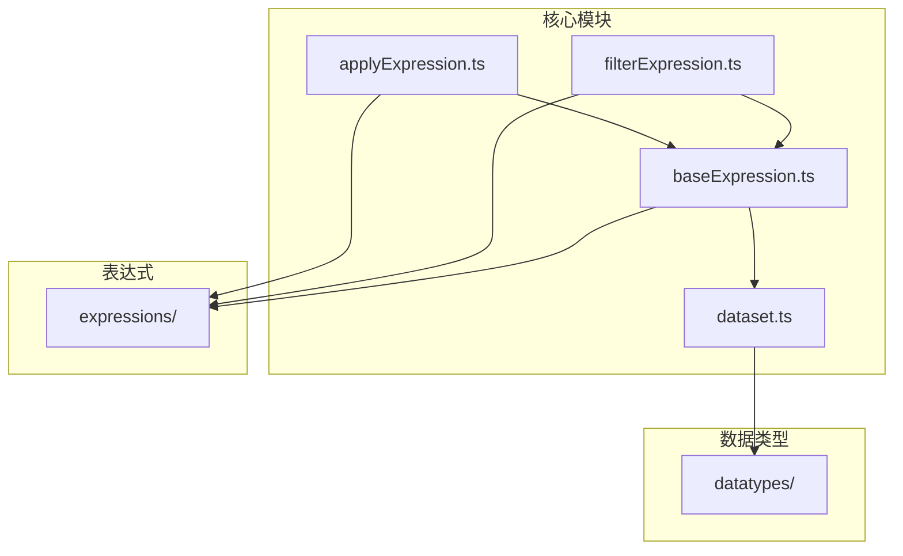
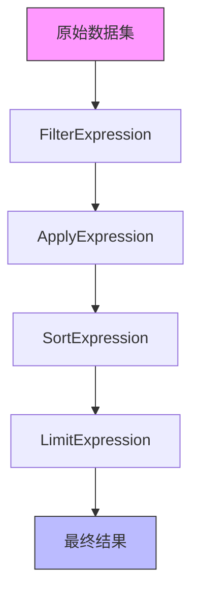
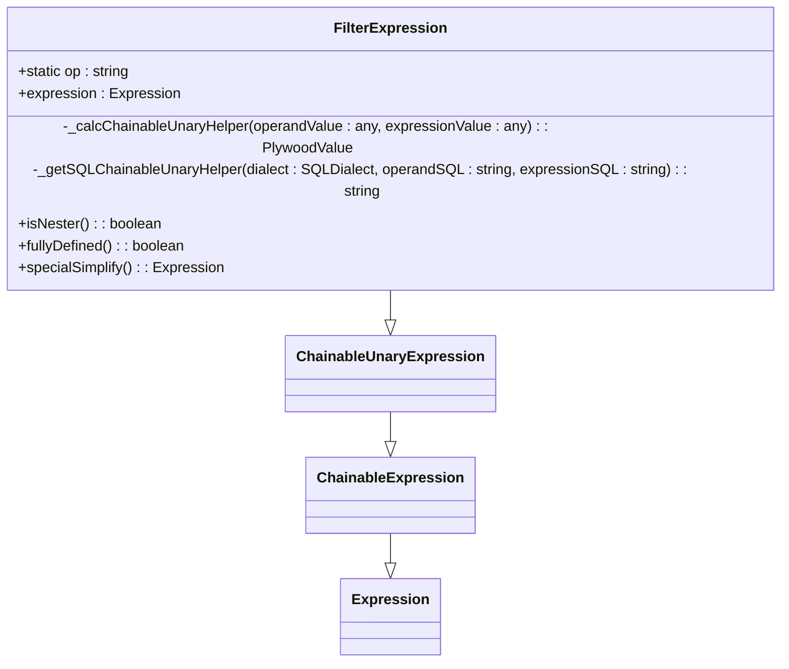
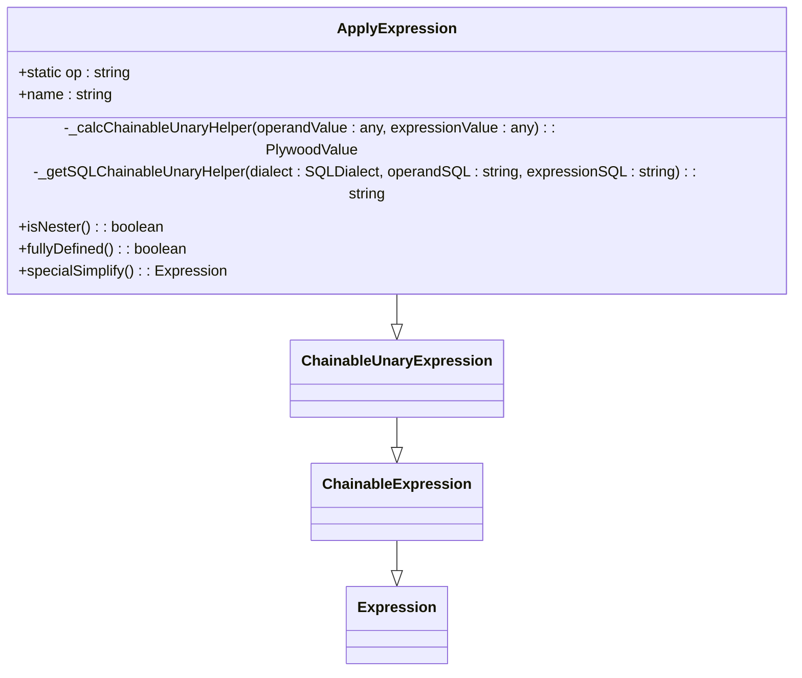
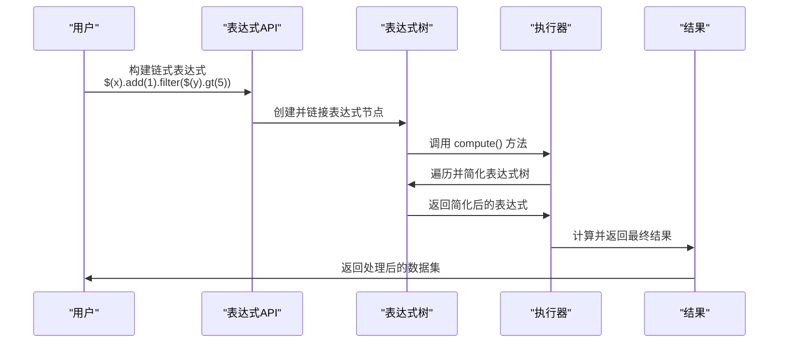
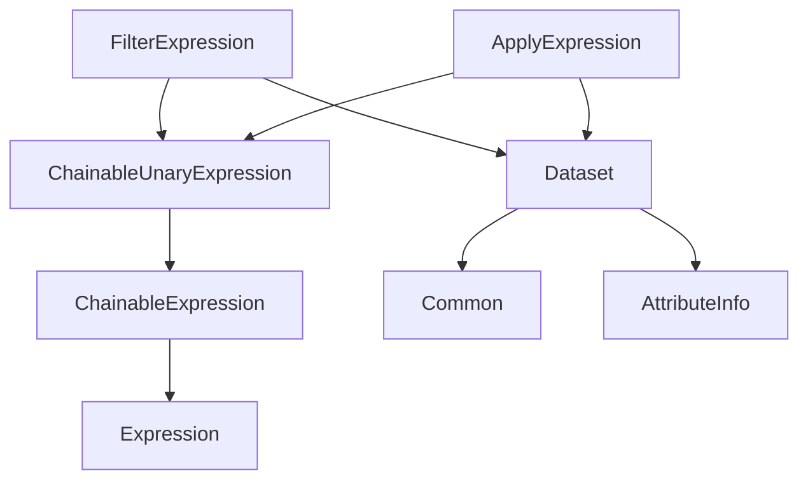

# 数据操作表达式

<cite>
**本文档引用的文件**
- [filterExpression.ts](file://src/expressions/filterExpression.ts)
- [applyExpression.ts](file://src/expressions/applyExpression.ts)
- [baseExpression.ts](file://src/expressions/baseExpression.ts)
- [dataset.ts](file://src/datatypes/dataset.ts)
</cite>

## 目录
1. [简介](#简介)
2. [项目结构](#项目结构)
3. [核心组件](#核心组件)
4. [架构概述](#架构概述)
5. [详细组件分析](#详细组件分析)
6. [依赖分析](#依赖分析)
7. [性能考虑](#性能考虑)
8. [故障排除指南](#故障排除指南)
9. [结论](#结论)

## 简介
本文档全面记录了Plywood库中数据操作表达式的实现，重点分析了数据过滤、数据切分、字段选择、应用变换、结果排序和数量限制等核心数据处理操作。文档深入探讨了每个数据操作表达式类的执行上下文、性能特征和资源消耗，并结合`filterExpression.ts`和`applyExpression.ts`中的代码，阐述了数据流水线的构建机制和优化策略。此外，文档还提供了复杂数据转换场景的使用示例，展示了如何组合多个数据操作表达式来构建ETL流程，并包含了大数据集处理的最佳实践、内存管理策略和流式处理支持。

## 项目结构
该项目是一个用于数据操作和分析的TypeScript库。其核心功能位于`src`目录下，主要分为以下几个模块：
- `datatypes/`: 定义了核心数据类型，如`Dataset`（数据集）、`Datum`（数据行）和各种范围类型。
- `expressions/`: 包含了所有数据操作表达式的实现，如`filterExpression.ts`（过滤表达式）和`applyExpression.ts`（应用表达式）。
- `dialect/`: 提供了针对不同数据库（如Druid、MySQL）的SQL方言支持。
- `external/`: 处理与外部数据源（如数据库）的交互。
- `executor/`: 负责执行表达式并计算结果。

**Diagram sources**
- [dataset.ts](file://src/datatypes/dataset.ts#L313-L1425)
- [baseExpression.ts](file://src/expressions/baseExpression.ts#L2468-L2774)
- [filterExpression.ts](file://src/expressions/filterExpression.ts#L25-L87)
- [applyExpression.ts](file://src/expressions/applyExpression.ts#L26-L150)

**Section sources**
- [src/](file://src/)
- [src/datatypes/](file://src/datatypes/)
- [src/expressions/](file://src/expressions/)

## 核心组件
数据操作表达式的核心是`Expression`类及其子类。`Expression`是一个抽象基类，定义了所有表达式共有的行为，如序列化、计算和简化。`ChainableExpression`和`ChainableUnaryExpression`是两个关键的抽象类，它们实现了链式调用的模式，允许将多个操作连接在一起，形成一个数据处理流水线。

`Dataset`类是数据操作的载体，它封装了一个数据行（`Datum`）的数组，并提供了`filter`、`apply`、`sort`等方法来执行具体的数据操作。这些方法在内部会创建相应的表达式对象（如`FilterExpression`、`ApplyExpression`），并将它们链接到当前的表达式链上。

**Section sources**
- [baseExpression.ts](file://src/expressions/baseExpression.ts#L2468-L2774)
- [dataset.ts](file://src/datatypes/dataset.ts#L313-L1425)

## 架构概述
Plywood的数据处理架构采用了一种声明式的、基于表达式树的模式。用户通过链式调用API（如`.filter(...).apply(...).sort(...)`）来构建一个表达式树。这个树的每个节点代表一个数据操作。当需要计算结果时，系统会遍历这棵树，将其“简化”（simplify）并最终执行。

**Diagram sources**
- [baseExpression.ts](file://src/expressions/baseExpression.ts#L2468-L2774)
- [dataset.ts](file://src/datatypes/dataset.ts#L313-L1425)

## 详细组件分析
### FilterExpression 分析
`FilterExpression`类负责实现数据过滤操作。它继承自`ChainableUnaryExpression`，包含一个`expression`属性，该属性是一个布尔表达式，用于决定哪些数据行应该被保留。

其核心方法`_calcChainableUnaryHelper`通过调用底层`Dataset`实例的`filter`方法来执行过滤。该方法接收一个计算函数（`ComputeFn`），该函数由`expression`的`getFn()`方法生成。这种设计将表达式的定义与执行逻辑分离，提高了代码的可维护性。

**Diagram sources**
- [filterExpression.ts](file://src/expressions/filterExpression.ts#L25-L87)

**Section sources**
- [filterExpression.ts](file://src/expressions/filterExpression.ts#L25-L87)

### ApplyExpression 分析
`ApplyExpression`类负责实现字段应用和变换操作。它同样继承自`ChainableUnaryExpression`，并额外包含一个`name`属性，用于指定新生成字段的名称。

其`_calcChainableUnaryHelper`方法通过调用`Dataset`的`apply`方法来执行。该方法会遍历数据集中的每一行，计算`expression`的值，并将结果以`name`为键名添加到新的数据行中。`updateTypeContext`方法用于在类型检查阶段更新数据集的元数据，确保新字段的类型被正确记录。

**Diagram sources**
- [applyExpression.ts](file://src/expressions/applyExpression.ts#L26-L150)

**Section sources**
- [applyExpression.ts](file://src/expressions/applyExpression.ts#L26-L150)

### 数据流水线构建机制
数据流水线的构建依赖于`Expression`类提供的丰富API。用户可以通过`$()`创建引用，通过`r()`创建字面量，然后使用`add`、`multiply`等方法进行算术运算，最后通过`filter`、`apply`、`sort`等方法进行数据操作。

**Diagram sources**
- [baseExpression.ts](file://src/expressions/baseExpression.ts#L2468-L2774)
- [dataset.ts](file://src/datatypes/dataset.ts#L313-L1425)

## 依赖分析
`FilterExpression`和`ApplyExpression`都直接依赖于`baseExpression.ts`中定义的`ChainableUnaryExpression`基类。同时，它们也间接依赖于`dataset.ts`，因为它们的计算逻辑最终会委托给`Dataset`类的实例方法。

**Diagram sources**
- [filterExpression.ts](file://src/expressions/filterExpression.ts#L25-L87)
- [applyExpression.ts](file://src/expressions/applyExpression.ts#L26-L150)
- [baseExpression.ts](file://src/expressions/baseExpression.ts#L2468-L2774)
- [dataset.ts](file://src/datatypes/dataset.ts#L313-L1425)

**Section sources**
- [filterExpression.ts](file://src/expressions/filterExpression.ts#L25-L87)
- [applyExpression.ts](file://src/expressions/applyExpression.ts#L26-L150)

## 性能考虑
- **表达式简化（Simplification）**: `simplify()`方法是性能优化的关键。它可以在不改变表达式语义的前提下，对表达式树进行化简（例如，将`X.filter(True)`简化为`X`），从而减少后续计算的开销。
- **惰性求值（Lazy Evaluation）**: 表达式树的构建是惰性的，只有在调用`compute()`或`simulate()`时才会真正执行计算。这允许系统对整个流水线进行优化。
- **内存管理**: `Dataset`类的`depthFirstTrimTo()`方法支持对大数据集进行深度优先的裁剪，防止内存溢出。`computeStream()`方法提供了流式处理支持，可以处理远超内存容量的数据集。
- **外部查询优化**: `getReadyExternals()`和`applyReadyExternals()`方法负责管理与外部数据源的交互，通过批量查询和结果填充来优化性能。

## 故障排除指南
- **类型错误**: 如果在`referenceCheck`或`changeInTypeContext`阶段出现类型错误，请检查表达式中引用的字段名是否正确，以及字段的类型是否与操作兼容。
- **计算超时**: 如果`compute()`调用超时，可以通过增加`timeout`选项的值来解决。同时，检查表达式是否过于复杂，考虑使用`maxQueries`和`maxComputeCycles`来限制计算深度。
- **内存不足**: 对于大数据集，优先使用`computeStream()`进行流式处理。如果必须使用`compute()`，请设置`maxRows`选项来限制返回结果的行数。
- **外部查询失败**: 检查`External`对象的配置是否正确，确保网络连接正常。`simulateQueryPlan()`方法可以帮助预览将要执行的查询，便于调试。

**Section sources**
- [baseExpression.ts](file://src/expressions/baseExpression.ts#L2468-L2774)
- [dataset.ts](file://src/datatypes/dataset.ts#L313-L1425)

## 结论
Plywood的数据操作表达式API提供了一个强大、灵活且类型安全的框架，用于构建复杂的数据处理流水线。通过深入理解`FilterExpression`和`ApplyExpression`等核心组件的实现机制，开发者可以更有效地利用该库进行数据分析和ETL任务。其基于表达式树和链式调用的设计模式，不仅使代码清晰易读，还为性能优化（如表达式简化和流式处理）提供了坚实的基础。遵循文档中提到的最佳实践，可以确保在处理大规模数据时获得最佳的性能和稳定性。