# 时间表达式

<cite>
**本文档引用的文件**   
- [timeFloorExpression.ts](file://src/expressions/timeFloorExpression.ts)
- [timeBucketExpression.ts](file://src/expressions/timeBucketExpression.ts)
- [timePartExpression.ts](file://src/expressions/timePartExpression.ts)
- [timeShiftExpression.ts](file://src/expressions/timeShiftExpression.ts)
- [timeRangeExpression.ts](file://src/expressions/timeRangeExpression.ts)
- [hasTimezone.ts](file://src/expressions/mixins/hasTimezone.ts)
- [baseDialect.ts](file://src/dialect/baseDialect.ts)
- [timeRange.ts](file://src/datatypes/timeRange.ts)
</cite>

## 目录
1. [简介](#简介)
2. [核心时间表达式类](#核心时间表达式类)
3. [时区处理机制](#时区处理机制)
4. [时间粒度与边界条件](#时间粒度与边界条件)
5. [时间序列分组原理](#时间序列分组原理)
6. [性能优化策略](#性能优化策略)
7. [时间表达式使用示例](#时间表达式使用示例)
8. [跨数据库时间类型映射](#跨数据库时间类型映射)

## 简介
本文档深入记录了时间表达式API的核心功能，包括时间取整、时间分桶、时间部分提取、时间偏移和时间范围生成等时间处理函数的实现。详细解释了每个时间表达式类的时区处理机制、时间粒度参数和边界条件。结合timeFloorExpression.ts和timeBucketExpression.ts中的实现，说明了时间序列数据的分组原理和性能优化策略。提供了时间表达式在趋势分析和同比环比计算中的使用示例，并涵盖了时间精度处理、夏令时影响、跨年计算以及与不同数据库时间类型的映射关系。

## 核心时间表达式类

### 时间取整表达式 (TimeFloorExpression)
TimeFloorExpression类实现了时间取整功能，将时间值向下舍入到指定的时间间隔边界。该类继承自ChainableExpression并实现了HasTimezone接口，确保了时区的一致性处理。时间取整操作在时间序列数据分析中至关重要，特别是在进行时间分组和聚合时。

**时间取整表达式类图**
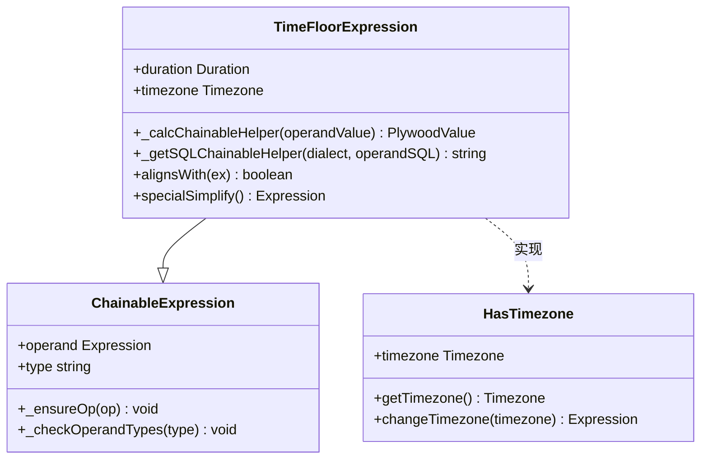

**图表来源**
- [timeFloorExpression.ts](file://src/expressions/timeFloorExpression.ts#L25-L130)

**章节来源**
- [timeFloorExpression.ts](file://src/expressions/timeFloorExpression.ts#L25-L130)

### 时间分桶表达式 (TimeBucketExpression)
TimeBucketExpression类实现了时间分桶功能，将时间值映射到相应的时间区间。与TimeFloorExpression不同，TimeBucketExpression返回的是一个时间范围（TIME_RANGE）而不是单个时间点。这种设计使得它非常适合用于时间区间的查询和分析。

**时间分桶表达式类图**
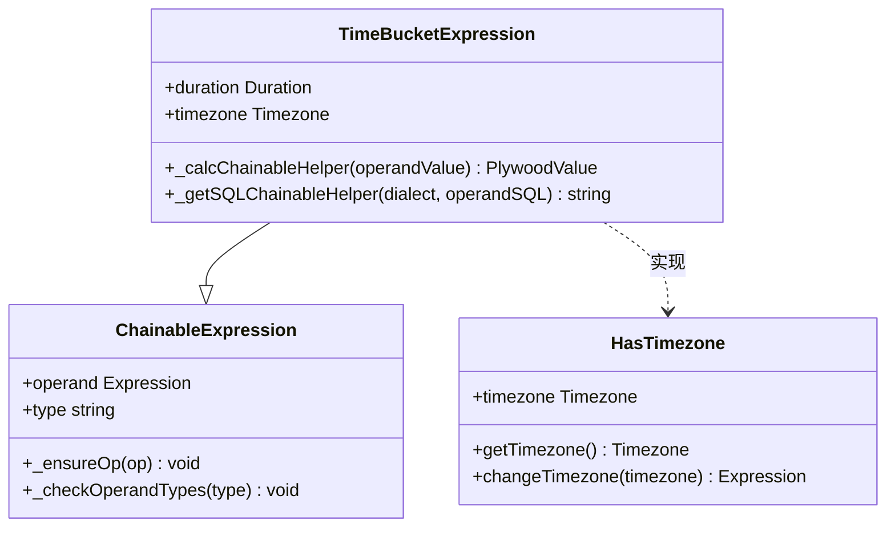

**图表来源**
- [timeBucketExpression.ts](file://src/expressions/timeBucketExpression.ts#L24-L93)

**章节来源**
- [timeBucketExpression.ts](file://src/expressions/timeBucketExpression.ts#L24-L93)

### 时间部分提取表达式 (TimePartExpression)
TimePartExpression类实现了时间部分提取功能，可以从时间值中提取特定的时间单元，如小时、分钟、星期几等。该类通过PART_TO_FUNCTION静态映射表定义了各种时间部分的提取逻辑，并通过PART_TO_MAX_VALUES映射表提供了各时间部分的最大可能值。

**时间部分提取表达式类图**
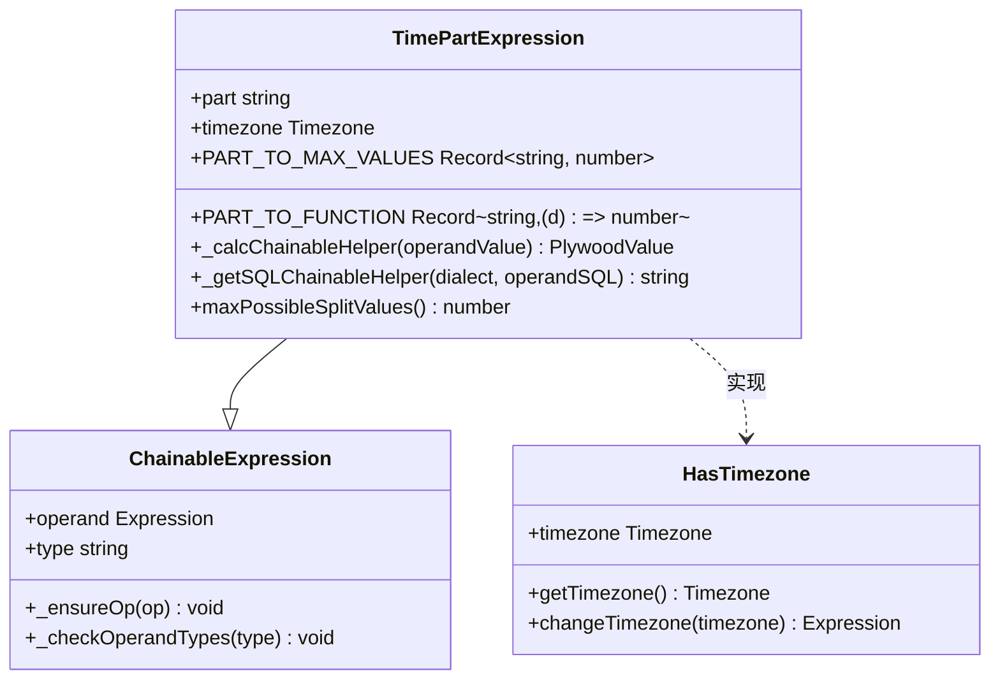

**图表来源**
- [timePartExpression.ts](file://src/expressions/timePartExpression.ts#L24-L164)

**章节来源**
- [timePartExpression.ts](file://src/expressions/timePartExpression.ts#L24-L164)

### 时间偏移表达式 (TimeShiftExpression)
TimeShiftExpression类实现了时间偏移功能，可以将时间值向前或向后移动指定的时间间隔。该类支持步长（step）参数，允许进行多步时间偏移操作。时间偏移在同比环比分析中非常有用，可以方便地比较不同时间段的数据。

**时间偏移表达式类图**
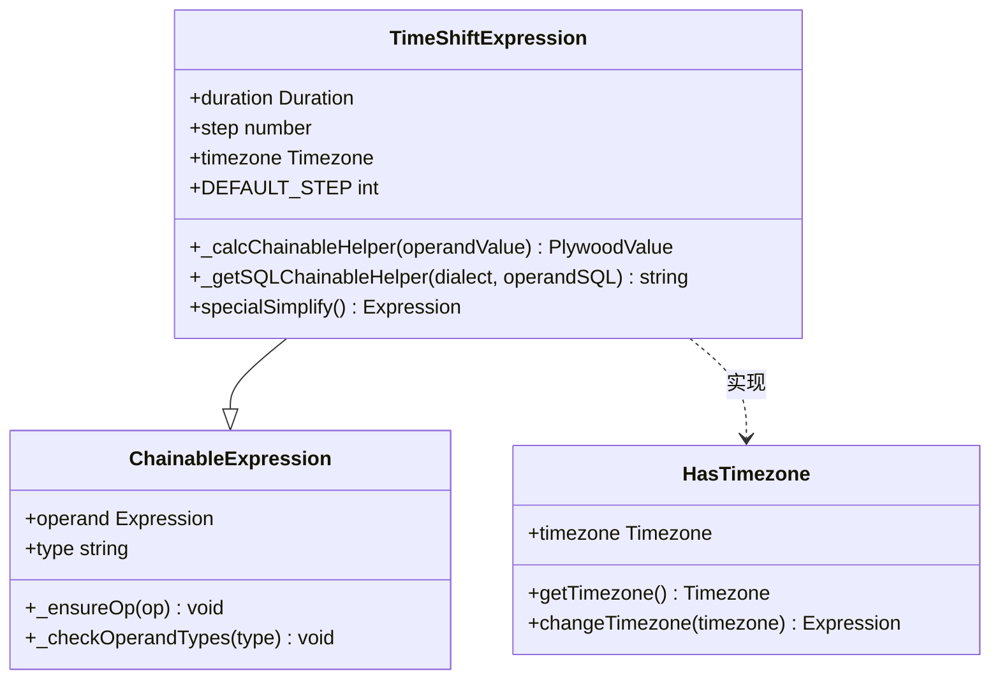

**图表来源**
- [timeShiftExpression.ts](file://src/expressions/timeShiftExpression.ts#L24-L121)

**章节来源**
- [timeShiftExpression.ts](file://src/expressions/timeShiftExpression.ts#L24-L121)

### 时间范围表达式 (TimeRangeExpression)
TimeRangeExpression类实现了时间范围生成功能，可以基于给定的时间点和持续时间生成相应的时间区间。该类支持正向和反向时间范围生成，通过step参数的正负值来控制方向。时间范围在时间区间查询和过滤中非常有用。

**时间范围表达式类图**
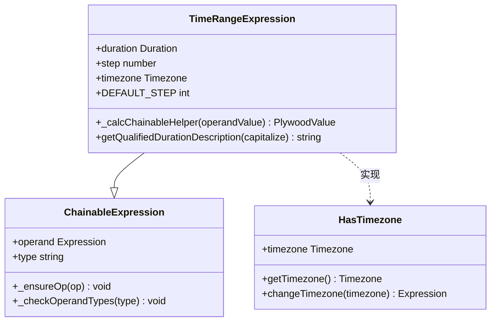

**图表来源**
- [timeRangeExpression.ts](file://src/expressions/timeRangeExpression.ts#L25-L114)

**章节来源**
- [timeRangeExpression.ts](file://src/expressions/timeRangeExpression.ts#L25-L114)

## 时区处理机制

### 时区混合类 (HasTimezone)
HasTimezone类作为混合类（mixin）被多个时间表达式类使用，提供了统一的时区处理机制。该类定义了timezone属性和相关方法，确保了时区信息在表达式链中的正确传递和处理。

**时区混合类图**
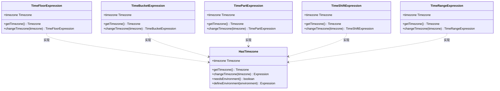

**图表来源**
- [hasTimezone.ts](file://src/expressions/mixins/hasTimezone.ts#L20-L60)

**章节来源**
- [hasTimezone.ts](file://src/expressions/mixins/hasTimezone.ts#L20-L60)

### 时区处理流程
时区处理机制确保了时间表达式在不同地理位置和时区设置下的正确性。当创建时间表达式时，如果没有指定时区，则默认使用UTC时区。这保证了时间计算的一致性和可预测性。

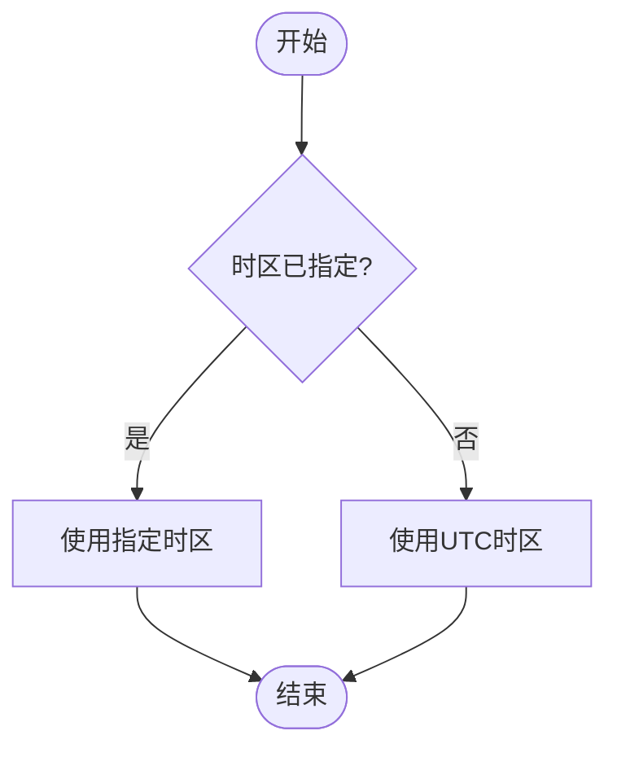

**图表来源**
- [hasTimezone.ts](file://src/expressions/mixins/hasTimezone.ts#L20-L60)

**章节来源**
- [hasTimezone.ts](file://src/expressions/mixins/hasTimezone.ts#L20-L60)

## 时间粒度与边界条件

### 时间粒度参数
时间表达式支持多种时间粒度参数，包括秒、分钟、小时、天、周、月、季度和年。这些粒度参数通过Duration类来表示，确保了时间间隔的精确性和一致性。

**时间粒度参数表**
| 粒度类型 | 描述 | 示例 |
|---------|------|------|
| PT1S | 1秒 | 每秒数据 |
| PT1M | 1分钟 | 每分钟数据 |
| PT1H | 1小时 | 每小时数据 |
| P1D | 1天 | 每日数据 |
| P1W | 1周 | 每周数据 |
| P1M | 1月 | 每月数据 |
| P3M | 1季度 | 每季度数据 |
| P1Y | 1年 | 每年数据 |

**章节来源**
- [timeFloorExpression.ts](file://src/expressions/timeFloorExpression.ts#L25-L130)
- [timeBucketExpression.ts](file://src/expressions/timeBucketExpression.ts#L24-L93)

### 边界条件处理
时间表达式在处理边界条件时需要特别注意，包括夏令时转换、闰秒、跨年计算等特殊情况。这些边界条件的正确处理对于确保时间计算的准确性至关重要。

**边界条件处理流程**
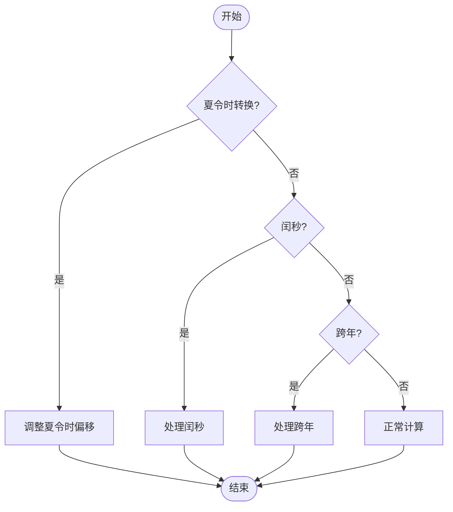

**图表来源**
- [timeFloorExpression.ts](file://src/expressions/timeFloorExpression.ts#L25-L130)
- [timeBucketExpression.ts](file://src/expressions/timeBucketExpression.ts#L24-L93)

**章节来源**
- [timeFloorExpression.ts](file://src/expressions/timeFloorExpression.ts#L25-L130)
- [timeBucketExpression.ts](file://src/expressions/timeBucketExpression.ts#L24-L93)

## 时间序列分组原理

### 时间取整与分桶的关系
时间取整和时间分桶是时间序列数据分组的两种主要方式。时间取整将时间值向下舍入到最近的时间间隔边界，而时间分桶则将时间值映射到相应的时间区间。这两种操作在时间序列分析中有着不同的应用场景。

**时间取整与分桶对比**
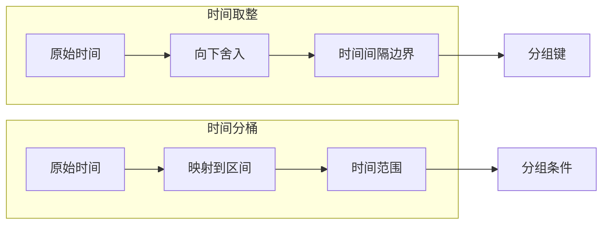

**图表来源**
- [timeFloorExpression.ts](file://src/expressions/timeFloorExpression.ts#L25-L130)
- [timeBucketExpression.ts](file://src/expressions/timeBucketExpression.ts#L24-L93)

**章节来源**
- [timeFloorExpression.ts](file://src/expressions/timeFloorExpression.ts#L25-L130)
- [timeBucketExpression.ts](file://src/expressions/timeBucketExpression.ts#L24-L93)

### 分组对齐检查
时间表达式提供了alignsWith方法来检查两个时间操作是否对齐。这对于优化查询和确保数据一致性非常重要。只有当两个操作具有相同的时区并且一个操作的持续时间可以被另一个整除时，它们才被认为是"对齐"的。

**分组对齐检查流程**
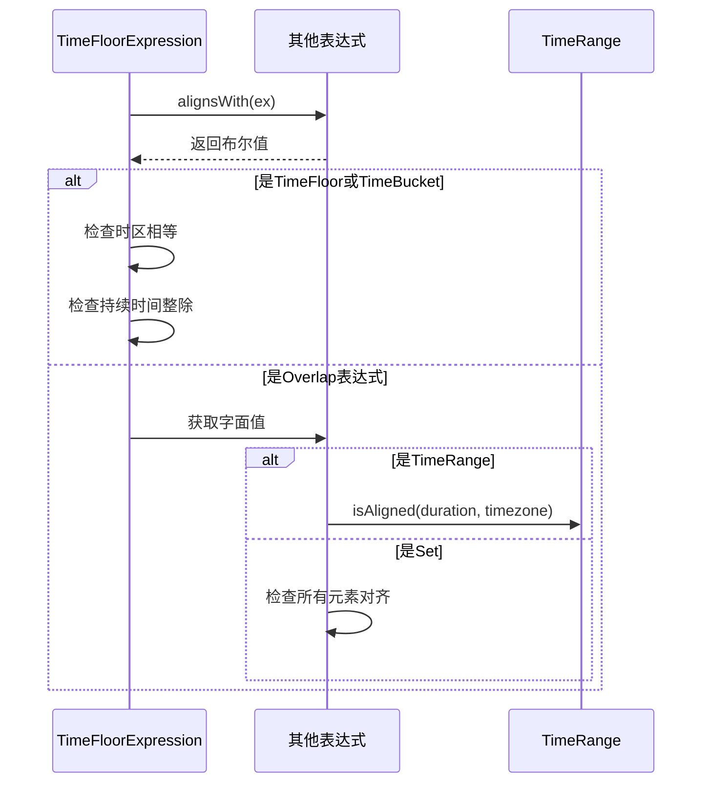

**图表来源**
- [timeFloorExpression.ts](file://src/expressions/timeFloorExpression.ts#L92-L113)

**章节来源**
- [timeFloorExpression.ts](file://src/expressions/timeFloorExpression.ts#L92-L113)

## 性能优化策略

### 表达式简化
时间表达式实现了specialSimplify方法来进行表达式简化，这有助于提高查询性能。例如，连续的相同时间取整操作可以被简化为单个操作，时间偏移步长为0的操作可以直接返回原操作数。

**表达式简化规则**
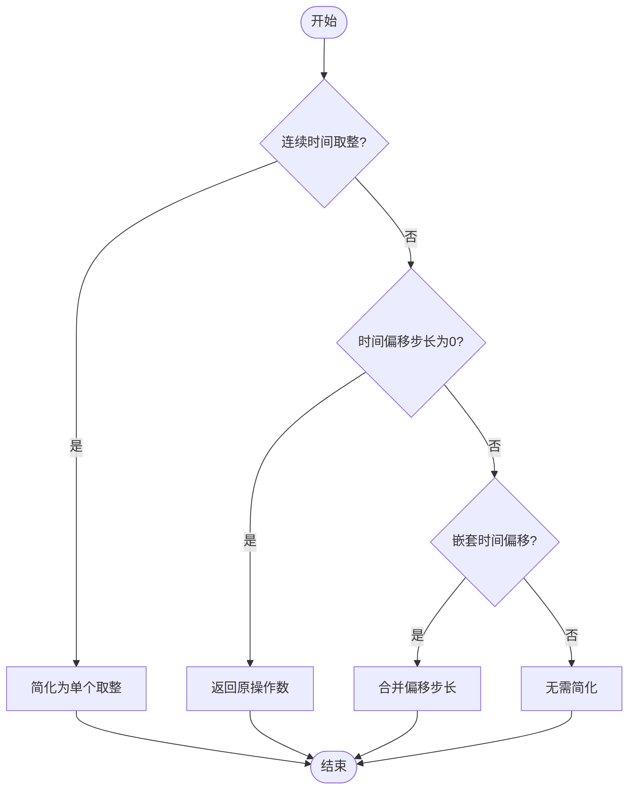

**图表来源**
- [timeFloorExpression.ts](file://src/expressions/timeFloorExpression.ts#L115-L125)
- [timeShiftExpression.ts](file://src/expressions/timeShiftExpression.ts#L94-L116)

**章节来源**
- [timeFloorExpression.ts](file://src/expressions/timeFloorExpression.ts#L115-L125)
- [timeShiftExpression.ts](file://src/expressions/timeShiftExpression.ts#L94-L116)

### SQL生成优化
时间表达式通过_getSQLChainableHelper方法生成优化的SQL代码。不同的数据库方言（Dialect）可以提供特定的优化实现，确保生成的SQL代码在目标数据库上具有最佳性能。

**SQL生成流程**
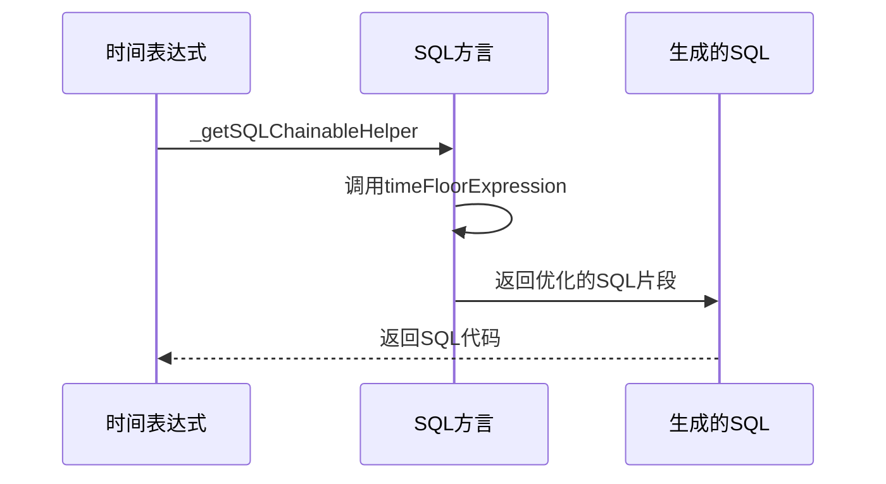

**图表来源**
- [timeFloorExpression.ts](file://src/expressions/timeFloorExpression.ts#L88-L90)
- [baseDialect.ts](file://src/dialect/baseDialect.ts#L161-L161)

**章节来源**
- [timeFloorExpression.ts](file://src/expressions/timeFloorExpression.ts#L88-L90)
- [baseDialect.ts](file://src/dialect/baseDialect.ts#L161-L161)

## 时间表达式使用示例

### 趋势分析
时间表达式在趋势分析中非常有用，可以通过时间偏移来比较不同时间段的数据变化趋势。

**趋势分析示例**
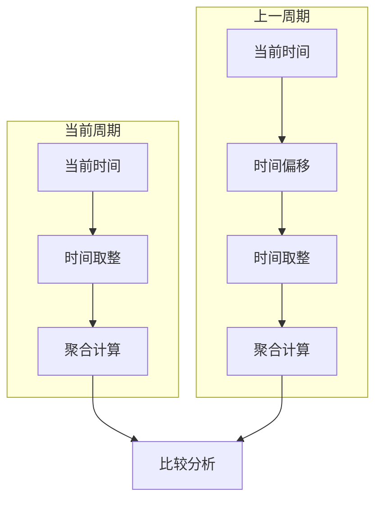

**章节来源**
- [timeShiftExpression.ts](file://src/expressions/timeShiftExpression.ts#L24-L121)
- [timeFloorExpression.ts](file://src/expressions/timeFloorExpression.ts#L25-L130)

### 同比环比计算
同比环比计算是时间表达式的重要应用场景，通过时间偏移和时间取整的组合使用，可以方便地进行年同比、月环比等计算。

**同比环比计算流程**
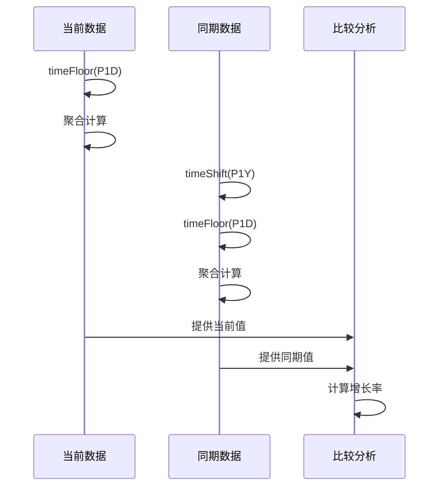

**图表来源**
- [timeShiftExpression.ts](file://src/expressions/timeShiftExpression.ts#L24-L121)
- [timeFloorExpression.ts](file://src/expressions/timeFloorExpression.ts#L25-L130)

**章节来源**
- [timeShiftExpression.ts](file://src/expressions/timeShiftExpression.ts#L24-L121)
- [timeFloorExpression.ts](file://src/expressions/timeFloorExpression.ts#L25-L130)

## 跨数据库时间类型映射

### 数据库方言支持
系统通过Dialect类支持多种数据库的时间类型映射，包括ClickHouse、Druid、MySQL和PostgreSQL等。每种数据库方言都实现了特定的时间函数，确保时间表达式可以在不同数据库上正确执行。

**数据库方言类图**
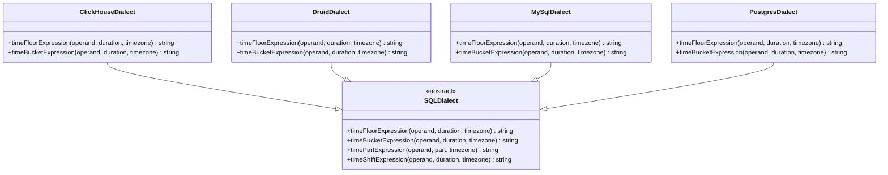

**图表来源**
- [baseDialect.ts](file://src/dialect/baseDialect.ts#L21-L172)
- [clickHouseDialect.ts](file://src/dialect/clickHouseDialect.ts#L4-L161)
- [druidDialect.ts](file://src/dialect/druidDialect.ts#L20-L175)
- [mySqlDialect.ts](file://src/dialect/mySqlDialect.ts#L21-L172)
- [postgresDialect.ts](file://src/dialect/postgresDialect.ts#L20-L158)

**章节来源**
- [baseDialect.ts](file://src/dialect/baseDialect.ts#L21-L172)

### 时间类型映射表
不同数据库对时间类型的处理方式有所不同，需要进行适当的映射和转换。

**时间类型映射表**
| 数据库 | 时间取整函数 | 时间分桶函数 | 时间部分提取函数 | 时间偏移函数 |
|-------|------------|------------|----------------|------------|
| ClickHouse | toStartOfInterval | timeSlot | toHour/toMinute等 | dateAdd/dateSub |
| Druid | FLOOR | TIME_FLOOR | EXTRACT | TIME_SHIFT |
| MySQL | DATE_FORMAT | TIMESTAMPADD | EXTRACT | DATE_ADD/DATE_SUB |
| PostgreSQL | DATE_TRUNC | GENERATE_SERIES | EXTRACT | DATE_TRUNC |

**章节来源**
- [baseDialect.ts](file://src/dialect/baseDialect.ts#L161-L161)
- [clickHouseDialect.ts](file://src/dialect/clickHouseDialect.ts#L119-L125)
- [druidDialect.ts](file://src/dialect/druidDialect.ts#L129-L133)
- [mySqlDialect.ts](file://src/dialect/mySqlDialect.ts#L123-L135)
- [postgresDialect.ts](file://src/dialect/postgresDialect.ts#L116-L120)