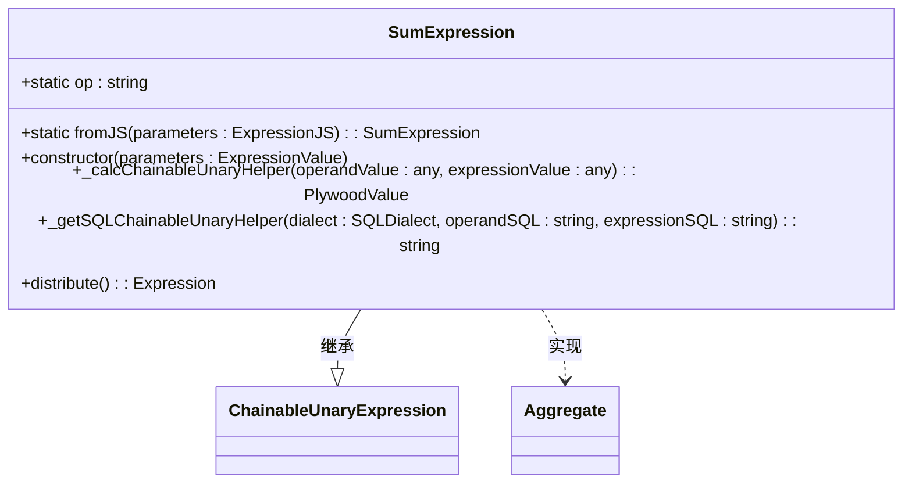
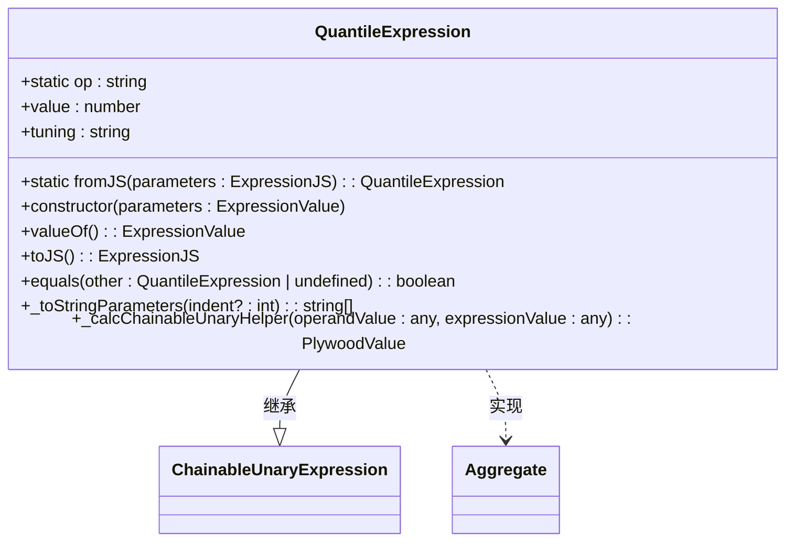
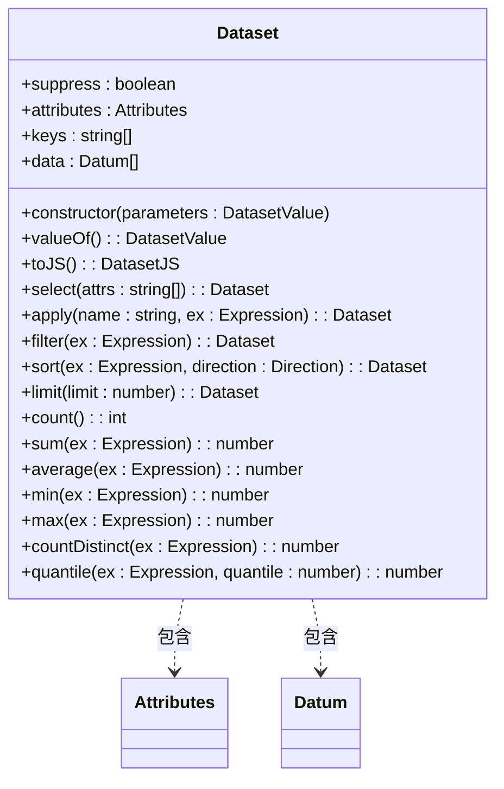
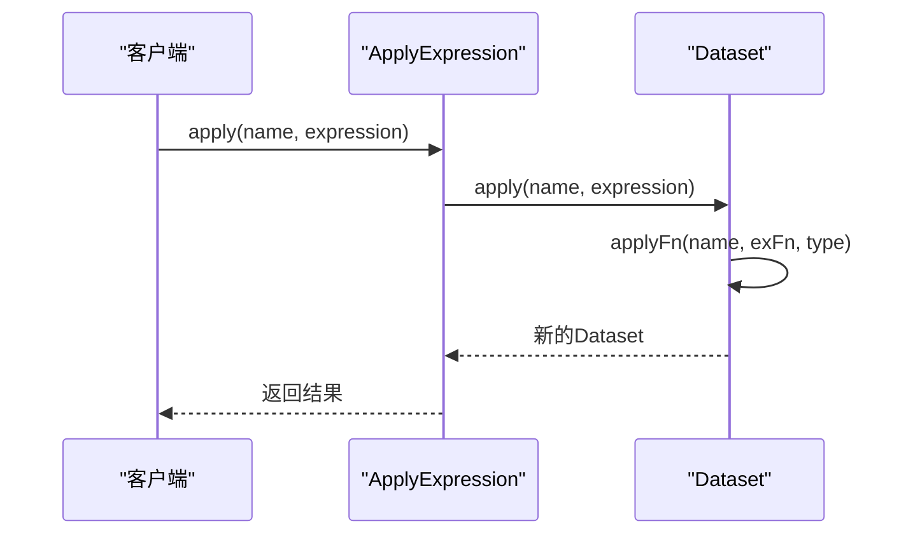

# 聚合表达式

<cite>
**本文档引用的文件**   
- [sumExpression.ts](file://src/expressions/sumExpression.ts)
- [quantileExpression.ts](file://src/expressions/quantileExpression.ts)
- [applyExpression.ts](file://src/expressions/applyExpression.ts)
- [dataset.ts](file://src/datatypes/dataset.ts)
- [aggregate.ts](file://src/expressions/mixins/aggregate.ts)
- [baseDialect.ts](file://src/dialect/baseDialect.ts)
- [averageExpression.ts](file://src/expressions/averageExpression.ts)
- [countExpression.ts](file://src/expressions/countExpression.ts)
- [minExpression.ts](file://src/expressions/minExpression.ts)
- [maxExpression.ts](file://src/expressions/maxExpression.ts)
- [countDistinctExpression.ts](file://src/expressions/countDistinctExpression.ts)
- [cardinalityExpression.ts](file://src/expressions/cardinalityExpression.ts)
</cite>

## 目录
1. [引言](#引言)
2. [核心聚合函数](#核心聚合函数)
3. [聚合上下文与数据集结构](#聚合上下文与数据集结构)
4. [分布式聚合计算原理](#分布式聚合计算原理)
5. [分组查询中的聚合表达式](#分组查询中的聚合表达式)
6. [空值处理与溢出保护](#空值处理与溢出保护)
7. [跨数据源兼容性](#跨数据源兼容性)
8. [结论](#结论)

## 引言
聚合表达式是数据分析系统中的核心组件，用于对数据集执行各种统计计算。本文档全面记录了求和、计数、平均值、最小值、最大值、分位数、基数估算和去重计数等聚合函数的实现细节。通过分析`sumExpression.ts`和`quantileExpression.ts`等文件中的实现，详细说明了分布式聚合的计算原理和精度控制机制。文档还提供了聚合表达式在分组查询中的使用示例，展示了如何通过`applyExpression`构建聚合指标。

## 核心聚合函数

### 求和表达式 (SumExpression)
`SumExpression`类实现了对数据集中指定数值字段的求和操作。该类继承自`ChainableUnaryExpression`并实现了`Aggregate`接口，确保了其作为聚合函数的特性。构造函数中通过`_ensureOp("sum")`和`_checkOperandTypes('DATASET')`等方法验证操作类型和操作数类型，保证了输入数据的正确性。

**图表来源**
- [sumExpression.ts](file://src/expressions/sumExpression.ts#L25-L77)

### 计数表达式 (CountExpression)
`CountExpression`类用于计算数据集中的记录数量。它同样继承自`ChainableExpression`并实现`Aggregate`接口。`calc`方法负责实际的计数逻辑，而`_getSQLChainableHelper`方法则生成相应的SQL语句，支持在不同数据库方言中的执行。

**代码来源**
- [countExpression.ts](file://src/expressions/countExpression.ts#L21-L42)

### 平均值表达式 (AverageExpression)
`AverageExpression`类实现了平均值计算功能。其核心逻辑通过`_calcChainableUnaryHelper`方法调用`Dataset`类的`average`方法完成。该类还提供了`decomposeAverage`方法，可以将平均值计算分解为求和与计数的组合操作，便于在分布式环境中进行优化。

**代码来源**
- [averageExpression.ts](file://src/expressions/averageExpression.ts#L21-L47)

### 最小值与最大值表达式 (MinExpression & MaxExpression)
`MinExpression`和`MaxExpression`类分别用于计算数据集中的最小值和最大值。它们都支持数值和时间类型的比较，并通过`_checkExpressionTypes`方法验证输入类型。这两个类的实现方式相似，主要区别在于`_calcChainableUnaryHelper`方法中调用的是`Dataset`类的`min`或`max`方法。

**代码来源**
- [minExpression.ts](file://src/expressions/minExpression.ts#L21-L42)
- [maxExpression.ts](file://src/expressions/maxExpression.ts#L21-L42)

### 分位数表达式 (QuantileExpression)
`QuantileExpression`类实现了分位数计算功能。除了基本的表达式参数外，该类还包含`value`和`tuning`两个属性，分别表示分位数值和精度调整参数。`_calcChainableUnaryHelper`方法调用`Dataset`类的`quantile`方法进行实际计算，支持对数值数据的分位数分析。

**图表来源**
- [quantileExpression.ts](file://src/expressions/quantileExpression.ts#L20-L71)

### 去重计数表达式 (CountDistinctExpression)
`CountDistinctExpression`类用于计算数据集中指定字段的去重后数量。其实现基于`Dataset`类的`countDistinct`方法，通过维护一个哈希表来跟踪已见值，从而实现高效的去重计数。该类还支持生成相应的SQL语句，使用`COUNT(DISTINCT ...)`语法。

**代码来源**
- [countDistinctExpression.ts](file://src/expressions/countDistinctExpression.ts#L21-L41)

### 基数估算表达式 (CardinalityExpression)
`CardinalityExpression`类用于估算集合的基数。它支持多种数据类型，包括布尔值、字符串、数值及其范围类型。该类通过`_calcChainableHelper`方法实现核心逻辑，对于集合类型的数据直接调用其`cardinality`方法，对于其他类型则返回1。

**代码来源**
- [cardinalityExpression.ts](file://src/expressions/cardinalityExpression.ts#L20-L45)

## 聚合上下文与数据集结构

### 数据集类 (Dataset)
`Dataset`类是聚合操作的基础数据结构，封装了数据集的属性、键和数据。该类提供了多种聚合方法，如`count`、`sum`、`average`、`min`、`max`等，这些方法构成了聚合表达式的基础。`Dataset`类还支持数据的筛选、排序、分组等操作，为复杂的分析需求提供了支持。

**图表来源**
- [dataset.ts](file://src/datatypes/dataset.ts#L313-L1425)

### 聚合混入 (Aggregate Mixin)
`Aggregate`混入类定义了所有聚合表达式共有的行为特征。它提供了`isAggregate`、`isNester`和`fullyDefined`等方法，用于标识表达式是否为聚合类型、是否为嵌套类型以及是否完全定义。这些方法在表达式的优化和执行过程中起着重要作用。

**代码来源**
- [aggregate.ts](file://src/expressions/mixins/aggregate.ts#L18-L33)

## 分布式聚合计算原理

### 分布式求和的优化
`SumExpression`类的`distribute`方法实现了分布式求和的优化。当表达式为常量时，可以直接将计数结果乘以常量值；当表达式为加法或减法时，可以分别对各部分进行求和后再合并结果。这种优化策略显著减少了网络传输的数据量，提高了分布式计算的效率。

**代码来源**
- [sumExpression.ts](file://src/expressions/sumExpression.ts#L50-L77)

### 分位数计算的精度控制
`QuantileExpression`类通过`tuning`参数实现了分位数计算的精度控制。在分布式环境中，分位数计算通常采用近似算法，`tuning`参数允许用户在计算精度和性能之间进行权衡。较高的精度设置会导致更多的计算资源消耗，但结果更接近真实值。

**代码来源**
- [quantileExpression.ts](file://src/expressions/quantileExpression.ts#L20-L71)

## 分组查询中的聚合表达式

### 应用表达式 (ApplyExpression)
`ApplyExpression`类用于在数据集上应用聚合操作，生成新的指标列。该类的`_calcChainableUnaryHelper`方法调用`Dataset`类的`apply`方法，将聚合结果作为新列添加到数据集中。`ApplyExpression`是构建复杂分析查询的关键组件，支持在分组查询中创建各种聚合指标。

**图表来源**
- [applyExpression.ts](file://src/expressions/applyExpression.ts#L26-L150)

### 构建聚合指标的示例
在分组查询中，可以通过`applyExpression`构建各种聚合指标。例如，可以创建一个包含总销售额、平均订单金额、订单数量等指标的查询。这些指标可以基于不同的维度进行分组，如按地区、按产品类别等，从而提供多维度的分析视角。

**代码来源**
- [applyExpression.ts](file://src/expressions/applyExpression.ts#L26-L150)

## 空值处理与溢出保护

### 空值处理策略
所有聚合函数都实现了对空值的处理。在`Dataset`类的聚合方法中，空值通常被忽略或被视为0。例如，在求和操作中，空值不会影响总和的计算；在平均值计算中，空值不计入计数。这种处理方式确保了聚合结果的稳定性和可靠性。

**代码来源**
- [dataset.ts](file://src/datatypes/dataset.ts#L313-L1425)

### 溢出保护机制
为了防止数值溢出，聚合函数在内部使用了适当的数值类型和计算策略。例如，在求和操作中，使用`number`类型而不是`int`类型来存储结果，以支持更大的数值范围。此外，系统还提供了配置选项，允许用户根据具体需求调整数值精度和溢出处理策略。

**代码来源**
- [sumExpression.ts](file://src/expressions/sumExpression.ts#L25-L77)

## 跨数据源兼容性

### 数据库方言支持
系统通过`SQLDialect`类实现了对多种数据库方言的支持。`baseDialect.ts`文件中定义了基本的SQL生成方法，如`escapeName`、`escapeLiteral`等。具体的数据库方言类（如`PostgresDialect`、`MySqlDialect`）继承自`baseDialect`并重写相关方法，以适应不同数据库的语法差异。

**代码来源**
- [baseDialect.ts](file://src/dialect/baseDialect.ts#L21-L172)

### 聚合函数的SQL生成
每个聚合表达式类都实现了`_getSQLChainableUnaryHelper`方法，用于生成相应的SQL语句。这些方法利用`SQLDialect`类提供的工具，确保生成的SQL语句符合目标数据库的语法要求。例如，`SumExpression`生成`SUM(...)`语句，`CountDistinctExpression`生成`COUNT(DISTINCT ...)`语句。

**代码来源**
- [sumExpression.ts](file://src/expressions/sumExpression.ts#L25-L77)
- [countDistinctExpression.ts](file://src/expressions/countDistinctExpression.ts#L21-L41)

## 结论
本文档全面介绍了聚合表达式的实现细节，涵盖了从基本的求和、计数到复杂的分位数计算等多种聚合函数。通过分析`sumExpression.ts`和`quantileExpression.ts`等文件，深入探讨了分布式聚合的计算原理和精度控制机制。文档还展示了如何在分组查询中使用`applyExpression`构建聚合指标，并讨论了空值处理、溢出保护和跨数据源兼容性等重要问题。这些内容为开发者理解和使用聚合表达式提供了全面的指导。