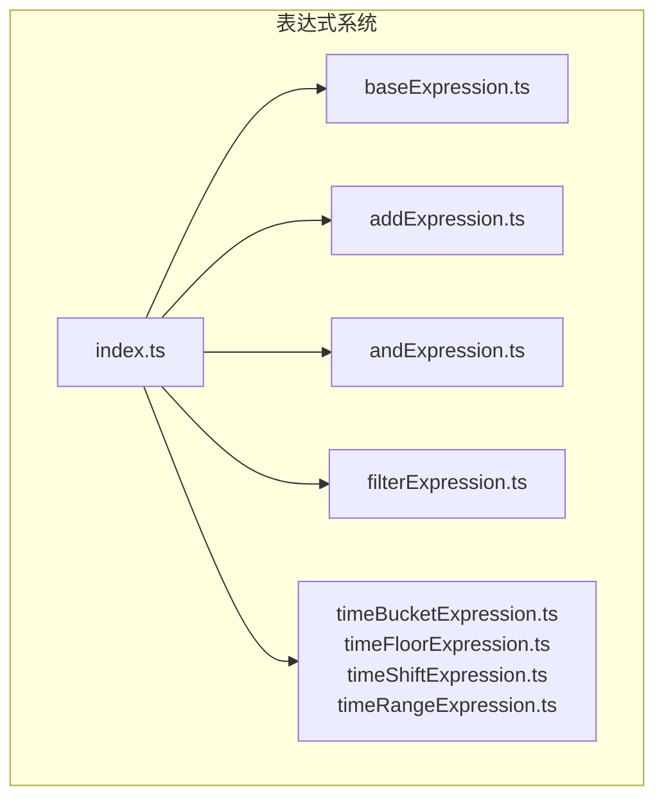
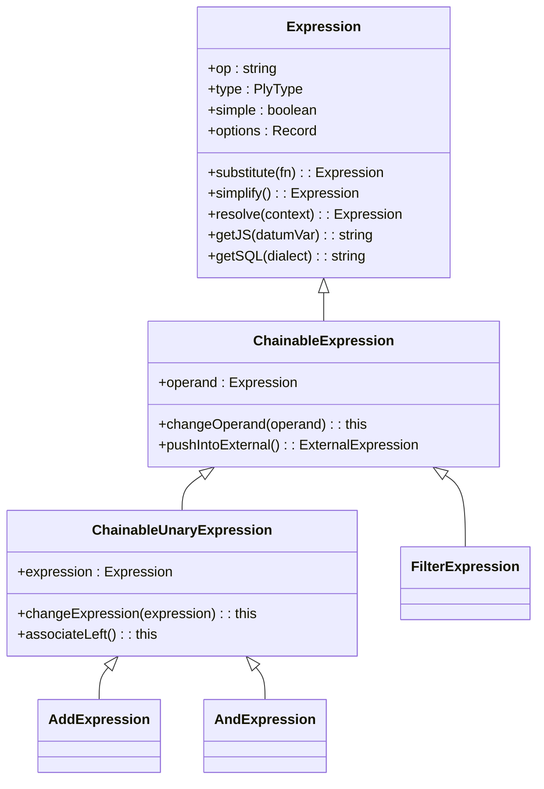
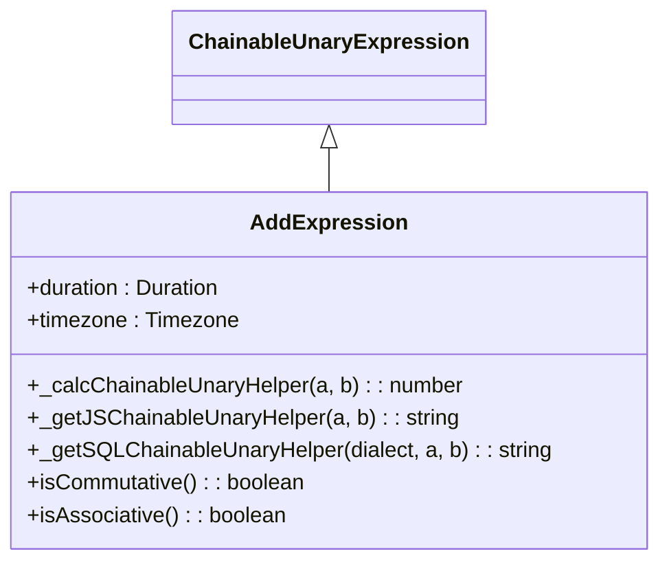
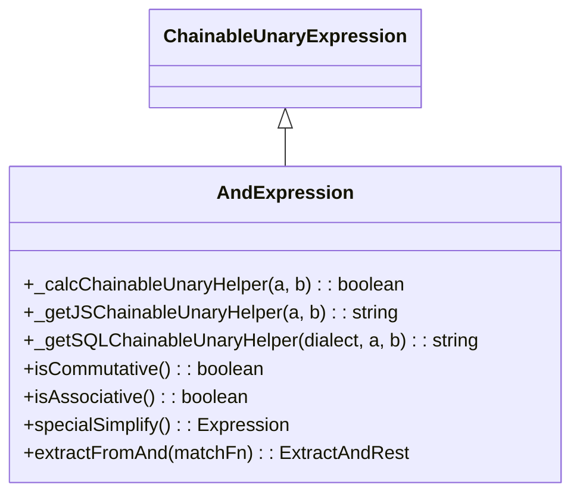
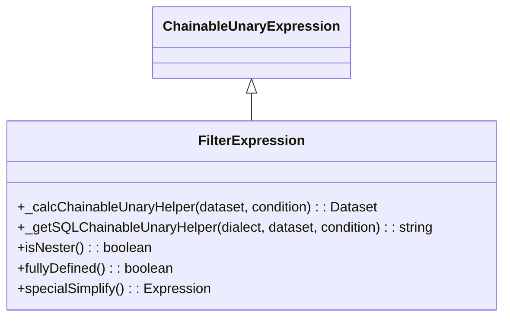
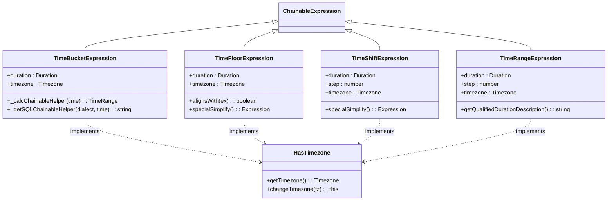
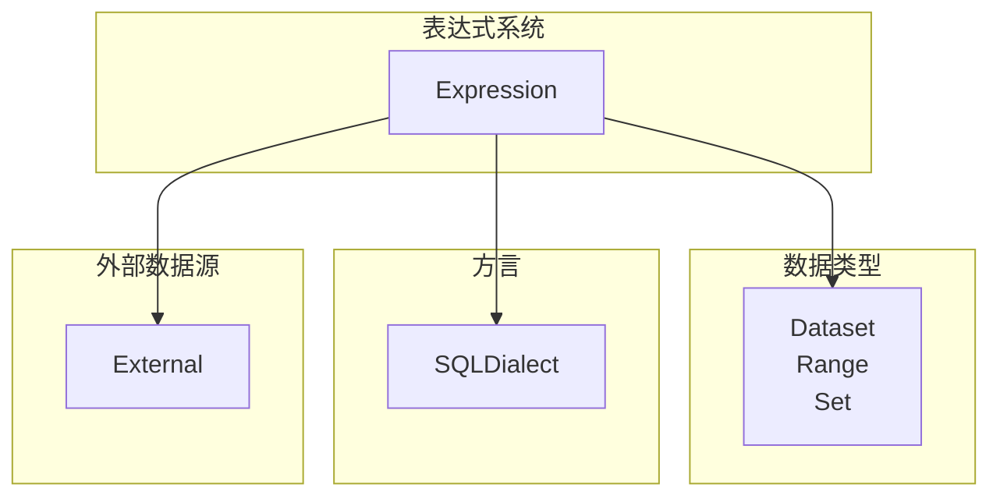

# 表达式API

<cite>
**本文档中引用的文件**  
- [index.ts](file://src/expressions/index.ts)
- [baseExpression.ts](file://src/expressions/baseExpression.ts)
- [addExpression.ts](file://src/expressions/addExpression.ts)
- [andExpression.ts](file://src/expressions/andExpression.ts)
- [filterExpression.ts](file://src/expressions/filterExpression.ts)
- [timeBucketExpression.ts](file://src/expressions/timeBucketExpression.ts)
- [timeFloorExpression.ts](file://src/expressions/timeFloorExpression.ts)
- [timeShiftExpression.ts](file://src/expressions/timeShiftExpression.ts)
- [timeRangeExpression.ts](file://src/expressions/timeRangeExpression.ts)
</cite>

## 目录
1. [简介](#简介)
2. [项目结构](#项目结构)
3. [核心组件](#核心组件)
4. [架构概述](#架构概述)
5. [详细组件分析](#详细组件分析)
6. [依赖分析](#依赖分析)
7. [性能考虑](#性能考虑)
8. [故障排除指南](#故障排除指南)
9. [结论](#结论)
10. [附录](#附录)（如有必要）

## 简介
本文档全面记录了Plywood表达式系统API，重点介绍`src/expressions/index.ts`中导出的所有表达式类。文档详细说明了`Expression`基类及其子类（如`AddExpression`、`AndExpression`、`FilterExpression`等）的构造函数、核心方法（如`apply`、`simplify`、`resolve`）、参数类型和返回值。结合`baseExpression.ts`中的实现，解释了表达式链式调用机制和表达式树的构建方式。提供了`Expression.parse()`的使用示例，展示如何从字符串解析表达式。文档涵盖了算术、逻辑、字符串、时间等各类表达式，并说明了它们在查询构建中的作用。

## 项目结构
Plywood项目的表达式系统位于`src/expressions/`目录下，采用模块化设计，每个表达式类型都有独立的文件。核心表达式基类`Expression`定义在`baseExpression.ts`中，而具体的表达式实现（如`AddExpression`、`FilterExpression`等）则分布在各自的文件中。`index.ts`文件作为表达式系统的入口，导出了所有表达式类，便于外部模块统一导入。



**图源**
- [index.ts](file://src/expressions/index.ts)
- [baseExpression.ts](file://src/expressions/baseExpression.ts)

**节源**
- [index.ts](file://src/expressions/index.ts)
- [baseExpression.ts](file://src/expressions/baseExpression.ts)

## 核心组件
表达式系统的核心是`Expression`抽象基类，它定义了所有表达式共有的行为和属性。`Expression`类提供了`apply`、`simplify`、`resolve`等核心方法，以及`toString`、`toJS`、`equals`等序列化和比较方法。所有具体的表达式类都继承自`Expression`或其子类（如`ChainableExpression`、`ChainableUnaryExpression`），并实现特定的计算逻辑。

**节源**
- [baseExpression.ts](file://src/expressions/baseExpression.ts#L1000-L1500)

## 架构概述
Plywood表达式系统采用面向对象的设计模式，通过继承和多态实现不同类型表达式的统一接口。`Expression`基类定义了表达式的基本结构，`ChainableExpression`和`ChainableUnaryExpression`提供了链式调用的支持。表达式通过`substitute`方法实现递归遍历和替换，通过`getJS`和`getSQL`方法生成JavaScript和SQL代码。整个系统支持表达式树的构建、简化和求值。



**图源**
- [baseExpression.ts](file://src/expressions/baseExpression.ts#L1000-L2000)

## 详细组件分析
本节详细分析表达式系统中的关键组件，包括算术、逻辑、过滤和时间表达式。

### 算术表达式分析
`AddExpression`是算术表达式的一个典型代表，用于执行加法操作。它继承自`ChainableUnaryExpression`，实现了`_calcChainableUnaryHelper`方法来计算两个操作数的和。



**图源**
- [addExpression.ts](file://src/expressions/addExpression.ts#L10-L50)

**节源**
- [addExpression.ts](file://src/expressions/addExpression.ts#L1-L64)

### 逻辑表达式分析
`AndExpression`用于执行逻辑与操作，它同样继承自`ChainableUnaryExpression`。该类实现了`isCommutative`和`isAssociative`方法，表明逻辑与操作满足交换律和结合律，并在`simplify`方法中利用这些性质进行表达式简化。



**图源**
- [andExpression.ts](file://src/expressions/andExpression.ts#L10-L50)

**节源**
- [andExpression.ts](file://src/expressions/andExpression.ts#L1-L131)

### 过滤表达式分析
`FilterExpression`用于对数据集进行过滤操作，它继承自`ChainableUnaryExpression`。该表达式将一个布尔表达式应用于数据集，返回满足条件的子集。



**图源**
- [filterExpression.ts](file://src/expressions/filterExpression.ts#L10-L50)

**节源**
- [filterExpression.ts](file://src/expressions/filterExpression.ts#L1-L91)

### 时间表达式分析
时间表达式包括`TimeBucketExpression`、`TimeFloorExpression`、`TimeShiftExpression`和`TimeRangeExpression`，它们都继承自`ChainableExpression`并实现了`HasTimezone`混入。这些表达式用于处理时间数据的分组、对齐和转换。



**图源**
- [timeBucketExpression.ts](file://src/expressions/timeBucketExpression.ts#L10-L50)
- [timeFloorExpression.ts](file://src/expressions/timeFloorExpression.ts#L10-L50)
- [timeShiftExpression.ts](file://src/expressions/timeShiftExpression.ts#L10-L50)
- [timeRangeExpression.ts](file://src/expressions/timeRangeExpression.ts#L10-L50)

**节源**
- [timeBucketExpression.ts](file://src/expressions/timeBucketExpression.ts#L1-L98)
- [timeFloorExpression.ts](file://src/expressions/timeFloorExpression.ts#L1-L135)
- [timeShiftExpression.ts](file://src/expressions/timeShiftExpression.ts#L1-L126)
- [timeRangeExpression.ts](file://src/expressions/timeRangeExpression.ts#L1-L119)

## 依赖分析
表达式系统依赖于多个其他模块，包括数据类型模块（`datatypes`）、方言模块（`dialect`）和外部数据源模块（`external`）。`Expression`类使用`Dataset`、`Range`等数据类型来表示计算结果，使用`SQLDialect`来生成SQL代码，并通过`External`类与外部数据源交互。



**图源**
- [baseExpression.ts](file://src/expressions/baseExpression.ts#L10-L100)

**节源**
- [baseExpression.ts](file://src/expressions/baseExpression.ts#L1-L2776)

## 性能考虑
表达式系统在设计时考虑了性能优化。`simplify`方法可以对表达式树进行简化，减少不必要的计算。`getReadyExternals`方法可以批量获取外部数据，减少网络请求次数。`compute`方法支持异步计算和流式处理，可以处理大规模数据集。

## 故障排除指南
当表达式系统出现问题时，可以检查以下几点：1) 确保表达式类型正确，使用`canHaveType`方法验证；2) 检查表达式是否已完全解析，使用`resolved`方法验证；3) 使用`simulate`方法模拟表达式计算，查看中间结果；4) 检查外部数据源连接是否正常。

**节源**
- [baseExpression.ts](file://src/expressions/baseExpression.ts#L2000-L2500)

## 结论
Plywood表达式系统提供了一套强大而灵活的API，用于构建和执行复杂的数据查询。通过链式调用和表达式树，开发者可以以声明式的方式描述数据处理逻辑。系统支持多种表达式类型，包括算术、逻辑、字符串和时间操作，并可以生成JavaScript和SQL代码。表达式系统的设计注重性能和可扩展性，是Plywood数据处理能力的核心。

## 附录
### Expression.parse() 使用示例
```typescript
// 从字符串解析表达式
const expr1 = Expression.parse('$main.filter($time > "2020-01-01")');
const expr2 = Expression.parse('ply().apply(total, $price * $quantity)');
```

### 表达式链式调用示例
```typescript
// 构建复杂的表达式链
const expression = $('data')
  .filter($('time').greaterThan('2020-01-01'))
  .split({ day: $('time').timeBucket('P1D') })
  .apply('total', $('price').multiply($('quantity')))
  .sort('$total', 'descending')
  .limit(10);
```