# 逻辑表达式

<cite>
**本文档中引用的文件**   
- [andExpression.ts](file://src/expressions/andExpression.ts)
- [orExpression.ts](file://src/expressions/orExpression.ts)
- [notExpression.ts](file://src/expressions/notExpression.ts)
- [inExpression.ts](file://src/expressions/inExpression.ts)
- [containsExpression.ts](file://src/expressions/containsExpression.ts)
- [baseExpression.ts](file://src/expressions/baseExpression.ts)
- [greaterThanExpression.ts](file://src/expressions/greaterThanExpression.ts)
- [lessThanExpression.ts](file://src/expressions/lessThanExpression.ts)
- [greaterThanOrEqualExpression.ts](file://src/expressions/greaterThanOrEqualExpression.ts)
- [lessThanOrEqualExpression.ts](file://src/expressions/lessThanOrEqualExpression.ts)
- [isExpression.ts](file://src/expressions/isExpression.ts)
- [baseDialect.ts](file://src/dialect/baseDialect.ts)
- [clickHouseDialect.ts](file://src/dialect/clickHouseDialect.ts)
- [mySqlDialect.ts](file://src/dialect/mySqlDialect.ts)
- [postgresDialect.ts](file://src/dialect/postgresDialect.ts)
- [druidDialect.ts](file://src/dialect/druidDialect.ts)
</cite>

## 目录
1. [简介](#简介)
2. [布尔逻辑表达式](#布尔逻辑表达式)
3. [比较表达式](#比较表达式)
4. [短路求值机制](#短路求值机制)
5. [类型检查规则](#类型检查规则)
6. [表达式简化规则](#表达式简化规则)
7. [空值处理策略](#空值处理策略)
8. [性能优化建议](#性能优化建议)
9. [实用示例](#实用示例)

## 简介
逻辑表达式是Plywood查询语言的核心组成部分，用于构建复杂的条件查询和数据过滤规则。本API文档详细解释了布尔逻辑表达式（and、or、not）和比较表达式（大于、小于、等于、in、contains等）的实现细节，包括接口定义、参数类型、返回值以及优化策略。

**Section sources**
- [baseExpression.ts](file://src/expressions/baseExpression.ts#L1-L100)

## 布尔逻辑表达式
布尔逻辑表达式用于组合多个条件，支持and、or、not三种基本操作。

### And表达式
And表达式实现逻辑与操作，当所有操作数都为真时返回真。该表达式具有交换律和结合律特性。

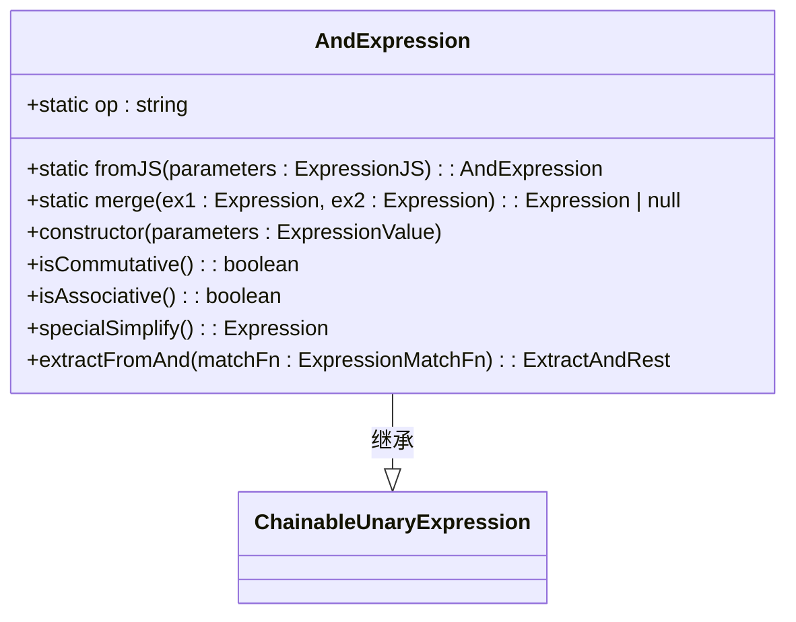

**Diagram sources**
- [andExpression.ts](file://src/expressions/andExpression.ts#L34-L127)

### Or表达式
Or表达式实现逻辑或操作，当任意操作数为真时返回真。该表达式同样具有交换律和结合律特性。

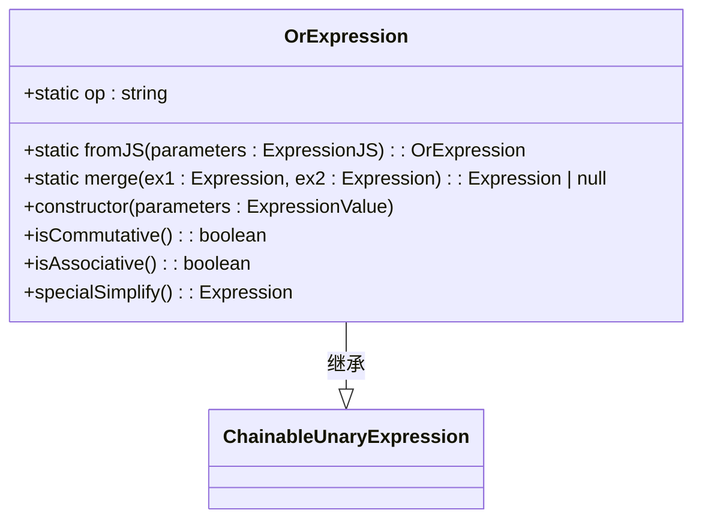

**Diagram sources**
- [orExpression.ts](file://src/expressions/orExpression.ts#L20-L99)

### Not表达式
Not表达式实现逻辑非操作，用于反转布尔值。

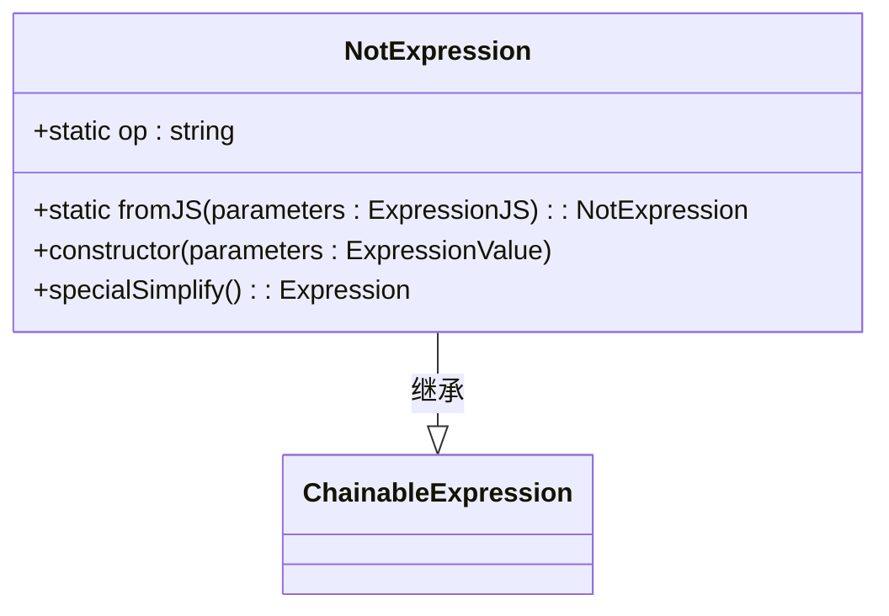

**Diagram sources**
- [notExpression.ts](file://src/expressions/notExpression.ts#L15-L54)

**Section sources**
- [andExpression.ts](file://src/expressions/andExpression.ts#L1-L130)
- [orExpression.ts](file://src/expressions/orExpression.ts#L1-L100)
- [notExpression.ts](file://src/expressions/notExpression.ts#L1-L55)

## 比较表达式
比较表达式用于比较两个值的关系，包括大小比较、相等性检查和包含关系判断。

### 大小比较表达式
支持大于、小于、大于等于、小于等于四种比较操作。

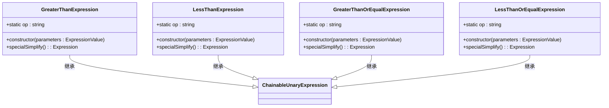

**Diagram sources**
- [greaterThanExpression.ts](file://src/expressions/greaterThanExpression.ts#L22-L64)
- [lessThanExpression.ts](file://src/expressions/lessThanExpression.ts#L23-L65)
- [greaterThanOrEqualExpression.ts](file://src/expressions/greaterThanOrEqualExpression.ts#L22-L64)
- [lessThanOrEqualExpression.ts](file://src/expressions/lessThanOrEqualExpression.ts#L22-L64)

### 相等性检查表达式
Is表达式用于检查两个值是否相等，支持类型对齐检查。

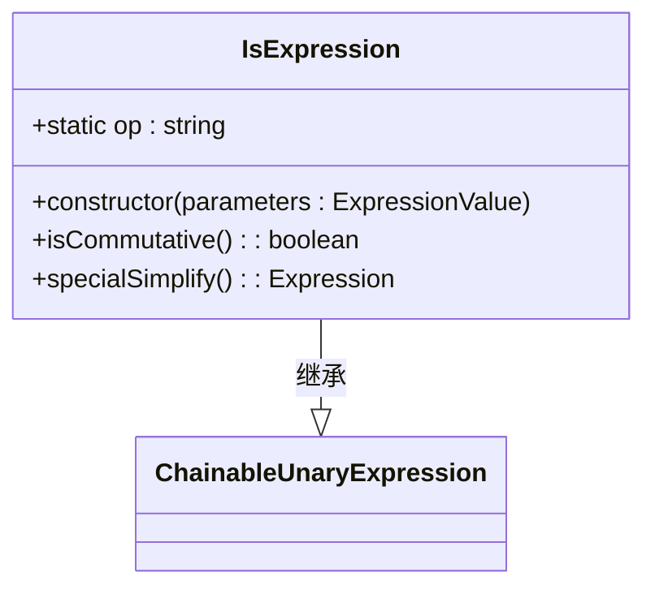

**Diagram sources**
- [isExpression.ts](file://src/expressions/isExpression.ts#L25-L136)

### 包含关系表达式
In表达式检查操作数是否在指定集合或范围内。

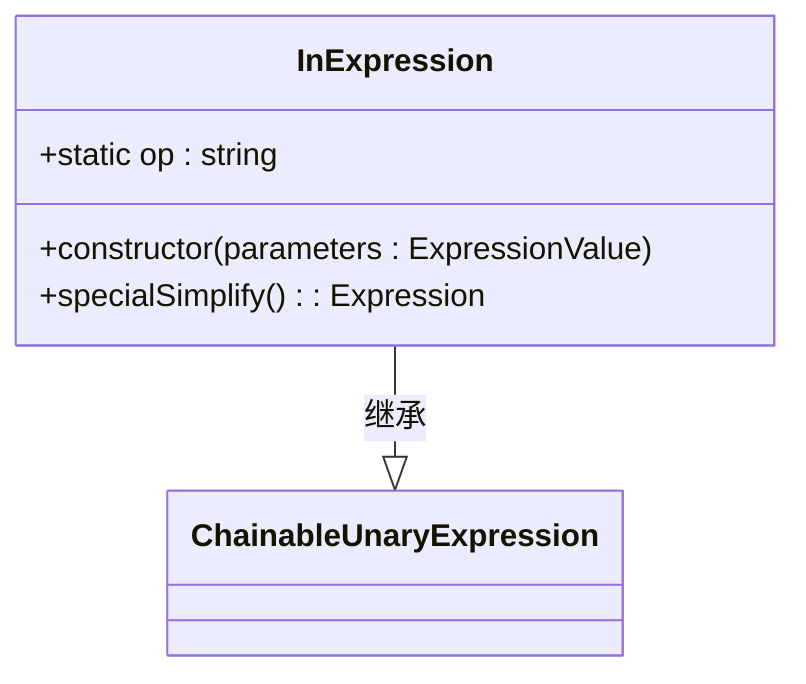

**Diagram sources**
- [inExpression.ts](file://src/expressions/inExpression.ts#L15-L82)

### 字符串包含表达式
Contains表达式检查字符串是否包含指定子串，支持大小写敏感和不敏感两种模式。

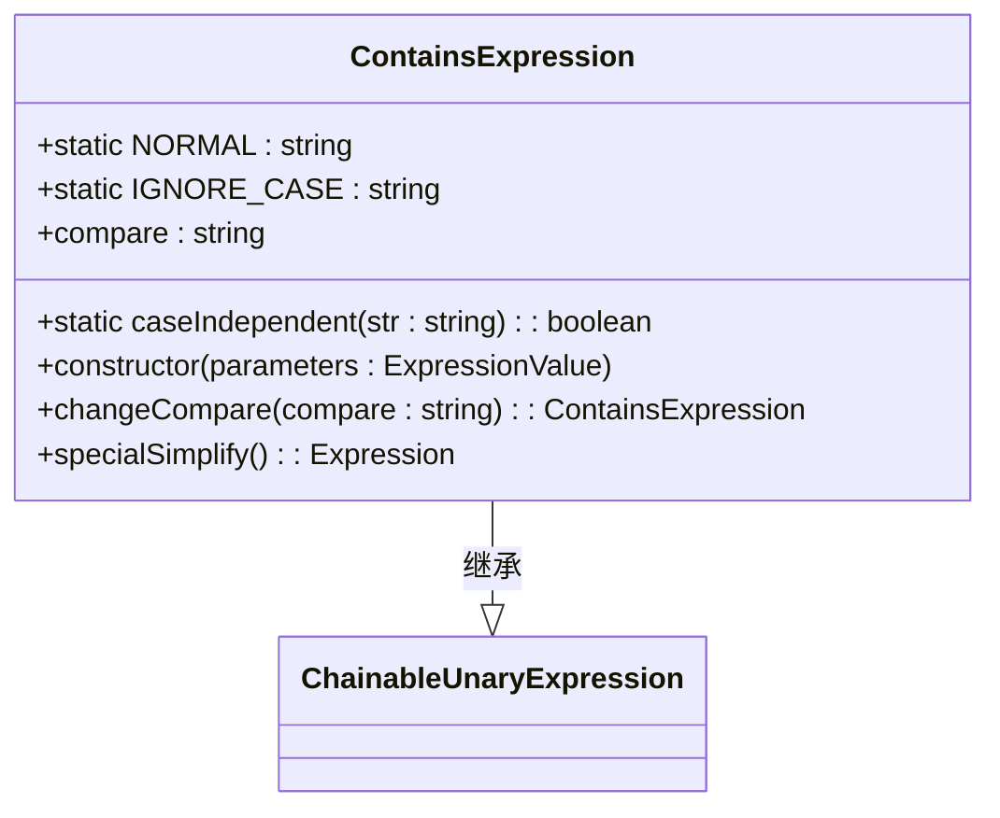

**Diagram sources**
- [containsExpression.ts](file://src/expressions/containsExpression.ts#L21-L138)

**Section sources**
- [greaterThanExpression.ts](file://src/expressions/greaterThanExpression.ts#L1-L67)
- [lessThanExpression.ts](file://src/expressions/lessThanExpression.ts#L1-L68)
- [inExpression.ts](file://src/expressions/inExpression.ts#L1-L82)
- [containsExpression.ts](file://src/expressions/containsExpression.ts#L1-L141)

## 短路求值机制
逻辑表达式实现了短路求值机制，以提高执行效率。

### And表达式的短路求值
当And表达式的任意操作数为假时，立即返回假，不再计算后续操作数。

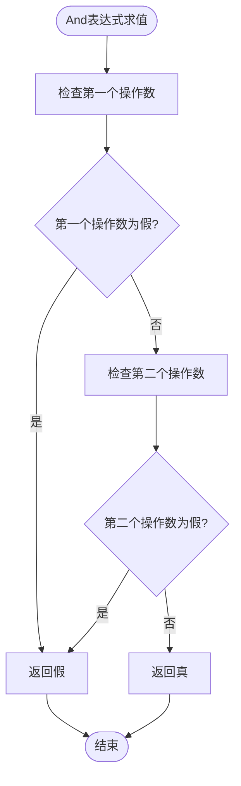

**Diagram sources**
- [andExpression.ts](file://src/expressions/andExpression.ts#L90-L110)

### Or表达式的短路求值
当Or表达式的任意操作数为真时，立即返回真，不再计算后续操作数。

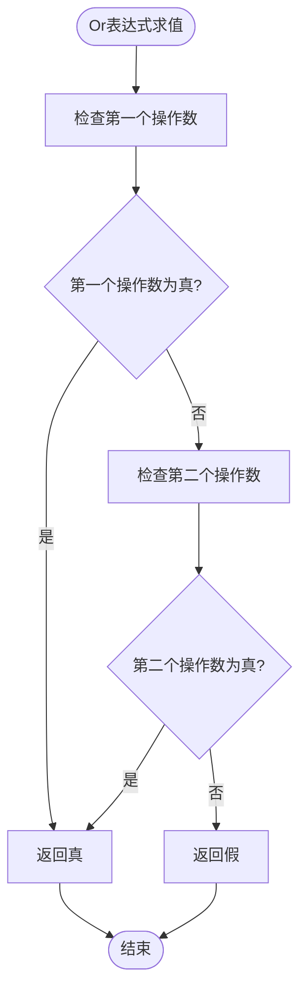

**Diagram sources**
- [orExpression.ts](file://src/expressions/orExpression.ts#L50-L70)

**Section sources**
- [andExpression.ts](file://src/expressions/andExpression.ts#L76-L129)
- [orExpression.ts](file://src/expressions/orExpression.ts#L50-L77)

## 类型检查规则
逻辑表达式在构建和执行过程中实施严格的类型检查规则。

### 操作数类型检查
所有逻辑表达式都会检查操作数的类型是否符合要求。

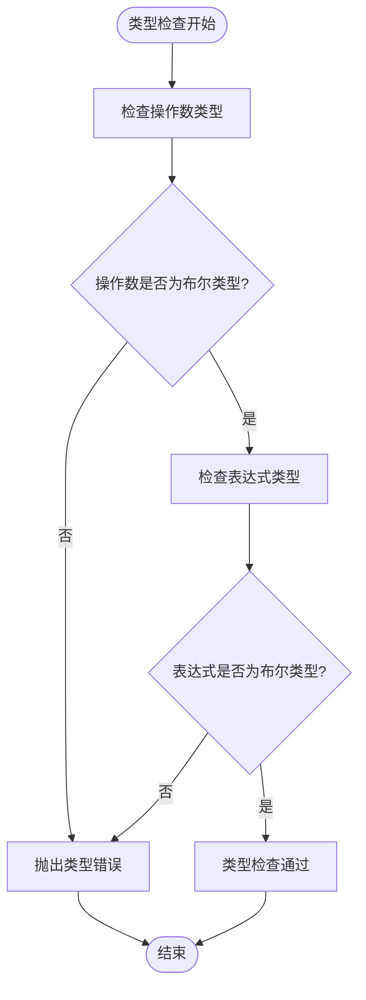

**Diagram sources**
- [baseExpression.ts](file://src/expressions/baseExpression.ts#L2198-L2255)
- [baseExpression.ts](file://src/expressions/baseExpression.ts#L2483-L2535)

### 类型对齐检查
比较表达式要求操作数和表达式具有匹配的类型。

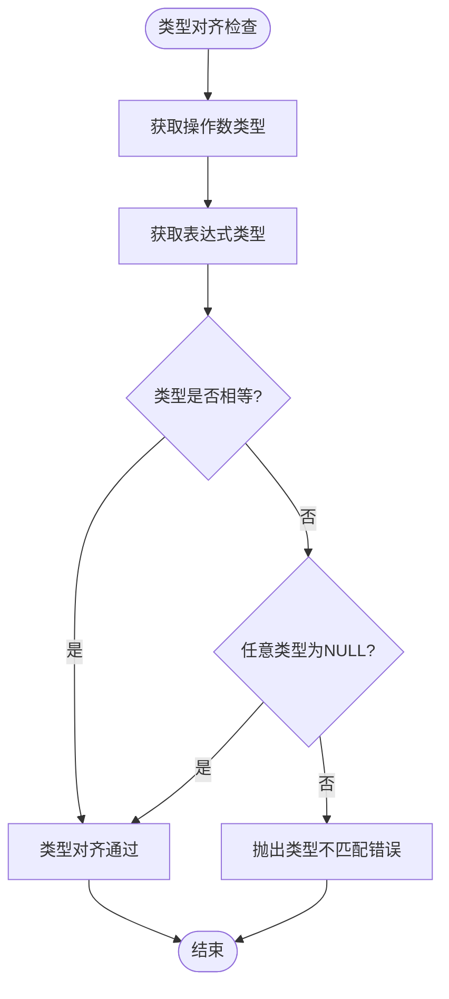

**Diagram sources**
- [baseExpression.ts](file://src/expressions/baseExpression.ts#L2483-L2535)

**Section sources**
- [baseExpression.ts](file://src/expressions/baseExpression.ts#L2191-L2466)

## 表达式简化规则
逻辑表达式在执行前会进行自动简化，以提高执行效率。

### And表达式简化
- `X and false` 简化为 `false`
- `X and true` 简化为 `X`
- `false and X` 简化为 `false`
- `true and X` 简化为 `X`

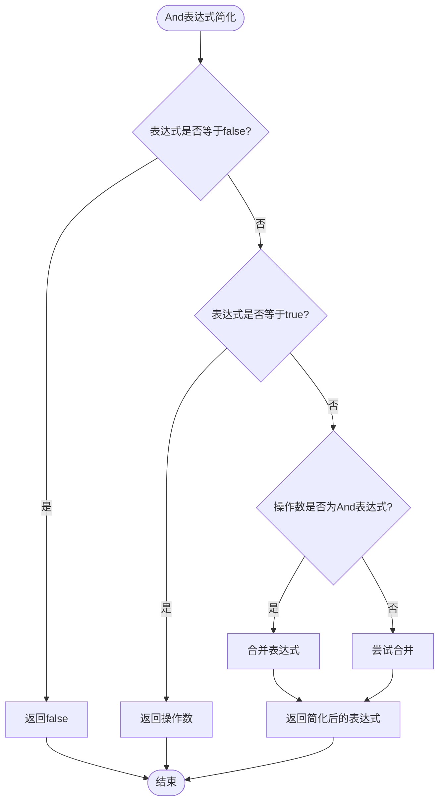

**Diagram sources**
- [andExpression.ts](file://src/expressions/andExpression.ts#L92-L110)

### Or表达式简化
- `X or true` 简化为 `true`
- `X or false` 简化为 `X`
- `true or X` 简化为 `true`
- `false or X` 简化为 `X`

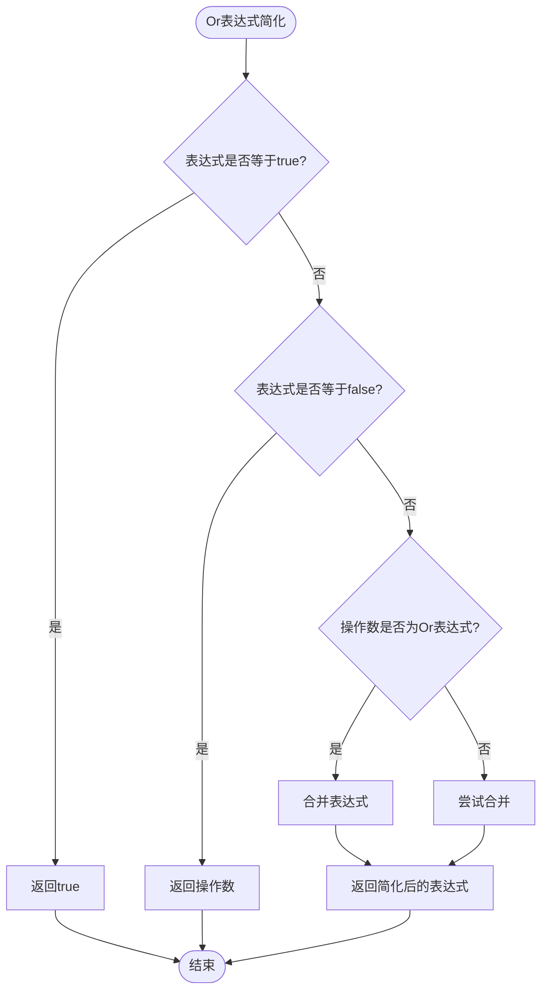

**Diagram sources**
- [orExpression.ts](file://src/expressions/orExpression.ts#L50-L70)

**Section sources**
- [andExpression.ts](file://src/expressions/andExpression.ts#L90-L110)
- [orExpression.ts](file://src/expressions/orExpression.ts#L50-L70)

## 空值处理策略
逻辑表达式对空值（null）有特定的处理策略。

### Null安全操作
使用jsNullSafetyBinary方法确保在JavaScript环境中安全处理null值。

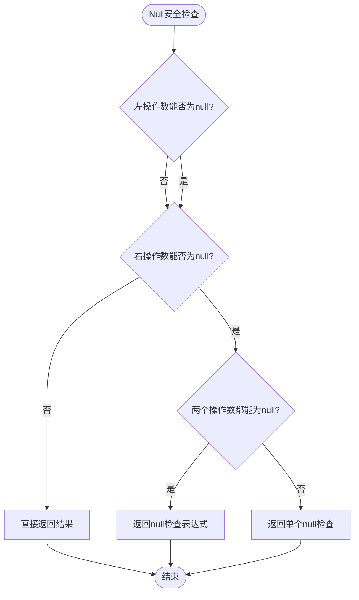

**Diagram sources**
- [baseExpression.ts](file://src/expressions/baseExpression.ts#L583-L631)

### 数据库空值处理
不同数据库方言对空值的处理方式不同，通过dialect.isNotDistinctFromExpression方法统一处理。

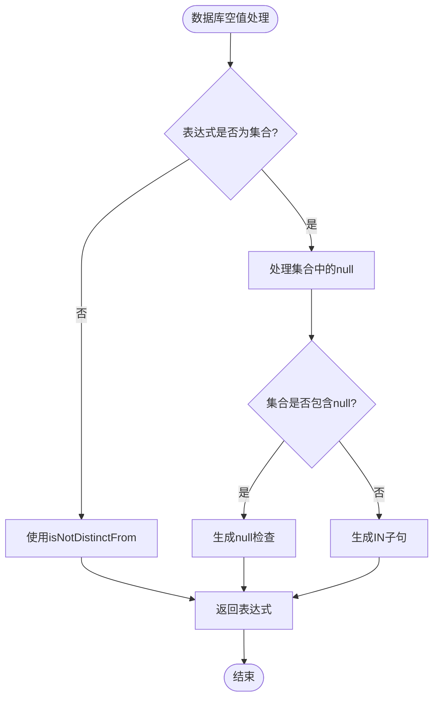

**Diagram sources**
- [isExpression.ts](file://src/expressions/isExpression.ts#L75-L100)

**Section sources**
- [baseExpression.ts](file://src/expressions/baseExpression.ts#L583-L631)
- [isExpression.ts](file://src/expressions/isExpression.ts#L75-L100)

## 性能优化建议
为提高逻辑表达式的执行性能，建议遵循以下优化策略。

### 表达式顺序优化
将计算成本低且可能为假的条件放在And表达式的前面，以利用短路求值机制。

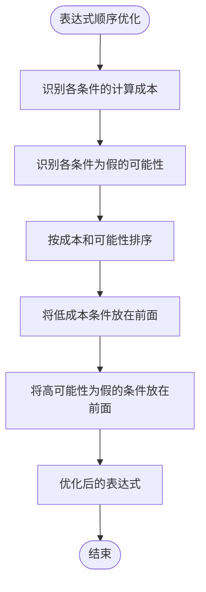

### 避免重复计算
使用表达式简化和缓存机制避免重复计算相同的子表达式。

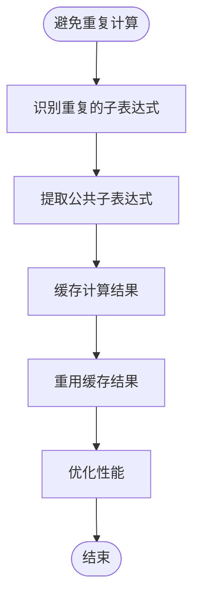

### 利用表达式简化
在构建复杂查询时，利用表达式简化规则减少不必要的计算。

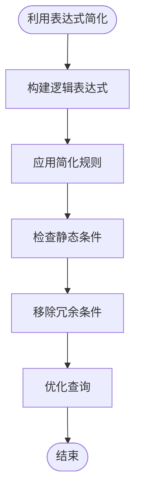

**Section sources**
- [andExpression.ts](file://src/expressions/andExpression.ts#L90-L110)
- [orExpression.ts](file://src/expressions/orExpression.ts#L50-L70)

## 实用示例
以下示例展示了如何使用Expression.and()和Expression.or()静态方法构建复杂条件查询。

### 复杂条件查询构建
使用Expression.and()方法组合多个过滤条件。

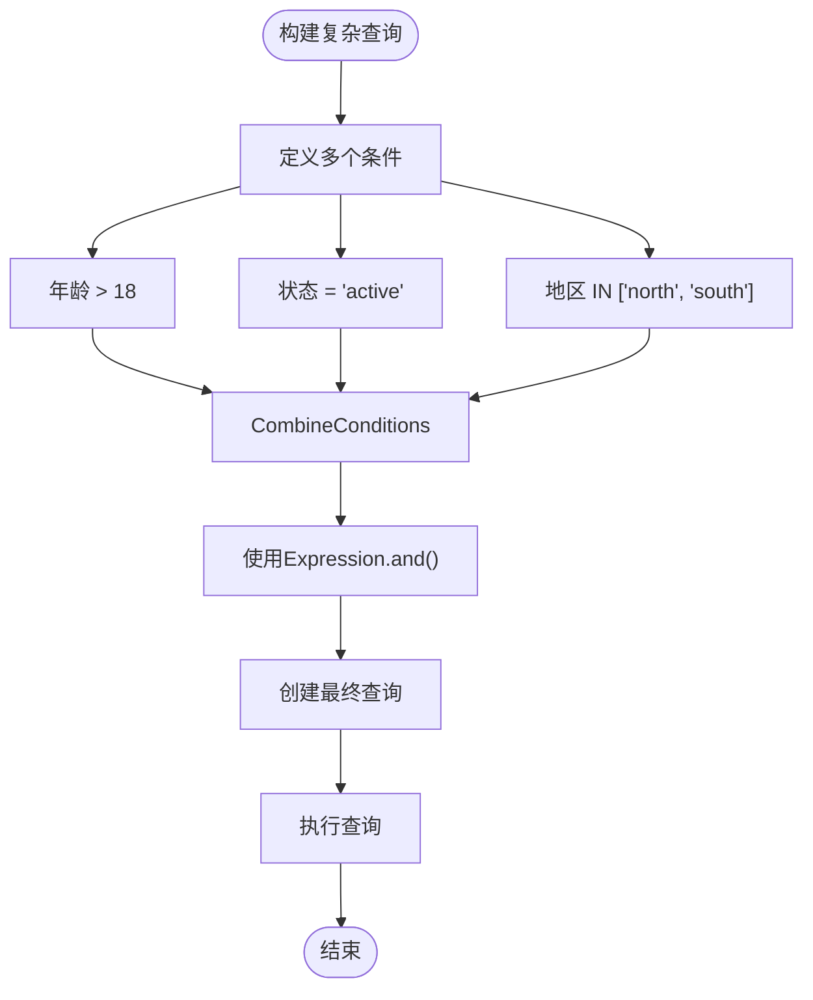

**Diagram sources**
- [andExpression.ts](file://src/expressions/andExpression.ts#L583-L631)

### 动态条件组合
使用Expression.or()方法构建动态的条件组合。

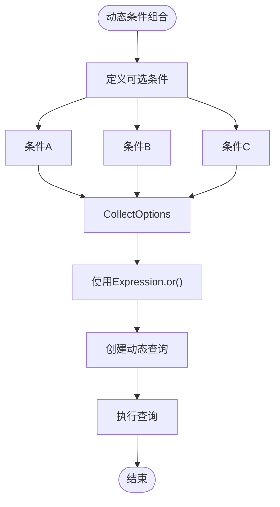

**Diagram sources**
- [orExpression.ts](file://src/expressions/orExpression.ts#L633-L673)

### 实际代码示例
```typescript
// 使用Expression.and()构建复杂查询
const complexFilter = Expression.and([
  $('age').greaterThan(18),
  $('status').is('active'),
  $('region').in(['north', 'south']),
  $('score').greaterThanOrEqual(80)
]);

// 使用Expression.or()构建多条件查询
const searchQuery = Expression.or([
  $('name').contains('john', 'ignoreCase'),
  $('email').contains('john', 'ignoreCase'),
  $('phone').contains('john')
]);
```

**Section sources**
- [andExpression.ts](file://src/expressions/andExpression.ts#L583-L631)
- [orExpression.ts](file://src/expressions/orExpression.ts#L633-L673)