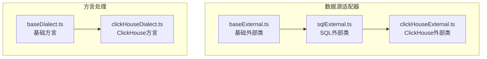
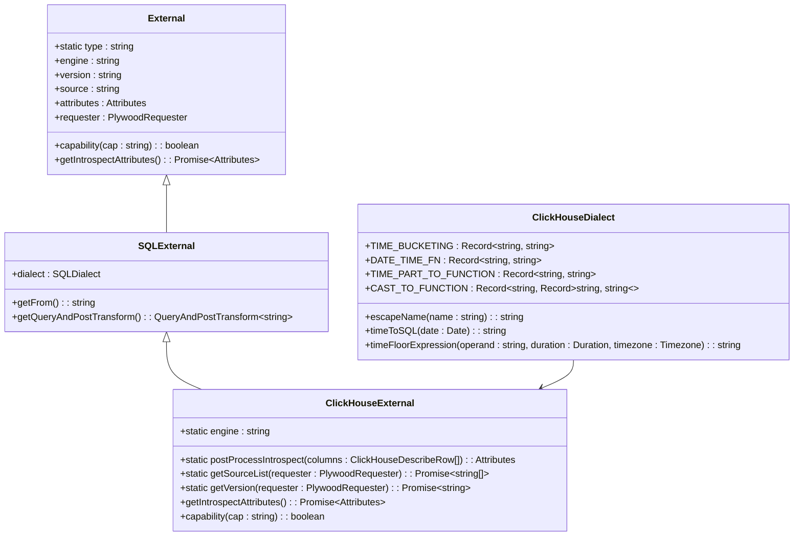
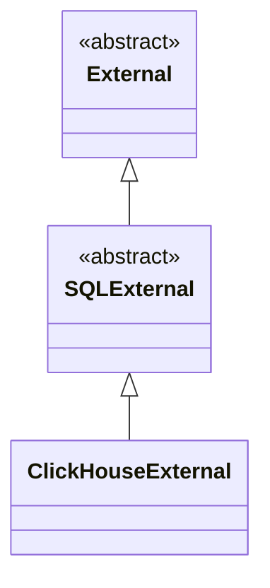
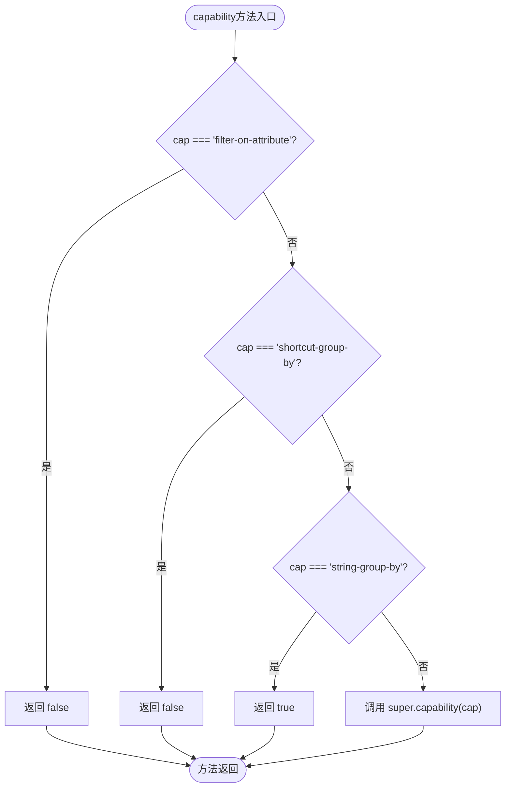
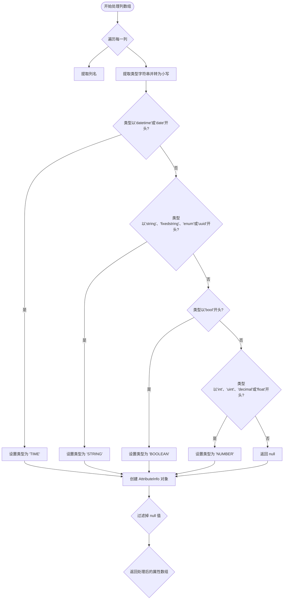
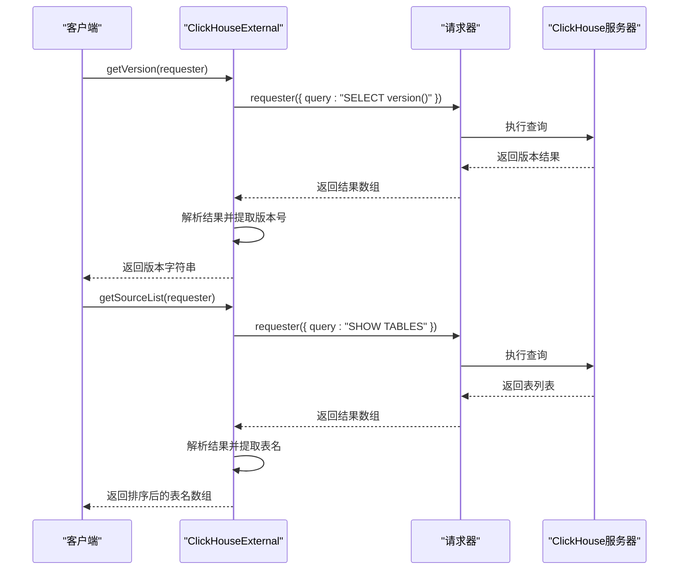
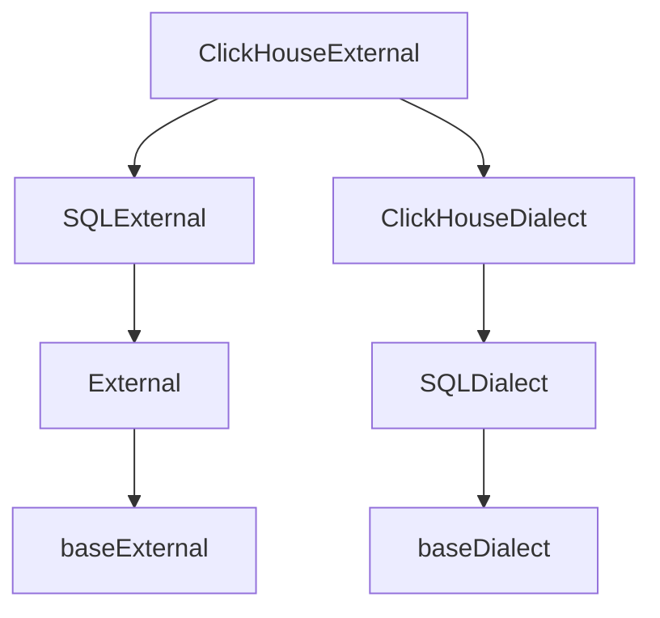

# ClickHouse数据源

<cite>
**本文档引用的文件**   
- [clickHouseExternal.ts](file://src/external/clickHouseExternal.ts)
- [clickHouseDialect.ts](file://src/dialect/clickHouseDialect.ts)
- [sqlExternal.ts](file://src/external/sqlExternal.ts)
- [baseExternal.ts](file://src/external/baseExternal.ts)
</cite>

## 目录
1. [简介](#简介)
2. [项目结构](#项目结构)
3. [核心组件](#核心组件)
4. [架构概述](#架构概述)
5. [详细组件分析](#详细组件分析)
6. [依赖分析](#依赖分析)
7. [性能考虑](#性能考虑)
8. [故障排除指南](#故障排除指南)
9. [结论](#结论)
10. [附录](#附录)（如有必要）

## 简介
本文档详细介绍了ClickHouse数据源适配器的实现，重点分析了`ClickHouseExternal`类及其继承关系。文档解释了该适配器如何声明其特定能力，如何解析ClickHouse的元数据，并将原生类型映射到Plywood类型系统。同时，文档还涵盖了其特有的版本和数据源列表获取方法。

## 项目结构
ClickHouse数据源适配器位于`src/external/`目录下，主要由`clickHouseExternal.ts`文件实现。该适配器继承自`SQLExternal`类，并使用`ClickHouseDialect`来处理ClickHouse特有的SQL语法。类型映射和元数据解析逻辑在`clickHouseExternal.ts`中定义，而SQL生成逻辑则在`clickHouseDialect.ts`中实现。



**图示来源**
- [clickHouseExternal.ts](file://src/external/clickHouseExternal.ts)
- [clickHouseDialect.ts](file://src/dialect/clickHouseDialect.ts)
- [sqlExternal.ts](file://src/external/sqlExternal.ts)

**章节来源**
- [clickHouseExternal.ts](file://src/external/clickHouseExternal.ts)
- [project_structure](file://PROJECT_STRUCTURE.md)

## 核心组件
`ClickHouseExternal`类是ClickHouse数据源适配器的核心，它继承自`SQLExternal`类，实现了ClickHouse特有的功能。该类负责处理元数据查询、类型映射、能力声明等关键功能。通过重写父类方法，`ClickHouseExternal`能够正确地与ClickHouse数据库交互，并将其原生特性映射到Plywood的数据模型中。

**章节来源**
- [clickHouseExternal.ts](file://src/external/clickHouseExternal.ts#L13-L103)

## 架构概述
ClickHouse数据源适配器采用分层架构，上层是`ClickHouseExternal`类，负责业务逻辑和能力声明；中层是`SQLExternal`类，提供通用的SQL外部数据源功能；底层是`ClickHouseDialect`类，处理ClickHouse特有的SQL语法和函数。这种架构使得适配器既能复用通用功能，又能灵活地支持ClickHouse的特定特性。



**图示来源**
- [clickHouseExternal.ts](file://src/external/clickHouseExternal.ts#L13-L103)
- [clickHouseDialect.ts](file://src/dialect/clickHouseDialect.ts#L4-L161)

## 详细组件分析

### ClickHouseExternal类分析
`ClickHouseExternal`类是ClickHouse数据源适配器的主要实现，它继承自`SQLExternal`类并重写了多个方法以支持ClickHouse的特定功能。

#### 继承关系
`ClickHouseExternal`继承自`SQLExternal`类，而`SQLExternal`又继承自`External`基类。这种继承关系使得`ClickHouseExternal`能够复用SQL外部数据源的通用功能，同时可以针对ClickHouse进行定制化实现。



**图示来源**
- [clickHouseExternal.ts](file://src/external/clickHouseExternal.ts#L13-L103)
- [sqlExternal.ts](file://src/external/sqlExternal.ts#L41-L198)

#### 能力声明
`capability`方法用于声明该数据源支持或不支持的特定功能。对于ClickHouse，该方法明确指出了其能力限制和优势：



**图示来源**
- [clickHouseExternal.ts](file://src/external/clickHouseExternal.ts#L97-L102)

**章节来源**
- [clickHouseExternal.ts](file://src/external/clickHouseExternal.ts#L97-L102)

#### 元数据解析
`postProcessIntrospect`方法负责解析`DESCRIBE`命令的输出，并将ClickHouse的原生类型映射到Plywood的类型系统。该方法遍历查询结果，根据列的类型字符串进行模式匹配，然后创建相应的`AttributeInfo`对象。



**图示来源**
- [clickHouseExternal.ts](file://src/external/clickHouseExternal.ts#L25-L62)

**章节来源**
- [clickHouseExternal.ts](file://src/external/clickHouseExternal.ts#L25-L62)

#### 版本和数据源列表
`getVersion`和`getSourceList`是`ClickHouseExternal`类的静态方法，用于获取ClickHouse服务器的版本信息和可用的数据源列表。这些方法通过执行特定的SQL查询来获取信息，并对结果进行解析。



**图示来源**
- [clickHouseExternal.ts](file://src/external/clickHouseExternal.ts#L64-L82)

**章节来源**
- [clickHouseExternal.ts](file://src/external/clickHouseExternal.ts#L64-L82)

### 高性能查询示例
以下是一个利用ClickHouse高性能特性的查询示例。该查询展示了如何使用ClickHouse的聚合函数和时间分组功能来高效地处理大量数据：

```sql
SELECT 
    toStartOfHour(timestamp) AS hour,
    country,
    COUNT(*) AS click_count,
    SUM(revenue) AS total_revenue
FROM user_events 
WHERE timestamp >= '2023-01-01' AND timestamp < '2023-02-01'
GROUP BY hour, country
ORDER BY total_revenue DESC
LIMIT 100
```

此查询利用了ClickHouse的列式存储和向量化执行引擎，能够快速处理数十亿行数据。`toStartOfHour`函数用于将时间戳按小时分组，`GROUP BY`子句支持字符串分组（由`capability`方法声明），而`LIMIT`子句则确保结果集大小可控。

**章节来源**
- [clickHouseDialect.ts](file://src/dialect/clickHouseDialect.ts#L4-L161)
- [clickHouseExternal.ts](file://src/external/clickHouseExternal.ts#L97-L102)

## 依赖分析
ClickHouse数据源适配器的依赖关系清晰且层次分明。`ClickHouseExternal`类直接依赖于`SQLExternal`类和`ClickHouseDialect`类。`SQLExternal`类提供了通用的SQL外部数据源功能，而`ClickHouseDialect`类则处理ClickHouse特有的SQL语法。这种设计遵循了依赖倒置原则，使得适配器易于维护和扩展。



**图示来源**
- [clickHouseExternal.ts](file://src/external/clickHouseExternal.ts)
- [sqlExternal.ts](file://src/external/sqlExternal.ts)
- [clickHouseDialect.ts](file://src/dialect/clickHouseDialect.ts)

**章节来源**
- [clickHouseExternal.ts](file://src/external/clickHouseExternal.ts)
- [sqlExternal.ts](file://src/external/sqlExternal.ts)

## 性能考虑
ClickHouse数据源适配器在设计时充分考虑了性能因素。通过重写`capability`方法，适配器能够避免使用ClickHouse不支持的低效功能（如`filter-on-attribute`），同时充分利用其支持的高效功能（如`string-group-by`）。元数据查询通过`DESCRIBE`命令直接获取表结构，避免了复杂的系统表查询。此外，适配器利用了ClickHouse的原生类型系统，减少了数据转换的开销。

## 故障排除指南
在使用ClickHouse数据源适配器时，可能会遇到以下常见问题：

1. **元数据查询失败**：检查`DESCRIBE`命令的语法是否正确，确保表名被正确转义。
2. **类型映射错误**：确认`postProcessIntrospect`方法中的类型匹配逻辑是否覆盖了所有可能的ClickHouse类型。
3. **版本获取失败**：验证`SELECT version()`查询是否返回预期格式的结果。
4. **数据源列表为空**：检查`SHOW TABLES`命令的执行权限和数据库连接状态。

**章节来源**
- [clickHouseExternal.ts](file://src/external/clickHouseExternal.ts#L25-L102)

## 结论
ClickHouse数据源适配器通过继承`SQLExternal`类并重写关键方法，成功地将ClickHouse的原生特性集成到Plywood框架中。适配器准确地声明了其能力，正确地解析了元数据，并提供了高效的查询支持。通过合理的架构设计和性能优化，该适配器能够充分发挥ClickHouse的高性能优势，为大数据分析提供可靠的支持。