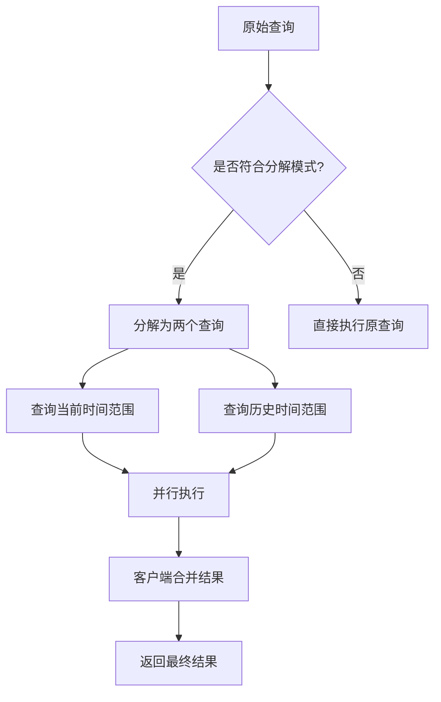
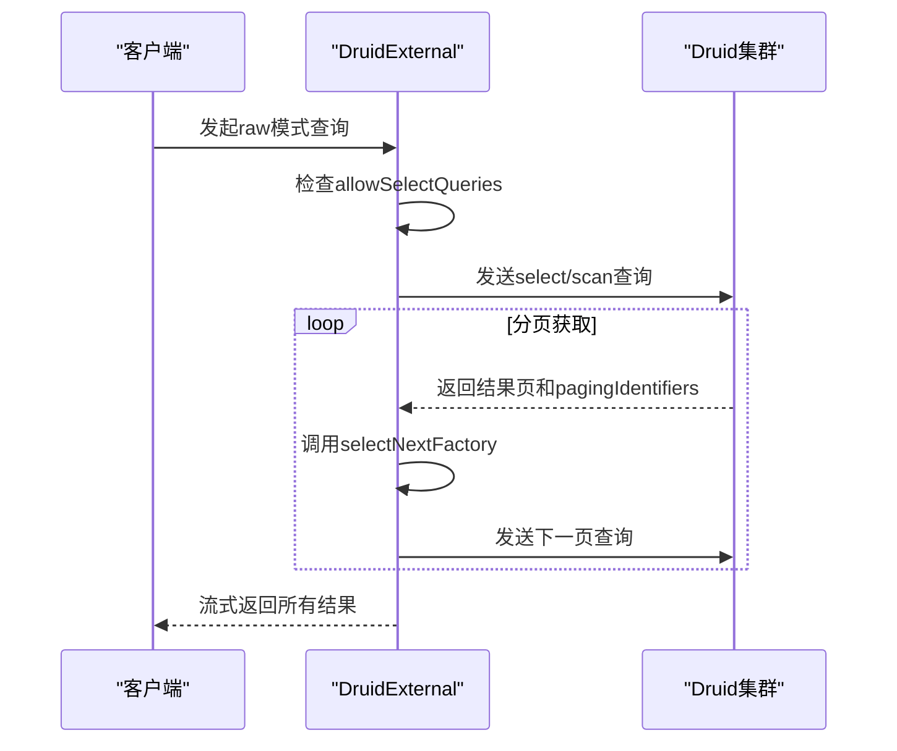
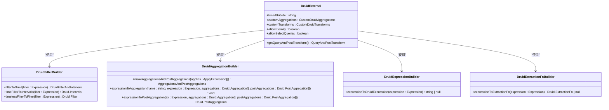

# Druid数据源

<cite>
**本文档引用的文件**   
- [druidExternal.ts](file://src/external/druidExternal.ts)
- [druidFilterBuilder.ts](file://src/external/utils/druidFilterBuilder.ts)
- [druidAggregationBuilder.ts](file://src/external/utils/druidAggregationBuilder.ts)
- [druidExpressionBuilder.ts](file://src/external/utils/druidExpressionBuilder.ts)
- [druidExtractionFnBuilder.ts](file://src/external/utils/druidExtractionFnBuilder.ts)
- [druidTypes.ts](file://src/external/utils/druidTypes.ts)
- [baseExternal.ts](file://src/external/baseExternal.ts)
</cite>

## 目录
1. [简介](#简介)
2. [核心类DruidExternal](#核心类druidexternal)
3. [特有配置项](#特有配置项)
4. [查询优化机制](#查询优化机制)
5. [直接查询模式](#直接查询模式)
6. [Plywood表达式转换](#plywood表达式转换)
7. [性能考量](#性能考量)
8. [代码示例](#代码示例)

## 简介
Druid数据源适配器是连接Plywood框架与Apache Druid数据库的核心组件。它通过`DruidExternal`类实现了对Druid原生查询能力的全面封装，支持从数据源发现、元数据获取到复杂聚合查询的完整生命周期管理。该适配器不仅能够处理标准的分组聚合、时间序列分析，还提供了对子总计（subtotals）查询优化和直接查询模式等高级功能的支持。通过将Plywood表达式（如FilterExpression、SplitExpression）转换为Druid原生的JSON查询结构，该适配器实现了在两种查询语言之间的无缝桥接，为上层应用提供了统一且高效的数据访问接口。

## 核心类DruidExternal
`DruidExternal`类是Druid数据源适配器的核心实现，它继承自`External`抽象基类，并针对Druid数据库的特性进行了专门的扩展和优化。该类负责管理与Druid集群的连接、执行查询、处理结果以及维护数据源的元信息。`DruidExternal`通过一系列静态方法和实例方法，提供了对Druid查询API的完整覆盖，包括数据源列表获取、版本信息查询、元数据发现等。其核心功能围绕着将Plywood的高级表达式转换为Druid可执行的查询对象，并通过流式处理机制高效地返回结果。该类的设计充分考虑了性能和灵活性，支持多种查询模式（如timeseries、topN、groupBy）的自动选择，并通过`querySelection`策略进行控制。

**Section sources**
- [druidExternal.ts](file://src/external/druidExternal.ts#L136-L2087)

## 特有配置项
`DruidExternal`类定义了一系列特有的配置项，用于定制其与Druid数据源的交互行为。`timeAttribute`配置项指定了数据集中表示时间戳的属性名称，默认为`__time`，这是Druid内部用于时间索引的特殊字段。`customAggregations`允许用户定义自定义的聚合函数，这些函数可以映射到Druid的原生聚合器（如hyperUnique、thetaSketch），从而支持复杂的近似计算。`customTransforms`则用于定义自定义的提取函数（extractionFn），可以在查询时对维度值进行转换。`allowEternity`配置项控制是否允许在没有时间过滤条件的情况下执行查询，这对于全量数据扫描场景非常有用。`querySelection`策略决定了查询类型的选择逻辑，支持`any`、`no-top-n`和`group-by-only`三种模式，以适应不同的性能和准确性要求。

**Section sources**
- [druidExternal.ts](file://src/external/druidExternal.ts#L136-L2087)
- [druidTypes.ts](file://src/external/utils/druidTypes.ts#L21-L31)

## 查询优化机制
`DruidExternal`通过`subtotalsSpec`查询优化机制来提升特定场景下的查询效率。当查询涉及多个时间范围的对比分析时，该机制能够将单个复杂的查询分解为多个独立的、更简单的查询，然后在客户端进行合并。这种优化的核心在于`getJoinDecompositionShortcut`方法，它能够识别出符合特定模式的查询（例如，基于时间偏移的对比分析），并将其分解为两个`DruidExternal`实例。第一个实例负责查询当前时间范围的数据，第二个实例则查询历史时间范围的数据。通过这种方式，可以避免在单个查询中使用复杂的`HAVING`子句或嵌套聚合，从而显著降低Druid集群的计算压力。分解后的查询可以并行执行，进一步提升了整体性能。最终，客户端通过`leftJoin`或`fullJoin`操作将两个结果集合并，生成最终的分析报告。



**Diagram sources **
- [druidExternal.ts](file://src/external/druidExternal.ts#L1721-L2087)

## 直接查询模式
`useDirectQuery`直接查询模式是一种绕过标准聚合流程的高效数据访问方式。当`DruidExternal`的`mode`设置为`raw`且`allowSelectQueries`为`true`时，该模式被激活。在此模式下，适配器会生成`select`或`scan`类型的Druid查询，直接从数据源中检索原始事件数据，而不是执行预定义的聚合操作。`select`查询适用于Druid 0.11.0之前的版本，它通过`dimensions`和`metrics`字段指定要返回的列，并利用`pagingSpec`实现分页。`scan`查询则是Druid 0.11.0之后推荐的方式，它通过`virtualColumns`支持更复杂的表达式计算，并以`compactedList`格式返回结果，提高了网络传输效率。`selectNextFactory`工厂函数负责生成分页逻辑，它根据前一次查询的`pagingIdentifiers`和结果数量，动态调整下一页的查询参数，确保能够连续地获取所有数据。



**Diagram sources **
- [druidExternal.ts](file://src/external/druidExternal.ts#L1322-L1720)

## Plywood表达式转换
`DruidExternal`通过一系列构建器类将Plywood表达式转换为Druid原生的JSON查询结构。`druidFilterBuilder`负责将`FilterExpression`转换为Druid的过滤器（filter）对象。它首先将时间相关的过滤条件（如`is`、`overlap`）提取出来，转换为`intervals`参数，其余的过滤条件则转换为`filter`对象，支持`and`、`or`、`selector`、`in`等多种类型。`druidAggregationBuilder`则负责将`ApplyExpression`中的聚合操作转换为Druid的`aggregations`和`postAggregations`。它能够识别`sum`、`count`、`min`、`max`等基本聚合，并将其映射到对应的Druid聚合器（如`doubleSum`、`count`）。对于更复杂的表达式，它会生成`javascript`类型的聚合器。`druidExpressionBuilder`和`druidExtractionFnBuilder`共同处理表达式和提取函数的转换，前者将Plywood表达式编译为Druid的表达式语言（如`timestamp_floor`、`concat`），后者则生成用于维度转换的`extractionFn`（如`timeFormat`、`bucket`）。



**Diagram sources **
- [druidExternal.ts](file://src/external/druidExternal.ts#L136-L2087)
- [druidFilterBuilder.ts](file://src/external/utils/druidFilterBuilder.ts#L54-L489)
- [druidAggregationBuilder.ts](file://src/external/utils/druidAggregationBuilder.ts#L74-L741)
- [druidExpressionBuilder.ts](file://src/external/utils/druidExpressionBuilder.ts#L69-L445)
- [druidExtractionFnBuilder.ts](file://src/external/utils/druidExtractionFnBuilder.ts#L49-L503)

## 性能考量
`DruidExternal`在设计时充分考虑了性能优化。`topNCompatibleSort`方法用于检查排序操作是否与`topN`查询兼容。`topN`查询要求排序的维度必须是分组维度，并且排序表达式不能包含对时间属性的过滤，以确保查询的正确性和效率。该方法通过检查排序引用的名称是否存在于`applies`中，并验证其表达式是否包含时间过滤，来判断兼容性。分页查询通过`selectNextFactory`实现，它利用Druid的`pagingIdentifiers`机制来追踪查询进度。该工厂函数会根据前一次查询的结果长度和`pagingIdentifiers`，动态计算下一页的查询参数，包括更新`pagingIdentifiers`和调整`threshold`，从而实现高效、无遗漏的分页遍历。此外，`nestedGroupByIfNeeded`方法通过生成嵌套的`groupBy`查询，优化了包含重分割（resplit）的复杂聚合操作，避免了在单个查询中处理过多的聚合逻辑。

**Section sources**
- [druidExternal.ts](file://src/external/druidExternal.ts#L136-L2087)

## 代码示例
以下代码示例展示了如何创建和使用`DruidExternal`实例进行数据查询。首先，通过`fromJS`静态方法创建一个`DruidExternal`实例，指定数据源、时间属性和请求器。然后，通过链式调用添加过滤、分组和聚合操作。最后，调用`queryValue`方法执行查询并获取结果。此示例演示了如何查询`wikipedia`数据源中，`channel`为`#en.wikipedia`的编辑次数，并按`cityName`进行分组统计。

```typescript
// 创建DruidExternal实例
const druidExternal = DruidExternal.fromJS({
  engine: 'druid',
  source: 'wikipedia',
  timeAttribute: '__time',
  context: { priority: 1 }
}, requester);

// 构建查询
const query = druidExternal
  .filter($("channel").is("#en.wikipedia"))
  .split($("cityName"), 'city')
  .apply('count', $('').count())
  .sort('$count', 'descending')
  .limit(10);

// 执行查询
const result = await query.queryValue(true, []);
console.log(result);
```

**Section sources**
- [druidExternal.ts](file://src/external/druidExternal.ts#L136-L2087)