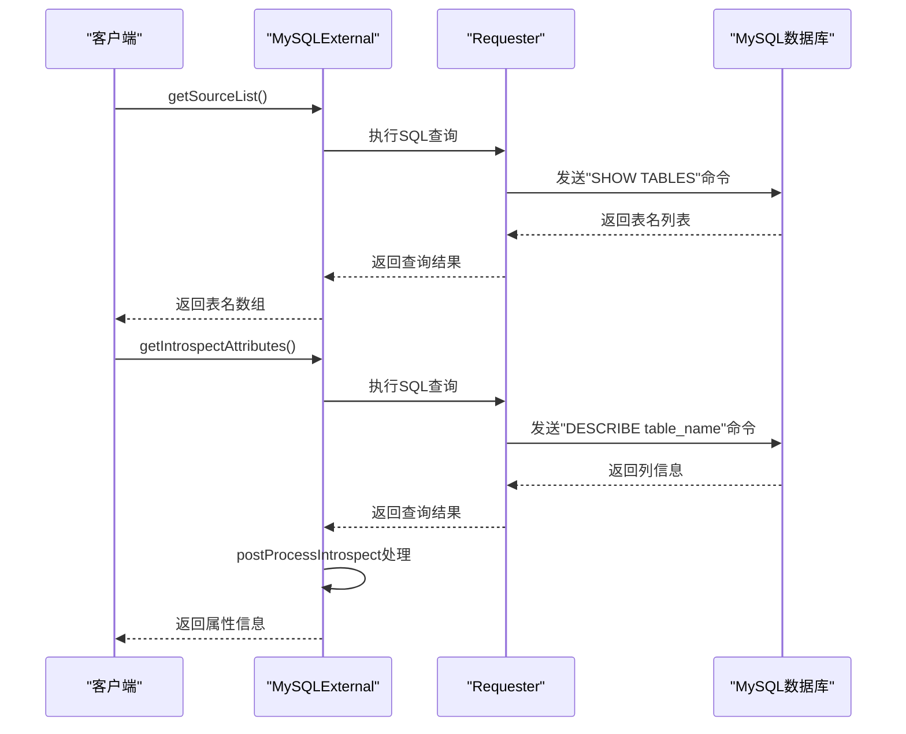
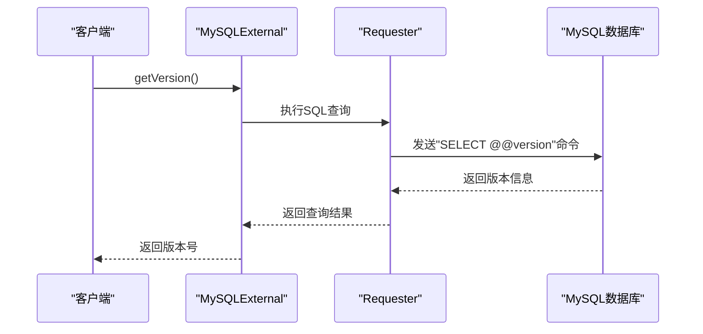
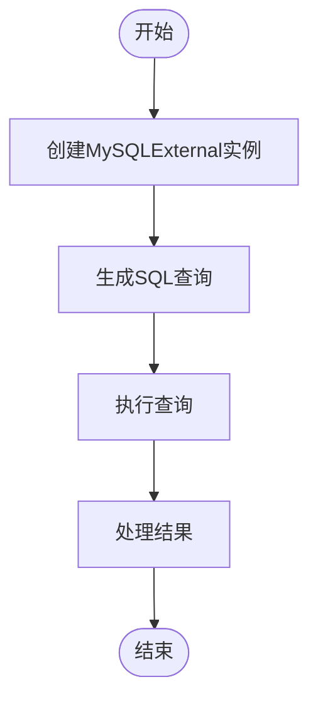

# MySQL数据源

<cite>
**本文档引用的文件**   
- [mySqlExternal.ts](file://src/external/mySqlExternal.ts)
- [mySqlDialect.ts](file://src/dialect/mySqlDialect.ts)
- [sqlExternal.ts](file://src/external/sqlExternal.ts)
- [attributeInfo.ts](file://src/datatypes/attributeInfo.ts)
</cite>

## 目录
1. [简介](#简介)
2. [连接配置](#连接配置)
3. [元数据获取](#元数据获取)
4. [类型系统映射](#类型系统映射)
5. [SQL编译机制](#sql编译机制)
6. [版本检测](#版本检测)
7. [查询示例](#查询示例)

## 简介
MySQL数据源适配器是Plywood框架中的一个关键组件，它通过`MySQLExternal`类实现了与MySQL数据库的集成。该类继承自`SQLExternal`基类，利用`MySQLDialect`将Plywood表达式编译成标准的SQL语句。适配器不仅支持基本的CRUD操作，还提供了元数据获取、类型映射和版本检测等高级功能。通过`postProcessIntrospect`方法，适配器能够解析`DESCRIBE`命令的结果，并将MySQL的原生数据类型（如`varchar`、`int`、`timestamp`）映射到Plywood的类型系统（STRING、NUMBER、TIME）。这种设计使得开发者可以无缝地在Plywood中使用MySQL数据源，而无需关心底层的SQL细节。

**Section sources**
- [mySqlExternal.ts](file://src/external/mySqlExternal.ts#L30-L117)

## 连接配置
`MySQLExternal`类的构造函数接收一个包含连接参数的对象，这些参数包括数据库的主机名、端口、用户名、密码和数据库名称。构造函数通过调用父类`SQLExternal`的构造函数来初始化连接，并设置`MySQLDialect`作为SQL方言处理器。`_ensureEngine`方法确保了连接的引擎类型正确无误，防止了错误的数据库类型被使用。这种设计模式保证了连接的安全性和可靠性，同时也为后续的SQL编译和执行提供了基础。

```mermaid
classDiagram
class MySQLExternal {
+static engine : string
+static type : string
+static fromJS(parameters : ExternalJS, requester : PlywoodRequester<any>) : MySQLExternal
+static postProcessIntrospect(columns : MySQLDescribeRow[]) : Attributes
+static getSourceList(requester : PlywoodRequester<any>) : Promise<string[]>
+static getVersion(requester : PlywoodRequester<any>) : Promise<string>
+constructor(parameters : ExternalValue)
+getIntrospectAttributes() : Promise<Attributes>
}
class SQLExternal {
+static type : string
+dialect : SQLDialect
+constructor(parameters : ExternalValue, dialect : SQLDialect)
+canHandleFilter(filter : FilterExpression) : boolean
+canHandleSort(sort : SortExpression) : boolean
+capability(cap : string) : boolean
+sqlToQuery(sql : string) : any
+getFrom() : string
+getQueryAndPostTransform() : QueryAndPostTransform<string>
+getIntrospectAttributes() : Promise<Attributes>
}
class MySQLDialect {
+static TIME_BUCKETING : Record<string, string>
+static TIME_PART_TO_FUNCTION : Record<string, string>
+static CAST_TO_FUNCTION : {[outputType : string] : {[inputType : string] : string}}
+escapeName(name : string) : string
+escapeLiteral(name : string) : string
+timeToSQL(date : Date) : string
+concatExpression(a : string, b : string) : string
+containsExpression(a : string, b : string) : string
+isNotDistinctFromExpression(a : string, b : string) : string
+castExpression(inputType : PlyType, operand : string, cast : string) : string
+utcToWalltime(operand : string, timezone : Timezone) : string
+walltimeToUTC(operand : string, timezone : Timezone) : string
+timeFloorExpression(operand : string, duration : Duration, timezone : Timezone) : string
+timeBucketExpression(operand : string, duration : Duration, timezone : Timezone) : string
+timePartExpression(operand : string, part : string, timezone : Timezone) : string
+timeShiftExpression(operand : string, duration : Duration, timezone : Timezone) : string
+extractExpression(operand : string, regexp : string) : string
+indexOfExpression(str : string, substr : string) : string
}
MySQLExternal --> SQLExternal : "继承"
MySQLExternal --> MySQLDialect : "使用"
SQLExternal --> MySQLDialect : "使用"
```

**Diagram sources **
- [mySqlExternal.ts](file://src/external/mySqlExternal.ts#L30-L117)
- [sqlExternal.ts](file://src/external/sqlExternal.ts#L41-L198)
- [mySqlDialect.ts](file://src/dialect/mySqlDialect.ts#L21-L172)

**Section sources**
- [mySqlExternal.ts](file://src/external/mySqlExternal.ts#L30-L117)
- [sqlExternal.ts](file://src/external/sqlExternal.ts#L41-L198)

## 元数据获取
`MySQLExternal`类提供了`getSourceList`静态方法，用于获取数据库中的所有表名。该方法通过执行`SHOW TABLES` SQL命令来获取表名列表，并将结果转换为字符串数组。`getIntrospectAttributes`方法则用于获取指定表的列信息，它通过执行`DESCRIBE`命令来获取表的结构信息，并调用`postProcessIntrospect`方法对结果进行处理。这些方法为Plywood提供了必要的元数据，使得框架能够正确地解析和处理MySQL数据源。



**Diagram sources **
- [mySqlExternal.ts](file://src/external/mySqlExternal.ts#L30-L117)

**Section sources**
- [mySqlExternal.ts](file://src/external/mySqlExternal.ts#L30-L117)

## 类型系统映射
`postProcessIntrospect`方法是`MySQLExternal`类的核心功能之一，它负责将MySQL的原生数据类型映射到Plywood的类型系统。该方法接收`DESCRIBE`命令的结果，即一个包含列信息的数组，然后遍历每一行，根据列的类型进行映射。例如，`datetime`、`timestamp`和`date`类型被映射为`TIME`，`varchar`、`enum`、`text`和`blob`类型被映射为`STRING`，`tinyint(1)`被映射为`BOOLEAN`，而各种整数和浮点数类型则被映射为`NUMBER`。这种映射机制确保了Plywood能够正确地处理MySQL数据源中的不同类型的数据。

```mermaid
flowchart TD
Start([开始]) --> ProcessColumns["处理列信息"]
ProcessColumns --> CheckType{"检查类型"}
CheckType --> |datetime, timestamp, date| MapToTime["映射为TIME"]
CheckType --> |varchar, enum, text, blob| MapToString["映射为STRING"]
CheckType --> |tinyint(1)| MapToBoolean["映射为BOOLEAN"]
CheckType --> |int, bigint, decimal, float, double| MapToNumber["映射为NUMBER"]
CheckType --> |其他| ReturnNull["返回null"]
MapToTime --> End([结束])
MapToString --> End
MapToBoolean --> End
MapToNumber --> End
ReturnNull --> End
```

**Diagram sources **
- [mySqlExternal.ts](file://src/external/mySqlExternal.ts#L30-L117)

**Section sources**
- [mySqlExternal.ts](file://src/external/mySqlExternal.ts#L30-L117)

## SQL编译机制
`MySQLDialect`类是`MySQLExternal`类的SQL方言处理器，它负责将Plywood表达式编译成标准的SQL语句。该类提供了多种方法，如`escapeName`、`escapeLiteral`、`timeToSQL`等，用于处理SQL语句中的各种元素。`timeFloorExpression`、`timeBucketExpression`、`timePartExpression`等方法则用于处理时间相关的表达式。这些方法确保了Plywood表达式能够被正确地转换为MySQL支持的SQL语句，从而实现了Plywood与MySQL的无缝集成。

```mermaid
classDiagram
class MySQLDialect {
+static TIME_BUCKETING : Record<string, string>
+static TIME_PART_TO_FUNCTION : Record<string, string>
+static CAST_TO_FUNCTION : {[outputType : string] : {[inputType : string] : string}}
+escapeName(name : string) : string
+escapeLiteral(name : string) : string
+timeToSQL(date : Date) : string
+concatExpression(a : string, b : string) : string
+containsExpression(a : string, b : string) : string
+isNotDistinctFromExpression(a : string, b : string) : string
+castExpression(inputType : PlyType, operand : string, cast : string) : string
+utcToWalltime(operand : string, timezone : Timezone) : string
+walltimeToUTC(operand : string, timezone : Timezone) : string
+timeFloorExpression(operand : string, duration : Duration, timezone : Timezone) : string
+timeBucketExpression(operand : string, duration : Duration, timezone : Timezone) : string
+timePartExpression(operand : string, part : string, timezone : Timezone) : string
+timeShiftExpression(operand : string, duration : Duration, timezone : Timezone) : string
+extractExpression(operand : string, regexp : string) : string
+indexOfExpression(str : string, substr : string) : string
}
class SQLDialect {
+setTable(name : string | null) : void
+nullConstant() : string
+constantGroupBy() : string
+escapeName(name : string) : string
+maybeNamespacedName(name : string) : string
+escapeLiteral(name : string) : string
+booleanToSQL(bool : boolean) : string
+floatDivision(numerator : string, denominator : string) : string
+numberOrTimeToSQL(x : number | Date) : string
+numberToSQL(num : number) : string
+dateToSQLDateString(date : Date) : string
+timeToSQL(date : Date) : string
+aggregateFilterIfNeeded(inputSQL : string, expressionSQL : string, elseSQL : string | null = null) : string
+concatExpression(a : string, b : string) : string
+containsExpression(a : string, b : string) : string
+substrExpression(a : string, position : number, length : number) : string
+coalesceExpression(a : string, b : string) : string
+ifThenElseExpression(a : string, b : string, c : string | null = null) : string
+isNotDistinctFromExpression(a : string, b : string) : string
+regexpExpression(expression : string, regexp : string) : string
+inExpression(operand : string, start : string, end : string, bounds : string)
+castExpression(inputType : PlyType, operand : string, cast : PlyTypeSimple) : string
+lengthExpression(a : string) : string
+lookupExpression(_base : string, _lookup : string) : string
+timeFloorExpression(operand : string, duration : Duration, timezone : Timezone) : string
+timeBucketExpression(operand : string, duration : Duration, timezone : Timezone) : string
+timePartExpression(operand : string, part : string, timezone : Timezone) : string
+timeShiftExpression(operand : string, duration : Duration, timezone : Timezone) : string
+extractExpression(operand : string, regexp : string) : string
+indexOfExpression(str : string, substr : string) : string
}
MySQLDialect --> SQLDialect : "继承"
```

**Diagram sources **
- [mySqlDialect.ts](file://src/dialect/mySqlDialect.ts#L21-L172)
- [baseDialect.ts](file://src/dialect/baseDialect.ts#L21-L172)

**Section sources**
- [mySqlDialect.ts](file://src/dialect/mySqlDialect.ts#L21-L172)

## 版本检测
`getVersion`静态方法用于获取MySQL数据库的版本信息。该方法通过执行`SELECT @@version` SQL命令来获取版本号，并将结果返回。这个功能对于确保Plywood与特定版本的MySQL兼容性非常重要，特别是在使用某些特定于版本的SQL特性时。通过版本检测，开发者可以确保他们的应用程序在目标数据库上正常运行。



**Diagram sources **
- [mySqlExternal.ts](file://src/external/mySqlExternal.ts#L30-L117)

**Section sources**
- [mySqlExternal.ts](file://src/external/mySqlExternal.ts#L30-L117)

## 查询示例
以下是一个从MySQL查询数据的完整示例。首先，创建一个`MySQLExternal`实例，然后使用`getQueryAndPostTransform`方法生成SQL查询语句，最后通过`requester`执行查询并处理结果。



**Diagram sources **
- [mySqlExternal.ts](file://src/external/mySqlExternal.ts#L30-L117)

**Section sources**
- [mySqlExternal.ts](file://src/external/mySqlExternal.ts#L30-L117)