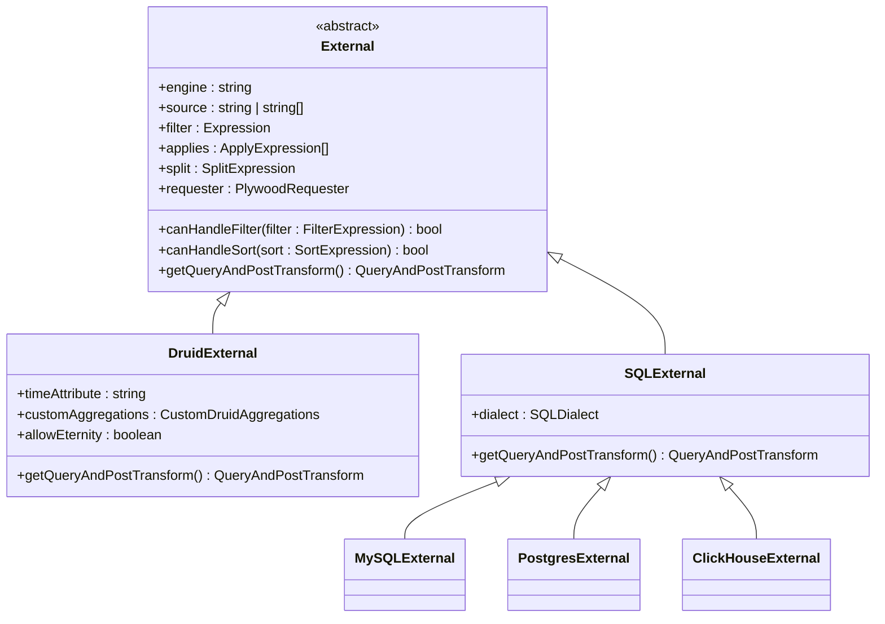
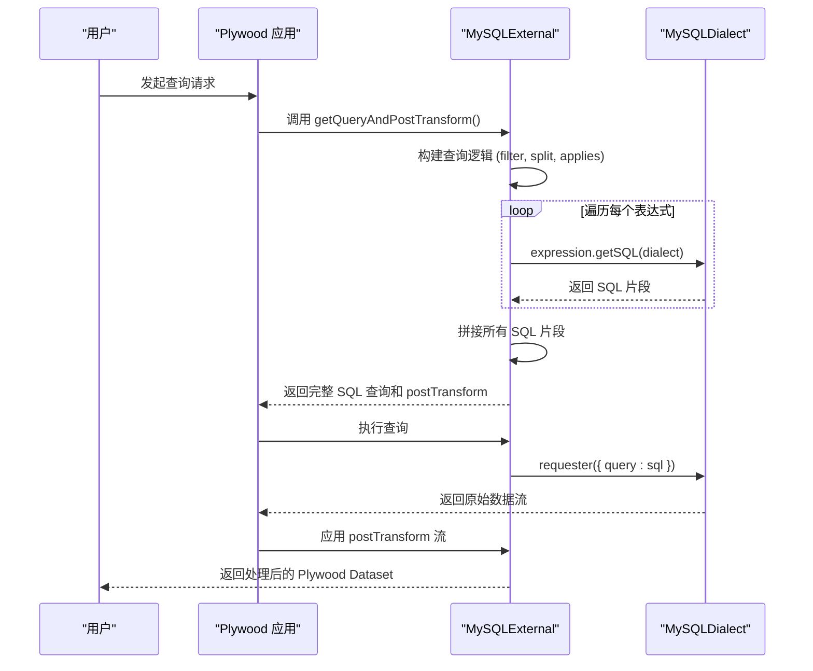
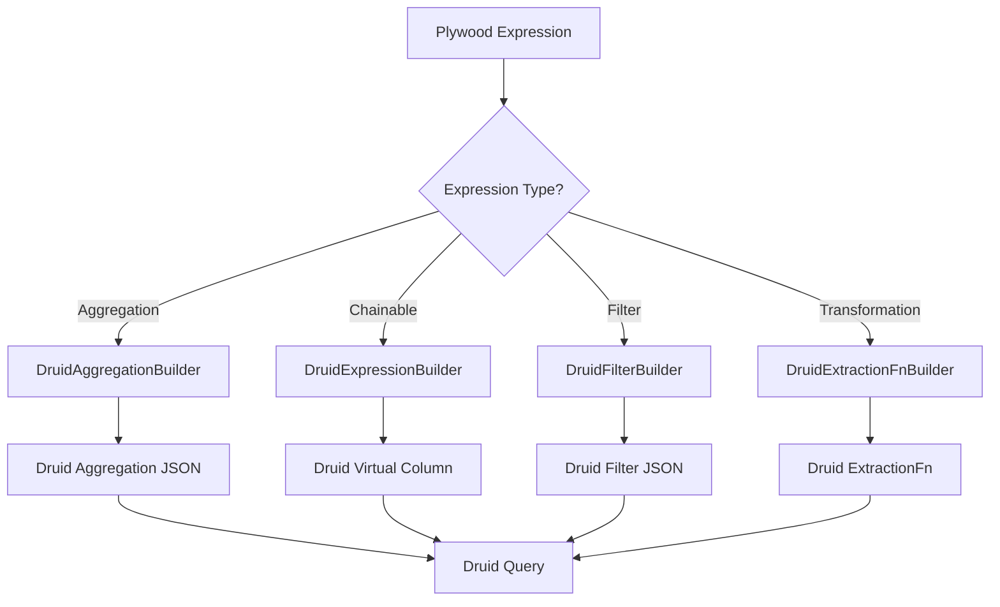

# 外部数据源

<cite>
**本文档引用的文件**
- [baseExternal.ts](file://src/external/baseExternal.ts)
- [druidExternal.ts](file://src/external/druidExternal.ts)
- [mySqlExternal.ts](file://src/external/mySqlExternal.ts)
- [postgresExternal.ts](file://src/external/postgresExternal.ts)
- [clickHouseExternal.ts](file://src/external/clickHouseExternal.ts)
- [baseDialect.ts](file://src/dialect/baseDialect.ts)
- [druidDialect.ts](file://src/dialect/druidDialect.ts)
- [mySqlDialect.ts](file://src/dialect/mySqlDialect.ts)
- [postgresDialect.ts](file://src/dialect/postgresDialect.ts)
- [clickHouseDialect.ts](file://src/dialect/clickHouseDialect.ts)
- [druidAggregationBuilder.ts](file://src/external/utils/druidAggregationBuilder.ts)
- [druidExpressionBuilder.ts](file://src/external/utils/druidExpressionBuilder.ts)
- [druidExtractionFnBuilder.ts](file://src/external/utils/druidExtractionFnBuilder.ts)
- [druidFilterBuilder.ts](file://src/external/utils/druidFilterBuilder.ts)
- [druidHavingFilterBuilder.ts](file://src/external/utils/druidHavingFilterBuilder.ts)
- [druidTypes.ts](file://src/external/utils/druidTypes.ts)
- [subtotalsSpecExecutor.ts](file://src/expressions/subtotals/subtotalsSpecExecutor.ts)
- [subtotalsSpecQueryBuilder.ts](file://src/expressions/subtotals/subtotalsSpecQueryBuilder.ts)
- [subtotalsSpecResultProcessor.ts](file://src/expressions/subtotals/subtotalsSpecResultProcessor.ts)
- [sqlExternal.ts](file://src/external/sqlExternal.ts)
</cite>

## 目录
1. [简介](#简介)
2. [抽象基类设计](#抽象基类设计)
3. [查询方言与编译机制](#查询方言与编译机制)
4. [具体适配器实现](#具体适配器实现)
5. [Druid 适配器高级特性](#druid-适配器高级特性)
6. [集成示例](#集成示例)

## 简介

本文档详细阐述了Plywood库中外部数据源适配器的设计与实现。核心在于`baseExternal.ts`中定义的抽象基类`External`，它为连接和查询各种外部数据库（如Druid, MySQL, PostgreSQL, ClickHouse）提供了统一的接口。文档将深入解析该基类的设计原理，展示如何为不同数据库实现具体的适配器，并解释数据源如何与查询方言（dialect）协同工作，将Plywood表达式编译成特定数据库的原生查询语言（如Druid JSON查询或SQL）。特别地，文档将重点介绍`druidExternal.ts`中对`subtotalsSpec`和直接查询（`useDirectQuery`）的支持，以及相关的配置选项、连接参数和性能考量。

**Section sources**
- [baseExternal.ts](file://src/external/baseExternal.ts#L0-L799)

## 抽象基类设计

`External`类是所有外部数据源适配器的基石，它定义了一个抽象基类，封装了与外部数据源交互的核心逻辑。该设计遵循了面向对象的继承和多态原则，允许为不同的数据库引擎创建具体的子类。

### 核心属性与方法

`External`类通过`ExternalValue`接口定义了一系列核心属性，这些属性在所有具体适配器中都是通用的。关键属性包括：
- **`engine`**: 指定数据源的类型，如`druid`, `mysql`等。
- **`source`**: 指定数据源的名称或标识符，例如数据库表名或Druid数据源名。
- **`filter`**: 一个Plywood `Expression`，用于在查询前对数据进行过滤。
- **`applies`**: 一个应用表达式（`ApplyExpression`）列表，用于定义在查询结果上执行的聚合或计算操作。
- **`split`**: 一个分割表达式（`SplitExpression`），用于定义数据的分组维度。
- **`requester`**: 一个`PlywoodRequester`，负责执行实际的HTTP请求或数据库查询。

该类还定义了多个抽象方法和受保护方法，强制子类实现特定功能，同时提供可重用的通用逻辑：
- **`getQueryAndPostTransform()`**: 这是一个核心抽象方法，要求子类实现。它负责将Plywood的查询逻辑（由`filter`, `split`, `applies`等构成）转换为目标数据库的原生查询语句（如SQL或Druid JSON），并返回一个包含查询和后处理转换流（`postTransform`）的对象。
- **`canHandleFilter()` 和 `canHandleSort()`**: 这些方法允许适配器声明其对特定过滤条件和排序操作的支持能力，为查询优化提供依据。
- **`inflateArrays()` 和 `getInteligentInflater()`**: 这些是通用的后处理工具，用于在数据流中将原始的字符串或数字数组转换为Plywood的`Set`对象，并根据数据类型（如时间、数值范围）自动应用正确的解析器。

这种设计模式将通用的、与数据库无关的逻辑（如数据流处理、类型推断）与特定于数据库的逻辑（如查询语法生成）清晰地分离，极大地提高了代码的可维护性和可扩展性。



**Diagram sources**
- [baseExternal.ts](file://src/external/baseExternal.ts#L0-L799)
- [druidExternal.ts](file://src/external/druidExternal.ts#L0-L799)
- [sqlExternal.ts](file://src/external/sqlExternal.ts#L0-L199)

**Section sources**
- [baseExternal.ts](file://src/external/baseExternal.ts#L0-L799)

## 查询方言与编译机制

Plywood通过“查询方言”（Query Dialect）机制来解决不同数据库查询语言（SQL方言、JSON查询等）之间的差异。这一机制的核心是`SQLDialect`抽象类及其子类，它们充当了Plywood表达式与目标数据库原生语法之间的翻译器。

### 抽象方言基类

`baseDialect.ts`文件定义了`SQLDialect`抽象类。它为所有SQL方言提供了统一的接口，定义了一系列必须由具体方言实现的抽象方法，例如：
- **`timeToSQL(date: Date)`**: 将JavaScript的`Date`对象转换为特定数据库的日期时间字符串。
- **`concatExpression(a: string, b: string)`**: 生成连接两个字符串的SQL表达式（如`CONCAT(a, b)`或`a || b`）。
- **`timeBucketExpression(operand: string, duration: Duration, timezone: Timezone)`**: 生成对时间字段进行分桶的SQL表达式（如`DATE_TRUNC('month', time)`）。
- **`castExpression(inputType: PlyType, operand: string, cast: PlyTypeSimple)`**: 生成类型转换的SQL表达式。

### 具体方言实现

针对不同的数据库，Plywood实现了具体的方言类：
- **`MySQLDialect`**: 为MySQL生成语法，例如使用`CONCAT()`函数进行字符串连接，使用`CONVERT_TZ()`处理时区。
- **`PostgresDialect`**: 为PostgreSQL生成语法，例如使用`||`操作符进行字符串连接，使用`DATE_TRUNC()`进行时间分桶。
- **`ClickHouseDialect`**: 为ClickHouse生成语法，例如使用`CONCAT()`函数和`toStartOfMonth()`等特定函数。
- **`DruidDialect`**: 虽然Druid使用JSON查询而非SQL，但`DruidDialect`类仍然遵循相同的模式，将Plywood表达式编译成Druid查询中`virtualColumns`或`filter`字段所需的JavaScript表达式。

### 编译过程

当一个具体的`External`适配器（如`MySQLExternal`）需要生成查询时，它会使用其关联的`dialect`实例。例如，在`sqlExternal.ts`中，`getQueryAndPostTransform`方法会调用`apply.getSQL(dialect)`，这会触发`ApplyExpression`对象使用传入的方言实例来生成其对应的SQL片段。整个查询语句就是通过这种方式，由各个表达式组件的SQL片段拼接而成。这种设计使得Plywood的核心查询逻辑与底层数据库的语法完全解耦，只需为新数据库实现一个新的`SQLDialect`子类即可轻松集成。



**Diagram sources**
- [baseDialect.ts](file://src/dialect/baseDialect.ts#L0-L174)
- [mySqlDialect.ts](file://src/dialect/mySqlDialect.ts#L0-L174)
- [postgresDialect.ts](file://src/dialect/postgresDialect.ts#L0-L160)
- [clickHouseDialect.ts](file://src/dialect/clickHouseDialect.ts#L0-L163)
- [druidDialect.ts](file://src/dialect/druidDialect.ts#L0-L177)
- [sqlExternal.ts](file://src/external/sqlExternal.ts#L0-L199)

**Section sources**
- [baseDialect.ts](file://src/dialect/baseDialect.ts#L0-L174)
- [mySqlDialect.ts](file://src/dialect/mySqlDialect.ts#L0-L174)
- [postgresDialect.ts](file://src/dialect/postgresDialect.ts#L0-L160)
- [clickHouseDialect.ts](file://src/dialect/clickHouseDialect.ts#L0-L163)
- [druidDialect.ts](file://src/dialect/druidDialect.ts#L0-L177)

## 具体适配器实现

基于`External`基类和`SQLDialect`机制，Plywood为多种数据库提供了具体的适配器实现。这些适配器主要通过继承`SQLExternal`（适用于SQL数据库）或直接继承`External`（如`DruidExternal`）来构建。

### SQL 数据库适配器

`MySQLExternal`, `PostgresExternal`, 和 `ClickHouseExternal`都继承自`SQLExternal`。它们的实现非常相似，主要区别在于所使用的方言实例：
- **`MySQLExternal`**: 在构造函数中传入`new MySQLDialect()`。
- **`PostgresExternal`**: 在构造函数中传入`new PostgresDialect()`。
- **`ClickHouseExternal`**: 在构造函数中传入`new ClickHouseDialect()`。

它们的`fromJS`静态方法负责从JSON配置创建实例，而`getIntrospectAttributes`方法则负责通过执行`DESCRIBE`或`SHOW COLUMNS`等元数据查询来自动发现表结构，并将数据库的原生类型（如`VARCHAR`, `TIMESTAMP`）映射为Plywood的类型（如`STRING`, `TIME`）。

### Druid 适配器

`DruidExternal`是唯一不继承自`SQLExternal`的适配器，因为它需要与Druid的JSON API进行交互。它的实现更为复杂，因为它需要将Plywood的表达式编译成Druid查询的各个部分，如`aggregations`, `postAggregations`, `dimensions`, 和 `filter`。

为了实现这一复杂的编译过程，`DruidExternal`依赖于一组专门的构建器（Builder）工具：
- **`DruidAggregationBuilder`**: 负责将Plywood的聚合表达式（如`sum`, `countDistinct`）转换为Druid的`aggregation`和`postAggregation` JSON对象。
- **`DruidExpressionBuilder`**: 负责将Plywood的链式表达式（如`add`, `multiply`, `substring`）转换为Druid查询中`virtualColumns`所需的JavaScript表达式。
- **`DruidFilterBuilder`**: 负责将Plywood的过滤表达式转换为Druid的`filter` JSON对象。
- **`DruidExtractionFnBuilder`**: 负责将Plywood的转换表达式（如`timeBucket`, `transformCase`）转换为Druid的`extractionFn`，用于在分组时对维度值进行预处理。

这种分而治之的设计使得`DruidExternal`的代码结构清晰，每个构建器专注于一个特定的编译任务。



**Diagram sources**
- [mySqlExternal.ts](file://src/external/mySqlExternal.ts#L0-L120)
- [postgresExternal.ts](file://src/external/postgresExternal.ts#L0-L139)
- [clickHouseExternal.ts](file://src/external/clickHouseExternal.ts#L0-L106)
- [druidExternal.ts](file://src/external/druidExternal.ts#L0-L799)
- [druidAggregationBuilder.ts](file://src/external/utils/druidAggregationBuilder.ts#L0-L742)
- [druidExpressionBuilder.ts](file://src/external/utils/druidExpressionBuilder.ts#L0-L446)
- [druidFilterBuilder.ts](file://src/external/utils/druidFilterBuilder.ts#L0-L490)
- [druidExtractionFnBuilder.ts](file://src/external/utils/druidExtractionFnBuilder.ts#L0-L504)

**Section sources**
- [mySqlExternal.ts](file://src/external/mySqlExternal.ts#L0-L120)
- [postgresExternal.ts](file://src/external/postgresExternal.ts#L0-L139)
- [clickHouseExternal.ts](file://src/external/clickHouseExternal.ts#L0-L106)
- [druidExternal.ts](file://src/external/druidExternal.ts#L0-L799)

## Druid 适配器高级特性

`druidExternal.ts`不仅实现了基本的查询功能，还支持一些高级特性，以优化查询性能和满足复杂的分析需求。

### SubtotalsSpec 支持

`subtotalsSpec`是Druid的一个强大功能，它允许在一个`groupBy`查询中同时返回所有层级的汇总数据（例如，按国家、省份、城市的销售额，以及各级别的总计）。Plywood通过`subtotalsSpec`模块支持此功能。

该功能的实现分为三个主要部分：
1.  **查询构建 (`subtotalsSpecQueryBuilder.ts`)**: 该模块分析原始的查询计划（可能包含多个`topN`或`timeseries`查询），并将它们合并成一个单一的、包含`subtotalsSpec`字段的`groupBy`查询。`subtotalsSpec`是一个二维数组，定义了所有需要的分组层级。
2.  **查询执行 (`subtotalsSpecExecutor.ts`)**: 该模块负责执行合并后的`groupBy`查询以及一个可选的`timeseries`总计查询。它使用`DruidExternal`的`requester`发送请求，并处理返回的数据流。
3.  **结果处理 (`subtotalsSpecResultProcessor.ts`)**: 该模块接收扁平化的查询结果，并将其重新组织成一个具有层级结构的Plywood `Dataset`。它会将`timeseries`查询的总计行合并到`groupBy`结果中，并根据`subtotalsSpec`的定义构建嵌套的`SPLIT`字段，从而在前端应用中实现高效的钻取分析。

### 直接查询 (`useDirectQuery`)

`DruidExternal`类通过`allowSelectQueries`配置项支持直接查询。当此选项启用时，适配器可以处理`mode`为`raw`的查询，这通常对应于Druid的`scan`查询类型。`scan`查询会返回原始的、未聚合的数据行，适用于需要获取明细数据的场景。`canHandleFilter`和`canHandleSort`方法在此模式下会施加限制，例如`scan`查询只能按时间升序排序。

### 配置选项与性能考量

`DruidExternal`提供了丰富的配置选项，这些选项直接影响查询的性能和行为：
- **`timeAttribute`**: 指定数据源中的时间戳字段名（默认为`__time`），这对于时间过滤和分桶至关重要。
- **`rollup`**: 指示数据源是否已进行预聚合。如果为`true`，某些聚合操作（如`count`）会被优化为对预聚合计数器的求和。
- **`exactResultsOnly`**: 如果设置为`true`，则会禁用近似聚合（如`hyperUnique`），确保结果的精确性，但可能牺牲性能。
- **`context`**: 允许向Druid查询中注入自定义的上下文参数，可用于查询超时、优先级设置或自定义扩展。
- **`querySelection`**: 控制查询类型的选择策略，例如`"no-top-n"`会强制使用`groupBy`而非`topN`，以避免`topN`查询的近似性。

**Section sources**
- [druidExternal.ts](file://src/external/druidExternal.ts#L0-L799)
- [subtotalsSpecQueryBuilder.ts](file://src/expressions/subtotals/subtotalsSpecQueryBuilder.ts#L0-L261)
- [subtotalsSpecExecutor.ts](file://src/expressions/subtotals/subtotalsSpecExecutor.ts#L0-L236)
- [subtotalsSpecResultProcessor.ts](file://src/expressions/subtotals/subtotalsSpecResultProcessor.ts#L0-L513)

## 集成示例

以下是一个使用`DruidExternal`进行集成的简化示例：

```typescript
// 1. 创建一个 requester，用于发送 HTTP 请求到 Druid Broker
const myRequester = (request) => {
  return fetch('http://druid-broker:8082/druid/v2/', {
    method: 'POST',
    body: JSON.stringify(request.query),
    headers: { 'Content-Type': 'application/json' }
  }).then(res => res.json());
};

// 2. 创建 DruidExternal 实例
const myDruidExternal = new DruidExternal({
  engine: 'druid',
  source: 'wikipedia',
  timeAttribute: 'timestamp',
  filter: $('timestamp').in(new TimeRange({ start: '2023-01-01', end: '2023-01-02' })),
  split: $('country').split($('city')),
  applies: [ $('edits').sum().apply('totalEdits') ],
  requester: myRequester,
  allowEternity: false,
  context: { 'queryId': 'my-query-123' }
});

// 3. 获取查询和后处理流
const { query, postTransform } = myDruidExternal.getQueryAndPostTransform();

// 4. 执行查询并处理结果
myRequester({ query }).then(rawData => {
  const resultStream = pipe(rawData, postTransform);
  // resultStream 现在是一个包含处理后数据的流
});
```

**Section sources**
- [druidExternal.ts](file://src/external/druidExternal.ts#L0-L799)
- [baseExternal.ts](file://src/external/baseExternal.ts#L0-L799)