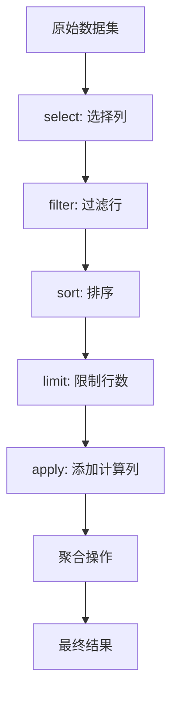
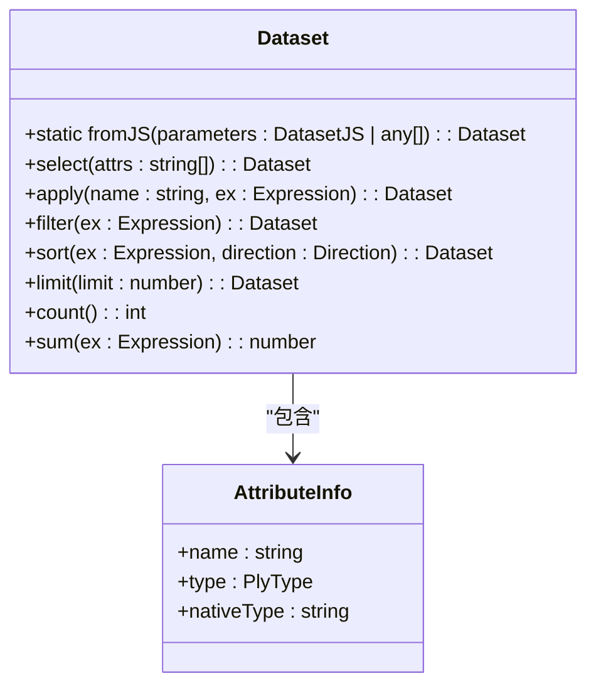

# 数据集

<cite>
**Referenced Files in This Document**   
- [dataset.ts](file://src/datatypes/dataset.ts)
- [attributeInfo.ts](file://src/datatypes/attributeInfo.ts)
- [dataset.mocha.js](file://test/datatypes/dataset.mocha.js)
- [test_execute_subtotals_fix.js](file://tests/subtotals/test_execute_subtotals_fix.js)
</cite>

## 目录
1. [简介](#简介)
2. [核心属性](#核心属性)
3. [操作方法](#操作方法)
4. [查询执行过程](#查询执行过程)
5. [数据集创建与操作示例](#数据集创建与操作示例)
6. [类型系统集成](#类型系统集成)
7. [生命周期与内存管理](#生命周期与内存管理)
8. [性能优化建议](#性能优化建议)

## 简介

Plywood数据集类型是该框架中的核心数据结构，用于表示和操作多维数据。`Dataset`类提供了一套完整的API来处理数据的转换、过滤、排序和聚合操作。该类设计为不可变对象，所有操作都会返回新的数据集实例，确保了数据的一致性和可预测性。

数据集在Plywood框架中扮演着关键角色，作为数据查询和分析的基础单元。它不仅能够存储扁平化的数据行，还支持嵌套的数据结构，使得复杂的数据关系能够被自然地表达和处理。通过链式调用的方式，开发者可以构建复杂的数据处理管道，实现从原始数据到分析结果的完整转换流程。

**Section sources**
- [dataset.ts](file://src/datatypes/dataset.ts#L313-L1425)

## 核心属性

`Dataset`类的核心属性包括`attributes`、`keys`和`data`，这些属性共同定义了数据集的结构和内容。

`attributes`属性是一个`Attributes`数组，每个元素都是一个`AttributeInfo`对象，描述了数据集中某一列的元信息，包括名称、数据类型等。当创建数据集时，如果未显式提供属性信息，系统会自动通过`getAttributesFromData`方法对数据进行类型推断。该方法会遍历数据样本，根据值的类型（如数字、字符串、日期等）自动确定列的类型，并按照预定义的类型顺序进行排序。

`keys`属性是一个字符串数组，用于标识数据集的键列。在进行数据连接（join）等操作时，键列起到了关键作用。空的键数组表示该数据集没有特定的键约束。

`data`属性是核心数据存储，包含一个`Datum`对象数组，每个`Datum`代表数据集中的一行记录。`Datum`本质上是一个键值对的映射，其中键是属性名称，值是对应的数据。这种设计使得数据集能够灵活地处理各种数据结构，包括嵌套的子数据集。

**Section sources**
- [dataset.ts](file://src/datatypes/dataset.ts#L481-L531)
- [attributeInfo.ts](file://src/datatypes/attributeInfo.ts#L0-L231)

## 操作方法

`Dataset`类提供了丰富的操作方法，主要分为两类：数据转换操作和聚合操作。

数据转换操作包括`select`、`apply`、`filter`、`sort`和`limit`。`select`方法用于选择数据集中的特定列，返回一个只包含指定列的新数据集。`apply`方法用于添加新列，它接受一个表达式作为参数，该表达式会被应用于每一行数据以计算新列的值。`filter`方法根据给定的条件过滤数据行，只保留满足条件的记录。`sort`方法对数据进行排序，支持升序和降序两种排序方向。`limit`方法则限制结果集的行数，常用于分页或性能优化。

聚合操作包括`count`、`sum`、`average`、`min`、`max`、`countDistinct`、`quantile`和`collect`。这些方法对数据集进行统计计算，返回单个数值结果。例如，`sum`方法计算指定列的总和，`average`方法计算平均值，`countDistinct`方法计算不同值的数量。`collect`方法则返回一个包含所有值的集合。

**Diagram sources**
- [dataset.ts](file://src/datatypes/dataset.ts#L583-L889)

## 查询执行过程

数据集在查询执行过程中扮演着核心角色，通过链式调用实现复杂的数据转换和分析。查询执行遵循惰性求值的原则，只有在需要结果时才会真正执行计算。

查询执行过程从一个数据集实例开始，通过连续调用操作方法构建查询管道。每个操作方法都返回一个新的数据集实例，这个新实例包含了执行该操作所需的所有信息。例如，当调用`filter`方法时，返回的数据集会记录过滤条件，但不会立即执行过滤操作。

真正的执行发生在需要获取结果时，如调用`toJS`、`toCSV`或任何聚合方法。此时，系统会遍历整个操作链，从原始数据开始，依次应用每个转换操作。对于嵌套数据集，执行过程会递归地处理子数据集。

数据集还支持外部数据源的集成，通过`getReadyExternals`和`applyReadyExternals`方法，可以将外部查询结果合并到数据集中。这使得Plywood能够处理分布式数据源，将远程查询结果无缝集成到本地数据处理流程中。

**Section sources**
- [dataset.ts](file://src/datatypes/dataset.ts#L927-L1050)

## 数据集创建与操作示例

数据集可以通过`fromJS`静态方法从JavaScript对象创建。该方法接受一个包含`data`数组的参数对象，也可以包含`attributes`和`keys`信息。如果未提供属性信息，系统会自动推断。

**Diagram sources**
- [dataset.ts](file://src/datatypes/dataset.ts#L313-L1425)
- [attributeInfo.ts](file://src/datatypes/attributeInfo.ts#L0-L231)

**Section sources**
- [dataset.mocha.js](file://test/datatypes/dataset.mocha.js#L0-L37)
- [test_execute_subtotals_fix.js](file://tests/subtotals/test_execute_subtotals_fix.js#L29-L92)

## 类型系统集成

`Dataset`类通过`getFullType`方法实现了与类型系统的深度集成。该方法返回一个`DatasetFullType`对象，描述了数据集的完整类型信息，包括所有列的类型以及嵌套数据集的类型结构。

`getFullType`方法首先检查数据集是否已经过类型推断，如果没有则抛出异常。然后遍历所有属性，对于普通类型的列，直接记录其类型；对于嵌套数据集类型的列，递归调用子数据集的`getFullType`方法获取其完整类型信息。这种递归机制使得系统能够处理任意深度的嵌套数据结构。

类型信息在查询优化和错误检测中起着重要作用。在执行查询前，系统可以验证表达式与数据类型是否匹配，避免运行时错误。同时，类型信息也为IDE提供了代码补全和语法检查的支持。

**Section sources**
- [dataset.ts](file://src/datatypes/dataset.ts#L533-L587)

## 生命周期与内存管理

`Dataset`类的生命周期从创建开始，到不再被引用结束。由于其不可变的设计，每个操作都会创建新的实例，这虽然保证了数据一致性，但也带来了内存开销。

内存管理方面，数据集采用引用传递的方式存储数据。当创建新数据集时，如果未修改原始数据，会直接引用原始数据数组，避免不必要的内存复制。只有在数据被修改时，才会创建新的数据副本。

为了优化内存使用，数据集提供了`hide`方法，可以标记数据集为"隐藏"状态，这在某些场景下可以避免不必要的数据序列化。`changeData`方法允许直接替换数据数组，为需要高效更新数据的场景提供了支持。

**Section sources**
- [dataset.ts](file://src/datatypes/dataset.ts#L533-L587)

## 性能优化建议

为了获得最佳性能，建议遵循以下优化策略：

1. **批量操作**：尽量将多个操作合并为单个链式调用，减少中间数据集的创建。
2. **提前过滤**：在数据处理管道的早期阶段进行过滤操作，减少后续操作的数据量。
3. **合理使用limit**：在可能的情况下使用`limit`方法限制结果集大小，特别是在探索性分析时。
4. **避免重复计算**：对于复杂的计算表达式，考虑使用`apply`方法将其结果存储为新列，避免在后续操作中重复计算。
5. **类型预定义**：在创建数据集时显式提供属性信息，避免自动类型推断的开销。

对于大规模数据处理，建议结合外部数据源使用，将计算下推到数据存储层，只将必要的结果返回到应用层进行进一步处理。

**Section sources**
- [dataset.ts](file://src/datatypes/dataset.ts#L313-L1425)