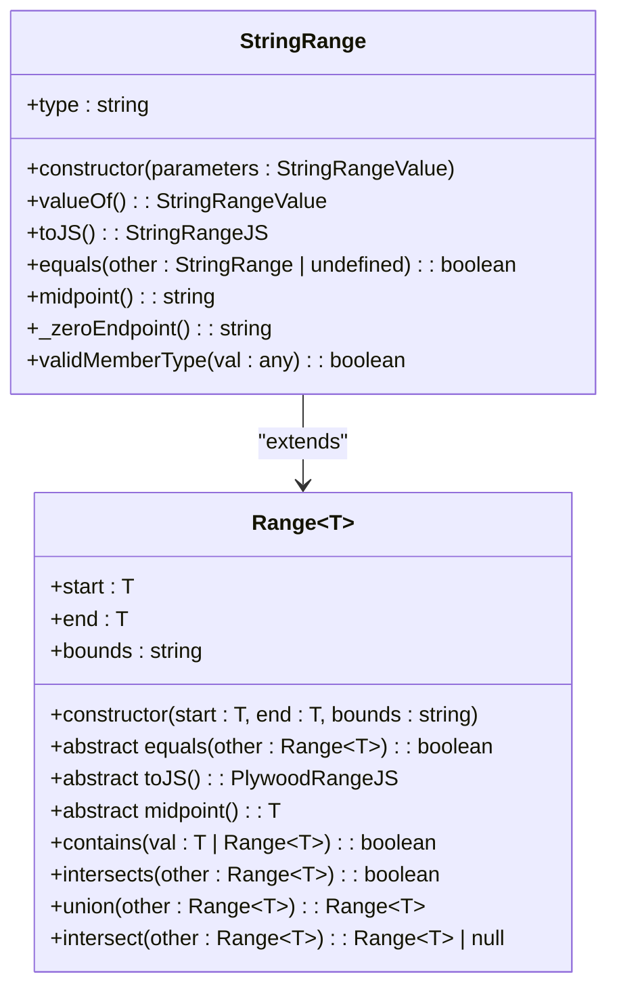
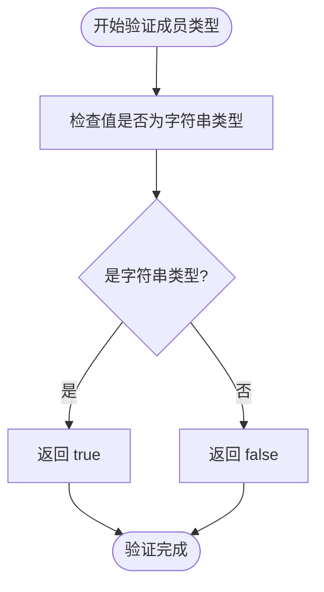
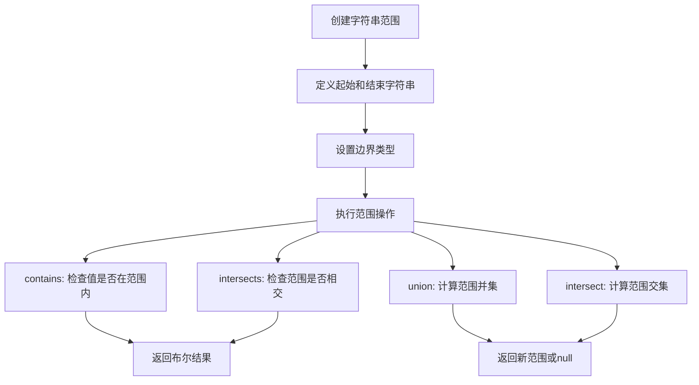
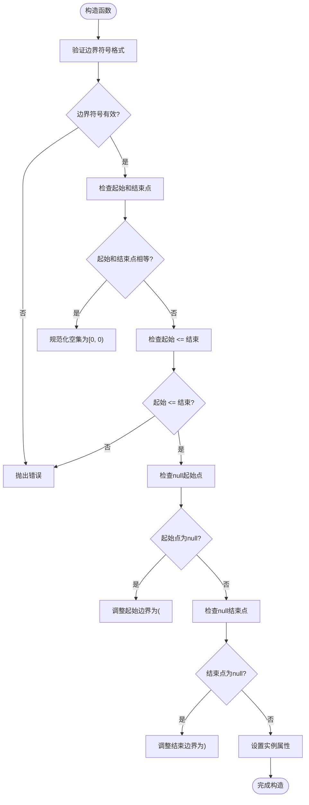
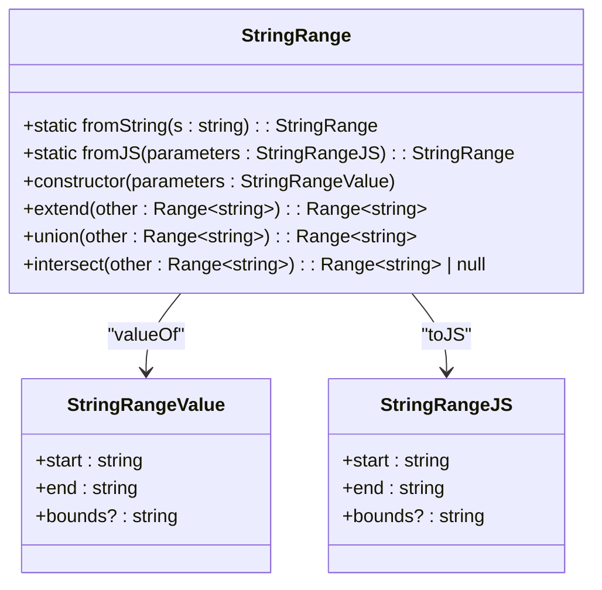
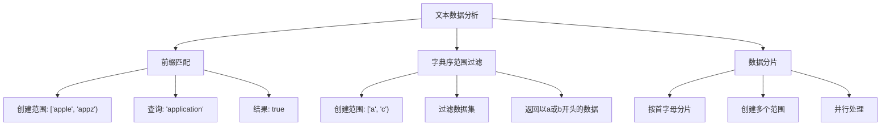
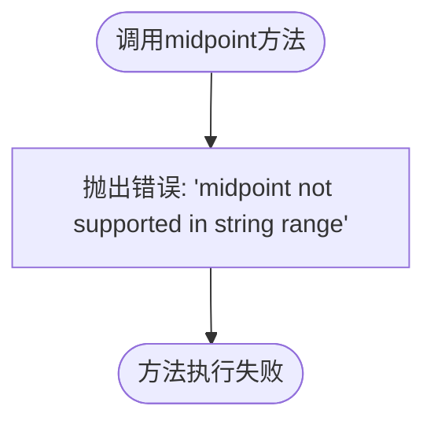
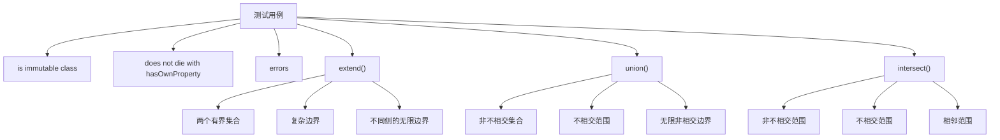

# 字符串范围

<cite>
**本文档中引用的文件**  
- [stringRange.ts](file://src/datatypes/stringRange.ts)
- [range.ts](file://src/datatypes/range.ts)
- [numberRange.ts](file://src/datatypes/numberRange.ts)
- [timeRange.ts](file://src/datatypes/timeRange.ts)
- [stringRange.mocha.js](file://test/datatypes/stringRange.mocha.js)
</cite>

## 目录
1. [简介](#简介)
2. [核心实现](#核心实现)
3. [类型安全与成员验证](#类型安全与成员验证)
4. [字符串比较与字典序查询](#字符串比较与字典序查询)
5. [边界条件与空值处理](#边界条件与空值处理)
6. [实例创建与操作](#实例创建与操作)
7. [典型应用场景](#典型应用场景)
8. [不支持中点计算的原因](#不支持中点计算的原因)
9. [与其他范围类型的对比](#与其他范围类型的对比)
10. [测试验证](#测试验证)

## 简介
字符串范围（StringRange）是Plywood库中用于表示和操作字符串区间的核心数据结构。作为通用范围（Range）类的特化实现，它专为处理文本数据的字典序范围查询而设计。本文档详细说明了StringRange的实现机制、核心功能、使用方法以及在文本数据分析中的典型应用。

**Section sources**
- [stringRange.ts](file://src/datatypes/stringRange.ts#L1-L98)
- [range.ts](file://src/datatypes/range.ts#L1-L349)

## 核心实现
StringRange类继承自通用的Range<string>基类，实现了针对字符串类型的特定行为。其核心实现包括构造函数、序列化方法和类型检查机制。



**Diagram sources**
- [stringRange.ts](file://src/datatypes/stringRange.ts#L32-L95)
- [range.ts](file://src/datatypes/range.ts#L30-L348)

**Section sources**
- [stringRange.ts](file://src/datatypes/stringRange.ts#L32-L95)
- [range.ts](file://src/datatypes/range.ts#L30-L348)

## 类型安全与成员验证
StringRange通过`validMemberType`方法确保类型安全，该方法重写了基类的同名方法，专门用于验证字符串类型。



**Diagram sources**
- [stringRange.ts](file://src/datatypes/stringRange.ts#L80-L82)

**Section sources**
- [stringRange.ts](file://src/datatypes/stringRange.ts#L80-L82)

## 字符串比较与字典序查询
StringRange利用JavaScript的内置字符串比较操作符（<, >）来实现字典序比较，支持各种范围查询操作。



**Section sources**
- [stringRange.ts](file://src/datatypes/stringRange.ts#L32-L95)
- [range.ts](file://src/datatypes/range.ts#L30-L348)

## 边界条件与空值处理
StringRange对边界条件和空值有明确的处理规则，包括null起始/结束点的表示方法和边界符号的规范化。



**Section sources**
- [range.ts](file://src/datatypes/range.ts#L69-L99)
- [stringRange.ts](file://src/datatypes/stringRange.ts#L63-L69)

## 实例创建与操作
StringRange提供了多种创建实例的方法，并支持各种范围操作。



**Diagram sources**
- [stringRange.ts](file://src/datatypes/stringRange.ts#L39-L41)
- [stringRange.ts](file://src/datatypes/stringRange.ts#L43-L54)
- [stringRange.ts](file://src/datatypes/stringRange.ts#L56-L61)
- [stringRange.ts](file://src/datatypes/stringRange.ts#L71-L78)

**Section sources**
- [stringRange.ts](file://src/datatypes/stringRange.ts#L39-L78)

## 典型应用场景
StringRange在文本数据分析中有多种典型应用，包括前缀匹配和字典序范围过滤。



**Section sources**
- [stringRange.mocha.js](file://test/datatypes/stringRange.mocha.js#L50-L160)

## 不支持中点计算的原因
StringRange的`midpoint`方法不支持字符串类型，因为字符串没有数学意义上的中点概念。



**Diagram sources**
- [stringRange.ts](file://src/datatypes/stringRange.ts#L71-L75)

**Section sources**
- [stringRange.ts](file://src/datatypes/stringRange.ts#L71-L75)

## 与其他范围类型的对比
StringRange与其他范围类型（如NumberRange和TimeRange）在实现上有显著差异。

```mermaid
classDiagram
class Range~T~ {
+abstract midpoint() : T
}
class StringRange {
+midpoint() : string
}
class NumberRange {
+midpoint() : number
}
class TimeRange {
+midpoint() : Date
}
StringRange --> Range : "extends"
NumberRange --> Range : "extends"
TimeRange --> Range : "extends"
StringRange -.-> "抛出错误" : "不支持中点计算"
NumberRange -.-> "返回数值" : "(start + end) / 2"
TimeRange -.-> "返回日期" : "new Date((start + end) / 2)"
```

**Section sources**
- [stringRange.ts](file://src/datatypes/stringRange.ts#L71-L78)
- [numberRange.ts](file://src/datatypes/numberRange.ts#L100-L102)
- [timeRange.ts](file://src/datatypes/timeRange.ts#L170-L172)

## 测试验证
StringRange的实现通过了全面的测试验证，确保了其正确性和可靠性。



**Section sources**
- [stringRange.mocha.js](file://test/datatypes/stringRange.mocha.js#L10-L160)