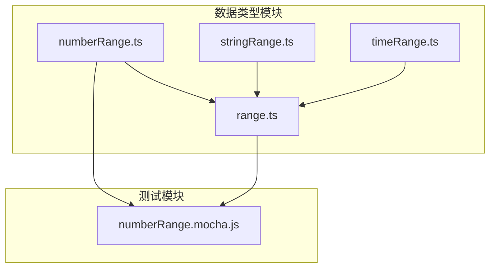
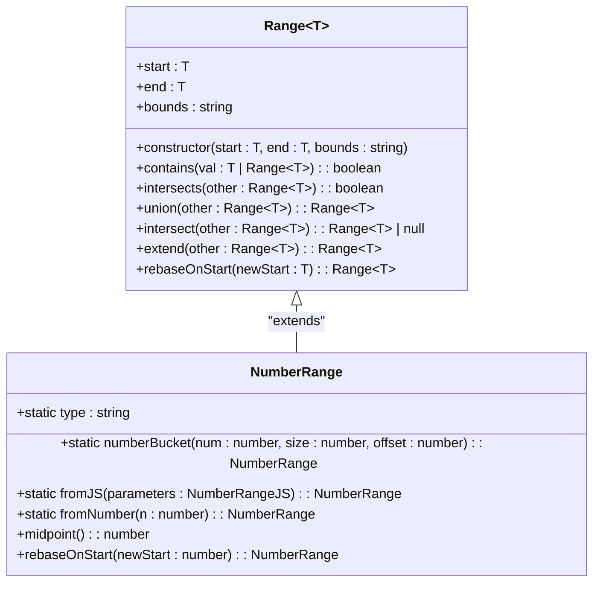
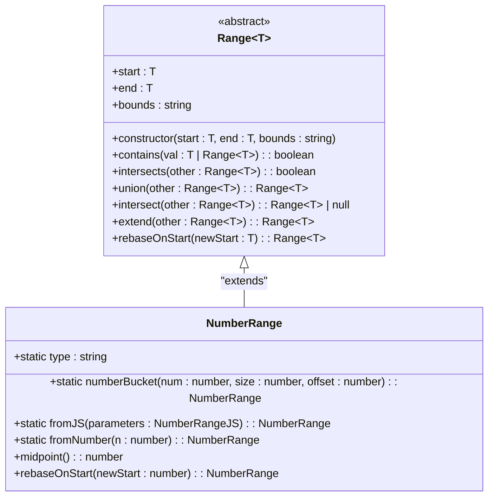
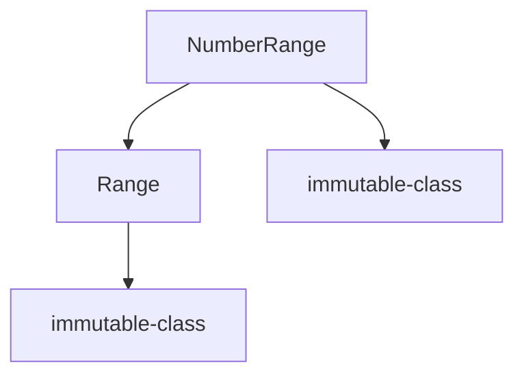

# 数值范围

<cite>
**Referenced Files in This Document**   
- [numberRange.ts](file://src/datatypes/numberRange.ts)
- [range.ts](file://src/datatypes/range.ts)
- [numberRange.mocha.js](file://test/datatypes/numberRange.mocha.js)
</cite>

## 目录
1. [简介](#简介)
2. [项目结构](#项目结构)
3. [核心组件](#核心组件)
4. [架构概述](#架构概述)
5. [详细组件分析](#详细组件分析)
6. [依赖分析](#依赖分析)
7. [性能考虑](#性能考虑)
8. [故障排除指南](#故障排除指南)
9. [结论](#结论)

## 简介
本文档深入分析Plywood库中的数值范围（NumberRange）实现。作为通用范围（Range）类的子类，NumberRange专门用于处理数值区间，提供了丰富的区间操作功能。文档将详细解释其继承和扩展基类功能的方式，重点说明fromJS反序列化机制、numberBucket静态方法在数据分桶场景中的应用，以及rebaseOnStart方法在时间序列对齐中的作用。同时，文档将涵盖创建数值范围实例的代码示例、包含检查、范围交集、并集计算等操作，以及在查询条件中使用数值范围进行过滤的最佳实践。最后，文档将讨论边界条件处理，如NaN值的处理和无穷大边界的表示。

## 项目结构
Plywood库的项目结构清晰地组织了其数据类型和功能模块。数值范围相关的实现主要位于`src/datatypes/`目录下，其中`numberRange.ts`文件定义了`NumberRange`类，而`range.ts`文件则定义了其基类`Range`。测试文件位于`test/datatypes/`目录下，为`NumberRange`的功能提供了全面的验证。

**Diagram sources**
- [numberRange.ts](file://src/datatypes/numberRange.ts)
- [range.ts](file://src/datatypes/range.ts)
- [numberRange.mocha.js](file://test/datatypes/numberRange.mocha.js)

**Section sources**
- [numberRange.ts](file://src/datatypes/numberRange.ts)
- [range.ts](file://src/datatypes/range.ts)
- [numberRange.mocha.js](file://test/datatypes/numberRange.mocha.js)

## 核心组件
`NumberRange`类是Plywood库中处理数值区间的核心组件。它继承自通用的`Range<T>`基类，并针对数值类型进行了特化。该类不仅实现了区间的基本操作，如包含检查、交集和并集计算，还提供了`numberBucket`和`rebaseOnStart`等高级功能，使其在数据分析和处理场景中非常有用。

**Section sources**
- [numberRange.ts](file://src/datatypes/numberRange.ts)

## 架构概述
`NumberRange`的架构设计遵循了面向对象的继承和多态原则。它通过继承`Range<T>`基类来复用通用的区间逻辑，同时通过重写和添加特定方法来扩展功能。这种设计模式使得代码既具有良好的可维护性，又具有高度的可扩展性。

**Diagram sources**
- [numberRange.ts](file://src/datatypes/numberRange.ts)
- [range.ts](file://src/datatypes/range.ts)

## 详细组件分析

### NumberRange 类分析
`NumberRange`类是`Range<number>`的具体实现，专门用于处理数值区间。它继承了基类的所有功能，并添加了针对数值类型的特定方法。

#### 继承与扩展
`NumberRange`通过继承`Range<number>`基类，获得了区间操作的基本功能，如包含检查、交集、并集等。同时，它通过重写`midpoint`方法和添加`numberBucket`、`rebaseOnStart`等静态和实例方法，扩展了基类的功能。

**Diagram sources**
- [numberRange.ts](file://src/datatypes/numberRange.ts)
- [range.ts](file://src/datatypes/range.ts)

#### fromJS 反序列化机制
`fromJS`静态方法是`NumberRange`类的重要组成部分，负责将JavaScript对象反序列化为`NumberRange`实例。该方法首先检查输入参数是否为对象，然后提取`start`和`end`值，并使用`finiteOrNull`函数处理可能的NaN或无穷大值，最后调用构造函数创建新的`NumberRange`实例。

**Section sources**
- [numberRange.ts](file://src/datatypes/numberRange.ts#L57-L68)

#### numberBucket 静态方法
`numberBucket`静态方法用于将一个数值分配到指定大小的桶中。该方法首先计算桶的起始位置，然后创建一个新的`NumberRange`实例，表示该数值所在的桶。这个方法在数据分桶和直方图生成等场景中非常有用。

**Section sources**
- [numberRange.ts](file://src/datatypes/numberRange.ts#L44-L51)

#### rebaseOnStart 方法
`rebaseOnStart`实例方法用于将数值范围的起始点重新对齐到一个新的起始点。该方法保持范围的长度不变，只改变其位置。这个方法在时间序列对齐和数据标准化等场景中非常有用。

**Section sources**
- [numberRange.ts](file://src/datatypes/numberRange.ts#L102-L110)

## 依赖分析
`NumberRange`类依赖于`Range`基类和`immutable-class`库。`Range`基类提供了区间操作的基本功能，而`immutable-class`库则确保了`NumberRange`实例的不可变性。

**Diagram sources**
- [numberRange.ts](file://src/datatypes/numberRange.ts)
- [range.ts](file://src/datatypes/range.ts)

**Section sources**
- [numberRange.ts](file://src/datatypes/numberRange.ts)
- [range.ts](file://src/datatypes/range.ts)

## 性能考虑
`NumberRange`类的设计考虑了性能因素。例如，`contains`和`intersects`方法的时间复杂度为O(1)，使得在大数据集上进行区间查询非常高效。此外，`union`和`intersect`方法的实现也经过优化，以减少不必要的计算。

## 故障排除指南
在使用`NumberRange`时，可能会遇到一些常见问题。例如，如果输入的`start`或`end`值不是数字，`fromJS`方法会抛出类型错误。此外，如果`start`大于`end`，构造函数会抛出错误。在处理无穷大边界时，需要特别注意边界条件的处理。

**Section sources**
- [numberRange.ts](file://src/datatypes/numberRange.ts)
- [numberRange.mocha.js](file://test/datatypes/numberRange.mocha.js)

## 结论
`NumberRange`类是Plywood库中一个功能强大且设计良好的组件。它通过继承和扩展`Range`基类，提供了丰富的数值区间操作功能。`fromJS`反序列化机制、`numberBucket`静态方法和`rebaseOnStart`方法等特性，使其在数据分析和处理场景中非常有用。通过深入理解其设计和实现，开发者可以更有效地利用这个类来解决实际问题。