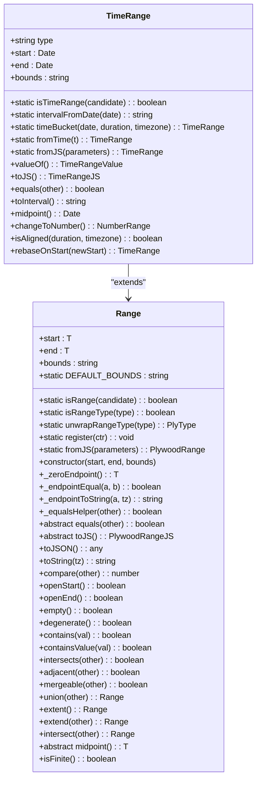
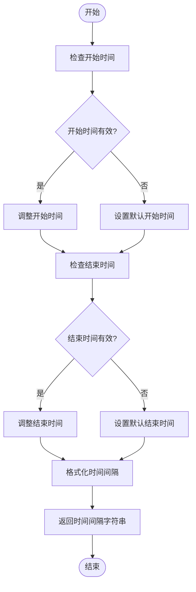
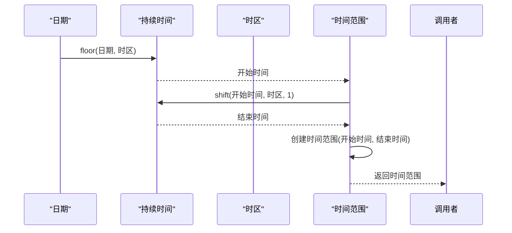
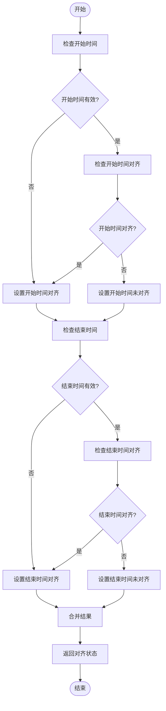
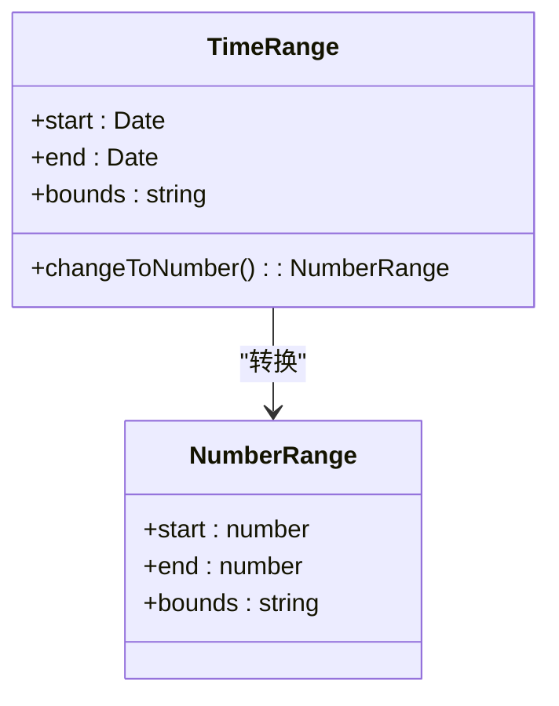
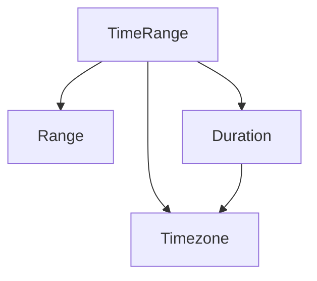

# 时间范围

<cite>
**Referenced Files in This Document**  
- [timeRange.ts](file://src/datatypes/timeRange.ts)
- [range.ts](file://src/datatypes/range.ts)
- [duration.d.ts](file://node_modules/@topgames/chronoshift/build/duration/duration.d.ts)
- [timezone.d.ts](file://node_modules/@topgames/chronoshift/build/timezone/timezone.d.ts)
- [timeRange.mocha.js](file://test/datatypes/timeRange.mocha.js)
- [timeRangeExpression.ts](file://src/expressions/timeRangeExpression.ts)
- [druidFilterBuilder.ts](file://src/external/utils/druidFilterBuilder.ts)
- [hasTimezone.ts](file://src/expressions/mixins/hasTimezone.ts)
</cite>

## 目录
1. [简介](#简介)
2. [核心组件](#核心组件)
3. [架构概述](#架构概述)
4. [详细组件分析](#详细组件分析)
5. [依赖分析](#依赖分析)
6. [性能考虑](#性能考虑)
7. [故障排除指南](#故障排除指南)
8. [结论](#结论)

## 简介
Plywood的时间范围（TimeRange）系统是处理时间序列数据的核心组件，它作为`Range<Date>`的特殊实现，为时间序列查询提供了强大的功能。该系统与chronoshift库深度集成，支持时区处理和时间分桶操作，特别适用于Druid等时序数据库的查询优化。时间范围系统不仅提供了创建和操作时间范围的基本功能，还实现了与时间序列数据库查询的无缝集成。

## 核心组件
时间范围系统的核心是`TimeRange`类，它继承自`Range<Date>`并实现了`Instance<TimeRangeValue, TimeRangeJS>`接口。该类提供了创建时间范围、执行时间范围操作和在时间序列查询中使用时间范围的完整功能。`TimeRange`类与`Duration`和`Timezone`类协同工作，实现了时间分桶、时间对齐检测和时间戳转换等功能。

**Section sources**
- [timeRange.ts](file://src/datatypes/timeRange.ts#L61-L184)

## 架构概述
时间范围系统采用分层架构，底层是`Range`基类，中层是`TimeRange`实现类，上层是与chronoshift库的集成。`Range`基类提供了范围操作的基本功能，`TimeRange`类在此基础上添加了时间特定的功能。系统通过`Duration`和`Timezone`类与chronoshift库集成，实现了时间分桶和时区支持。

```mermaid
graph TB
subgraph "时间范围系统"
Range[Range<Date>]
TimeRange[TimeRange]
Duration[Duration]
Timezone[Timezone]
end
TimeRange --> Range : "继承"
TimeRange --> Duration : "使用"
TimeRange --> Timezone : "使用"
```

**Diagram sources**
- [timeRange.ts](file://src/datatypes/timeRange.ts#L61-L184)
- [range.ts](file://src/datatypes/range.ts#L30-L348)

## 详细组件分析

### TimeRange类分析
`TimeRange`类是时间范围系统的核心，它提供了创建和操作时间范围的完整功能。该类实现了`toInterval`方法生成ISO时间间隔字符串，`timeBucket`方法与`Duration`和`Timezone`协同实现时间分桶，以及`isAligned`方法检测时间对齐状态的算法逻辑。

#### 类图


**Diagram sources**
- [timeRange.ts](file://src/datatypes/timeRange.ts#L61-L184)
- [range.ts](file://src/datatypes/range.ts#L30-L348)

### toInterval方法分析
`toInterval`方法生成ISO时间间隔字符串，用于表示时间范围。该方法将时间范围转换为包含开始和结束时间的字符串，格式为"开始时间/结束时间"。如果时间范围本身不是包含/排除的，则会添加一秒来处理。



**Diagram sources**
- [timeRange.ts](file://src/datatypes/timeRange.ts#L113-L133)

### timeBucket方法分析
`timeBucket`方法与`Duration`和`Timezone`协同实现时间分桶。该方法将给定日期按指定持续时间和时区进行分桶，返回一个时间范围。



**Diagram sources**
- [timeRange.ts](file://src/datatypes/timeRange.ts#L68-L80)
- [duration.d.ts](file://node_modules/@topgames/chronoshift/build/duration/duration.d.ts#L12-L38)

### isAligned方法分析
`isAligned`方法检测时间对齐状态的算法逻辑。该方法检查时间范围的开始和结束时间是否与指定的持续时间和时区对齐。



**Diagram sources**
- [timeRange.ts](file://src/datatypes/timeRange.ts#L158-L164)

### changeToNumber方法分析
`changeToNumber`方法在时间戳转换中的应用。该方法将时间范围转换为数字范围，将开始和结束时间转换为时间戳。



**Diagram sources**
- [timeRange.ts](file://src/datatypes/timeRange.ts#L149-L157)
- [numberRange.ts](file://src/datatypes/numberRange.ts#L37-L111)

## 依赖分析
时间范围系统依赖于多个核心组件，包括`Range`基类、`Duration`和`Timezone`类。这些依赖关系确保了时间范围系统的功能完整性和一致性。



**Diagram sources**
- [timeRange.ts](file://src/datatypes/timeRange.ts#L1-L187)
- [range.ts](file://src/datatypes/range.ts#L1-L349)
- [duration.d.ts](file://node_modules/@topgames/chronoshift/build/duration/duration.d.ts#L1-L39)
- [timezone.d.ts](file://node_modules/@topgames/chronoshift/build/timezone/timezone.d.ts#L1-L15)

**Section sources**
- [timeRange.ts](file://src/datatypes/timeRange.ts#L1-L187)
- [range.ts](file://src/datatypes/range.ts#L1-L349)
- [duration.d.ts](file://node_modules/@topgames/chronoshift/build/duration/duration.d.ts#L1-L39)
- [timezone.d.ts](file://node_modules/@topgames/chronoshift/build/timezone/timezone.d.ts#L1-L15)

## 性能考虑
时间范围系统在设计时考虑了性能优化，特别是在与Druid等时序数据库的集成中。通过使用`toInterval`方法生成ISO时间间隔字符串，系统能够高效地在数据库查询中使用时间范围。此外，`timeBucket`方法的实现避免了不必要的计算，提高了时间分桶操作的性能。

## 故障排除指南
在使用时间范围系统时，可能会遇到一些常见问题。例如，当创建时间范围时，如果开始时间大于结束时间，系统会抛出错误。此外，如果时间范围的边界无效，系统也会抛出错误。在使用`toInterval`方法时，需要注意时间范围的边界，因为不同的边界会影响生成的时间间隔字符串。

**Section sources**
- [timeRange.ts](file://src/datatypes/timeRange.ts#L1-L187)
- [timeRange.mocha.js](file://test/datatypes/timeRange.mocha.js#L1-L203)

## 结论
Plywood的时间范围系统是一个功能强大且设计精良的组件，它为时间序列数据处理提供了坚实的基础。通过与chronoshift库的深度集成，系统实现了时间分桶、时间对齐检测和时间戳转换等高级功能。该系统不仅适用于Druid等时序数据库的查询优化，还为其他时间序列数据处理场景提供了灵活的解决方案。