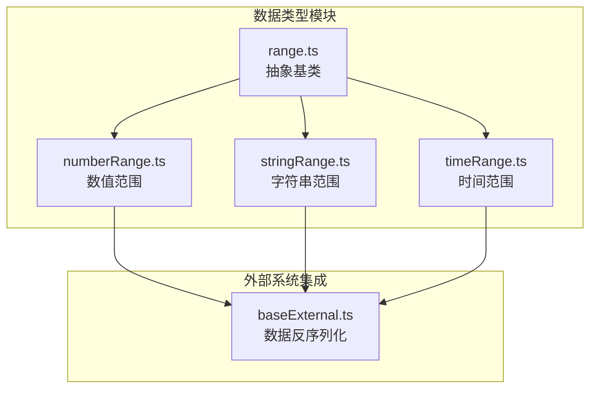
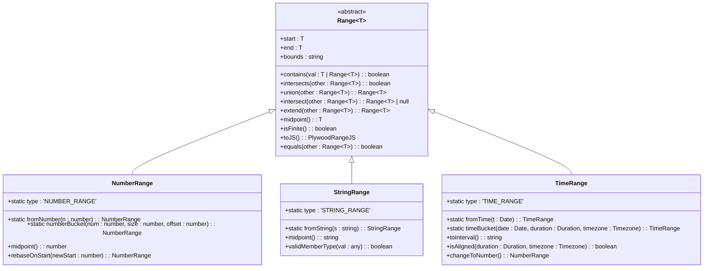
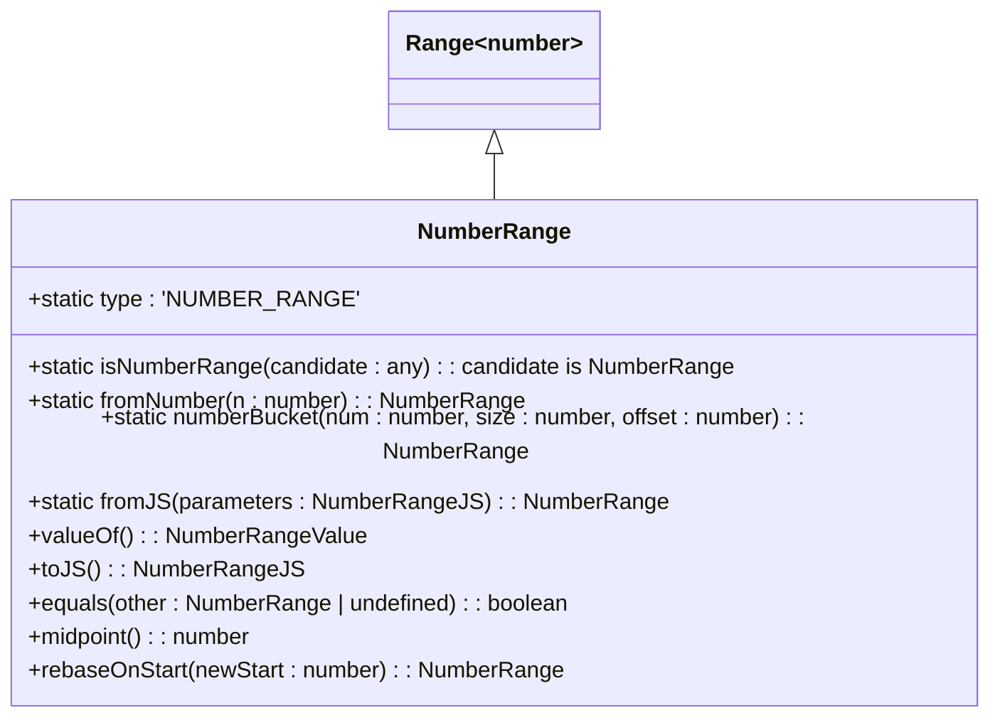
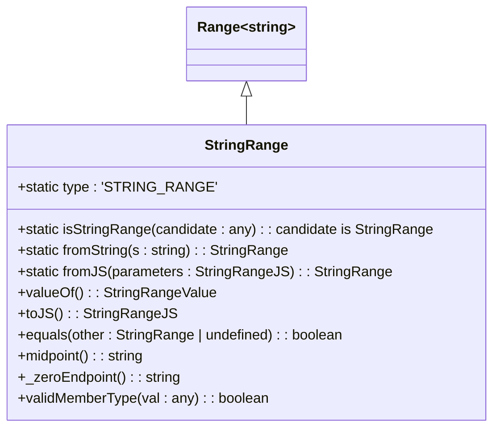
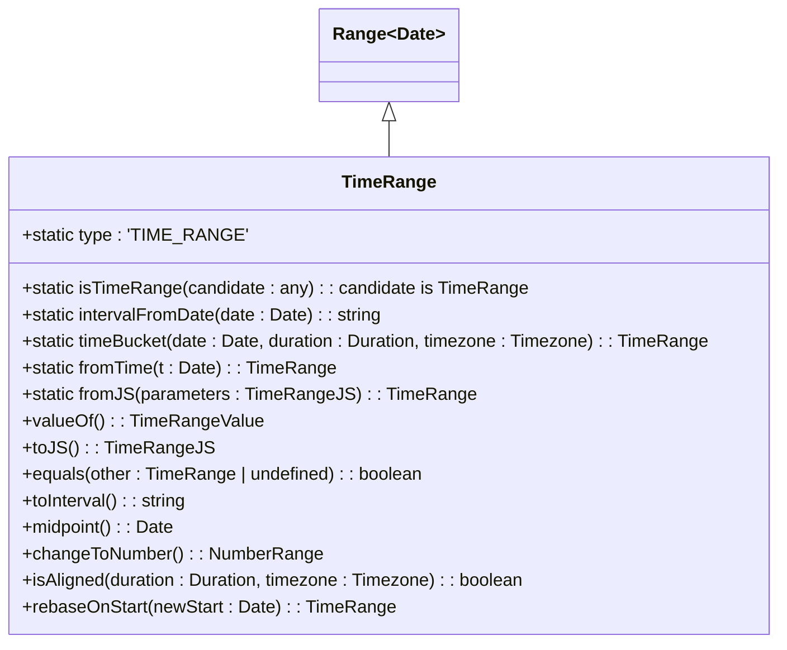

# 范围类型

<cite>
**本文档中引用的文件**
- [range.ts](file://src/datatypes/range.ts)
- [numberRange.ts](file://src/datatypes/numberRange.ts)
- [stringRange.ts](file://src/datatypes/stringRange.ts)
- [timeRange.ts](file://src/datatypes/timeRange.ts)
- [baseExternal.ts](file://src/external/baseExternal.ts)
</cite>

## 目录
1. [简介](#简介)
2. [项目结构](#项目结构)
3. [核心组件](#核心组件)
4. [架构概述](#架构概述)
5. [详细组件分析](#详细组件分析)
6. [依赖分析](#依赖分析)
7. [性能考虑](#性能考虑)
8. [故障排除指南](#故障排除指南)
9. [结论](#结论)
10. [附录](#附录)（如有必要）

## 简介
本文档深入分析Plywood的范围类型系统，详细解释`Range<T>`抽象基类的设计模式和核心方法的实现原理。文档阐述了数值范围（NumberRange）、时间范围（TimeRange）和字符串范围（StringRange）的具体实现差异和应用场景，重点说明时间范围在时间序列数据分析中的特殊处理，包括时区支持、时间对齐检测和时间桶操作。文档还提供了如何创建各种范围类型实例、执行范围操作以及在查询条件中使用范围类型的示例，并涵盖了范围类型的序列化/反序列化机制和边界条件处理。

## 项目结构
Plywood的范围类型系统主要位于`src/datatypes/`目录下，包含四个核心文件：`range.ts`定义了抽象基类`Range<T>`，而`numberRange.ts`、`stringRange.ts`和`timeRange.ts`分别实现了数值、字符串和时间的具体范围类型。这些类型通过工厂模式和注册机制进行管理，确保类型安全和一致性。范围类型在查询执行、数据转换和外部系统集成中扮演关键角色。



**图表来源**
- [range.ts](file://src/datatypes/range.ts#L1-L50)
- [numberRange.ts](file://src/datatypes/numberRange.ts#L1-L20)
- [stringRange.ts](file://src/datatypes/stringRange.ts#L1-L20)
- [timeRange.ts](file://src/datatypes/timeRange.ts#L1-L20)
- [baseExternal.ts](file://src/external/baseExternal.ts#L531-L599)

**章节来源**
- [range.ts](file://src/datatypes/range.ts#L1-L100)
- [numberRange.ts](file://src/datatypes/numberRange.ts#L1-L50)
- [stringRange.ts](file://src/datatypes/stringRange.ts#L1-L50)
- [timeRange.ts](file://src/datatypes/timeRange.ts#L1-L50)

## 核心组件
范围类型系统的核心是`Range<T>`抽象基类，它定义了所有范围类型共有的行为和属性。该类通过泛型`T`支持不同类型的数据（数值、字符串、日期），并提供了一套完整的范围操作方法，如包含检查、交集、并集等。具体的范围类型（`NumberRange`、`StringRange`、`TimeRange`）继承自`Range<T>`，并根据各自的数据类型特性进行特化实现。系统通过`classMap`静态属性和`register`方法实现工厂模式，允许根据输入数据类型动态创建相应的范围实例。

**章节来源**
- [range.ts](file://src/datatypes/range.ts#L1-L350)
- [numberRange.ts](file://src/datatypes/numberRange.ts#L1-L115)
- [stringRange.ts](file://src/datatypes/stringRange.ts#L1-L99)
- [timeRange.ts](file://src/datatypes/timeRange.ts#L1-L188)

## 架构概述
Plywood的范围类型系统采用抽象基类与具体实现分离的设计模式。`Range<T>`作为抽象基类，定义了范围操作的通用接口和默认行为，而具体的范围类型则负责处理特定数据类型的细节。这种设计实现了代码复用和类型安全。系统通过静态`classMap`和`fromJS`工厂方法实现动态类型识别和实例化，确保了API的简洁性和灵活性。范围类型在数据处理管道中作为关键的数据结构，支持高效的范围查询和数据转换。



**图表来源**
- [range.ts](file://src/datatypes/range.ts#L1-L350)
- [numberRange.ts](file://src/datatypes/numberRange.ts#L1-L115)
- [stringRange.ts](file://src/datatypes/stringRange.ts#L1-L99)
- [timeRange.ts](file://src/datatypes/timeRange.ts#L1-L188)

## 详细组件分析
范围类型系统由一个抽象基类和三个具体实现组成，每个组件都有其特定的职责和优化。基类`Range<T>`提供了通用的范围操作逻辑，而具体类则针对各自的数据类型进行了优化和扩展。这种分层设计使得系统既灵活又高效，能够处理各种数据类型的范围操作需求。

### Range<T> 抽象基类分析
`Range<T>`是所有范围类型的抽象基类，它定义了范围的核心概念和操作。该类通过泛型`T`支持不同类型的数据，并使用`bounds`属性表示范围的边界类型（如`[)`表示左闭右开）。基类实现了范围操作的核心逻辑，包括包含检查、交集、并集等，这些逻辑通过受保护的抽象方法（如`_endpointEqual`、`_endpointToString`）委托给子类实现，从而实现了多态性。

```mermaid
classDiagram
class Range~T~ {
<<abstract>>
+start : T
+end : T
+bounds : string
+DEFAULT_BOUNDS : '[)'
+isRange(candidate : any) : boolean
+isRangeType(type : PlyType) : boolean
+classMap : Record~string, typeof Range~
+register(ctr : any) : void
+fromJS(parameters : PlywoodRangeJS) : PlywoodRange
+constructor(start : T, end : T, bounds : string)
+_zeroEndpoint() : T
+_endpointEqual(a : T, b : T) : boolean
+_endpointToString(a : T, tz? : Timezone) : string
+_equalsHelper(other : Range~T~) : boolean
+abstract equals(other : Range~T~) : boolean
+abstract toJS() : PlywoodRangeJS
+toJSON() : any
+toString(tz? : Timezone) : string
+compare(other : Range~T~) : number
+openStart() : boolean
+openEnd() : boolean
+empty() : boolean
+degenerate() : boolean
+contains(val : T | Range~T~) : boolean
+containsValue(val : T) : boolean
+intersects(other : Range~T~) : boolean
+adjacent(other : Range~T~) : boolean
+mergeable(other : Range~T~) : boolean
+union(other : Range~T~) : Range~T~
+extent() : Range~T~
+extend(other : Range~T~) : Range~T~
+intersect(other : Range~T~) : Range~T~ | null
+abstract midpoint() : T
+isFinite() : boolean
}
```

**图表来源**
- [range.ts](file://src/datatypes/range.ts#L1-L350)

**章节来源**
- [range.ts](file://src/datatypes/range.ts#L1-L350)

### 数值范围 (NumberRange) 分析
`NumberRange`是`Range<number>`的具体实现，专门用于处理数值范围。它重写了`validMemberType`方法以确保只有数值类型可以作为成员，并实现了`midpoint`方法来计算数值范围的中点。`NumberRange`还提供了`numberBucket`静态方法，用于将数值分配到指定大小的桶中，这在数据分组和聚合分析中非常有用。此外，`rebaseOnStart`方法允许将范围的起点重新定位到新的数值上。



**图表来源**
- [numberRange.ts](file://src/datatypes/numberRange.ts#L1-L115)

**章节来源**
- [numberRange.ts](file://src/datatypes/numberRange.ts#L1-L115)

### 字符串范围 (StringRange) 分析
`StringRange`是`Range<string>`的具体实现，用于处理字符串范围。它重写了`validMemberType`方法以确保只有字符串类型可以作为成员，并将`_zeroEndpoint`方法重写为返回空字符串。由于字符串没有明确的中点概念，`midpoint`方法会抛出错误。`StringRange`适用于按字母顺序进行范围查询的场景，例如查找姓名在某个字母区间内的用户。



**图表来源**
- [stringRange.ts](file://src/datatypes/stringRange.ts#L1-L99)

**章节来源**
- [stringRange.ts](file://src/datatypes/stringRange.ts#L1-L99)

### 时间范围 (TimeRange) 分析
`TimeRange`是`Range<Date>`的具体实现，专门用于处理时间范围。它是范围类型系统中最复杂的实现，因为它需要处理时区、时间对齐和时间桶等特殊需求。`TimeRange`重写了`_endpointEqual`和`_endpointToString`方法以正确处理`Date`对象的比较和格式化。它提供了`timeBucket`静态方法用于创建时间桶，`isAligned`方法用于检查时间范围是否与特定时间间隔对齐，以及`toInterval`方法用于生成符合标准的时间间隔字符串。



**图表来源**
- [timeRange.ts](file://src/datatypes/timeRange.ts#L1-L188)

**章节来源**
- [timeRange.ts](file://src/datatypes/timeRange.ts#L1-L188)

## 依赖分析
范围类型系统内部依赖关系清晰，`Range<T>`作为核心抽象基类被所有具体范围类型所依赖。`NumberRange`、`StringRange`和`TimeRange`都直接继承自`Range<T>`，并根据各自的数据类型特性进行扩展。外部依赖方面，`TimeRange`依赖于`@topgames/chronoshift`库来处理时间相关的操作，如时区转换和时间间隔计算。在系统集成层面，`baseExternal.ts`中的反序列化工厂方法依赖于具体的范围类型来将外部数据转换为内部范围对象。

```mermaid
graph TD
Range[Range~T~<br>抽象基类] --> NumberRange[NumberRange<br>数值范围]
Range --> StringRange[StringRange<br>字符串范围]
Range --> TimeRange[TimeRange<br>时间范围]
TimeRange --> Chronoshift[@topgames/chronoshift<br>时间处理]
NumberRange --> BaseExternal[baseExternal.ts<br>反序列化]
StringRange --> BaseExternal
TimeRange --> BaseExternal
```

**图表来源**
- [range.ts](file://src/datatypes/range.ts#L1-L50)
- [numberRange.ts](file://src/datatypes/numberRange.ts#L1-L20)
- [stringRange.ts](file://src/datatypes/stringRange.ts#L1-L20)
- [timeRange.ts](file://src/datatypes/timeRange.ts#L1-L20)
- [baseExternal.ts](file://src/external/baseExternal.ts#L531-L599)

**章节来源**
- [range.ts](file://src/datatypes/range.ts#L1-L100)
- [numberRange.ts](file://src/datatypes/numberRange.ts#L1-L50)
- [stringRange.ts](file://src/datatypes/stringRange.ts#L1-L50)
- [timeRange.ts](file://src/datatypes/timeRange.ts#L1-L50)
- [baseExternal.ts](file://src/external/baseExternal.ts#L531-L599)

## 性能考虑
范围类型系统的设计考虑了性能因素。通过使用抽象基类和多态性，避免了代码重复，提高了维护性。核心操作如`contains`、`intersects`和`union`都经过优化，时间复杂度为O(1)。对于时间范围，`isAligned`方法可以快速判断时间范围是否与查询粒度对齐，这对于查询优化至关重要。在序列化和反序列化方面，系统提供了高效的`toJS`和`fromJS`方法，减少了数据转换的开销。

## 故障排除指南
在使用范围类型系统时，可能会遇到一些常见问题。例如，创建范围时如果`start`大于`end`会抛出错误，需要确保范围的有效性。对于时间范围，如果输入的日期字符串无法解析，`fromJS`方法会抛出错误，需要检查日期格式是否正确。在进行范围操作时，如果两个范围不相交且不相邻，`union`方法会返回`null`，需要先检查`mergeable`方法。此外，`StringRange`的`midpoint`方法会抛出错误，因为字符串没有明确的中点概念。

**章节来源**
- [range.ts](file://src/datatypes/range.ts#L100-L150)
- [timeRange.ts](file://src/datatypes/timeRange.ts#L70-L100)
- [numberRange.ts](file://src/datatypes/numberRange.ts#L50-L80)

## 结论
Plywood的范围类型系统是一个设计精良、功能强大的数据结构，它通过抽象基类和具体实现的分离，实现了代码复用和类型安全。系统支持数值、字符串和时间三种范围类型，并提供了丰富的操作方法，如包含检查、交集、并集等。特别是时间范围的实现，充分考虑了时区、时间对齐和时间桶等复杂需求，使其非常适合时间序列数据分析。该系统在查询优化、数据转换和外部系统集成中发挥着关键作用，是Plywood数据处理能力的重要组成部分。

## 附录
### 范围操作示例
以下是一些使用范围类型进行操作的示例：

- **创建范围实例**:
  - `NumberRange.fromNumber(5)` 创建一个包含单个数值5的范围
  - `TimeRange.fromJS({ start: '2023-01-01T00:00:00Z', end: '2023-01-02T00:00:00Z' })` 从JSON创建时间范围

- **执行范围操作**:
  - `range1.union(range2)` 计算两个范围的并集
  - `range1.intersect(range2)` 计算两个范围的交集
  - `range.contains(value)` 检查值是否在范围内

- **在查询条件中使用范围**:
  - `$('time').overlap(timeRange)` 在查询中使用时间范围进行重叠检查
  - `$('value').in(numberRange)` 在查询中使用数值范围进行包含检查