# 集合类型

<cite>
**本文档中引用的文件**   
- [set.ts](file://src/datatypes/set.ts)
- [common.ts](file://src/datatypes/common.ts)
- [range.ts](file://src/datatypes/range.ts)
- [numberRange.ts](file://src/datatypes/numberRange.ts)
- [timeRange.ts](file://src/datatypes/timeRange.ts)
- [stringRange.ts](file://src/datatypes/stringRange.ts)
- [set.mocha.js](file://test/datatypes/set.mocha.js)
</cite>

## 目录
1. [简介](#简介)
2. [集合类型设计原理](#集合类型设计原理)
3. [泛型类型系统](#泛型类型系统)
4. [内部哈希存储机制](#内部哈希存储机制)
5. [核心操作方法](#核心操作方法)
6. [集合运算](#集合运算)
7. [数据过滤与成员资格检查](#数据过滤与成员资格检查)
8. [类型升级与降级机制](#类型升级与降级机制)
9. [性能特征](#性能特征)
10. [使用示例](#使用示例)

## 简介
Plywood中的集合类型（Set）是一种强大的数据结构，用于表示和操作同类型元素的集合。集合类型支持多种数据类型，包括字符串、数字、时间以及它们的范围类型。集合在数据过滤、成员资格检查和多值维度处理中发挥着关键作用。本文档详细解释了`Set`类的设计原理、实现细节和使用方法。

## 集合类型设计原理
`Set`类是Plywood中用于表示集合的核心数据结构。它实现了`Instance<SetValue, SetJS>`接口，提供了丰富的集合操作方法。集合类型的设计考虑了类型安全、性能优化和易用性。

集合的核心特性包括：
- **类型安全**：每个集合都有明确的类型（`setType`），确保集合中的所有元素都具有相同的类型。
- **去重**：集合自动去除重复元素，保证元素的唯一性。
- **高效操作**：通过哈希表实现快速的查找、添加和删除操作。
- **类型系统集成**：与Plywood的类型系统紧密集成，支持类型推断和转换。

集合类型在处理多值维度时特别有用，可以高效地进行成员资格检查和集合运算。

**Section sources**
- [set.ts](file://src/datatypes/set.ts#L53-L475)

## 泛型类型系统
Plywood的集合类型系统基于前缀`SET/`来表示集合类型。例如，`SET/STRING`表示字符串集合，`SET/NUMBER`表示数字集合。这种设计允许集合类型与原子类型清晰地区分。

### 类型定义
集合类型通过`PlyType`枚举定义，支持以下类型：
- `SET/STRING`：字符串集合
- `SET/NUMBER`：数字集合
- `SET/TIME`：时间集合
- `SET/NUMBER_RANGE`：数字范围集合
- `SET/TIME_RANGE`：时间范围集合
- `SET/STRING_RANGE`：字符串范围集合

### 类型操作
`Set`类提供了静态方法来操作类型：
- `isSetType(type)`：检查类型是否为集合类型
- `wrapSetType(type)`：将原子类型包装为集合类型
- `unwrapSetType(type)`：从集合类型中提取原子类型
- `isAtomicType(type)`：检查类型是否为原子类型

这些方法确保了类型系统的一致性和安全性。

**Section sources**
- [set.ts](file://src/datatypes/set.ts#L100-L120)
- [common.ts](file://src/datatypes/common.ts#L28-L58)

## 内部哈希存储机制
`Set`类使用哈希表来实现高效的元素存储和查找。这种设计确保了大多数操作的时间复杂度为O(1)。

### 哈希表实现
集合的内部存储由两个主要部分组成：
- `elements`：存储实际的元素数组
- `hash`：哈希表，用于快速查找

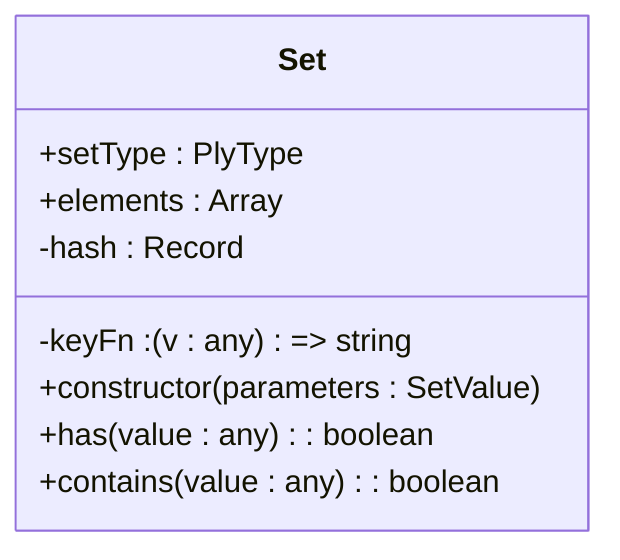

**Diagram sources **
- [set.ts](file://src/datatypes/set.ts#L150-L160)

### 键生成函数
`keyFn`是一个根据集合类型生成键的函数：
- 对于`TIME`类型，使用`dateString`函数生成ISO字符串
- 对于其他类型，使用`String`函数

这个设计确保了相同值的元素总是生成相同的键，从而保证了去重的正确性。

### 去重逻辑
在构造函数中，集合会自动去除重复元素：

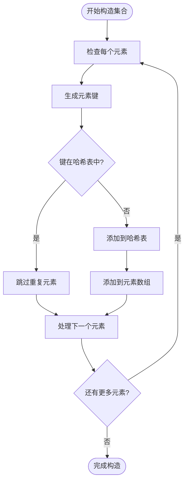

**Diagram sources **
- [set.ts](file://src/datatypes/set.ts#L170-L200)

## 核心操作方法
`Set`类提供了丰富的核心操作方法，用于集合的增删查改。

### union（并集）
`union`方法计算两个集合的并集：

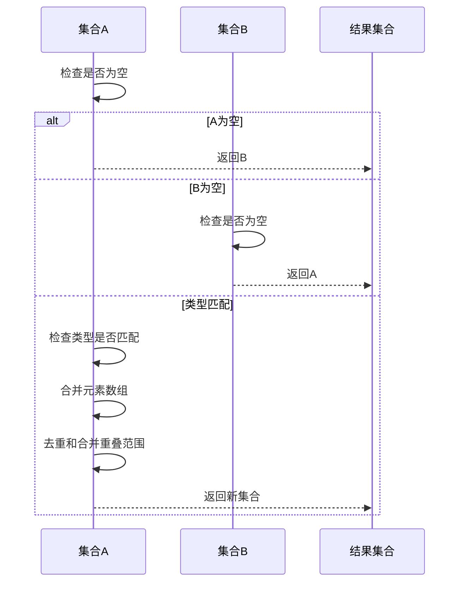

**Diagram sources **
- [set.ts](file://src/datatypes/set.ts#L384-L389)

### intersect（交集）
`intersect`方法计算两个集合的交集：

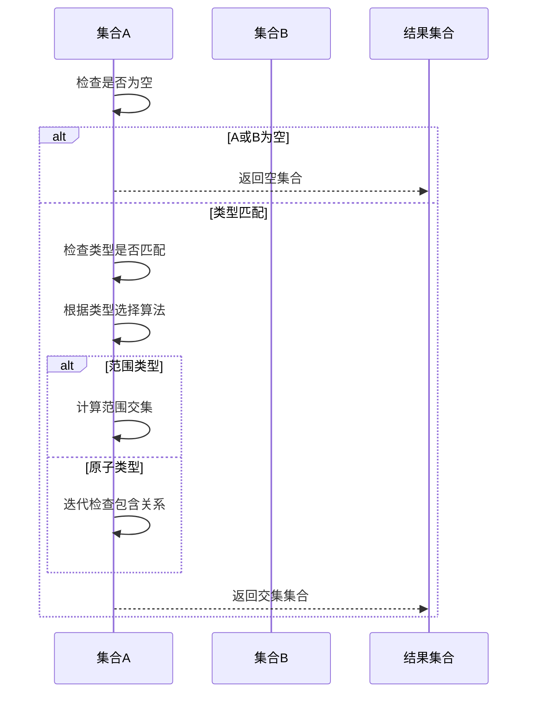

**Diagram sources **
- [set.ts](file://src/datatypes/set.ts#L391-L413)

### contains（包含检查）
`contains`方法检查一个值是否被集合包含：

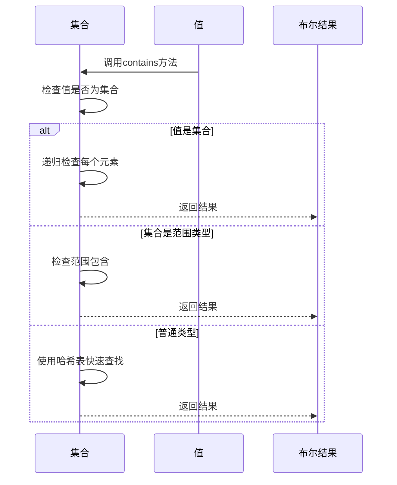

**Diagram sources **
- [set.ts](file://src/datatypes/set.ts#L436-L447)

### add/remove（增删元素）
`add`和`remove`方法用于修改集合：

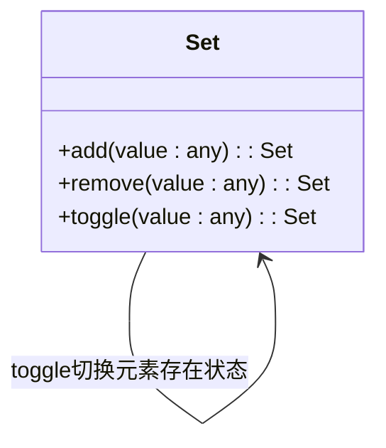

**Diagram sources **
- [set.ts](file://src/datatypes/set.ts#L449-L460)

## 集合运算
集合支持多种运算，包括并集、交集、差集等。

### 并集运算
并集运算将两个集合的元素合并：

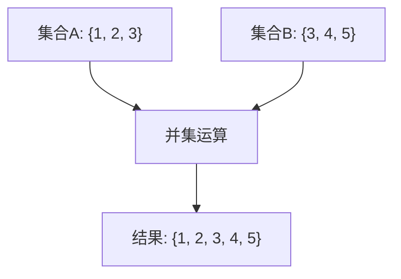

### 交集运算
交集运算找出两个集合共有的元素：

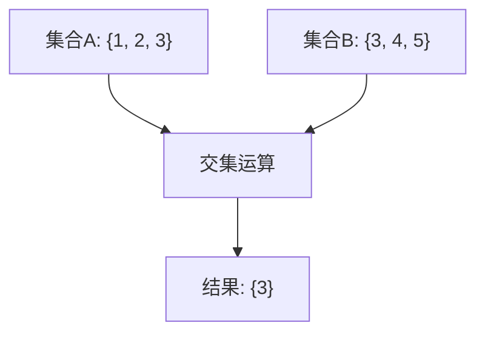

### 重叠检查
`overlap`方法检查两个集合是否有共同元素：

```mermaid
sequenceDiagram
participant SetA as 集合A
participant SetB as 集合B
participant Result as 布尔结果
SetA->>SetA : 检查是否为空
alt A或B为空
SetA-->>Result : 返回false
else 类型匹配
SetA->>SetA : 检查类型是否匹配
SetA->>SetA : 迭代A的每个元素
loop 每个元素
SetA->>SetB : 调用contains
SetB-->>SetA : 返回结果
alt 包含
SetA-->>Result : 返回true
break
end
end
SetA-->>Result : 返回false
end
```

**Diagram sources **
- [set.ts](file://src/datatypes/set.ts#L415-L434)

## 数据过滤与成员资格检查
集合类型在数据过滤和成员资格检查中发挥着重要作用。

### 多值维度处理
在处理多值维度时，集合可以高效地进行成员资格检查：

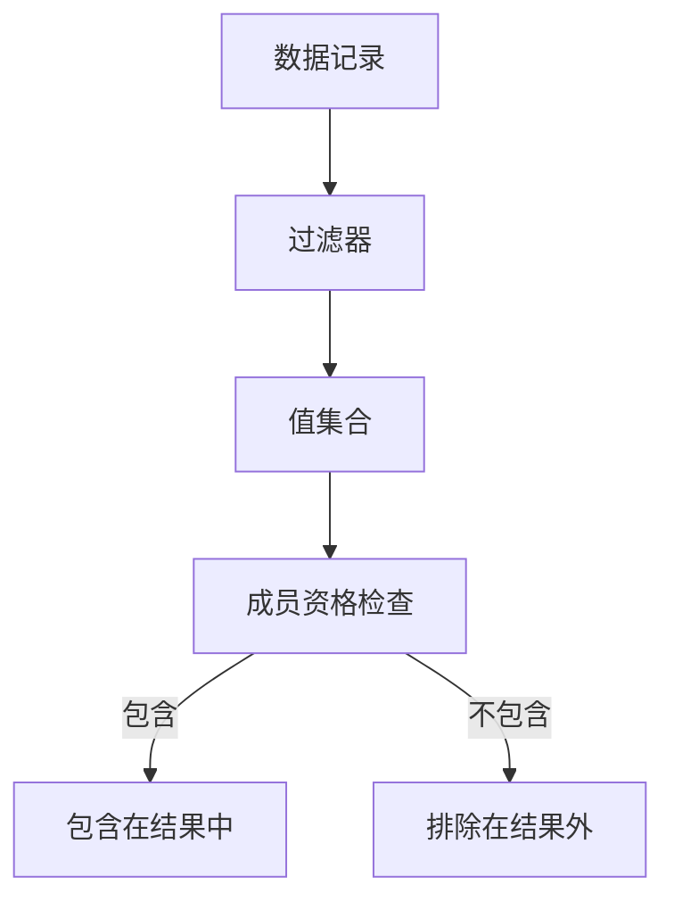

### 查询表达式中的使用
集合可以在查询表达式中作为过滤条件：

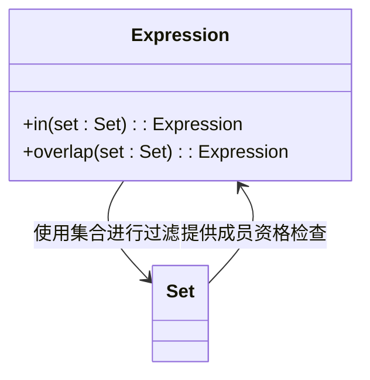

**Diagram sources **
- [set.ts](file://src/datatypes/set.ts#L436-L447)

## 类型升级与降级机制
集合类型支持类型升级和降级，以适应不同的使用场景。

### 类型升级
`upgradeType`方法将原子类型集合升级为范围类型集合：

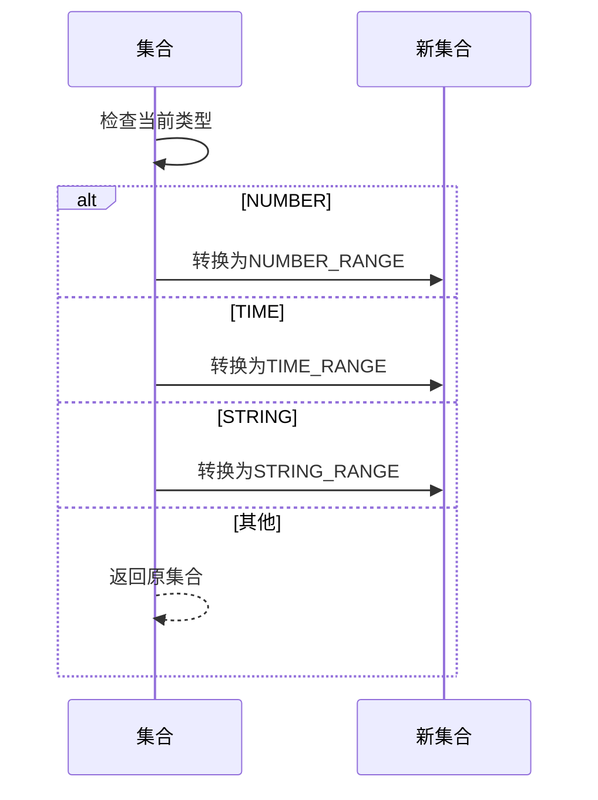

### 类型降级
`downgradeType`方法将范围类型集合降级为原子类型集合：

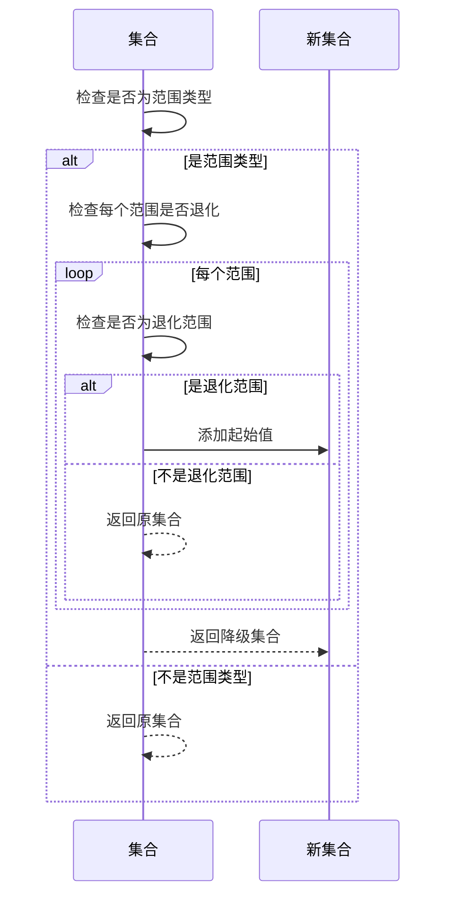

### 统一元素
`unifyElements`方法合并重叠的范围：

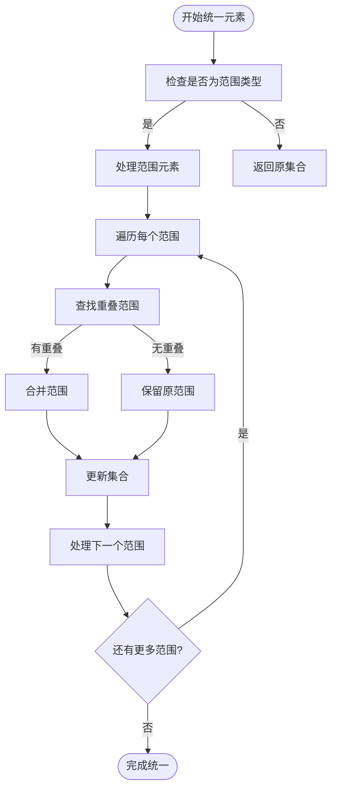

**Diagram sources **
- [set.ts](file://src/datatypes/set.ts#L330-L345)

## 性能特征
集合类型的性能特征经过精心设计，以确保高效的数据处理。

### 时间复杂度
| 操作 | 时间复杂度 | 说明 |
|------|-----------|------|
| `has` | O(1) | 哈希表查找 |
| `contains` | O(1)或O(n) | 哈希查找或范围检查 |
| `add` | O(1) | 哈希表操作 |
| `remove` | O(1) | 哈希表操作 |
| `union` | O(m+n) | 合并两个集合 |
| `intersect` | O(m×n) | 计算交集 |

### 空间复杂度
集合的空间复杂度为O(n)，其中n是集合中元素的数量。哈希表的使用确保了空间效率，同时避免了重复元素的存储。

### 优化策略
- **惰性计算**：某些操作（如`unifyElements`）只在需要时执行
- **哈希缓存**：使用哈希表缓存元素查找结果
- **类型检查**：在操作前进行类型检查，避免运行时错误

## 使用示例
以下示例展示了如何使用Plywood的集合类型。

### 创建集合
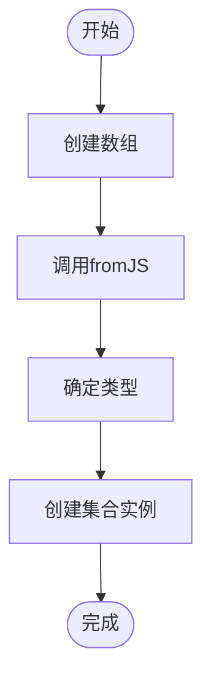

### 执行集合运算
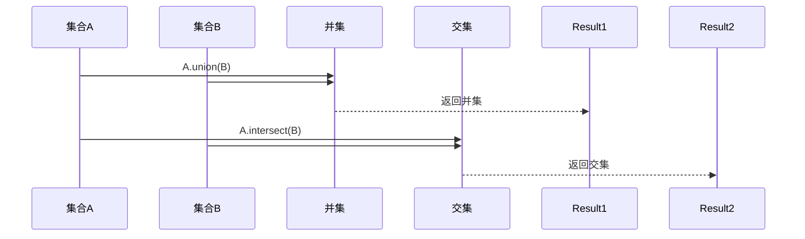

### 在查询中使用集合
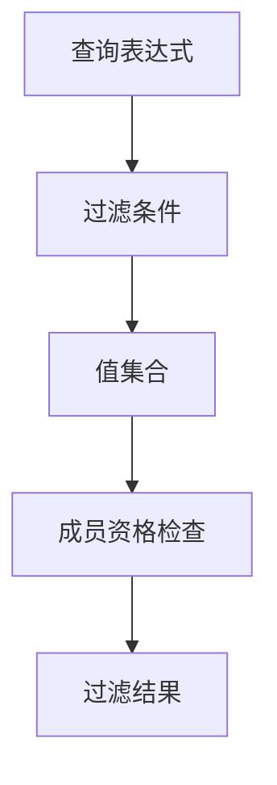

**Section sources**
- [set.ts](file://src/datatypes/set.ts#L204-L221)
- [set.mocha.js](file://test/datatypes/set.mocha.js#L100-L200)