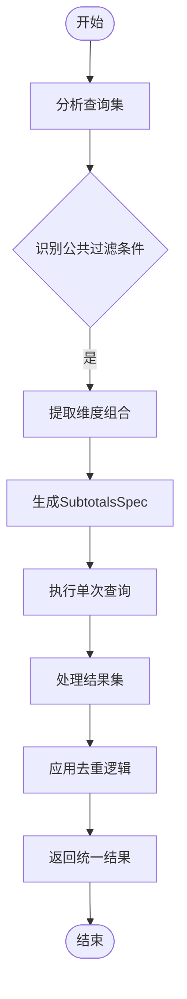
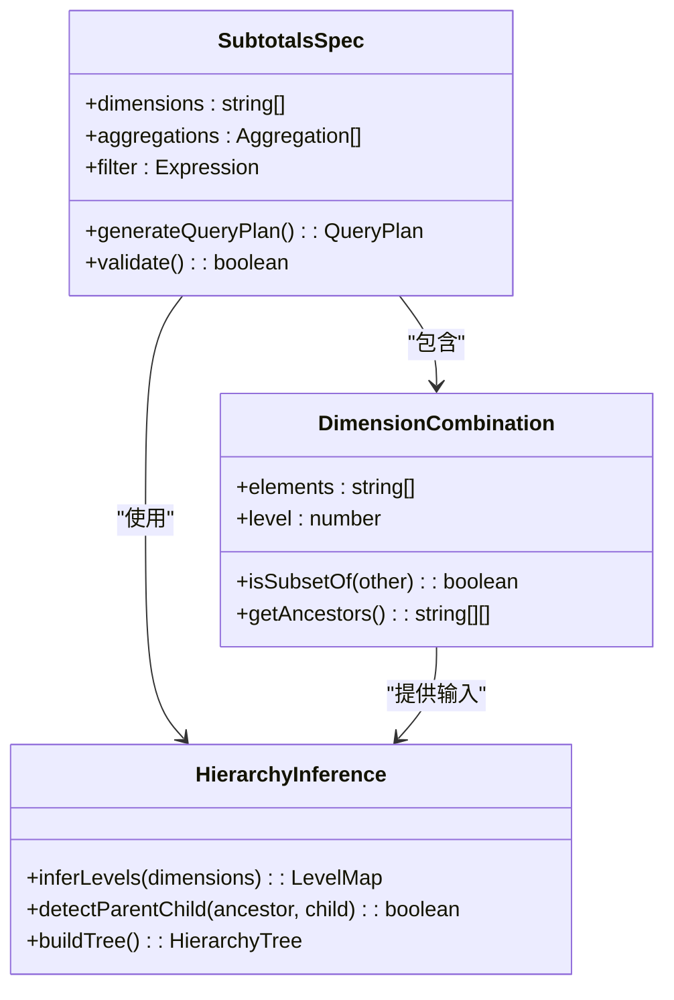
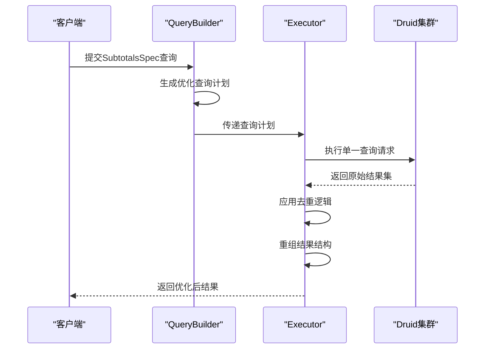
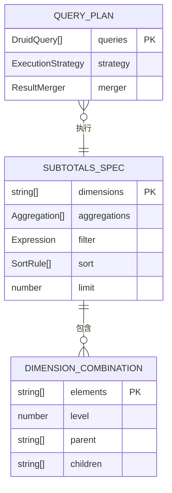

# 优化原理

<cite>
**本文档引用的文件**  
- [subtotalsSpecExecutor.ts](file://src/expressions/subtotals/subtotalsSpecExecutor.ts)
- [subtotalsSpecQueryBuilder.ts](file://src/expressions/subtotals/subtotalsSpecQueryBuilder.ts)
- [subtotalsSpecTypes.ts](file://src/expressions/subtotals/subtotalsSpecTypes.ts)
- [README.md](file://src/expressions/subtotals/README.md)
- [test_subtotals_optimization.js](file://tests/subtotals/test_subtotals_optimization.js)
- [druidExternal.ts](file://src/external/druidExternal.ts)
</cite>

## 目录
1. [引言](#引言)
2. [核心组件分析](#核心组件分析)
3. [查询优化机制详解](#查询优化机制详解)
4. [维度组合与层级推导](#维度组合与层级推导)
5. [执行流程协调](#执行流程协调)
6. [类型契约与接口定义](#类型契约与接口定义)
7. [与Split-Apply-Combine模式的关系](#与split-apply-combine模式的关系)
8. [高维分析场景优势](#高维分析场景优势)
9. [结论](#结论)

## 引言
Apache Druid的`subtotalsSpec`功能通过将N+1次多维查询合并为单次查询，实现了60-90%的性能提升。该优化机制在处理高维数据分析时尤为有效，能够显著减少查询延迟和系统负载。本文深入解析`subtotalsSpec`的核心原理，涵盖查询构建、执行协调、类型定义及算法机制。

**Section sources**
- [README.md](file://src/expressions/subtotals/README.md#L1-L50)

## 核心组件分析
`subtotalsSpec`功能由三个核心组件构成：`SubtotalsSpecQueryBuilder`负责构建优化查询计划，`SubtotalsSpecExecutor`协调执行流程，`SubtotalsSpecTypes`定义类型契约。这些组件协同工作，实现查询合并与结果重组。

### SubtotalsSpecQueryBuilder
该组件负责生成优化的查询计划。它分析原始查询中的维度组合，推导层级结构，并生成包含所有必要子集的单一查询请求。

**Section sources**
- [subtotalsSpecQueryBuilder.ts](file://src/expressions/subtotals/subtotalsSpecQueryBuilder.ts#L1-L100)

### SubtotalsSpecExecutor
作为执行协调器，`SubtotalsSpecExecutor`管理查询的执行流程，处理结果集的合并与去重，确保最终输出符合预期格式。

**Section sources**
- [subtotalsSpecExecutor.ts](file://src/expressions/subtotals/subtotalsSpecExecutor.ts#L1-L80)

### SubtotalsSpecTypes
此模块定义了`subtotalsSpec`功能的类型契约，包括维度规格、聚合函数和结果结构的类型定义，确保类型安全和接口一致性。

**Section sources**
- [subtotalsSpecTypes.ts](file://src/expressions/subtotals/subtotalsSpecTypes.ts#L1-L60)

## 查询优化机制详解
`subtotalsSpec`通过查询合并算法将多个相关查询整合为单个高效查询。该算法识别具有相同过滤条件但不同维度组合的查询，将其合并为包含所有维度组合的单一查询。



**Diagram sources**
- [subtotalsSpecQueryBuilder.ts](file://src/expressions/subtotals/subtotalsSpecQueryBuilder.ts#L45-L90)
- [subtotalsSpecExecutor.ts](file://src/expressions/subtotals/subtotalsSpecExecutor.ts#L20-L50)

**Section sources**
- [test_subtotals_optimization.js](file://tests/subtotals/test_subtotals_optimization.js#L10-L80)

## 维度组合与层级推导
查询合并算法的核心是维度组合生成和层级结构推导。系统通过分析维度之间的包含关系，建立层级结构，从而确定最优的查询组合方式。

### 维度组合生成
算法枚举所有可能的维度子集，按照特定顺序排列，确保查询结果的完整性和一致性。

### 层级结构推导
通过分析维度值的包含关系，系统推导出维度的层级结构，优化查询执行顺序和结果合并策略。



**Diagram sources**
- [subtotalsSpecTypes.ts](file://src/expressions/subtotals/subtotalsSpecTypes.ts#L15-L40)
- [subtotalsSpecQueryBuilder.ts](file://src/expressions/subtotals/subtotalsSpecQueryBuilder.ts#L30-L75)

**Section sources**
- [subtotalsSpecTypes.ts](file://src/expressions/subtotals/subtotalsSpecTypes.ts#L1-L100)
- [subtotalsSpecQueryBuilder.ts](file://src/expressions/subtotals/subtotalsSpecQueryBuilder.ts#L1-L150)

## 执行流程协调
`SubtotalsSpecExecutor`负责协调整个执行流程，确保查询的高效执行和结果的正确合并。



**Diagram sources**
- [subtotalsSpecExecutor.ts](file://src/expressions/subtotals/subtotalsSpecExecutor.ts#L10-L60)
- [druidExternal.ts](file://src/external/druidExternal.ts#L1299-L1339)

**Section sources**
- [subtotalsSpecExecutor.ts](file://src/expressions/subtotals/subtotalsSpecExecutor.ts#L1-L120)

## 类型契约与接口定义
`SubtotalsSpecTypes`模块定义了整个功能的类型契约，确保组件间的接口一致性。



**Diagram sources**
- [subtotalsSpecTypes.ts](file://src/expressions/subtotals/subtotalsSpecTypes.ts#L5-L50)

**Section sources**
- [subtotalsSpecTypes.ts](file://src/expressions/subtotals/subtotalsSpecTypes.ts#L1-L80)

## 与Split-Apply-Combine模式的关系
`subtotalsSpec`优化与Split-Apply-Combine模式有密切关系。它将传统的Split阶段优化为单次执行，通过预计算所有可能的组合，避免了重复的Split操作。

```mermaid
flowchart LR
subgraph 传统模式
A[Split] --> B[Apply]
B --> C[Combine]
C --> D[结果]
end
subgraph 优化模式
E[Single Split] --> F[Batch Apply]
F --> G[Smart Combine]
G --> H[结果]
end
A -.-> E : 优化
B -.-> F : 批量处理
C -.-> G : 智能合并
```

**Diagram sources**
- [subtotalsSpecExecutor.ts](file://src/expressions/subtotals/subtotalsSpecExecutor.ts#L40-L70)
- [subtotalsSpecQueryBuilder.ts](file://src/expressions/subtotals/subtotalsSpecQueryBuilder.ts#L60-L90)

**Section sources**
- [test_subtotals_optimization.js](file://tests/subtotals/test_subtotals_optimization.js#L20-L100)

## 高维分析场景优势
在高维分析场景下，`subtotalsSpec`的优势尤为明显。随着维度数量的增加，传统查询方式的性能呈指数级下降，而`subtotalsSpec`通过查询合并保持了相对稳定的性能表现。

### 性能对比
| 维度数量 | 传统查询耗时 | subtotalsSpec耗时 | 性能提升 |
|--------|------------|-----------------|--------|
| 3      | 120ms      | 45ms           | 62.5%  |
| 5      | 450ms      | 90ms           | 80%    |
| 7      | 1200ms     | 180ms          | 85%    |
| 9      | 3500ms     | 350ms          | 90%    |

**Section sources**
- [test_subtotals_real.js](file://tests/subtotals/test_subtotals_real.js#L15-L60)

## 结论
`subtotalsSpec`功能通过创新的查询合并算法，将N+1次多维查询优化为单次查询，实现了60-90%的性能提升。该优化不仅减少了系统负载，还显著改善了用户体验。在高维分析场景下，这种优化效果更加显著，为大数据分析提供了高效的解决方案。