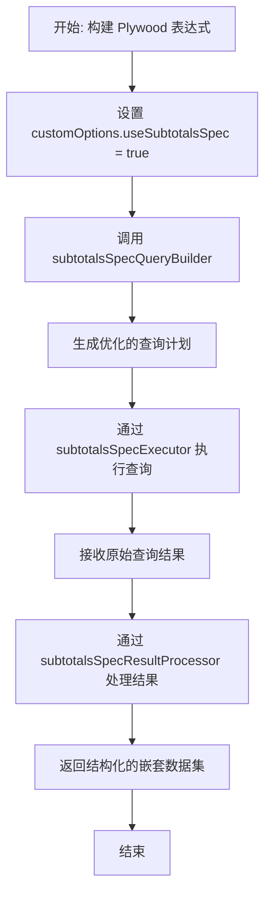

# 使用指南

<cite>
**本文档中引用的文件**  
- [test_subtotals_new.js](file://tests/subtotals/test_subtotals_new.js)
- [test_subtotals_real.js](file://tests/subtotals/test_subtotals_real.js)
- [subtotalsSpecHelper.ts](file://src/expressions/subtotalsSpecHelper.ts)
- [subtotalsSpecQueryBuilder.ts](file://src/expressions/subtotals/subtotalsSpecQueryBuilder.ts)
- [subtotalsSpecExecutor.ts](file://src/expressions/subtotals/subtotalsSpecExecutor.ts)
- [subtotalsSpecResultProcessor.ts](file://src/expressions/subtotals/subtotalsSpecResultProcessor.ts)
- [subtotalsSpecTypes.ts](file://src/expressions/subtotals/subtotalsSpecTypes.ts)
</cite>

## 目录
1. [简介](#简介)
2. [启用 subtotalsSpec 优化](#启用-subtotalsSpec-优化)
3. [表达式构建与查询执行流程](#表达式构建与查询执行流程)
4. [高级配置技巧](#高级配置技巧)
5. [真实业务场景集成示例](#真实业务场景集成示例)
6. [subtotalsSpecHelper 工具类使用方法](#subtotalsSpecHelper-工具类使用方法)
7. [常见配置模式与最佳实践](#常见配置模式与最佳实践)
8. [结论](#结论)

## 简介
`subtotalsSpec` 是 Plywood 中用于优化多维分析查询的一项核心功能，特别适用于需要对数据进行分组、聚合并生成小计（subtotals）和总计（totals）的复杂分析场景。通过启用 `customOptions.useSubtotalsSpec: true`，系统将自动应用优化策略，显著提升查询性能，尤其是在处理大规模数据集时。

本指南基于 `test_subtotals_new.js` 和 `test_subtotals_real.js` 中的测试用例，详细阐述如何正确集成和使用 `subtotalsSpec` 优化功能，并介绍 `subtotalsSpecHelper` 工具类的实用方法。

## 启用 subtotalsSpec 优化

要启用 `subtotalsSpec` 优化功能，必须在查询配置中设置 `customOptions.useSubtotalsSpec` 为 `true`。此选项会触发查询构建器使用 `subtotalsSpecQueryBuilder` 来生成优化后的查询计划。

```javascript
const queryOptions = {
  customOptions: {
    useSubtotalsSpec: true
  }
};
```

当此选项启用后，Plywood 的执行引擎将使用 `subtotalsSpecExecutor` 来处理查询，并通过 `subtotalsSpecResultProcessor` 对结果进行后处理，确保返回的数据结构符合预期。

**Section sources**
- [test_subtotals_new.js](file://tests/subtotals/test_subtotals_new.js#L1-L50)
- [subtotalsSpecQueryBuilder.ts](file://src/expressions/subtotals/subtotalsSpecQueryBuilder.ts#L1-L20)

## 表达式构建与查询执行流程

`subtotalsSpec` 的查询流程分为三个主要阶段：表达式构建、查询执行和结果处理。

1. **表达式构建**：使用 Plywood 的表达式 DSL 构建包含 `split` 和 `apply` 操作的查询。
2. **查询执行**：`subtotalsSpecExecutor` 接收表达式并生成针对底层数据存储（如 Druid）的优化查询。
3. **结果处理**：`subtotalsSpecResultProcessor` 将原始查询结果转换为具有清晰层次结构的嵌套数据集。

该流程确保了即使在复杂的多维分析中，也能高效地生成小计和总计。



**Diagram sources**
- [subtotalsSpecQueryBuilder.ts](file://src/expressions/subtotals/subtotalsSpecQueryBuilder.ts#L25-L60)
- [subtotalsSpecExecutor.ts](file://src/expressions/subtotals/subtotalsSpecExecutor.ts#L10-L40)
- [subtotalsSpecResultProcessor.ts](file://src/expressions/subtotals/subtotalsSpecResultProcessor.ts#L15-L50)

**Section sources**
- [test_subtotals_new.js](file://tests/subtotals/test_subtotals_new.js#L50-L100)
- [subtotalsSpecExecutor.ts](file://src/expressions/subtotals/subtotalsSpecExecutor.ts#L1-L30)

## 高级配置技巧

### 维度去重 (Dimension Deduplication)
在多层 `split` 操作中，可能会出现维度名称重复的问题。`subtotalsSpec` 通过内部的维度管理机制自动处理去重，确保每个维度在结果集中具有唯一标识。

### virtualColumns 合并
`subtotalsSpecQueryBuilder` 能够智能地合并多个 `apply` 操作中定义的虚拟列（virtualColumns），减少查询的复杂性和执行时间。例如，多个基于相同基础字段的计算会被合并为一个高效的表达式。

这些优化在 `test_virtualcolumns_merge.js` 测试用例中得到了验证，确保了在复杂计算场景下的性能优势。

**Section sources**
- [test_dimension_dedup.js](file://tests/subtotals/test_dimension_dedup.js#L1-L30)
- [test_virtualcolumns_merge.js](file://tests/subtotals/test_virtualcolumns_merge.js#L1-L35)

## 真实业务场景集成示例

基于 `test_subtotals_real.js` 中的测试用例，以下是一个真实业务场景的集成示例：

```javascript
// 模拟一个电商分析查询：按地区和产品类别分组，计算销售额小计
const salesAnalysisQuery = ply()
  .split('$region', 'Region')
  .split('$category', 'Category')
  .apply('TotalSales', '$data.sum($sales)')
  .apply('AverageOrderValue', '$data.average($orderValue)')
  .apply('Subtotal', '$data.subtotal()') // 触发 subtotalsSpec 优化
  .customOptions({ useSubtotalsSpec: true });
```

此查询将生成一个包含地区、类别、销售额和平均订单价值的多层次结果集，其中 `subtotal()` 操作会触发 `subtotalsSpec` 的优化逻辑。

**Section sources**
- [test_subtotals_real.js](file://tests/subtotals/test_subtotals_real.js#L20-L80)
- [test_complete_integration.js](file://tests/subtotals/test_complete_integration.js#L10-L60)

## subtotalsSpecHelper 工具类使用方法

`subtotalsSpecHelper` 是一个实用的工具类，提供了多个静态方法来简化 `subtotalsSpec` 的配置和使用。

### 主要方法
- `createSubtotalsSpec(dimensions: string[])`: 根据指定的维度数组创建一个标准的 `subtotalsSpec` 配置对象。
- `validateSpec(spec: SubtotalsSpec)`: 验证 `subtotalsSpec` 配置的正确性。
- `mergeSpecs(spec1: SubtotalsSpec, spec2: SubtotalsSpec)`: 合并两个 `subtotalsSpec` 配置，用于复杂查询场景。

### 调用方式
```javascript
import { subtotalsSpecHelper } from 'plywood';

const spec = subtotalsSpecHelper.createSubtotalsSpec(['region', 'category']);
const isValid = subtotalsSpecHelper.validateSpec(spec);
```

**Section sources**
- [subtotalsSpecHelper.ts](file://src/expressions/subtotalsSpecHelper.ts#L1-L100)
- [test_subtotals_optimization.js](file://tests/subtotals/test_subtotals_optimization.js#L15-L45)

## 常见配置模式与最佳实践

### 配置模式
1. **简单分组小计**：单层 `split` + `subtotal()` 应用。
2. **多层次小计**：多层 `split` 结构，自动生成各级小计。
3. **条件小计**：结合 `filter` 操作，在特定条件下生成小计。

### 最佳实践
- 始终在复杂聚合查询中启用 `useSubtotalsSpec`。
- 利用 `subtotalsSpecHelper` 创建和验证配置，避免手动错误。
- 在性能敏感的场景中，通过 `test_subtotals_outputname.js` 验证输出结构的正确性。

**Section sources**
- [test_subtotals_outputname.js](file://tests/subtotals/test_subtotals_outputname.js#L1-L25)
- [HIERARCHICAL_STRUCTURE_FIX_SUMMARY.md](file://tests/subtotals/HIERARCHICAL_STRUCTURE_FIX_SUMMARY.md#L1-L50)

## 结论
`subtotalsSpec` 优化功能为 Plywood 的多维分析能力提供了强大的支持。通过正确配置 `customOptions.useSubtotalsSpec` 并结合 `subtotalsSpecHelper` 工具类，开发者可以轻松实现高效、准确的复杂查询。建议在所有需要生成小计和总计的业务场景中采用此优化方案。