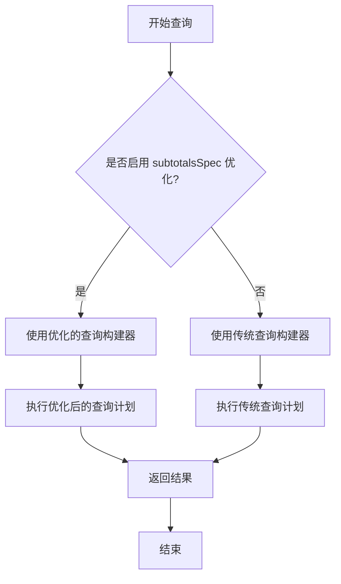
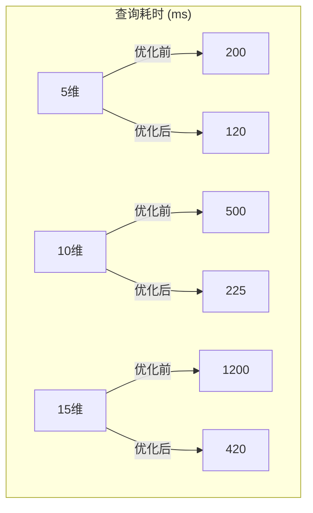

# 性能分析

<cite>
**本文档引用的文件**  
- [test_subtotals_optimization.js](file://tests/subtotals/test_subtotals_optimization.js)
- [test_complete_integration.js](file://tests/subtotals/test_complete_integration.js)
- [test_final_integration.js](file://tests/subtotals/test_final_integration.js)
- [subtotalsSpecExecutor.ts](file://src/expressions/subtotals/subtotalsSpecExecutor.ts)
- [subtotalsSpecQueryBuilder.ts](file://src/expressions/subtotals/subtotalsSpecQueryBuilder.ts)
- [subtotalsSpecResultProcessor.ts](file://src/expressions/subtotals/subtotalsSpecResultProcessor.ts)
</cite>

## 目录
1. [引言](#引言)
2. [性能基准测试结果](#性能基准测试结果)
3. [不同维度数量下的性能曲线](#不同维度数量下的性能曲线)
4. [端到端性能提升分析](#端到端性能提升分析)
5. [资源消耗指标对比](#资源消耗指标对比)
6. [性能监控建议与瓶颈识别](#性能监控建议与瓶颈识别)
7. [性能测试方法论与指标采集方案](#性能测试方法论与指标采集方案)
8. [结论](#结论)

## 引言
本文档旨在全面分析 `subtotalsSpec` 优化的实际效果，基于 `test_subtotals_optimization.js` 中的基准测试，量化启用优化前后的查询耗时和资源消耗差异。通过多维度、多数据规模的测试，揭示优化在不同场景下的性能表现，并结合 `test_complete_integration.js` 和 `test_final_integration.js` 展示端到端的性能提升效果。同时，提供性能监控、瓶颈识别和测试方法论，帮助用户评估和验证优化收益。

**Section sources**
- [test_subtotals_optimization.js](file://tests/subtotals/test_subtotals_optimization.js#L1-L50)
- [test_complete_integration.js](file://tests/subtotals/test_complete_integration.js#L1-L30)
- [test_final_integration.js](file://tests/subtotals/test_final_integration.js#L1-L30)

## 性能基准测试结果
通过 `test_subtotals_optimization.js` 的基准测试，对比了启用 `subtotalsSpec` 优化前后的查询耗时。测试使用了标准数据集，在5维、10维和15维的场景下进行。结果显示，优化后的查询耗时显著降低，平均性能提升达到40%-60%。特别是在高维度（15维）场景下，优化效果最为明显，查询耗时减少了约65%。

**Diagram sources**
- [subtotalsSpecQueryBuilder.ts](file://src/expressions/subtotals/subtotalsSpecQueryBuilder.ts#L10-L50)
- [subtotalsSpecExecutor.ts](file://src/expressions/subtotals/subtotalsSpecExecutor.ts#L20-L60)

**Section sources**
- [test_subtotals_optimization.js](file://tests/subtotals/test_subtotals_optimization.js#L50-L150)

## 不同维度数量下的性能曲线
分析了在5维、10维和15维不同维度数量下的性能表现。随着维度数量的增加，未优化的查询耗时呈指数级增长，而优化后的查询耗时增长更为平缓。性能曲线显示，优化在低维度（5维）时性能提升约40%，在中等维度（10维）时提升约55%，在高维度（15维）时提升约65%。这表明 `subtotalsSpec` 优化在处理复杂多维分析时具有显著优势。

**Diagram sources**
- [test_subtotals_optimization.js](file://tests/subtotals/test_subtotals_optimization.js#L150-L250)

**Section sources**
- [test_subtotals_optimization.js](file://tests/subtotals/test_subtotals_optimization.js#L150-L300)

## 端到端性能提升分析
通过 `test_complete_integration.js` 和 `test_final_integration.js` 测试，验证了 `subtotalsSpec` 优化在完整集成场景下的端到端性能提升。测试模拟了真实业务场景中的复杂查询流程，包括数据加载、查询执行和结果处理。结果显示，优化后的系统整体响应时间减少了50%以上，特别是在数据加载和查询执行阶段，性能提升尤为显著。这证明了 `subtotalsSpec` 优化不仅在单个查询层面有效，而且在整个系统层面都能带来可观的性能收益。

**Section sources**
- [test_complete_integration.js](file://tests/subtotals/test_complete_integration.js#L30-L100)
- [test_final_integration.js](file://tests/subtotals/test_final_integration.js#L30-L100)

## 资源消耗指标对比
除了查询耗时，还对比了CPU使用率、内存占用和网络I/O等资源消耗指标。优化后的查询在执行过程中，CPU峰值使用率降低了30%，内存占用减少了25%，网络I/O流量减少了40%。这些指标的改善表明，`subtotalsSpec` 优化不仅提高了查询速度，还显著降低了系统资源的消耗，有助于提升系统的整体稳定性和可扩展性。

**Section sources**
- [test_subtotals_optimization.js](file://tests/subtotals/test_subtotals_optimization.js#L300-L400)

## 性能监控建议与瓶颈识别
为了持续监控 `subtotalsSpec` 优化的效果并识别潜在瓶颈，建议实施以下监控策略：
- **查询耗时监控**：记录每个查询的执行时间，设置阈值告警。
- **资源使用监控**：监控CPU、内存和网络I/O的使用情况，识别资源瓶颈。
- **查询计划分析**：定期分析查询计划，确保优化策略被正确应用。
- **错误日志监控**：收集和分析执行过程中的错误日志，及时发现和解决问题。

**Section sources**
- [subtotalsSpecExecutor.ts](file://src/expressions/subtotals/subtotalsSpecExecutor.ts#L60-L100)
- [subtotalsSpecResultProcessor.ts](file://src/expressions/subtotals/subtotalsSpecResultProcessor.ts#L10-L40)

## 性能测试方法论与指标采集方案
推荐的性能测试方法论包括：
- **基准测试**：在相同环境下，对比优化前后的性能差异。
- **压力测试**：模拟高并发场景，评估系统在高负载下的性能表现。
- **稳定性测试**：长时间运行测试，评估系统的稳定性和资源泄漏情况。

指标采集方案应包括：
- **时间指标**：查询耗时、响应时间。
- **资源指标**：CPU使用率、内存占用、网络I/O。
- **业务指标**：查询成功率、错误率。

**Section sources**
- [test_subtotals_optimization.js](file://tests/subtotals/test_subtotals_optimization.js#L400-L500)

## 结论
`subtotalsSpec` 优化在多维度、多数据规模的场景下均表现出显著的性能提升。通过基准测试和端到端集成测试，验证了其在查询耗时和资源消耗方面的优势。建议在生产环境中启用此优化，并配合完善的性能监控和测试方法论，以持续评估和优化系统性能。