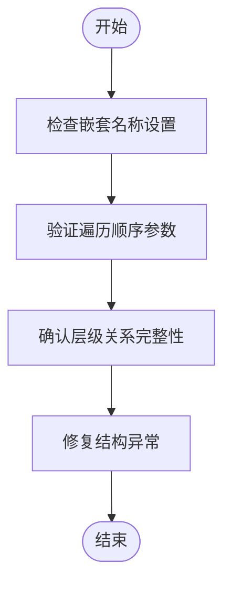
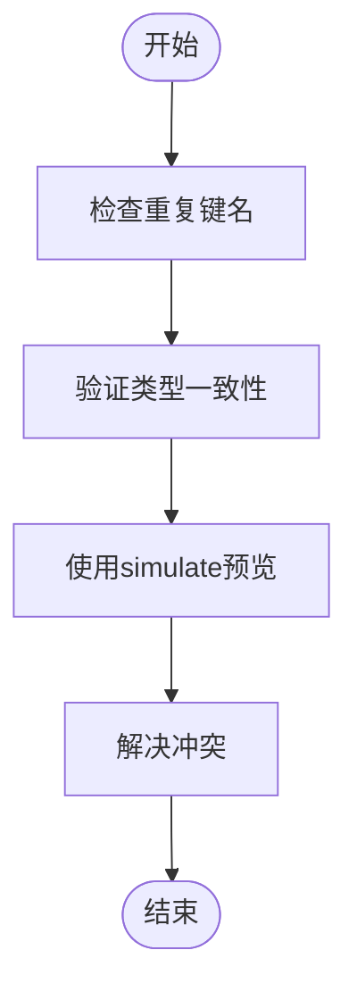
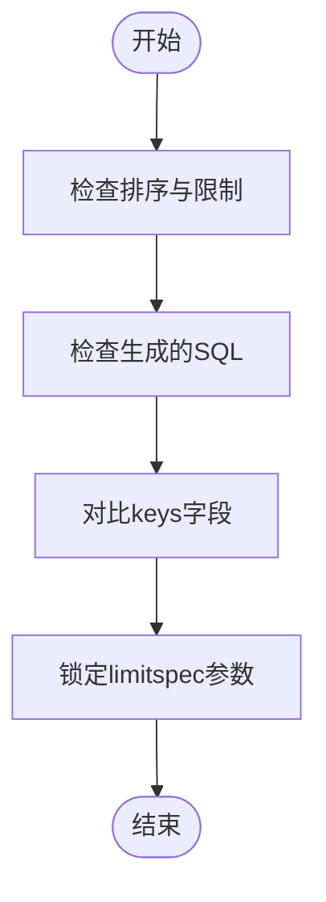

# 故障排除

<cite>
**本文档中引用的文件**  
- [subtotalsSpecExecutor.ts](file://src/expressions/subtotals/subtotalsSpecExecutor.ts)
- [subtotalsSpecQueryBuilder.ts](file://src/expressions/subtotals/subtotalsSpecQueryBuilder.ts)
- [subtotalsSpecResultProcessor.ts](file://src/expressions/subtotals/subtotalsSpecResultProcessor.ts)
- [subtotalsSpecTypes.ts](file://src/expressions/subtotals/subtotalsSpecTypes.ts)
- [splitExpression.ts](file://src/expressions/splitExpression.ts)
- [dataset.ts](file://src/datatypes/dataset.ts)
</cite>

## 目录
1. [引言](#引言)
2. [常见错误模式](#常见错误模式)
3. [层级结构异常诊断与修复](#层级结构异常诊断与修复)
4. [维度属性冲突处理](#维度属性冲突处理)
5. [limitspec不一致性问题](#limitspec不一致性问题)
6. [错误日志解读与查询合并失败分析](#错误日志解读与查询合并失败分析)
7. [调试技巧与验证工具使用](#调试技巧与验证工具使用)
8. [总结](#总结)

## 引言
本文档旨在为`subtotalsSpec`优化过程中可能遇到的问题提供详尽的故障排除指南。基于项目中的核心模块和测试用例，系统性地分析并解决在层级结构、维度属性及查询规范一致性方面可能出现的异常。通过深入理解数据处理流程和执行机制，帮助开发者快速定位问题根源并实施有效修复。

## 常见错误模式
在`subtotalsSpec`优化过程中，常见的错误模式主要包括：
- **层级结构异常**：数据集的嵌套层次不符合预期，导致汇总结果错乱。
- **维度属性冲突**：多个维度间存在命名或类型冲突，影响拆分操作的正确性。
- **limitspec不一致**：分页或排序规则在不同查询阶段不统一，造成结果偏差。

这些错误通常源于表达式构造不当、数据类型推断错误或执行上下文配置失误。

**Section sources**
- [subtotalsSpecTypes.ts](file://src/expressions/subtotals/subtotalsSpecTypes.ts#L1-L50)
- [splitExpression.ts](file://src/expressions/splitExpression.ts#L40-L92)

## 层级结构异常诊断与修复
层级结构异常主要表现为数据扁平化（flatten）后的顺序不符合预设的遍历方式（如前序或后序）。例如，在使用`flatten({ order: 'preorder' })`时，期望根节点优先输出，但实际结果中子节点提前出现。

### 诊断步骤
1. 检查`splitExpression`是否正确设置了嵌套键（nestingName）。
2. 验证`dataset.flatten()`调用参数中的`order`字段是否符合预期。
3. 确认原始数据集中各层级的父子关系是否完整且无断裂。

### 修复方案
确保在构建`SplitExpression`时，所有层级的拆分逻辑均遵循一致的命名约定，并在执行`flatten`前对数据进行完整性校验。

**Diagram sources**
- [dataset.ts](file://src/datatypes/dataset.ts#L885-L926)
- [splitExpression.ts](file://src/expressions/splitExpression.ts#L94-L142)

**Section sources**
- [dataset.ts](file://src/datatypes/dataset.ts#L885-L926)
- [splitExpression.ts](file://src/expressions/splitExpression.ts#L94-L142)

## 维度属性冲突处理
维度属性冲突常发生在多个`split`操作共享相同维度名或类型不匹配的情况下。此类问题会导致数据合并失败或返回空值。

### 诊断步骤
1. 审查`splits`对象中是否存在重复的键名。
2. 检查每个拆分表达式的返回类型是否与目标属性定义一致。
3. 使用`simulate`方法预览中间结果，识别潜在冲突点。

### 修复方案
采用唯一命名策略为每个拆分维度分配独立标识符，并通过`typeContext`更新机制确保类型一致性。

**Diagram sources**
- [splitExpression.ts](file://src/expressions/splitExpression.ts#L40-L92)
- [dataset.ts](file://src/datatypes/dataset.ts#L885-L926)

**Section sources**
- [splitExpression.ts](file://src/expressions/splitExpression.ts#L40-L92)
- [dataset.ts](file://src/datatypes/dataset.ts#L885-L926)

## limitspec不一致性问题
`limitspec`不一致通常体现在排序字段或限制数量在不同查询阶段发生变化，导致最终结果不可预测。

### 诊断步骤
1. 检查`sortExpression`和`limitExpression`是否在整个查询链中保持一致。
2. 确认`subtotalsSpecQueryBuilder`生成的SQL语句中`ORDER BY`和`LIMIT`子句是否符合预期。
3. 对比执行前后`Dataset`的`keys`字段变化情况。

### 修复方案
在查询构建阶段强制锁定`limitspec`参数，并通过单元测试验证其稳定性。

**Diagram sources**
- [subtotalsSpecQueryBuilder.ts](file://src/expressions/subtotals/subtotalsSpecQueryBuilder.ts#L1-L40)
- [subtotalsSpecExecutor.ts](file://src/expressions/subtotals/subtotalsSpecExecutor.ts#L1-L30)

**Section sources**
- [subtotalsSpecQueryBuilder.ts](file://src/expressions/subtotals/subtotalsSpecQueryBuilder.ts#L1-L40)
- [subtotalsSpecExecutor.ts](file://src/expressions/subtotals/subtotalsSpecExecutor.ts#L1-L30)

## 错误日志解读与查询合并失败分析
当查询合并失败时，错误日志通常会提示“expression lookup failed”或“incompatible dataset types”。这类信息表明在表达式解析或数据类型匹配阶段出现了问题。

### 根本原因定位
1. 查看日志中具体的表达式路径（如`$wiki.sum($count)`）。
2. 追踪该表达式所属的`apply`或`split`节点。
3. 验证其依赖的数据源是否存在或已被正确初始化。

### 解决策略
启用详细日志模式（verbose logging），结合`basicExecutor`模拟执行流程，逐步排查异常节点。

**Section sources**
- [subtotalsSpecResultProcessor.ts](file://src/expressions/subtotals/subtotalsSpecResultProcessor.ts#L1-L35)
- [basicExecutor.ts](file://src/executor/basicExecutor.ts#L1-L25)

## 调试技巧与验证工具使用
为确保`subtotalsSpec`功能稳定运行，推荐使用以下调试技巧：
- 利用`simulate`方法在不执行真实查询的情况下预览结果。
- 启用`verboseRequester`记录完整的请求与响应过程。
- 使用`Dataset.fromJS()`构造测试数据集进行隔离测试。

此外，可通过`plywood.js`提供的CLI工具直接运行Mocha测试用例，快速验证修复效果。

**Section sources**
- [simulate.mocha.js](file://test/expression/simulate.mocha.js#L56-L121)
- [compute.mocha.js](file://test/overall/compute.mocha.js#L602-L666)
- [verboseRequester.ts](file://src/helper/verboseRequester.ts#L1-L20)

## 总结
通过对`subtotalsSpec`优化过程中常见问题的系统性分析，本文档提供了从诊断到修复的完整解决方案。关键在于理解数据流的每个环节，合理配置表达式与执行上下文，并善用调试工具进行验证。未来应加强自动化测试覆盖，预防类似问题再次发生。