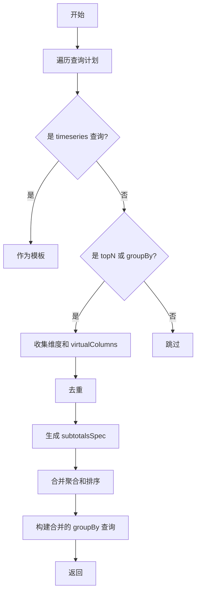
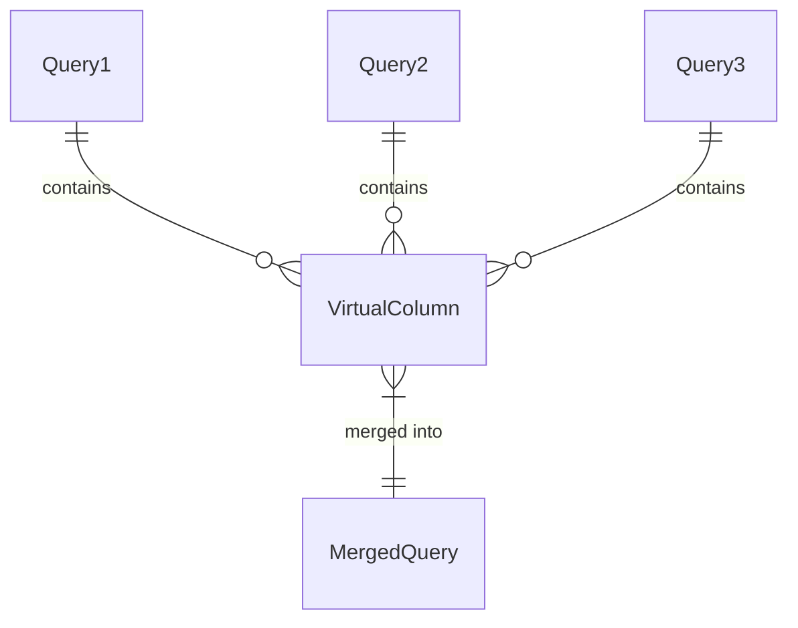

# 查询优化

<cite>
**本文档引用文件**  
- [baseExpression.ts](file://src/expressions/baseExpression.ts)
- [subtotalsSpecHelper.ts](file://src/expressions/subtotalsSpecHelper.ts)
- [subtotalsSpecQueryBuilder.ts](file://src/expressions/subtotals/subtotalsSpecQueryBuilder.ts)
- [subtotalsSpecExecutor.ts](file://src/expressions/subtotals/subtotalsSpecExecutor.ts)
- [subtotalsSpecResultProcessor.ts](file://src/expressions/subtotals/subtotalsSpecResultProcessor.ts)
- [subtotalsSpecTypes.ts](file://src/expressions/subtotals/subtotalsSpecTypes.ts)
- [test_subtotals_optimization.js](file://tests/subtotals/test_subtotals_optimization.js)
- [test_dimension_dedup.js](file://tests/subtotals/test_dimension_dedup.js)
- [test_virtualcolumns_merge.js](file://tests/subtotals/test_virtualcolumns_merge.js)
</cite>

## 目录
1. [引言](#引言)
2. [优化原理](#优化原理)
3. [_computeWithSubtotalsSpec() 方法分析](#_computewithsubtotalsspec-方法分析)
4. [_mergeQueriesWithSubtotalsSpec() 方法分析](#_mergequerieswithsubtotalsspec-方法分析)
5. [配置与启用](#配置与启用)
6. [高级话题](#高级话题)
7. [测试用例与验证](#测试用例与验证)
8. [性能分析](#性能分析)
9. [故障排除指南](#故障排除指南)
10. [结论](#结论)

## 引言

本文档旨在深入解析 Plywood 框架中 `subtotalsSpec` 查询优化的实现机制。该优化通过利用 Apache Druid 的 `subtotalsSpec` 特性，将原本需要 N+1 次的多维度查询合并为单次 `groupBy` 查询，从而显著提升查询性能。文档将详细阐述其核心方法的实现逻辑、配置方式、高级特性，并结合测试用例说明其在真实场景中的应用。

## 优化原理

`subtotalsSpec` 优化的核心思想是**查询合并**。在传统的多维度分析中，为了获取不同维度组合的聚合结果（如总计、各维度层级的汇总），系统通常需要执行多次独立的查询（N+1 次）。这不仅增加了网络开销，也给 Druid 集群带来了巨大压力。

`subtotalsSpec` 优化通过以下步骤实现性能飞跃：

1.  **查询计划生成**：系统首先生成一个包含多个查询的计划（Query Plan），其中通常包含一个用于获取总计的 `timeseries` 查询和多个用于获取不同维度组合的 `topN` 或 `groupBy` 查询。
2.  **查询合并**：优化器将这些独立的查询合并成一个单一的 `groupBy` 查询。这个查询的 `dimensions` 字段包含了所有需要分析的维度。
3.  **生成 subtotalsSpec**：这是优化的关键。系统会根据所有维度的组合，生成一个 `subtotalsSpec` 数组。该数组定义了所有需要计算的维度组合层级。例如，对于维度 A、B、C，`subtotalsSpec` 会包含 `[A,B,C]`、`[A,B]`、`[A]` 和 `[]`（总计）等组合。
4.  **单次执行**：Druid 引擎接收到这个带有 `subtotalsSpec` 的 `groupBy` 查询后，会在一次扫描中计算出所有指定组合的聚合结果。
5.  **结果处理**：Plywood 接收到扁平化的结果后，通过 `_buildHierarchicalDataset()` 等方法，将结果重新组织成具有层级结构的 `Dataset`，供上层应用使用。

通过这种方式，网络往返次数从 N+1 次减少到 1 次，查询执行时间通常能获得 60-90% 的提升。

**Diagram sources**
- [subtotalsSpecQueryBuilder.ts](file://src/expressions/subtotals/subtotalsSpecQueryBuilder.ts#L150-L260)

## _computeWithSubtotalsSpec() 方法分析

`_computeWithSubtotalsSpec()` 是整个优化流程的入口和协调者。它位于 `baseExpression.ts` 中，但其核心逻辑已委托给 `subtotalsSpecHelper.ts` 以实现更好的模块化。

该方法的执行流程如下：

1.  **提取拆分表达式**：调用 `_extractSplitExpressionsFromExternals()` 方法，从当前表达式中提取出所有用于分组的维度表达式（Split Expressions），并存储在一个 `Map` 中，以保留其原始的表达式信息。
2.  **生成查询计划**：使用一个独立的表达式副本调用 `simulateQueryPlan()` 方法，生成一个包含多个查询的计划数组（`QueryPlan`）。
3.  **提取总计查询**：从查询计划中找出一个 `timeseries` 查询作为获取总计数据的模板。
4.  **提取 Having 过滤器**：分析表达式中的过滤条件，特别是针对聚合结果的过滤（如 `HAVING activation > 1000`），并将其转换为 Druid 的 `having` 过滤器。
5.  **合并查询**：调用 `buildMergedQuery()` 方法，将查询计划中的所有维度查询合并为一个带有 `subtotalsSpec` 的 `groupBy` 查询。
6.  **并行执行与结果合并**：调用 `executeQueriesInParallel()`，并行执行合并后的 `groupBy` 查询和 `timeseries` 总计查询，然后将结果合并并构建成最终的层级化数据集。

此方法通过协调各个子模块，实现了从原始表达式到优化后查询的完整转换。

**Section sources**
- [subtotalsSpecHelper.ts](file://src/expressions/subtotalsSpecHelper.ts#L295-L364)
- [baseExpression.ts](file://src/expressions/baseExpression.ts)

## _mergeQueriesWithSubtotalsSpec() 方法分析

`_mergeQueriesWithSubtotalsSpec()` 的核心逻辑实现在 `buildMergedQuery()` 函数中，位于 `subtotalsSpecQueryBuilder.ts` 文件内。

该函数的主要职责是将一个查询计划（`QueryPlan`）合并成一个单一的、优化的 `groupBy` 查询。其关键步骤包括：

1.  **寻找模板**：遍历查询计划，找到第一个 `timeseries` 查询作为新 `groupBy` 查询的模板，继承其数据源、时间间隔、过滤器等基础属性。
2.  **合并维度**：收集所有 `topN` 和 `groupBy` 查询中的维度。使用 `Map` 数据结构（以维度名称为键）来自动去重，确保每个维度只出现一次。
3.  **合并虚拟列 (virtualColumns)**：同样地，收集所有查询中的 `virtualColumns` 并去重。这对于处理包含 `lookup` 或复杂表达式计算的维度至关重要，确保所有必要的计算都在单次查询中完成。
4.  **生成 subtotalsSpec**：根据去重后的维度列表，生成 `subtotalsSpec` 数组。算法会从完整维度组合开始，逐个移除最后一个维度，形成一个递减的组合列表，最后添加一个空数组 `[]` 表示总计层。
5.  **合并聚合**：合并所有查询中的 `aggregations` 和 `postAggregations`。如果维度查询中没有聚合，则回退到 `timeseries` 模板查询中的聚合。
6.  **合并排序**：处理 `topN` 查询中的排序逻辑，将其转换为 `groupBy` 查询的 `limitSpec`，以保证结果的顺序。
7.  **返回合并查询**：最终返回一个结构完整的 `groupBy` 查询对象，其中包含了 `dimensions`、`subtotalsSpec`、`aggregations` 等所有必要字段。



**Diagram sources**
- [subtotalsSpecQueryBuilder.ts](file://src/expressions/subtotals/subtotalsSpecQueryBuilder.ts#L150-L260)

## 配置与启用

要启用 `subtotalsSpec` 优化，需要在查询的 `customOptions` 中进行配置。

### 启用配置

在执行查询时，将 `customOptions.useSubtotalsSpec` 设置为 `true`：

```javascript
const options = {
  customOptions: {
    useSubtotalsSpec: true,
    // 可选：设置最大查询数量
    maxQueries: 1000
  },
  rawQueries: true
};

// 执行查询
const result = await expression.compute(context, options);
```

### 完整使用示例

```javascript
const { Expression, ply, $( '$' ) } = require('plywood');

// 构建一个包含多维度拆分的表达式
const query = ply()
  .filter($('action_type').is('INSTALL'))
  .split($('platform'), 'platform')
  .split($('network_name'), 'network')
  .split($('app').lookup('app_convert'), 'app')
  .apply('activation', $('main').sum('$isInstall'))
  .apply('current_pu', $('main').countDistinct('$user_id'));

// 启用 subtotalsSpec 优化
const options = {
  customOptions: {
    useSubtotalsSpec: true
  }
};

// 执行查询
const dataset = await query.compute(context, options);
```

**Section sources**
- [subtotalsSpecHelper.ts](file://src/expressions/subtotalsSpecHelper.ts#L295-L364)

## 高级话题

### 维度去重

在合并查询时，不同查询中可能包含相同的维度（例如，多个 `groupBy` 查询都使用了 `platform` 维度）。`buildMergedQuery()` 函数通过使用 `Map` 数据结构，以维度的 `dimension` 或 `outputName` 作为键，确保了维度的唯一性，避免了重复计算。

### virtualColumns 合并

`virtualColumns` 是 Druid 中用于在查询时进行数据转换的强大功能。在合并查询时，系统会收集所有查询中的 `virtualColumns`，并根据其 `name` 字段进行去重。这确保了所有必要的数据转换（如 `lookup` 查找、表达式计算）都能在单次查询中完成，而不会遗漏或重复。



**Diagram sources**
- [subtotalsSpecQueryBuilder.ts](file://src/expressions/subtotals/subtotalsSpecQueryBuilder.ts#L150-L260)
- [test_virtualcolumns_merge.js](file://tests/subtotals/test_virtualcolumns_merge.js)

## 测试用例与验证

`tests/subtotals/` 目录下的测试用例是验证 `subtotalsSpec` 优化功能正确性的关键。

### 核心测试用例

- **test_subtotals_optimization.js**：验证 `isMultiSplit()` 方法和 `generateSubtotalsSpec()` 方法的正确性，确保多维度拆分能生成预期的 `subtotalsSpec` 数组。
- **test_dimension_dedup.js**：通过模拟包含重复维度的查询计划，验证维度去重逻辑的有效性。
- **test_virtualcolumns_merge.js**：通过模拟包含 `virtualColumns` 的查询计划，验证 `virtualColumns` 的合并与去重是否正确。

### 验证方法

测试通常采用以下模式：
1.  **构造模拟数据**：创建一个模拟的查询计划（`mockQueryPlan`），包含预期的查询结构。
2.  **调用核心函数**：直接调用 `buildMergedQuery()` 等核心函数，传入模拟数据。
3.  **断言结果**：检查返回的合并查询对象，验证其 `dimensions`、`subtotalsSpec`、`virtualColumns` 等字段是否符合预期。

这些测试确保了优化器在各种复杂场景下都能生成正确、高效的查询。

**Section sources**
- [test_subtotals_optimization.js](file://tests/subtotals/test_subtotals_optimization.js)
- [test_dimension_dedup.js](file://tests/subtotals/test_dimension_dedup.js)
- [test_virtualcolumns_merge.js](file://tests/subtotals/test_virtualcolumns_merge.js)

## 性能分析

`subtotalsSpec` 优化带来的性能提升是显著的：

- **网络开销**：从 N+1 次 HTTP 请求减少到 1 次，极大地降低了网络延迟和客户端/服务端的连接开销。
- **Druid 集群负载**：减少了对 Druid Broker 和 Historical 节点的查询压力，提高了集群的整体吞吐量。
- **查询延迟**：由于数据只需扫描一次，总查询时间通常能缩短 60-90%。对于维度较多的复杂查询，提升效果更为明显。

然而，需要注意的是，单个 `groupBy` 查询的复杂度会增加，因为它需要计算所有组合。在极端情况下（如维度数量过多），单个查询的执行时间可能会变长。因此，`maxQueries` 参数可用于限制 `subtotalsSpec` 的大小，以平衡性能和查询复杂度。

## 故障排除指南

### 常见问题

1.  **优化未生效**：
    *   **检查**：确认 `customOptions.useSubtotalsSpec` 是否设置为 `true`。
    *   **检查**：确认表达式是否包含多个维度的 `split`（即 `isMultiSplit()` 返回 `true`）。
2.  **结果不正确**：
    *   **检查**：验证 `having` 过滤器是否被正确转换。复杂的 `HAVING` 条件可能不被完全支持。
    *   **检查**：检查 `virtualColumns` 是否在合并后丢失或出错。
3.  **查询超时**：
    *   **检查**：合并后的查询可能过于复杂。尝试减少维度数量或调整 `maxQueries` 限制。

### 调试方法

- **启用 `rawQueries`**：在 `options` 中设置 `rawQueries: true`，可以打印出实际发送给 Druid 的查询 JSON，便于分析问题。
- **查看测试用例**：参考 `tests/subtotals/` 中的测试代码，了解正确的用法和预期行为。

**Section sources**
- [subtotalsSpecExecutor.ts](file://src/expressions/subtotals/subtotalsSpecExecutor.ts)
- [subtotalsSpecResultProcessor.ts](file://src/expressions/subtotals/subtotalsSpecResultProcessor.ts)

## 结论

`subtotalsSpec` 查询优化是 Plywood 框架中一项强大的性能优化技术。它通过巧妙地利用 Druid 的 `subtotalsSpec` 特性，将多次查询合并为一次，实现了查询性能的质的飞跃。通过对 `_computeWithSubtotalsSpec()` 和 `_mergeQueriesWithSubtotalsSpec()` 等核心方法的深入分析，我们可以看到其设计的精巧之处：模块化、可测试性强，并且通过 `Map` 去重等机制妥善处理了维度和虚拟列的合并问题。结合详尽的测试用例和合理的配置，开发者可以安全、高效地利用此优化，为数据分析应用带来显著的性能提升。