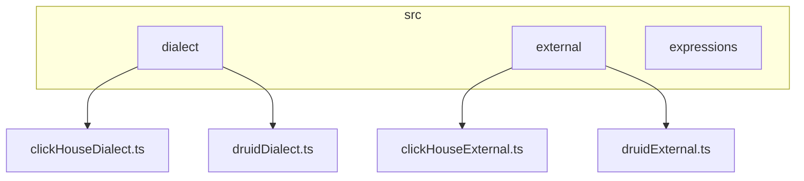
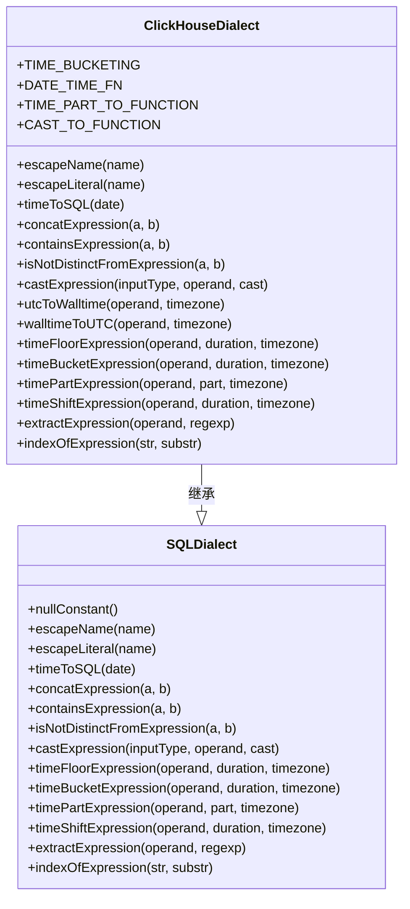
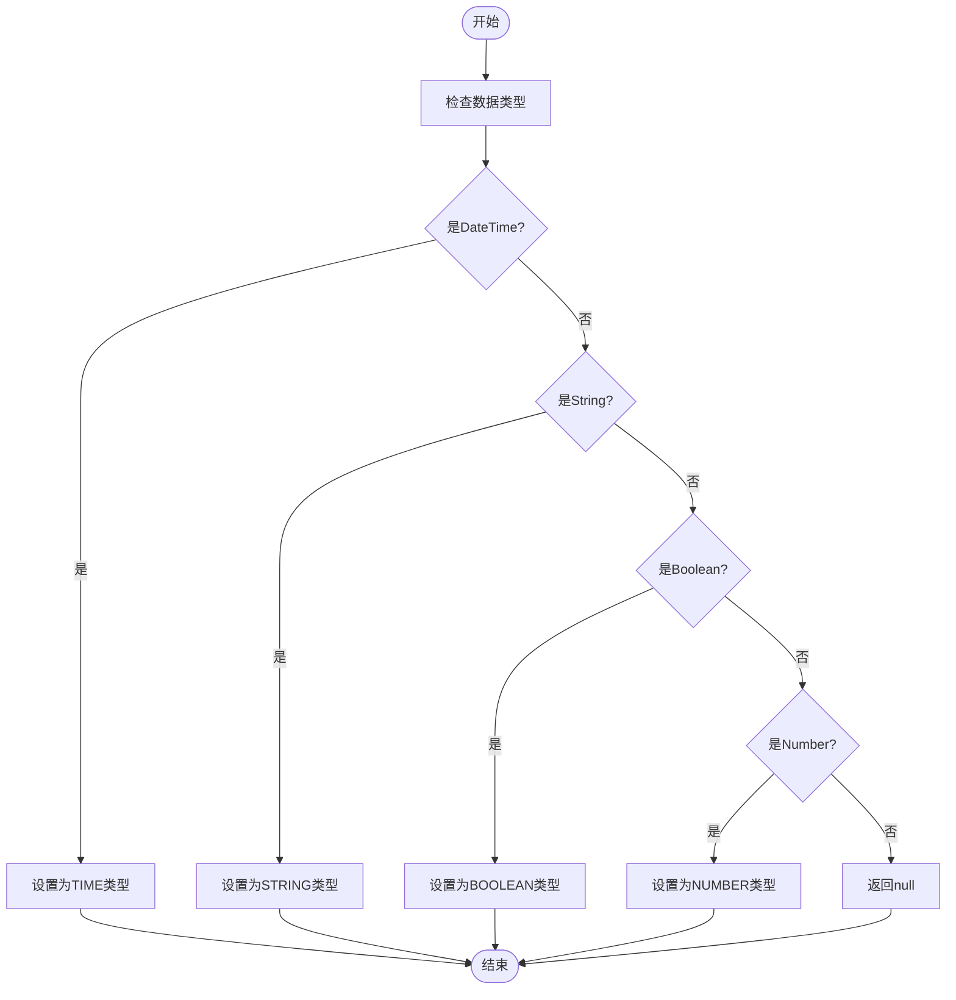
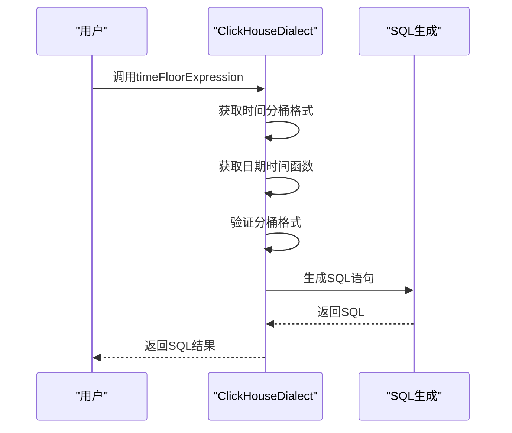
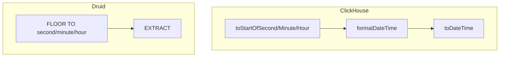
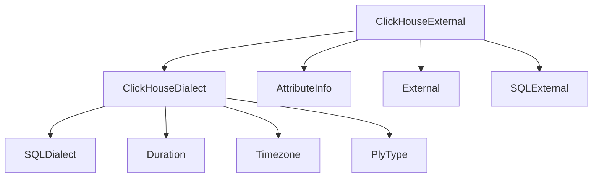

# ClickHouse方言

<cite>
**本文档引用的文件**   
- [clickHouseDialect.ts](file://src/dialect/clickHouseDialect.ts)
- [baseDialect.ts](file://src/dialect/baseDialect.ts)
- [clickHouseExternal.ts](file://src/external/clickHouseExternal.ts)
- [druidDialect.ts](file://src/dialect/druidDialect.ts)
</cite>

## 目录
1. [简介](#简介)
2. [项目结构](#项目结构)
3. [核心组件](#核心组件)
4. [架构概述](#架构概述)
5. [详细组件分析](#详细组件分析)
6. [依赖分析](#依赖分析)
7. [性能考虑](#性能考虑)
8. [故障排除指南](#故障排除指南)
9. [结论](#结论)

## 简介
本文档深入探讨了ClickHouse方言的查询生成机制，重点分析了clickHouseDialect.ts如何处理ClickHouse特有的数据类型、聚合函数和时间函数的转换逻辑。文档详细解析了ClickHouse高性能查询的关键实现，包括数据分片键、排序键的利用，以及近似计算函数的映射。通过实际案例展示了复杂分析查询的SQL生成过程，并提供了性能优化技巧、语法限制以及与其他分析型数据库方言的对比。

## 项目结构
项目结构清晰地组织了各个模块，其中src/dialect目录包含了ClickHouse和Druid方言的实现，src/external目录包含了外部数据源的处理逻辑。

**Diagram sources**
- [clickHouseDialect.ts](file://src/dialect/clickHouseDialect.ts#L4-L161)
- [druidDialect.ts](file://src/dialect/druidDialect.ts#L20-L175)
- [clickHouseExternal.ts](file://src/external/clickHouseExternal.ts#L25-L62)

**Section sources**
- [clickHouseDialect.ts](file://src/dialect/clickHouseDialect.ts#L4-L161)
- [druidDialect.ts](file://src/dialect/druidDialect.ts#L20-L175)

## 核心组件
ClickHouse方言的核心组件包括数据类型处理、聚合函数转换和时间函数处理。这些组件共同实现了ClickHouse特有的查询生成机制。

**Section sources**
- [clickHouseDialect.ts](file://src/dialect/clickHouseDialect.ts#L4-L161)
- [clickHouseExternal.ts](file://src/external/clickHouseExternal.ts#L25-L62)

## 架构概述
ClickHouse方言的架构基于SQLDialect基类，通过重写各种方法来实现ClickHouse特有的SQL生成逻辑。该架构支持数据类型转换、聚合函数映射和时间函数处理。

**Diagram sources**
- [baseDialect.ts](file://src/dialect/baseDialect.ts#L21-L172)
- [clickHouseDialect.ts](file://src/dialect/clickHouseDialect.ts#L4-L161)

## 详细组件分析

### ClickHouse方言分析
ClickHouse方言通过重写基类方法来实现ClickHouse特有的SQL生成逻辑。它处理了数据类型转换、聚合函数映射和时间函数处理。

#### 数据类型处理

**Diagram sources**
- [clickHouseExternal.ts](file://src/external/clickHouseExternal.ts#L25-L62)

#### 时间函数处理

**Diagram sources**
- [clickHouseDialect.ts](file://src/dialect/clickHouseDialect.ts#L119-L135)

**Section sources**
- [clickHouseDialect.ts](file://src/dialect/clickHouseDialect.ts#L4-L161)
- [clickHouseExternal.ts](file://src/external/clickHouseExternal.ts#L25-L62)

### Druid方言对比
ClickHouse方言与Druid方言在时间函数处理上有显著差异。Druid使用FLOOR函数进行时间分桶，而ClickHouse使用toStartOf系列函数。

**Diagram sources**
- [clickHouseDialect.ts](file://src/dialect/clickHouseDialect.ts#L119-L135)
- [druidDialect.ts](file://src/dialect/druidDialect.ts#L145-L150)

## 依赖分析
ClickHouse方言依赖于多个核心组件，包括数据类型处理、外部数据源处理和SQL方言基类。

**Diagram sources**
- [clickHouseDialect.ts](file://src/dialect/clickHouseDialect.ts#L4-L161)
- [clickHouseExternal.ts](file://src/external/clickHouseExternal.ts#L25-L62)

**Section sources**
- [clickHouseDialect.ts](file://src/dialect/clickHouseDialect.ts#L4-L161)
- [clickHouseExternal.ts](file://src/external/clickHouseExternal.ts#L25-L62)

## 性能考虑
ClickHouse方言的性能优化主要体现在以下几个方面：
- 使用toStartOf系列函数进行高效的时间分桶
- 通过CAST函数实现高效的数据类型转换
- 利用ClickHouse原生函数进行字符串操作

## 故障排除指南
在使用ClickHouse方言时可能遇到的常见问题包括：
- 时间分桶格式不支持
- 数据类型转换错误
- 外部数据源连接问题

**Section sources**
- [clickHouseDialect.ts](file://src/dialect/clickHouseDialect.ts#L119-L135)
- [clickHouseExternal.ts](file://src/external/clickHouseExternal.ts#L64-L105)

## 结论
ClickHouse方言通过重写SQLDialect基类的方法，实现了ClickHouse特有的查询生成机制。它有效地处理了数据类型转换、聚合函数映射和时间函数处理，为使用ClickHouse的用户提供了专业的指导。