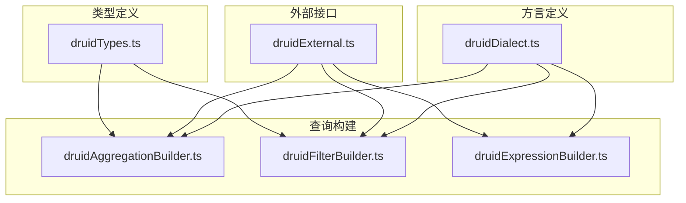
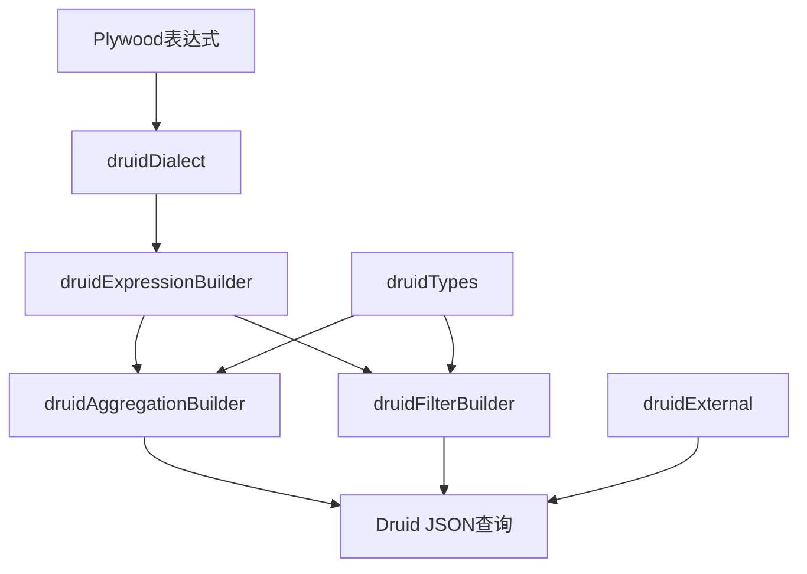
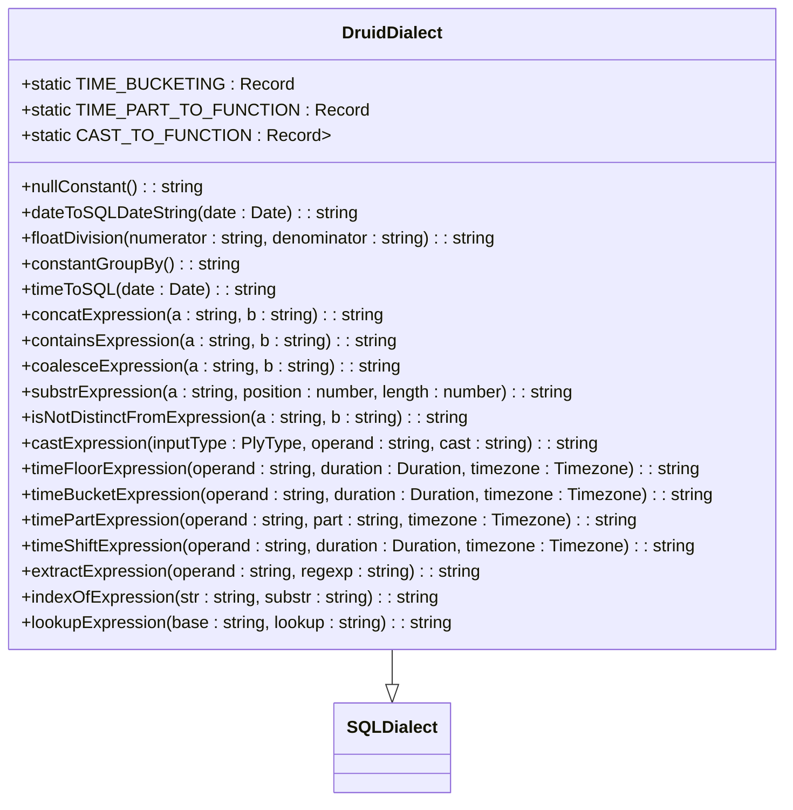
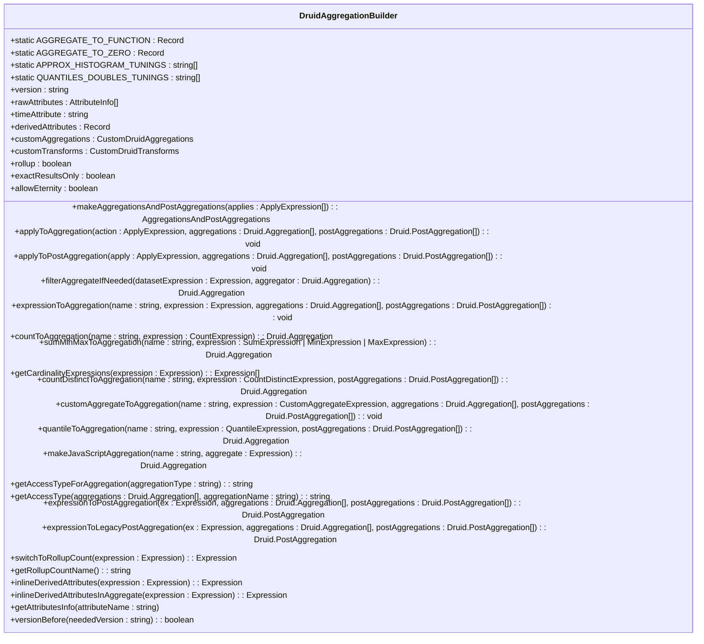
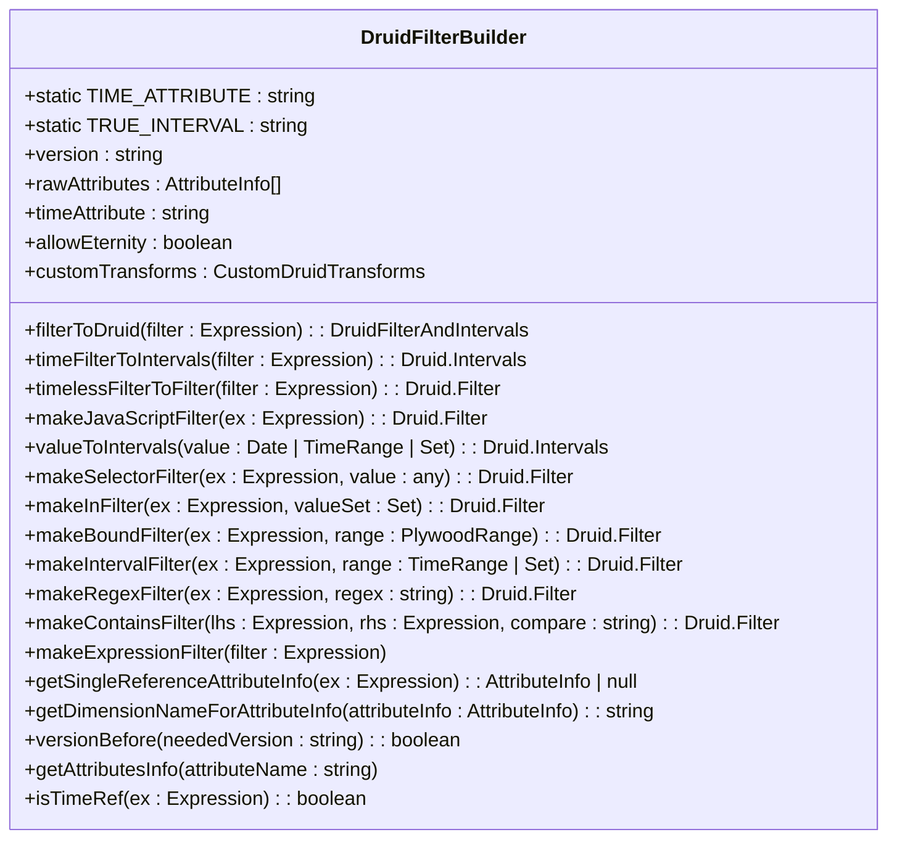
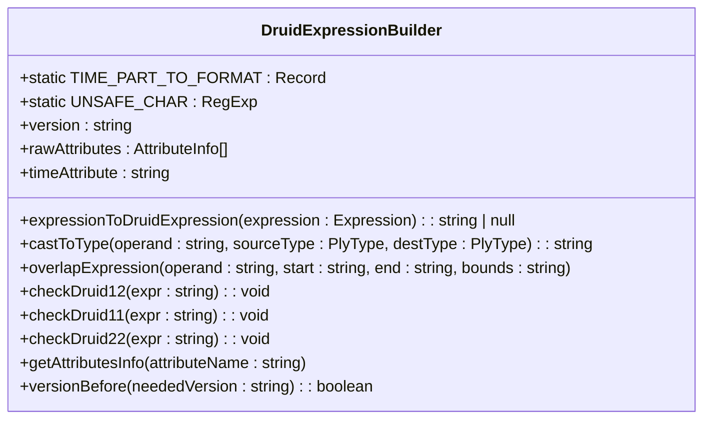
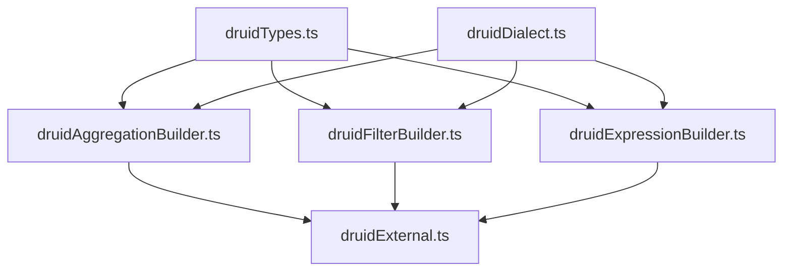

# Druid方言

<cite>
**本文档中引用的文件**   
- [druidDialect.ts](file://src/dialect/druidDialect.ts)
- [druidAggregationBuilder.ts](file://src/external/utils/druidAggregationBuilder.ts)
- [druidFilterBuilder.ts](file://src/external/utils/druidFilterBuilder.ts)
- [druidExpressionBuilder.ts](file://src/external/utils/druidExpressionBuilder.ts)
- [druidExternal.ts](file://src/external/druidExternal.ts)
- [druidTypes.ts](file://src/external/utils/druidTypes.ts)
</cite>

## 目录
1. [简介](#简介)
2. [项目结构](#项目结构)
3. [核心组件](#核心组件)
4. [架构概述](#架构概述)
5. [详细组件分析](#详细组件分析)
6. [依赖分析](#依赖分析)
7. [性能考虑](#性能考虑)
8. [故障排除指南](#故障排除指南)
9. [结论](#结论)

## 简介
本文档详细描述了Druid方言的实现机制，重点介绍其作为Plywood到Druid JSON查询转换器的功能。文档深入解析了如何将Plywood表达式编译为Druid原生的JSON格式查询，包括聚合、过滤、时间分组等操作的转换逻辑。同时解释了Druid特有的查询结构如dataSources、intervals、aggregations、postAggregations的生成方式。

## 项目结构
Plywood项目的结构清晰地组织了与Druid相关的组件，主要分为方言定义、外部查询构建和工具类三个部分。核心的Druid方言实现位于`src/dialect/`目录下，而查询构建逻辑则分布在`src/external/utils/`目录中。

**Diagram sources**
- [druidDialect.ts](file://src/dialect/druidDialect.ts)
- [druidAggregationBuilder.ts](file://src/external/utils/druidAggregationBuilder.ts)
- [druidFilterBuilder.ts](file://src/external/utils/druidFilterBuilder.ts)
- [druidExpressionBuilder.ts](file://src/external/utils/druidExpressionBuilder.ts)
- [druidExternal.ts](file://src/external/druidExternal.ts)
- [druidTypes.ts](file://src/external/utils/druidTypes.ts)

**Section sources**
- [druidDialect.ts](file://src/dialect/druidDialect.ts)
- [druidAggregationBuilder.ts](file://src/external/utils/druidAggregationBuilder.ts)
- [druidFilterBuilder.ts](file://src/external/utils/druidFilterBuilder.ts)
- [druidExpressionBuilder.ts](file://src/external/utils/druidExpressionBuilder.ts)
- [druidExternal.ts](file://src/external/druidExternal.ts)

## 核心组件
Druid方言的核心组件包括查询表达式构建器、聚合构建器、过滤器构建器和类型定义。这些组件协同工作，将Plywood表达式转换为Druid原生的JSON查询格式。`druidDialect.ts`定义了Druid特有的语法转换规则，而`druidAggregationBuilder.ts`和`druidFilterBuilder.ts`则负责构建复杂的聚合和过滤逻辑。

**Section sources**
- [druidDialect.ts](file://src/dialect/druidDialect.ts)
- [druidAggregationBuilder.ts](file://src/external/utils/druidAggregationBuilder.ts)
- [druidFilterBuilder.ts](file://src/external/utils/druidFilterBuilder.ts)

## 架构概述
Druid方言的架构基于分层设计，从Plywood表达式到Druid JSON查询的转换过程涉及多个构建器组件的协作。整个转换流程始于`druidDialect.ts`中的基础语法转换，然后由专门的构建器处理复杂的查询元素。

**Diagram sources**
- [druidDialect.ts](file://src/dialect/druidDialect.ts)
- [druidAggregationBuilder.ts](file://src/external/utils/druidAggregationBuilder.ts)
- [druidFilterBuilder.ts](file://src/external/utils/druidFilterBuilder.ts)
- [druidExpressionBuilder.ts](file://src/external/utils/druidExpressionBuilder.ts)
- [druidExternal.ts](file://src/external/druidExternal.ts)

## 详细组件分析

### Druid方言实现分析
`DruidDialect`类继承自`SQLDialect`，实现了Druid特有的语法转换规则。它定义了时间分桶、时间部分提取和类型转换等静态映射表，这些映射表用于将Plywood表达式转换为Druid兼容的SQL格式。

**Diagram sources**
- [druidDialect.ts](file://src/dialect/druidDialect.ts)

**Section sources**
- [druidDialect.ts](file://src/dialect/druidDialect.ts)

### 聚合构建器分析
`DruidAggregationBuilder`负责将Plywood的聚合表达式转换为Druid的聚合和后聚合结构。它支持多种聚合类型，包括计数、求和、最小值、最大值、去重计数和分位数计算。

**Diagram sources**
- [druidAggregationBuilder.ts](file://src/external/utils/druidAggregationBuilder.ts)

**Section sources**
- [druidAggregationBuilder.ts](file://src/external/utils/druidAggregationBuilder.ts)

### 过滤器构建器分析
`DruidFilterBuilder`负责将Plywood的过滤表达式转换为Druid的过滤器结构。它支持多种过滤类型，包括选择器过滤、范围过滤、正则表达式过滤和包含过滤。

**Diagram sources**
- [druidFilterBuilder.ts](file://src/external/utils/druidFilterBuilder.ts)

**Section sources**
- [druidFilterBuilder.ts](file://src/external/utils/druidFilterBuilder.ts)

### 表达式构建器分析
`DruidExpressionBuilder`负责将Plywood表达式转换为Druid表达式语言。它支持多种表达式类型，包括字符串操作、数学运算、时间操作和逻辑运算。

**Diagram sources**
- [druidExpressionBuilder.ts](file://src/external/utils/druidExpressionBuilder.ts)

**Section sources**
- [druidExpressionBuilder.ts](file://src/external/utils/druidExpressionBuilder.ts)

## 依赖分析
Druid方言的各个组件之间存在明确的依赖关系。`druidDialect.ts`作为基础组件被其他构建器组件所依赖，而`druidTypes.ts`提供了类型定义，被所有构建器组件所引用。

**Diagram sources**
- [druidDialect.ts](file://src/dialect/druidDialect.ts)
- [druidAggregationBuilder.ts](file://src/external/utils/druidAggregationBuilder.ts)
- [druidFilterBuilder.ts](file://src/external/utils/druidFilterBuilder.ts)
- [druidExpressionBuilder.ts](file://src/external/utils/druidExpressionBuilder.ts)
- [druidExternal.ts](file://src/external/druidExternal.ts)
- [druidTypes.ts](file://src/external/utils/druidTypes.ts)

**Section sources**
- [druidDialect.ts](file://src/dialect/druidDialect.ts)
- [druidAggregationBuilder.ts](file://src/external/utils/druidAggregationBuilder.ts)
- [druidFilterBuilder.ts](file://src/external/utils/druidFilterBuilder.ts)
- [druidExpressionBuilder.ts](file://src/external/utils/druidExpressionBuilder.ts)
- [druidExternal.ts](file://src/external/druidExternal.ts)
- [druidTypes.ts](file://src/external/utils/druidTypes.ts)

## 性能考虑
在使用Druid方言时，需要考虑以下性能优化建议：
1. 尽量使用Druid原生支持的聚合函数，避免使用JavaScript聚合
2. 对于时间分组操作，使用合适的分桶间隔以减少查询复杂度
3. 在过滤条件中优先使用选择器过滤而非表达式过滤
4. 对于去重计数，根据数据特性和精度要求选择合适的近似算法
5. 合理设置查询上下文参数以优化查询执行

## 故障排除指南
在使用Druid方言时可能遇到的常见问题及解决方案：
1. **查询超时**：检查过滤条件是否过于宽泛，添加更具体的时间范围过滤
2. **内存不足**：减少聚合维度数量或使用近似聚合函数
3. **语法错误**：验证Plywood表达式是否符合Druid方言的语法要求
4. **版本兼容性**：确认Druid集群版本与客户端库版本的兼容性
5. **数据精度问题**：对于需要精确结果的场景，避免使用近似算法

**Section sources**
- [druidDialect.ts](file://src/dialect/druidDialect.ts)
- [druidAggregationBuilder.ts](file://src/external/utils/druidAggregationBuilder.ts)
- [druidFilterBuilder.ts](file://src/external/utils/druidFilterBuilder.ts)
- [druidExpressionBuilder.ts](file://src/external/utils/druidExpressionBuilder.ts)

## 结论
Druid方言作为Plywood到Druid JSON查询的转换器，提供了一套完整的机制来处理复杂的查询转换需求。通过分层的架构设计和模块化的组件实现，它能够高效地将Plywood表达式转换为Druid原生的查询格式。理解其内部实现机制有助于开发者更好地利用这一工具，优化查询性能并解决可能出现的问题。