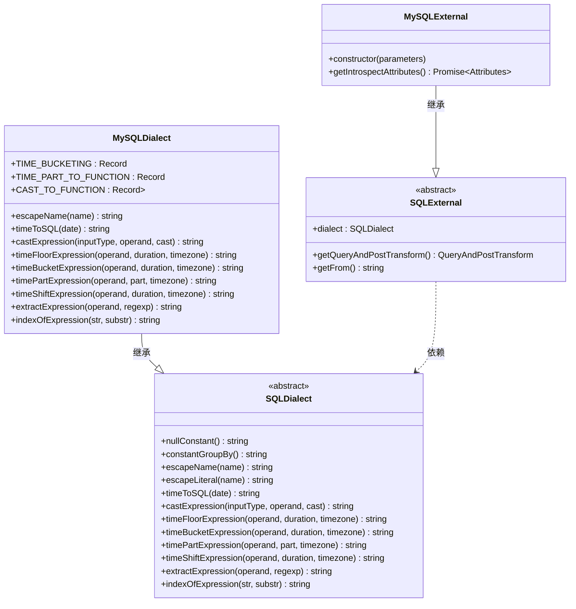
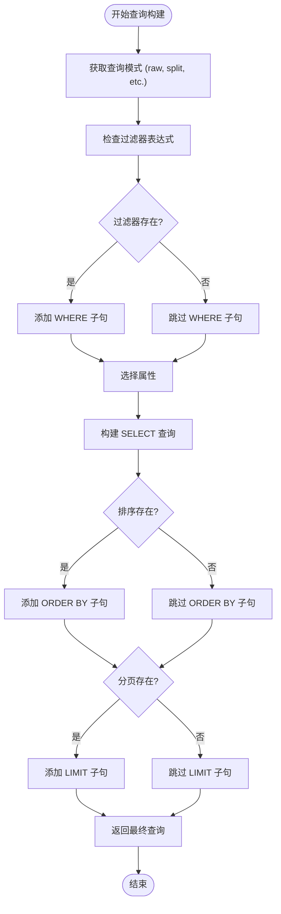
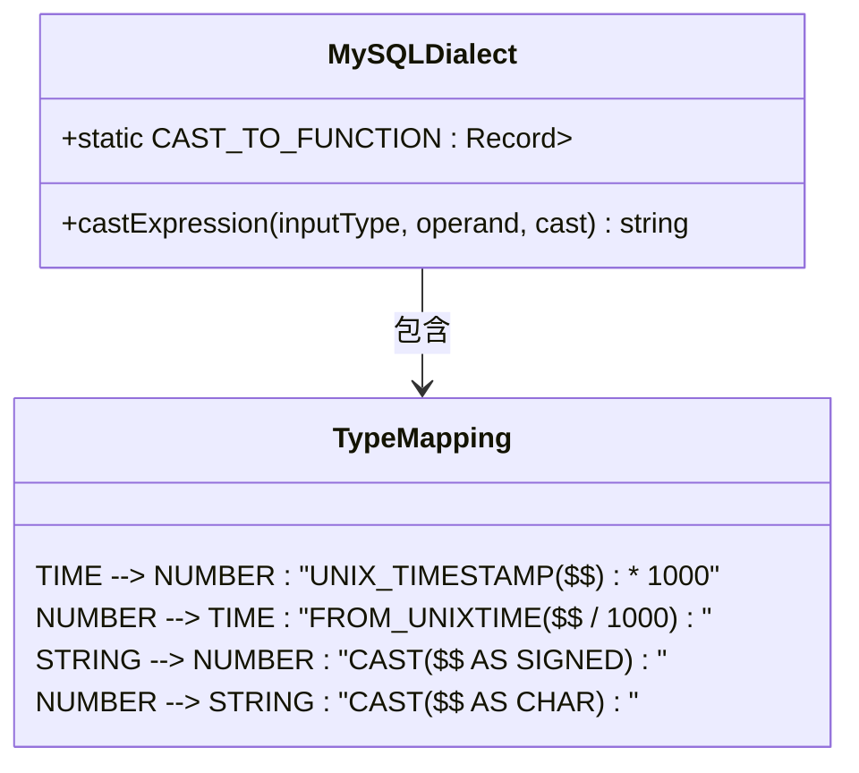
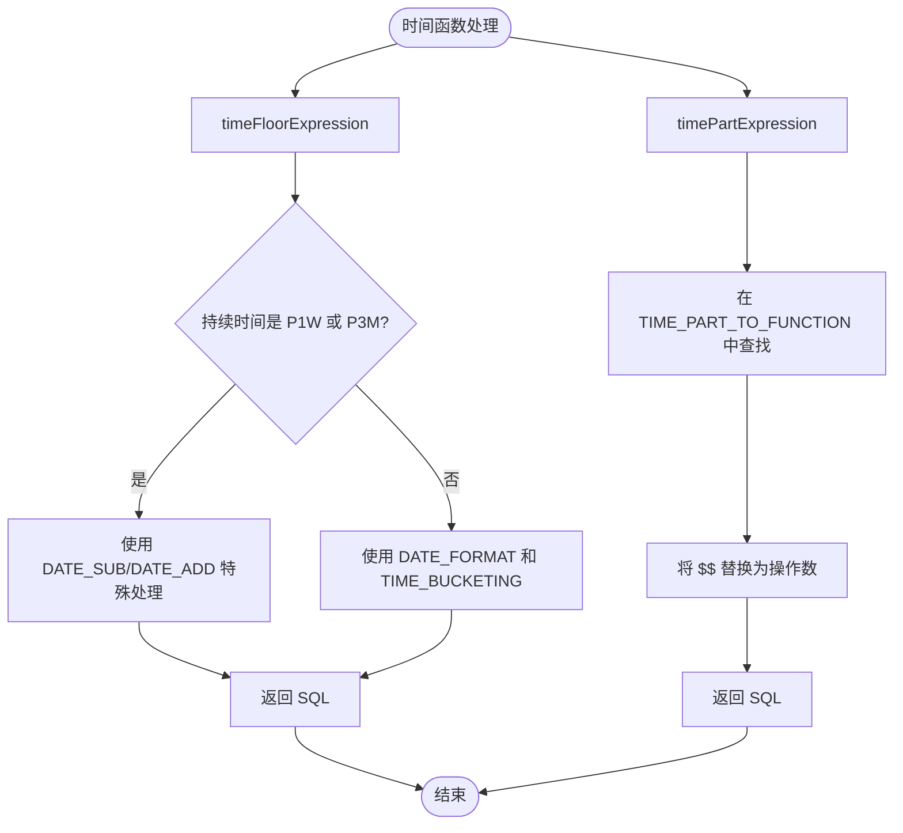
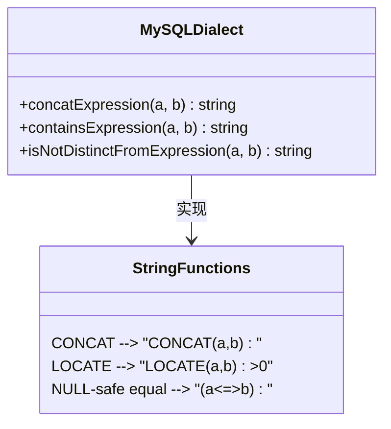

# MySQL方言

<cite>
**Referenced Files in This Document**   
- [mySqlDialect.ts](file://src/dialect/mySqlDialect.ts)
- [baseDialect.ts](file://src/dialect/baseDialect.ts)
- [mySqlExternal.ts](file://src/external/mySqlExternal.ts)
- [sqlExternal.ts](file://src/external/sqlExternal.ts)
</cite>

## 目录
1. [简介](#简介)
2. [核心架构与继承关系](#核心架构与继承关系)
3. [SQL生成核心机制](#sql生成核心机制)
4. [数据类型映射与转换](#数据类型映射与转换)
5. [时间函数处理](#时间函数处理)
6. [字符串与条件表达式](#字符串与条件表达式)
7. [分页与查询构建](#分页与查询构建)
8. [与其他方言的差异对比](#与其他方言的差异对比)
9. [兼容性限制与性能考量](#兼容性限制与性能考量)
10. [总结](#总结)

## 简介

MySQL方言是Plywood查询编译器中的一个关键组件，负责将Plywood表达式树转换为标准的MySQL SQL语句。该方言通过继承`SQLDialect`基类，实现了针对MySQL数据库的特定SQL语法和函数调用。其主要职责包括处理SELECT、WHERE、GROUP BY、HAVING等子句的构建逻辑，以及实现MySQL特有的数据类型映射、函数转换和分页机制。`MySQLDialect`类与`MySQLExternal`类协同工作，前者专注于SQL语法生成，后者负责与MySQL数据库的连接和元数据查询。

**Section sources**
- [mySqlDialect.ts](file://src/dialect/mySqlDialect.ts#L21-L172)
- [mySqlExternal.ts](file://src/external/mySqlExternal.ts#L30-L117)

## 核心架构与继承关系

MySQL方言的实现基于清晰的继承和组合模式。`MySQLDialect`类继承自抽象的`SQLDialect`基类，必须实现所有抽象方法。`MySQLExternal`类则继承自`SQLExternal`，并在构造函数中注入`MySQLDialect`实例，从而将SQL生成逻辑与数据库交互逻辑分离。

**Diagram sources**
- [mySqlDialect.ts](file://src/dialect/mySqlDialect.ts#L21-L172)
- [baseDialect.ts](file://src/dialect/baseDialect.ts#L21-L172)
- [mySqlExternal.ts](file://src/external/mySqlExternal.ts#L30-L117)
- [sqlExternal.ts](file://src/external/sqlExternal.ts#L41-L198)

**Section sources**
- [mySqlDialect.ts](file://src/dialect/mySqlDialect.ts#L21-L172)
- [baseDialect.ts](file://src/dialect/baseDialect.ts#L21-L172)

## SQL生成核心机制

Plywood到SQL的编译过程始于`MySQLExternal`的`getQueryAndPostTransform`方法。该方法根据查询模式（raw, value, total, split）构建相应的SQL查询。对于`raw`模式，它会生成包含SELECT、FROM、WHERE、ORDER BY和LIMIT子句的完整查询。`split`模式则会生成包含GROUP BY和HAVING子句的聚合查询。整个过程通过调用`dialect`对象的方法来生成符合MySQL语法的SQL片段。

**Diagram sources**
- [sqlExternal.ts](file://src/external/sqlExternal.ts#L41-L198)

**Section sources**
- [sqlExternal.ts](file://src/external/sqlExternal.ts#L41-L198)

## 数据类型映射与转换

`MySQLDialect`类通过`CAST_TO_FUNCTION`静态对象定义了不同类型之间的转换规则。当需要进行类型转换时，`castExpression`方法会根据输入类型和目标类型查找对应的SQL函数模板，并将`$$`占位符替换为实际的操作数。例如，将数字转换为时间类型会使用`FROM_UNIXTIME($$ / 1000)`，而将时间转换为数字则使用`UNIX_TIMESTAMP($$) * 1000`。

**Diagram sources**
- [mySqlDialect.ts](file://src/dialect/mySqlDialect.ts#L59-L75)

**Section sources**
- [mySqlDialect.ts](file://src/dialect/mySqlDialect.ts#L59-L75)

## 时间函数处理

MySQL方言对时间处理提供了全面的支持，包括时间取整、时间部分提取和时间偏移。`timeFloorExpression`方法利用`TIME_BUCKETING`映射表，将不同粒度的持续时间（如PT1M, P1D）转换为相应的`DATE_FORMAT`格式字符串。对于特殊的时间粒度如P1W（周）和P3M（季度），则使用`DATE_SUB`和`DATE_ADD`函数进行特殊处理。`timePartExpression`方法则通过`TIME_PART_TO_FUNCTION`映射表，将时间部分（如HOUR_OF_DAY, DAY_OF_WEEK）转换为相应的MySQL函数调用。

**Diagram sources**
- [mySqlDialect.ts](file://src/dialect/mySqlDialect.ts#L100-L135)

**Section sources**
- [mySqlDialect.ts](file://src/dialect/mySqlDialect.ts#L100-L135)

## 字符串与条件表达式

在字符串处理方面，`MySQLDialect`重写了`concatExpression`和`containsExpression`方法。`concatExpression`使用MySQL的`CONCAT`函数来连接字符串，而`containsExpression`则使用`LOCATE`函数来检查子字符串是否存在。`isNotDistinctFromExpression`方法使用MySQL的`<=>`（NULL-safe equal）操作符来安全地比较可能包含NULL值的表达式。

**Diagram sources**
- [mySqlDialect.ts](file://src/dialect/mySqlDialect.ts#L76-L98)

**Section sources**
- [mySqlDialect.ts](file://src/dialect/mySqlDialect.ts#L76-L98)

## 分页与查询构建

分页功能由`LimitExpression`类在`sqlExternal.ts`中处理。当查询包含`limit`时，`getQueryAndPostTransform`方法会调用`limit.getSQL(dialect)`来生成相应的`LIMIT`子句。`MySQLExternal`类通过`getFrom`方法构建FROM子句，支持表名的命名空间（schema.table）格式。整个查询构建过程是模块化的，每个子句（WHERE, ORDER BY, LIMIT）都是独立添加的。

**Section sources**
- [sqlExternal.ts](file://src/external/sqlExternal.ts#L41-L198)
- [mySqlExternal.ts](file://src/external/mySqlExternal.ts#L30-L117)

## 与其他方言的差异对比

与其他SQL方言相比，MySQL方言有其独特之处。例如，与PostgreSQL方言相比，MySQL使用反引号（`）来转义标识符，而PostgreSQL使用双引号（"）。在时间函数上，MySQL使用`WEEK()`函数获取周数，而Druid方言使用`TIME_EXTRACT($$, 'WEEK')`。此外，`extractExpression`在MySQL方言中被标记为必须实现，因为它依赖于外部的UDF库，而其他方言可能有原生支持。

**Section sources**
- [mySqlDialect.ts](file://src/dialect/mySqlDialect.ts#L21-L172)
- [druidDialect.ts](file://src/dialect/druidDialect.ts#L20-L175)
- [postgresDialect.ts](file://src/dialect/postgresDialect.ts)

## 兼容性限制与性能考量

MySQL方言存在一些兼容性限制。首先，`extractExpression`方法目前抛出错误，因为它依赖于一个名为`lib_mysqludf_preg`的外部UDF库，这在标准MySQL安装中并不存在。其次，`WEEK_OF_MONTH`时间部分未实现，注释中明确标记为`???`。在性能方面，使用`CONVERT_TZ`函数进行时区转换可能会带来额外的开销，尤其是在处理大量数据时。建议在可能的情况下，在应用层处理时区转换，或确保数据库服务器的时区设置正确。

**Section sources**
- [mySqlDialect.ts](file://src/dialect/mySqlDialect.ts#L165-L172)

## 总结

MySQL方言作为Plywood查询编译器的重要组成部分，成功地将高级表达式树转换为高效的MySQL SQL语句。它通过继承和实现`SQLDialect`基类，提供了对MySQL特有语法和函数的全面支持。尽管存在一些限制，如`extractExpression`的缺失实现，但其核心功能如数据类型转换、时间处理和查询构建都已完善。开发者在使用时应了解其兼容性限制，并根据具体需求进行优化。