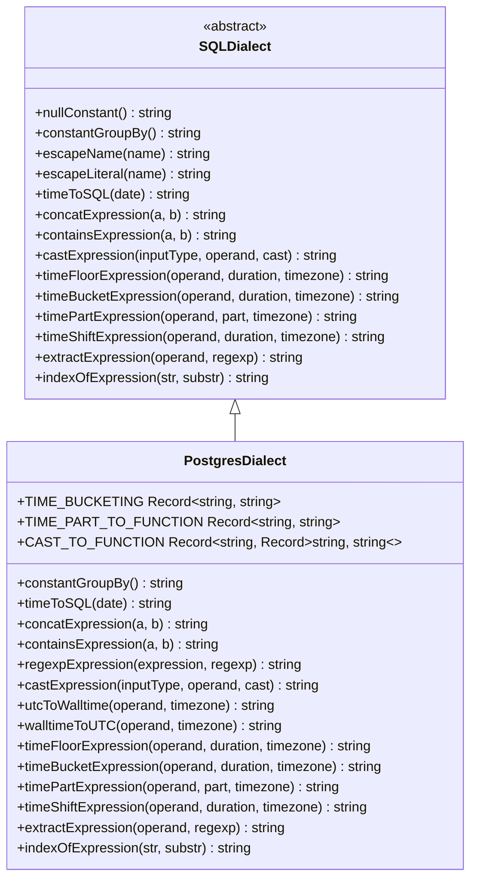
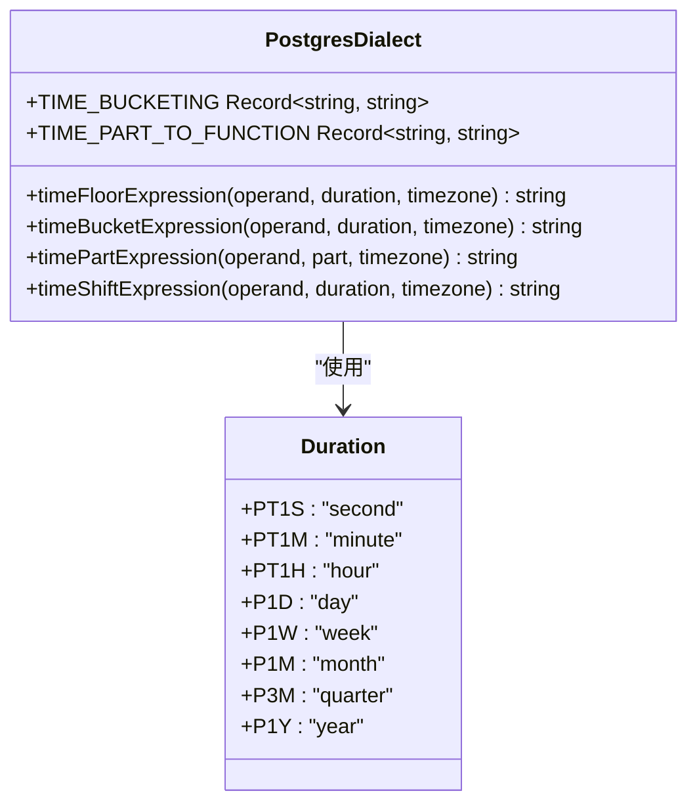
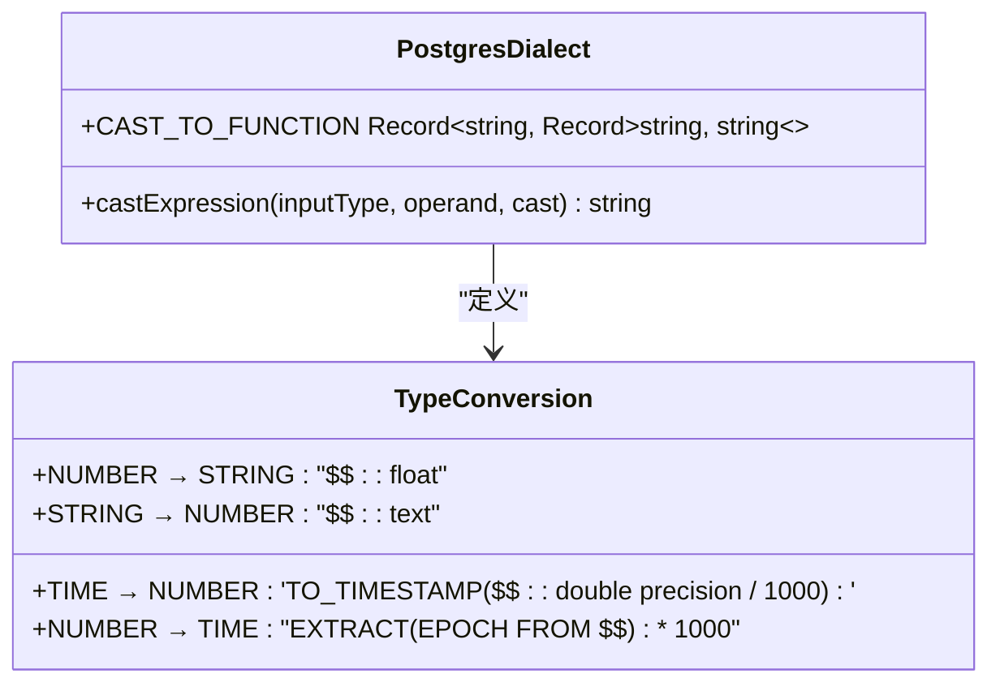
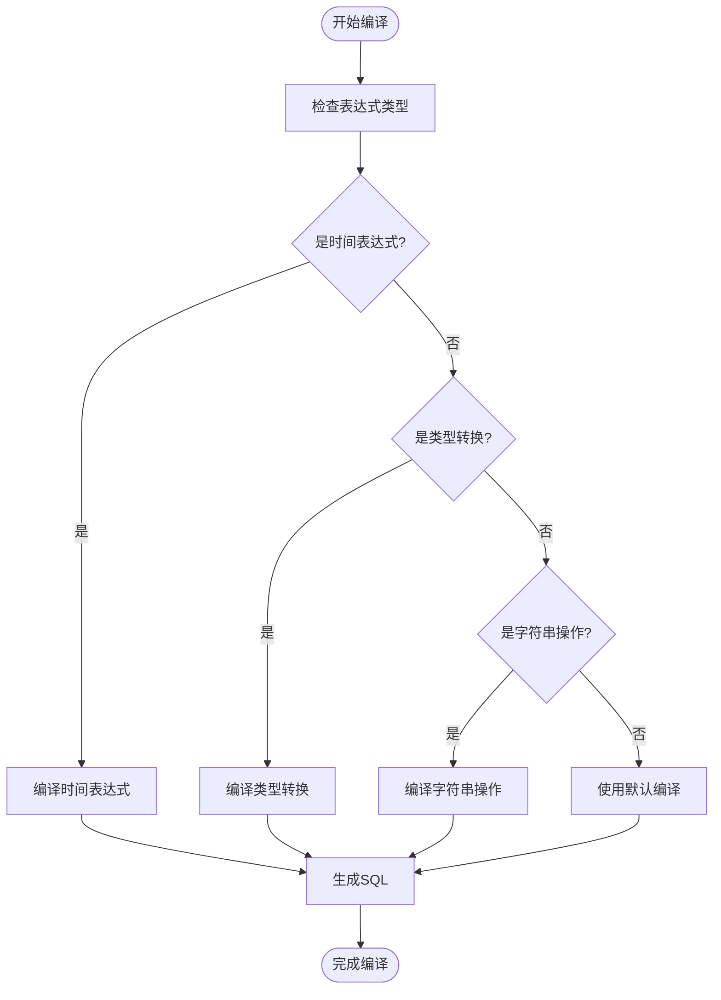
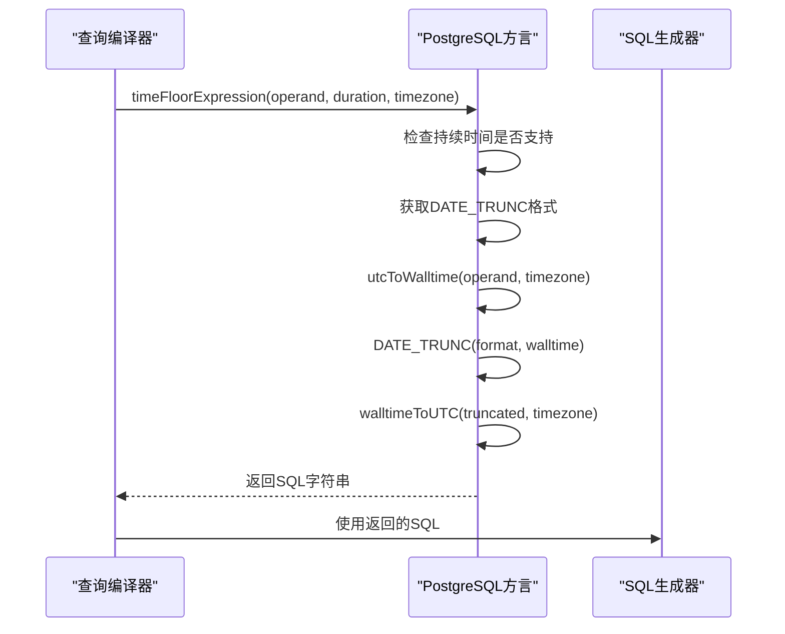
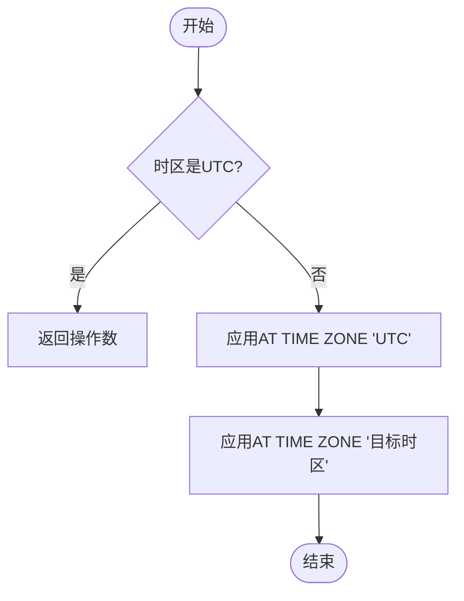

# PostgreSQL方言

<cite>
**本文档引用的文件**
- [postgresDialect.ts](file://src/dialect/postgresDialect.ts)
- [baseDialect.ts](file://src/dialect/baseDialect.ts)
- [postgresExternal.ts](file://src/external/postgresExternal.ts)
</cite>

## 目录
1. [简介](#简介)
2. [架构概述](#架构概述)
3. [核心组件分析](#核心组件分析)
4. [查询编译机制](#查询编译机制)
5. [PostgreSQL特定功能支持](#postgresql特定功能支持)
6. [类型转换与函数映射](#类型转换与函数映射)
7. [与通用SQL方言的差异](#与通用sql方言的差异)
8. [最佳实践与性能调优](#最佳实践与性能调优)
9. [已知限制](#已知限制)
10. [结论](#结论)

## 简介
PostgreSQL方言是Plywood框架中用于生成PostgreSQL特定SQL语法的组件。它继承自基础SQL方言类，并实现了PostgreSQL数据库特有的功能扩展。该方言的主要作用是将高级查询表达式编译为有效的PostgreSQL SQL语句，同时处理PostgreSQL特有的数据类型和函数。

PostgreSQL方言的设计目标是充分利用PostgreSQL数据库的强大功能，包括JSONB类型、窗口函数、数组操作等高级特性。通过继承基础方言并重写特定方法，PostgreSQL方言能够生成优化的SQL查询，同时保持与其他数据库方言的一致性接口。

**Section sources**
- [postgresDialect.ts](file://src/dialect/postgresDialect.ts#L20-L158)
- [baseDialect.ts](file://src/dialect/baseDialect.ts#L21-L172)

## 架构概述
PostgreSQL方言的架构基于继承和多态的设计模式。它继承自`SQLDialect`基类，该基类定义了所有SQL方言必须实现的抽象方法。PostgreSQL方言通过重写这些方法来提供PostgreSQL特定的实现。



**Diagram sources**
- [postgresDialect.ts](file://src/dialect/postgresDialect.ts#L20-L158)
- [baseDialect.ts](file://src/dialect/baseDialect.ts#L21-L172)

## 核心组件分析
PostgreSQL方言的核心组件包括时间处理、类型转换、字符串操作和正则表达式支持。这些组件通过静态常量和实例方法实现，提供了PostgreSQL特定的功能。

### 时间处理组件
PostgreSQL方言通过`TIME_BUCKETING`和`TIME_PART_TO_FUNCTION`静态常量定义了时间分组和时间部分提取的映射关系。这些常量将Plywood的持续时间表示转换为PostgreSQL的日期函数参数。



**Diagram sources**
- [postgresDialect.ts](file://src/dialect/postgresDialect.ts#L20-L158)

### 类型转换组件
类型转换组件通过`CAST_TO_FUNCTION`静态常量定义了不同类型之间的转换规则。这些规则映射了Plywood类型系统到PostgreSQL SQL函数的转换。



**Diagram sources**
- [postgresDialect.ts](file://src/dialect/postgresDialect.ts#L20-L158)

## 查询编译机制
PostgreSQL方言的查询编译机制基于方法重写和表达式树遍历。当Plywood需要生成PostgreSQL SQL时，它会调用方言实例的相应方法，这些方法返回特定于PostgreSQL的SQL片段。

### 表达式编译流程


**Diagram sources**
- [postgresDialect.ts](file://src/dialect/postgresDialect.ts#L20-L158)
- [baseDialect.ts](file://src/dialect/baseDialect.ts#L21-L172)

### 时间函数编译
时间函数的编译涉及时区处理和日期函数的应用。`timeFloorExpression`方法是时间处理的核心，它结合了时区转换和`DATE_TRUNC`函数。



**Diagram sources**
- [postgresDialect.ts](file://src/dialect/postgresDialect.ts#L116-L120)
- [baseDialect.ts](file://src/dialect/baseDialect.ts#L151-L151)

## PostgreSQL特定功能支持
PostgreSQL方言实现了多个PostgreSQL特有的功能，包括正则表达式、字符串连接和位置查找。

### 正则表达式支持
PostgreSQL使用`~`操作符进行正则表达式匹配，这与MySQL的`REGEXP`关键字不同。`regexpExpression`方法直接映射到PostgreSQL的语法。

```mermaid
classDiagram
class PostgresDialect {
+regexpExpression(expression, regexp) string
}
class MySQLDialect {
+regexpExpression(expression, regexp) string
}
class Expression {
+regexpExpression(expression, regexp) string
}
Expression <|-- PostgresDialect
Expression <|-- MySQLDialect
PostgresDialect --> "使用 ~ 操作符" : "区别于"
MySQLDialect --> "使用 REGEXP 关键字" : "区别于"
```

**Diagram sources**
- [postgresDialect.ts](file://src/dialect/postgresDialect.ts#L96-L104)
- [mySqlDialect.ts](file://src/dialect/mySqlDialect.ts#L107-L111)

### 字符串操作
PostgreSQL使用`||`操作符进行字符串连接，而MySQL使用`CONCAT`函数。`concatExpression`方法实现了这一差异。

```mermaid
classDiagram
class PostgresDialect {
+concatExpression(a, b) string
}
class MySQLDialect {
+concatExpression(a, b) string
}
class Expression {
+concatExpression(a, b) string
}
Expression <|-- PostgresDialect
Expression <|-- MySQLDialect
PostgresDialect --> "使用 || 操作符" : "区别于"
MySQLDialect --> "使用 CONCAT 函数" : "区别于"
```

**Diagram sources**
- [postgresDialect.ts](file://src/dialect/postgresDialect.ts#L96-L104)
- [mySqlDialect.ts](file://src/dialect/mySqlDialect.ts#L107-L111)

## 类型转换与函数映射
PostgreSQL方言的类型转换策略基于`CAST_TO_FUNCTION`常量，该常量定义了不同类型转换的SQL函数。

### 类型转换映射表
| 源类型 | 目标类型 | SQL函数 |
|--------|--------|--------|
| TIME | NUMBER | TO_TIMESTAMP($$::double precision / 1000) |
| NUMBER | TIME | EXTRACT(EPOCH FROM $$) * 1000 |
| NUMBER | STRING | $$::float |
| STRING | NUMBER | $$::text |

**Section sources**
- [postgresDialect.ts](file://src/dialect/postgresDialect.ts#L51-L98)

### 时区处理
PostgreSQL方言实现了完整的时区转换功能，使用`AT TIME ZONE`操作符在UTC和本地时间之间转换。



**Diagram sources**
- [postgresDialect.ts](file://src/dialect/postgresDialect.ts#L96-L104)

## 与通用SQL方言的差异
PostgreSQL方言与通用SQL方言的主要差异体现在语法、函数和类型系统上。

### 语法差异
- **字符串连接**: PostgreSQL使用`||`，通用SQL可能使用`+`或`CONCAT`
- **正则表达式**: PostgreSQL使用`~`，通用SQL可能使用`REGEXP`
- **空值处理**: PostgreSQL的`GROUP BY`使用`''=''`，而其他数据库可能使用`1`

### 函数差异
- **时间截断**: PostgreSQL使用`DATE_TRUNC`，而MySQL使用`DATE_FORMAT`
- **类型转换**: PostgreSQL使用`::`操作符，而MySQL使用`CAST`函数
- **位置查找**: PostgreSQL的`POSITION`返回基于1的索引，需要减1以匹配基于0的索引

**Section sources**
- [postgresDialect.ts](file://src/dialect/postgresDialect.ts#L20-L158)
- [mySqlDialect.ts](file://src/dialect/mySqlDialect.ts#L21-L172)

## 最佳实践与性能调优
使用PostgreSQL方言时，应遵循以下最佳实践以获得最佳性能。

### 查询优化建议
1. **使用适当的时间分组**: 利用`timeFloorExpression`进行高效的时间分组
2. **避免不必要的类型转换**: 尽量在应用层处理类型转换，减少数据库负载
3. **利用PostgreSQL特有功能**: 使用JSONB、数组和窗口函数等高级特性
4. **优化正则表达式**: 使用索引友好的正则表达式模式

### 性能监控
- 监控生成的SQL查询的执行计划
- 使用`EXPLAIN`分析查询性能
- 优化频繁执行的查询模式

## 已知限制
PostgreSQL方言存在一些已知限制，开发者需要注意。

### 功能限制
- **WEEK_OF_MONTH**: 目前未实现，标记为`???`
- **复杂正则表达式**: 某些复杂的正则表达式可能需要额外的处理
- **数组操作**: 虽然支持数组类型，但复杂的数组操作可能需要自定义实现

### 兼容性限制
- 依赖PostgreSQL 9.1+版本的特性
- 某些高级功能可能在旧版本的PostgreSQL中不可用
- 时区处理依赖于PostgreSQL的时区数据库

**Section sources**
- [postgresDialect.ts](file://src/dialect/postgresDialect.ts#L51-L98)

## 结论
PostgreSQL方言成功地将Plywood的通用查询表达式编译为高效的PostgreSQL SQL语句。通过继承基础方言并重写特定方法，它实现了PostgreSQL特有的功能，同时保持了与其他数据库方言的一致性。

该方言充分利用了PostgreSQL的高级特性，如`AT TIME ZONE`操作符、`DATE_TRUNC`函数和`||`字符串连接操作符。通过精心设计的类型转换映射和时间处理逻辑，它能够生成优化的SQL查询，充分发挥PostgreSQL数据库的能力。

对于开发者而言，理解PostgreSQL方言的工作机制有助于编写更高效的查询，并充分利用PostgreSQL的特有功能。未来的工作可以集中在完善WEEK_OF_MONTH支持和增强数组操作功能上。