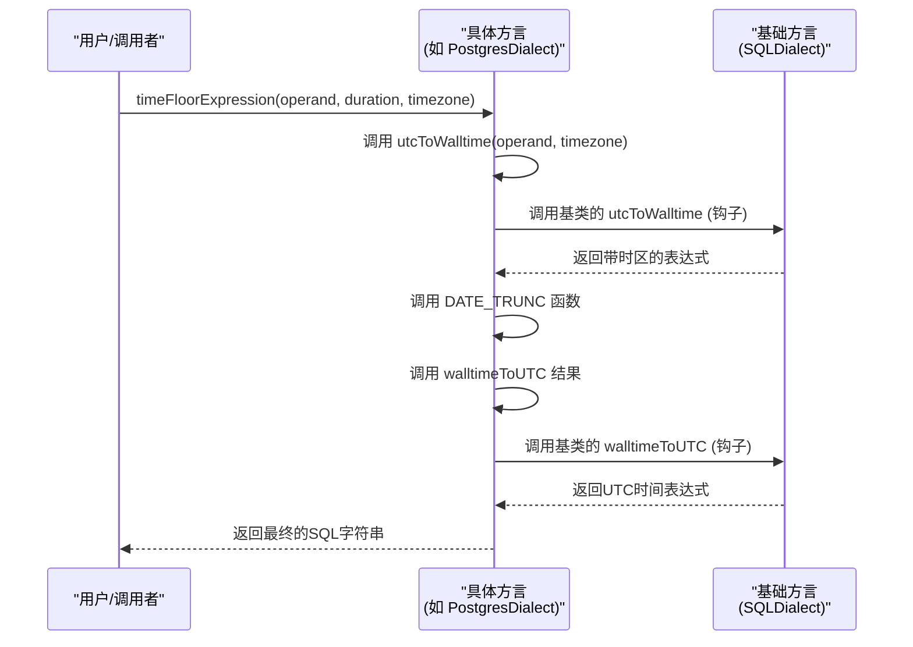

# 基础方言

<cite>
**Referenced Files in This Document**   
- [baseDialect.ts](file://src/dialect/baseDialect.ts)
- [clickHouseDialect.ts](file://src/dialect/clickHouseDialect.ts)
- [druidDialect.ts](file://src/dialect/druidDialect.ts)
- [mySqlDialect.ts](file://src/dialect/mySqlDialect.ts)
- [postgresDialect.ts](file://src/dialect/postgresDialect.ts)
</cite>

## 目录
1. [简介](#简介)
2. [项目结构](#项目结构)
3. [核心组件](#核心组件)
4. [架构概述](#架构概述)
5. [详细组件分析](#详细组件分析)
6. [依赖分析](#依赖分析)
7. [性能考虑](#性能考虑)
8. [故障排除指南](#故障排除指南)
9. [结论](#结论)

## 简介
本文档旨在深入解析 `plywood` 项目中基础方言模块的架构设计，重点阐述 `baseDialect.ts` 文件中策略模式的实现原理。该模块为系统提供了统一的SQL方言抽象层，通过抽象基类定义了查询编译的通用接口和核心方法，为所有具体数据库方言（如ClickHouse、Druid、MySQL、PostgreSQL）提供了统一的扩展点。文档将详细解释关键方法的设计意图和调用流程，分析基础方言如何处理通用SQL构造，并为特定数据库方言提供可重写的钩子方法，为希望扩展新数据库支持的开发者提供清晰的实现指南和最佳实践。

## 项目结构
`plywood` 项目的方言模块位于 `src/dialect/` 目录下，采用清晰的分层设计。该模块的核心是 `baseDialect.ts` 文件，它定义了所有具体方言必须遵循的抽象基类 `SQLDialect`。其他文件如 `clickHouseDialect.ts`、`druidDialect.ts`、`mySqlDialect.ts` 和 `postgresDialect.ts` 则是该基类的具体实现，各自针对特定的数据库系统定制了SQL生成逻辑。

```mermaid
graph TB
subgraph "src/dialect"
Base[baseDialect.ts<br/>抽象基类]
ClickHouse[clickHouseDialect.ts<br/>具体实现]
Druid[druidDialect.ts<br/>具体实现]
MySQL[mySqlDialect.ts<br/>具体实现]
Postgres[postgresDialect.ts<br/>具体实现]
end
Base --> ClickHouse : "继承"
Base --> Druid : "继承"
Base --> MySQL : "继承"
Base --> Postgres : "继承"
style Base fill:#4CAF50,stroke:#388E3C
style ClickHouse fill:#2196F3,stroke:#1976D2
style Druid fill:#2196F3,stroke:#1976D2
style MySQL fill:#2196F3,stroke:#1976D2
style Postgres fill:#2196F3,stroke:#1976D2
```

**Diagram sources**
- [baseDialect.ts](file://src/dialect/baseDialect.ts)
- [clickHouseDialect.ts](file://src/dialect/clickHouseDialect.ts)
- [druidDialect.ts](file://src/dialect/druidDialect.ts)
- [mySqlDialect.ts](file://src/dialect/mySqlDialect.ts)
- [postgresDialect.ts](file://src/dialect/postgresDialect.ts)

**Section sources**
- [baseDialect.ts](file://src/dialect/baseDialect.ts)
- [clickHouseDialect.ts](file://src/dialect/clickHouseDialect.ts)
- [druidDialect.ts](file://src/dialect/druidDialect.ts)
- [mySqlDialect.ts](file://src/dialect/mySqlDialect.ts)
- [postgresDialect.ts](file://src/dialect/postgresDialect.ts)

## 核心组件
本模块的核心组件是 `SQLDialect` 抽象类。它作为所有具体方言实现的基石，通过定义一系列抽象方法和提供通用的SQL构造方法，实现了策略模式。该类本身不生成任何具体的SQL语句，而是为 `ClickHouseDialect`、`DruidDialect` 等具体类提供了一个统一的接口和可重用的代码基础。这种设计使得添加对新数据库的支持变得简单，开发者只需继承 `SQLDialect` 并实现其抽象方法即可。

**Section sources**
- [baseDialect.ts](file://src/dialect/baseDialect.ts)

## 架构概述
该模块的架构基于经典的面向对象设计模式——策略模式和模板方法模式。`SQLDialect` 类作为策略的接口，定义了所有数据库方言必须支持的操作。具体方言类（如 `PostgresDialect`）则是具体的策略实现，它们根据各自数据库的语法和特性来实现这些操作。

```mermaid
classDiagram
class SQLDialect {
<<abstract>>
-escapedTableName : string | null
+setTable(name : string | null) : void
+nullConstant() : string
+constantGroupBy() : string
+escapeName(name : string) : string
+maybeNamespacedName(name : string) : string
+escapeLiteral(name : string) : string
+booleanToSQL(bool : boolean) : string
+floatDivision(numerator : string, denominator : string) : string
+numberOrTimeToSQL(x : number | Date) : string
+numberToSQL(num : number) : string
+dateToSQLDateString(date : Date) : string
+timeToSQL(date : Date) : string
+aggregateFilterIfNeeded(inputSQL : string, expressionSQL : string, elseSQL : string | null) : string
+concatExpression(a : string, b : string) : string
+containsExpression(a : string, b : string) : string
+substrExpression(a : string, position : number, length : number) : string
+coalesceExpression(a : string, b : string) : string
+ifThenElseExpression(a : string, b : string, c : string | null) : string
+isNotDistinctFromExpression(a : string, b : string) : string
+regexpExpression(expression : string, regexp : string) : string
+inExpression(operand : string, start : string, end : string, bounds : string) : string
+castExpression(inputType : PlyType, operand : string, cast : PlyTypeSimple) : string
+lengthExpression(a : string) : string
+lookupExpression(_base : string, _lookup : string) : string
+timeFloorExpression(operand : string, duration : Duration, timezone : Timezone) : string
+timeBucketExpression(operand : string, duration : Duration, timezone : Timezone) : string
+timePartExpression(operand : string, part : string, timezone : Timezone) : string
+timeShiftExpression(operand : string, duration : Duration, timezone : Timezone) : string
+extractExpression(operand : string, regexp : string) : string
+indexOfExpression(str : string, substr : string) : string
}
class ClickHouseDialect {
+timeToSQL(date : Date) : string
+concatExpression(a : string, b : string) : string
+containsExpression(a : string, b : string) : string
+isNotDistinctFromExpression(a : string, b : string) : string
+castExpression(inputType : PlyType, operand : string, cast : string) : string
+utcToWalltime(operand : string, timezone : Timezone) : string
+walltimeToUTC(operand : string, timezone : Timezone) : string
+timeFloorExpression(operand : string, duration : Duration, timezone : Timezone) : string
+timeBucketExpression(operand : string, duration : Duration, timezone : Timezone) : string
+timePartExpression(operand : string, part : string, timezone : Timezone) : string
+timeShiftExpression(operand : string, duration : Duration, timezone : Timezone) : string
+extractExpression(operand : string, regexp : string) : string
+indexOfExpression(str : string, substr : string) : string
}
class DruidDialect {
+nullConstant() : string
+dateToSQLDateString(date : Date) : string
+floatDivision(numerator : string, denominator : string) : string
+constantGroupBy() : string
+timeToSQL(date : Date) : string
+concatExpression(a : string, b : string) : string
+containsExpression(a : string, b : string) : string
+coalesceExpression(a : string, b : string) : string
+substrExpression(a : string, position : number, length : number) : string
+isNotDistinctFromExpression(a : string, b : string) : string
+castExpression(inputType : PlyType, operand : string, cast : string) : string
+timeFloorExpression(operand : string, duration : Duration, timezone : Timezone) : string
+timeBucketExpression(operand : string, duration : Duration, timezone : Timezone) : string
+timePartExpression(operand : string, part : string, timezone : Timezone) : string
+timeShiftExpression(operand : string, duration : Duration, timezone : Timezone) : string
+extractExpression(operand : string, regexp : string) : string
+indexOfExpression(str : string, substr : string) : string
+lookupExpression(base : string, lookup : string) : string
}
class MySQLDialect {
+timeToSQL(date : Date) : string
+concatExpression(a : string, b : string) : string
+containsExpression(a : string, b : string) : string
+isNotDistinctFromExpression(a : string, b : string) : string
+castExpression(inputType : PlyType, operand : string, cast : string) : string
+utcToWalltime(operand : string, timezone : Timezone) : string
+walltimeToUTC(operand : string, timezone : Timezone) : string
+timeFloorExpression(operand : string, duration : Duration, timezone : Timezone) : string
+timeBucketExpression(operand : string, duration : Duration, timezone : Timezone) : string
+timePartExpression(operand : string, part : string, timezone : Timezone) : string
+timeShiftExpression(operand : string, duration : Duration, timezone : Timezone) : string
+extractExpression(operand : string, regexp : string) : string
+indexOfExpression(str : string, substr : string) : string
}
class PostgresDialect {
+constantGroupBy() : string
+timeToSQL(date : Date) : string
+concatExpression(a : string, b : string) : string
+containsExpression(a : string, b : string) : string
+regexpExpression(expression : string, regexp : string) : string
+castExpression(inputType : PlyType, operand : string, cast : string) : string
+utcToWalltime(operand : string, timezone : Timezone) : string
+walltimeToUTC(operand : string, timezone : Timezone) : string
+timeFloorExpression(operand : string, duration : Duration, timezone : Timezone) : string
+timeBucketExpression(operand : string, duration : Duration, timezone : Timezone) : string
+timePartExpression(operand : string, part : string, timezone : Timezone) : string
+timeShiftExpression(operand : string, duration : Duration, timezone : Timezone) : string
+extractExpression(operand : string, regexp : string) : string
+indexOfExpression(str : string, substr : string) : string
}
SQLDialect <|-- ClickHouseDialect
SQLDialect <|-- DruidDialect
SQLDialect <|-- MySQLDialect
SQLDialect <|-- PostgresDialect
```



**Diagram sources**
- [baseDialect.ts](file://src/dialect/baseDialect.ts)
- [clickHouseDialect.ts](file://src/dialect/clickHouseDialect.ts)
- [druidDialect.ts](file://src/dialect/druidDialect.ts)
- [mySqlDialect.ts](file://src/dialect/mySqlDialect.ts)
- [postgresDialect.ts](file://src/dialect/postgresDialect.ts)

## 详细组件分析
### 基础方言类分析
`SQLDialect` 类是整个模块的基石，它通过抽象基类的方式定义了查询编译的通用接口和核心方法。

#### 抽象基类与通用接口
`SQLDialect` 类被声明为 `abstract`，这意味着它不能被直接实例化，只能被继承。它定义了多个抽象方法，如 `timeToSQL`、`castExpression`、`timeFloorExpression` 等，这些方法在基类中没有具体实现（抛出错误），强制要求所有子类必须提供自己的实现。这确保了所有具体方言都支持这些核心的SQL构造操作。

同时，该类也提供了一系列非抽象的、具有默认实现的方法，用于处理通用的SQL构造。例如：
- `escapeName(name: string)`：通过将双引号转义为双引号并用双引号包围，为标识符（如表名、列名）提供默认的转义规则。
- `escapeLiteral(name: string)`：通过将单引号转义为两个单引号并用单引号包围，为字符串字面量提供默认的转义规则。
- `ifThenElseExpression(a, b, c)`：生成标准的 `CASE WHEN ... THEN ... ELSE ... END` SQL表达式。
- `inExpression(operand, start, end, bounds)`：根据边界条件生成 `IN` 或比较操作的SQL。

这些通用方法为所有具体方言提供了坚实的基础，减少了重复代码。

#### 关键方法设计意图
尽管 `documentation_objective` 中提到的 `expressionToSQL` 和 `booleanExpressionToSQL` 方法在 `baseDialect.ts` 中未找到，但我们可以分析其核心的抽象方法和钩子方法的设计意图。

- **`timeToSQL(date: Date)`**：这是一个抽象方法，要求子类将JavaScript的 `Date` 对象转换为特定数据库的日期/时间字面量。例如，`PostgresDialect` 会生成 `TIMESTAMP 'YYYY-MM-DD HH:MM:SS'`，而 `ClickHouseDialect` 会生成 `toDateTime('YYYY-MM-DD HH:MM:SS')`。
- **`castExpression(inputType, operand, cast)`**：此抽象方法负责生成类型转换的SQL。它利用类内部的静态映射表（如 `CAST_TO_FUNCTION`）来查找正确的转换函数，并通过字符串替换（`$$`）将操作数注入其中。
- **`timeFloorExpression(operand, duration, timezone)`**：此方法将时间戳向下取整到指定的时间间隔（如小时、天）。它通常依赖于 `utcToWalltime` 和 `walltimeToUTC` 钩子方法来处理时区转换，然后调用数据库特定的截断函数（如 `DATE_TRUNC` 或 `toStartOfHour`）。

#### 通用SQL构造与钩子方法
基础方言通过提供可重写的“钩子”方法来处理数据库间的差异。例如：
- `utcToWalltime(operand, timezone)` 和 `walltimeToUTC(operand, timezone)`：这两个方法在基类中是空实现，但在 `MySQLDialect` 和 `PostgresDialect` 中被重写，分别使用 `CONVERT_TZ` 和 `AT TIME ZONE` 来处理时区转换。
- `floatDivision(numerator, denominator)`：此方法在基类中返回 `(${numerator}/${denominator})`，但在 `DruidDialect` 中被重写为 `(${numerator}*1.0/${denominator})`，以确保浮点除法，因为Druid的默认除法是整数除法。

这种设计允许基础方言处理通用逻辑，同时将特定于数据库的细节委托给子类。



**Diagram sources**
- [baseDialect.ts](file://src/dialect/baseDialect.ts)
- [postgresDialect.ts](file://src/dialect/postgresDialect.ts)

**Section sources**
- [baseDialect.ts](file://src/dialect/baseDialect.ts)
- [postgresDialect.ts](file://src/dialect/postgresDialect.ts)

## 依赖分析
该模块的依赖关系清晰且松耦合。`baseDialect.ts` 是核心，它依赖于外部库 `@topgames/chronoshift` 提供的 `Duration` 和 `Timezone` 类型，以及项目内部的 `../types` 模块提供的 `PlyType`。所有具体方言文件（如 `postgresDialect.ts`）都直接依赖于 `baseDialect.ts`，通过继承 `SQLDialect` 类来获得其功能。

```mermaid
graph TD
A["@topgames/chronoshift<br/>(Duration, Timezone)"] --> B[baseDialect.ts<br/>(SQLDialect)]
C["../types<br/>(PlyType)"] --> B
B --> D[clickHouseDialect.ts]
B --> E[druidDialect.ts]
B --> F[mySqlDialect.ts]
B --> G[postgresDialect.ts]
style A fill:#FFC107,stroke:#FFA000
style C fill:#FFC107,stroke:#FFA000
style B fill:#4CAF50,stroke:#388E3C
style D fill:#2196F3,stroke:#1976D2
style E fill:#2196F3,stroke:#1976D2
style F fill:#2196F3,stroke:#1976D2
style G fill:#2196F3,stroke:#1976D2
```

**Diagram sources**
- [baseDialect.ts](file://src/dialect/baseDialect.ts)
- [clickHouseDialect.ts](file://src/dialect/clickHouseDialect.ts)
- [druidDialect.ts](file://src/dialect/druidDialect.ts)
- [mySqlDialect.ts](file://src/dialect/mySqlDialect.ts)
- [postgresDialect.ts](file://src/dialect/postgresDialect.ts)

**Section sources**
- [baseDialect.ts](file://src/dialect/baseDialect.ts)

## 性能考虑
从代码分析来看，该模块的设计主要关注功能性和可扩展性，而非直接的运行时性能优化。其性能特征主要体现在：
- **编译时开销**：SQL的生成是在查询编译阶段完成的，因此其性能影响主要在应用启动或查询解析时，而非查询执行时。
- **方法调用开销**：由于大量使用了继承和多态，每次调用一个方法（如 `timeToSQL`）都会涉及一次虚函数调用。然而，这种开销在现代JavaScript引擎中通常可以忽略不计。
- **字符串操作**：大量的SQL字符串是通过字符串拼接和替换生成的，这在处理复杂查询时可能会产生一定的内存开销。

总体而言，该模块的性能是可接受的，其设计的清晰性和可维护性远大于其微小的运行时开销。

## 故障排除指南
在扩展或使用此模块时，可能会遇到以下问题：

1.  **方法未实现错误**：如果创建了一个新的方言类但忘记实现某个抽象方法（如 `timeToSQL`），在调用该方法时会抛出 `"must implement"` 错误。解决方法是确保所有抽象方法都被正确重写。
2.  **SQL语法错误**：生成的SQL在目标数据库中执行失败。这通常是由于对特定数据库的语法理解有误。应仔细检查具体方言类中的实现，并参考数据库的官方文档。
3.  **时区处理错误**：时间相关的SQL结果与预期不符。应检查 `utcToWalltime` 和 `walltimeToUTC` 方法的实现是否正确处理了时区转换。
4.  **类型转换失败**：`castExpression` 方法抛出 `"unsupported cast"` 错误。这表明在 `CAST_TO_FUNCTION` 映射表中缺少相应的转换规则，需要添加。

**Section sources**
- [baseDialect.ts](file://src/dialect/baseDialect.ts)

## 结论
`baseDialect.ts` 模块通过精妙的面向对象设计，成功地为 `plywood` 项目构建了一个灵活、可扩展的SQL方言抽象层。它利用抽象基类和策略模式，将通用的SQL构造逻辑与特定数据库的实现细节分离。这种设计不仅保证了代码的一致性和可维护性，还极大地简化了对新数据库的支持。开发者在扩展新方言时，只需关注实现那些具有数据库特性的抽象方法，而无需重复编写通用的SQL处理逻辑。该模块是软件工程中“开闭原则”和“依赖倒置原则”的优秀实践范例。