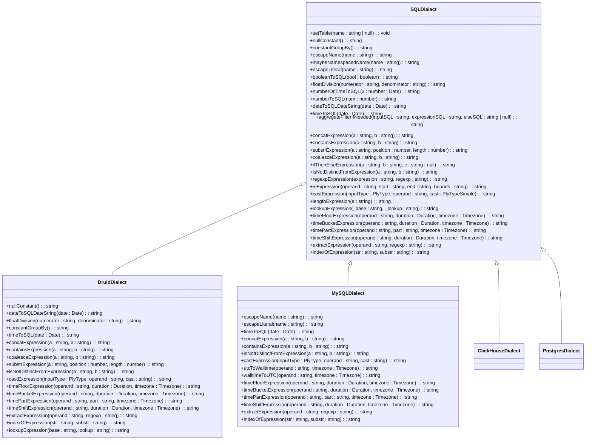
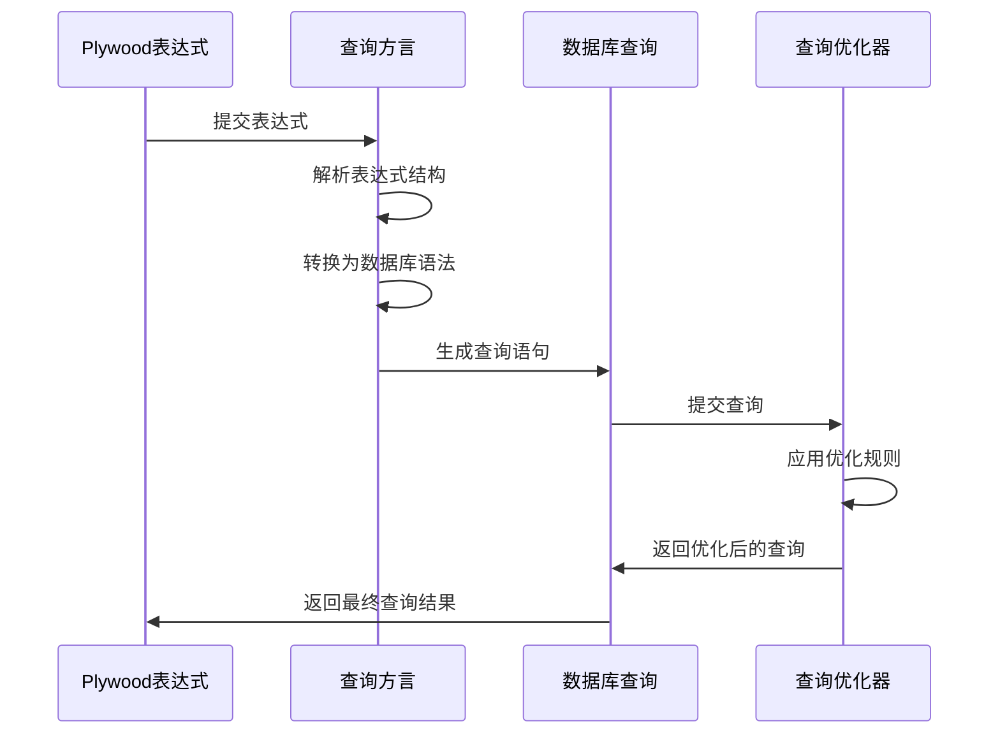

# 查询方言

<cite>
**本文档引用的文件**   
- [baseDialect.ts](file://src/dialect/baseDialect.ts)
- [druidDialect.ts](file://src/dialect/druidDialect.ts)
- [mySqlDialect.ts](file://src/dialect/mySqlDialect.ts)
- [clickHouseDialect.ts](file://src/dialect/clickHouseDialect.ts)
- [postgresDialect.ts](file://src/dialect/postgresDialect.ts)
- [druidExternal.ts](file://src/external/druidExternal.ts)
- [mySqlExternal.ts](file://src/external/mySqlExternal.ts)
- [clickHouseExternal.ts](file://src/external/clickHouseExternal.ts)
- [postgresExternal.ts](file://src/external/postgresExternal.ts)
- [druidExpressionBuilder.ts](file://src/external/utils/druidExpressionBuilder.ts)
- [druidFilterBuilder.ts](file://src/external/utils/druidFilterBuilder.ts)
- [druidAggregationBuilder.ts](file://src/external/utils/druidAggregationBuilder.ts)
</cite>

## 目录
1. [引言](#引言)
2. [查询方言模块概述](#查询方言模块概述)
3. [基础方言实现](#基础方言实现)
4. [具体方言实现](#具体方言实现)
5. [方言特性与优化](#方言特性与优化)
6. [查询生成过程](#查询生成过程)
7. [扩展新方言](#扩展新方言)
8. [结论](#结论)

## 引言
查询方言模块是Plywood系统中的核心组件，负责将Plywood的通用表达式转换为特定数据库的查询语言。该模块采用策略模式实现，通过抽象基类定义通用接口，具体方言类实现特定数据库的语法和特性。本文档详细解释查询编译器的作用，分析`baseDialect.ts`的策略模式实现，以及`druidDialect.ts`、`mySqlDialect.ts`等具体方言的差异，涵盖每种方言支持的特性、语法限制和优化技巧。

**Section sources**
- [baseDialect.ts](file://src/dialect/baseDialect.ts#L1-L174)
- [druidDialect.ts](file://src/dialect/druidDialect.ts#L1-L177)
- [mySqlDialect.ts](file://src/dialect/mySqlDialect.ts#L1-L174)

## 查询方言模块概述
查询方言模块作为查询编译器，负责将Plywood的通用表达式转换为特定数据库的查询语言。该模块通过抽象基类`SQLDialect`定义通用接口，具体方言类如`DruidDialect`、`MySQLDialect`等实现特定数据库的语法和特性。这种设计模式使得系统能够灵活支持多种数据库，同时保持代码的可维护性和可扩展性。

**Section sources**
- [baseDialect.ts](file://src/dialect/baseDialect.ts#L1-L174)
- [druidDialect.ts](file://src/dialect/druidDialect.ts#L1-L177)
- [mySqlDialect.ts](file://src/dialect/mySqlDialect.ts#L1-L174)

## 基础方言实现
`baseDialect.ts`文件定义了`SQLDialect`抽象类，采用策略模式实现查询编译器的基础功能。该类提供了通用的SQL语法转换方法，如`escapeName`用于转义标识符，`escapeLiteral`用于转义字面量，`timeToSQL`用于时间格式转换等。具体方言类通过继承`SQLDialect`并重写特定方法来实现数据库特定的语法。



**Diagram sources **
- [baseDialect.ts](file://src/dialect/baseDialect.ts#L1-L174)
- [druidDialect.ts](file://src/dialect/druidDialect.ts#L1-L177)
- [mySqlDialect.ts](file://src/dialect/mySqlDialect.ts#L1-L174)

**Section sources**
- [baseDialect.ts](file://src/dialect/baseDialect.ts#L1-L174)

## 具体方言实现
### Druid方言
`druidDialect.ts`实现了Druid数据库的查询语法。Druid方言生成复杂的JSON查询结构，支持时间序列查询和聚合操作。其主要特性包括：
- 使用`FLOOR`函数进行时间下取整
- 支持`LOOKUP`函数进行维度查找
- 使用`REGEXP_MATCHES`进行正则表达式匹配
- 通过`TIME_BUCKETING`和`TIME_PART_TO_FUNCTION`静态映射实现时间部分提取

### MySQL方言
`mySqlDialect.ts`实现了MySQL数据库的查询语法。MySQL方言构建标准的SELECT语句，支持常见的SQL操作。其主要特性包括：
- 使用`CONCAT`函数进行字符串连接
- 使用`LOCATE`函数进行子字符串查找
- 支持`CONVERT_TZ`函数进行时区转换
- 使用`DATE_FORMAT`和`DATE_ADD`函数处理时间操作

### ClickHouse方言
`clickHouseDialect.ts`实现了ClickHouse数据库的查询语法。ClickHouse方言优化了大数据量查询性能，支持列式存储特性。其主要特性包括：
- 使用`toStartOf*`系列函数进行时间下取整
- 支持`toDateTime`函数进行时间转换
- 使用`CONCAT`函数进行字符串连接
- 通过`utcToWalltime`和`walltimeToUTC`方法处理时区转换

### PostgreSQL方言
`postgresDialect.ts`实现了PostgreSQL数据库的查询语法。PostgreSQL方言利用其强大的SQL功能，支持复杂的查询操作。其主要特性包括：
- 使用`DATE_TRUNC`函数进行时间下取整
- 支持`AT TIME ZONE`进行时区转换
- 使用`DATE_PART`函数提取时间部分
- 支持`~`操作符进行正则表达式匹配

**Section sources**
- [druidDialect.ts](file://src/dialect/druidDialect.ts#L1-L177)
- [mySqlDialect.ts](file://src/dialect/mySqlDialect.ts#L1-L174)
- [clickHouseDialect.ts](file://src/dialect/clickHouseDialect.ts#L1-L163)
- [postgresDialect.ts](file://src/dialect/postgresDialect.ts#L1-L160)

## 方言特性与优化
### Druid方言特性
Druid方言针对时间序列数据进行了优化，支持高效的聚合查询。其查询结构通常包含：
- `queryType`指定查询类型（timeseries、topN、groupBy）
- `dataSource`指定数据源
- `granularity`指定时间粒度
- `aggregations`定义聚合操作
- `postAggregations`定义后聚合操作

### SQL方言特性
SQL方言（MySQL、PostgreSQL、ClickHouse）遵循标准SQL语法，支持常见的数据库操作。其查询结构通常包含：
- `SELECT`子句指定返回字段
- `FROM`子句指定数据源
- `WHERE`子句指定过滤条件
- `GROUP BY`子句指定分组字段
- `ORDER BY`子句指定排序字段

### 优化技巧
- **Druid方言**：利用`filtered`聚合器减少数据扫描量，使用`hyperUnique`和`thetaSketch`进行近似计数
- **MySQL方言**：使用索引优化查询性能，避免全表扫描
- **ClickHouse方言**：利用列式存储特性，只读取需要的列
- **PostgreSQL方言**：使用CTE（公用表表达式）优化复杂查询

**Section sources**
- [druidDialect.ts](file://src/dialect/druidDialect.ts#L1-L177)
- [mySqlDialect.ts](file://src/dialect/mySqlDialect.ts#L1-L174)
- [clickHouseDialect.ts](file://src/dialect/clickHouseDialect.ts#L1-L163)
- [postgresDialect.ts](file://src/dialect/postgresDialect.ts#L1-L160)

## 查询生成过程
查询生成过程涉及多个组件的协作，从Plywood表达式到最终的数据库查询。主要步骤包括：
1. **表达式解析**：将Plywood表达式解析为抽象语法树
2. **方言选择**：根据目标数据库选择合适的方言类
3. **语法转换**：使用方言类的方法将表达式转换为数据库特定语法
4. **查询构建**：组合各个部分生成完整的查询语句
5. **优化处理**：应用查询优化技巧提高执行效率



**Diagram sources **
- [druidExpressionBuilder.ts](file://src/external/utils/druidExpressionBuilder.ts#L1-L447)
- [druidFilterBuilder.ts](file://src/external/utils/druidFilterBuilder.ts#L1-L491)
- [druidAggregationBuilder.ts](file://src/external/utils/druidAggregationBuilder.ts#L1-L743)

**Section sources**
- [druidExpressionBuilder.ts](file://src/external/utils/druidExpressionBuilder.ts#L1-L447)
- [druidFilterBuilder.ts](file://src/external/utils/druidFilterBuilder.ts#L1-L491)
- [druidAggregationBuilder.ts](file://src/external/utils/druidAggregationBuilder.ts#L1-L743)

## 扩展新方言
要扩展新的查询方言，需要遵循以下步骤：
1. 创建新的方言类，继承`SQLDialect`抽象类
2. 实现必要的抽象方法，如`timeToSQL`、`concatExpression`等
3. 根据数据库特性重写具体方法
4. 在外部类中注册新的方言
5. 编写测试用例验证功能正确性

例如，扩展一个新的`OracleDialect`类：
```typescript
export class OracleDialect extends SQLDialect {
  constructor() {
    super();
  }
  
  public timeToSQL(date: Date): string {
    if (!date) return this.nullConstant();
    return `TIMESTAMP '${this.dateToSQLDateString(date)}'`;
  }
  
  public concatExpression(a: string, b: string): string {
    return `CONCAT(${a}, ${b})`;
  }
  
  // 实现其他必要方法...
}
```

**Section sources**
- [baseDialect.ts](file://src/dialect/baseDialect.ts#L1-L174)
- [druidDialect.ts](file://src/dialect/druidDialect.ts#L1-L177)

## 结论
查询方言模块通过策略模式实现了灵活的查询编译器，能够将Plywood的通用表达式转换为多种数据库的特定查询语言。`baseDialect.ts`提供了统一的接口定义，而具体的方言实现如`druidDialect.ts`、`mySqlDialect.ts`等则针对不同数据库的特性进行了优化。开发者可以通过理解查询生成过程和方言特性，更好地利用该模块进行数据查询和分析。对于需要扩展新方言的贡献者，文档提供了清晰的指导和示例，便于快速上手开发。