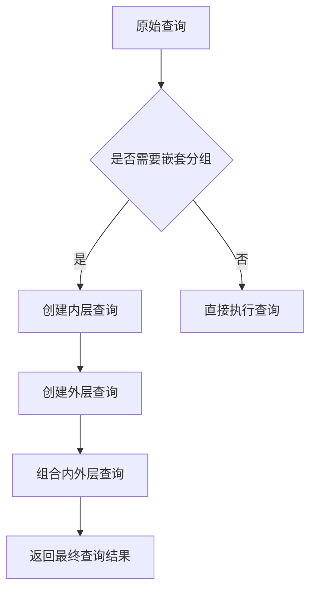
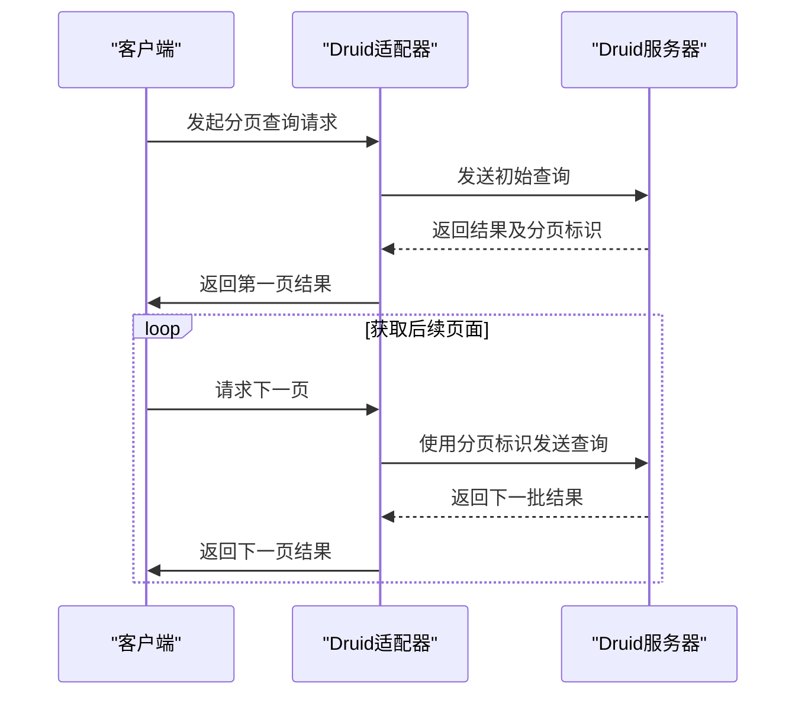
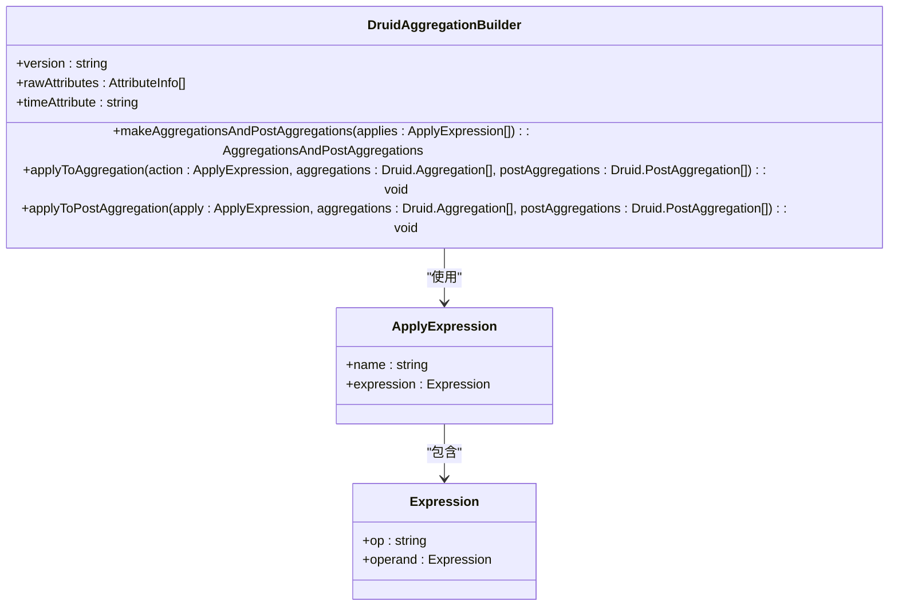
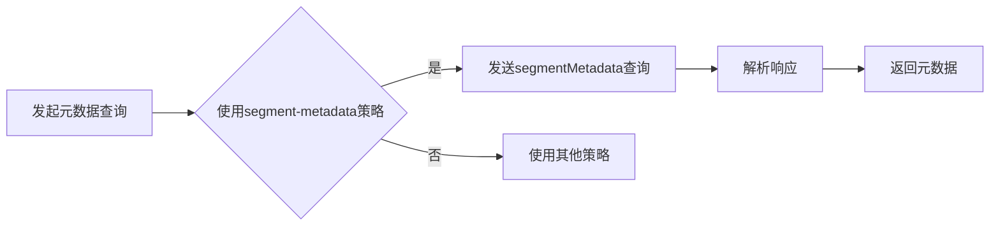

# Druid数据源

<cite>
**本文档引用的文件**   
- [druidExternal.ts](file://src/external/druidExternal.ts)
- [druidAggregationBuilder.ts](file://src/external/utils/druidAggregationBuilder.ts)
- [druidFilterBuilder.ts](file://src/external/utils/druidFilterBuilder.ts)
- [druidExpressionBuilder.ts](file://src/external/utils/druidExpressionBuilder.ts)
- [druidTypes.ts](file://src/external/utils/druidTypes.ts)
- [druidDialect.ts](file://src/dialect/druidDialect.ts)
</cite>

## 目录
1. [简介](#简介)
2. [核心功能](#核心功能)
3. [查询构建机制](#查询构建机制)
4. [元数据获取策略](#元数据获取策略)
5. [性能优化建议](#性能优化建议)
6. [常见问题解决方案](#常见问题解决方案)

## 简介
Druid数据源适配器是Plywood框架中的关键组件，负责与Apache Druid数据库进行交互。该适配器通过`druidExternal.ts`文件实现，提供了丰富的功能来支持复杂的分析查询。适配器不仅能够处理基本的聚合、过滤和维度提取操作，还具备高级特性如subtotalsSpec优化支持、直接查询执行和分页处理。

**Section sources**
- [druidExternal.ts](file://src/external/druidExternal.ts#L1-L100)

## 核心功能

### SubtotalsSpec优化支持
Druid数据源适配器实现了对subtotalsSpec的优化支持，这使得在处理层次结构数据时能够更高效地生成汇总信息。通过`nestedGroupByIfNeeded`方法，适配器能够在必要时自动创建嵌套的groupBy查询，从而在单个查询中完成多级聚合操作。

**Diagram sources**
- [druidExternal.ts](file://src/external/druidExternal.ts#L1299-L1339)

### 直接查询执行
适配器支持直接查询执行，允许用户绕过标准的聚合流程，直接从数据源获取原始数据。这一功能通过设置`allowSelectQueries`标志来启用，并且可以在`mode`为`raw`时触发。直接查询特别适用于需要获取未加工数据的场景。

**Section sources**
- [druidExternal.ts](file://src/external/druidExternal.ts#L1600-L1650)

### 分页处理
为了处理大规模数据集，适配器实现了高效的分页机制。`selectNextFactory`方法负责生成下一页查询的逻辑，通过维护`pagingIdentifiers`来跟踪当前查询的位置，并根据需要调整查询参数以获取下一批结果。

**Diagram sources**
- [druidExternal.ts](file://src/external/druidExternal.ts#L245-L286)

## 查询构建机制

### 聚合操作
聚合操作是Druid查询的核心部分，适配器通过`DruidAggregationBuilder`类来构建聚合表达式。该类能够将Plywood表达式转换为Druid原生的聚合函数，支持多种聚合类型如sum、count、min、max等。

**Diagram sources**
- [druidAggregationBuilder.ts](file://src/external/utils/druidAggregationBuilder.ts#L1-L50)

### 过滤操作
过滤操作通过`DruidFilterBuilder`类实现，该类能够将Plywood的过滤表达式转换为Druid的过滤条件。支持多种过滤类型，包括时间范围过滤、值匹配过滤和正则表达式过滤。

**Section sources**
- [druidFilterBuilder.ts](file://src/external/utils/druidFilterBuilder.ts#L1-L50)

### 维度提取
维度提取功能允许用户从数据中提取特定的维度信息。适配器通过`expressionToDimensionInflater`方法实现这一功能，能够处理复杂的表达式并生成相应的维度规范。

**Section sources**
- [druidExternal.ts](file://src/external/druidExternal.ts#L800-L850)

## 元数据获取策略

### SegmentMetadata策略
`segment-metadata-fallback`和`segment-metadata-only`策略利用Druid的segmentMetadata查询来获取数据源的元数据信息。这种方法能够提供详细的列信息，包括数据类型、基数和值范围。

**Diagram sources**
- [druidExternal.ts](file://src/external/druidExternal.ts#L1766-L1816)

### Datasource Introspect策略
`datasource-get`策略通过Druid的introspect查询来获取元数据。这种方法通常返回更简洁的信息，主要包含维度和度量的名称列表。

**Section sources**
- [druidExternal.ts](file://src/external/druidExternal.ts#L425-L463)

## 性能优化建议

1. **合理使用聚合**：尽量使用Druid原生支持的聚合函数，避免复杂的JavaScript聚合，以提高查询性能。
2. **优化过滤条件**：将最严格的过滤条件放在前面，减少需要处理的数据量。
3. **利用缓存**：启用Druid的查询缓存功能，对于频繁执行的查询可以显著提升响应速度。
4. **适当分页**：对于大数据集，使用分页查询而不是一次性获取所有数据，避免内存溢出。

## 常见问题解决方案

### 查询超时
当遇到查询超时时，可以尝试以下方法：
- 增加Druid服务器的查询超时设置
- 优化查询条件，减少数据扫描范围
- 使用更粗粒度的时间聚合

### 数据精度问题
对于需要高精度计算的场景，建议：
- 使用`exactResultsOnly`标志确保结果的准确性
- 避免使用近似算法如hyperUnique，改用精确计数方法

### 复杂表达式支持
对于无法直接转换的复杂表达式，可以：
- 使用自定义聚合函数
- 在应用层进行后处理计算

**Section sources**
- [druidExternal.ts](file://src/external/druidExternal.ts#L136-L2087)
- [druidAggregationBuilder.ts](file://src/external/utils/druidAggregationBuilder.ts#L1-L743)
- [druidFilterBuilder.ts](file://src/external/utils/druidFilterBuilder.ts#L1-L491)
- [druidExpressionBuilder.ts](file://src/external/utils/druidExpressionBuilder.ts#L1-L447)
- [druidTypes.ts](file://src/external/utils/druidTypes.ts#L1-L34)
- [druidDialect.ts](file://src/dialect/druidDialect.ts#L1-L178)