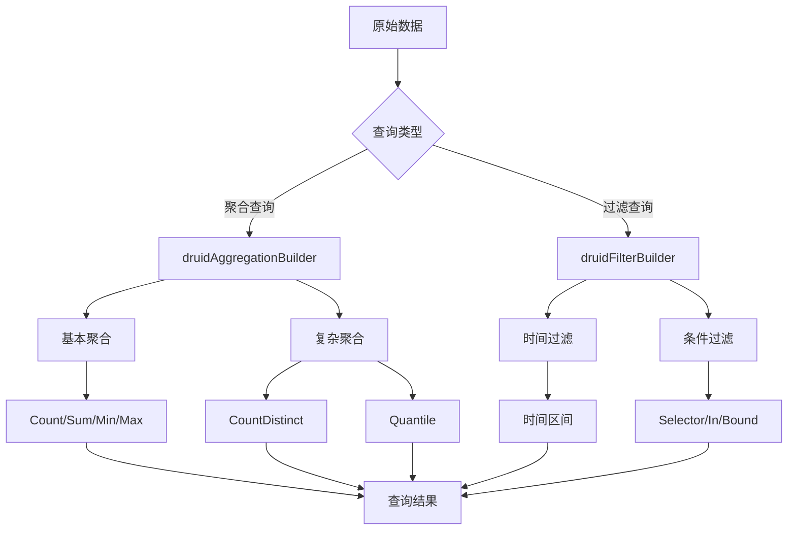

# Druid查询构建

<cite>
**本文档引用的文件**   
- [druidAggregationBuilder.ts](file://src/external/utils/druidAggregationBuilder.ts)
- [druidFilterBuilder.ts](file://src/external/utils/druidFilterBuilder.ts)
- [druidExternal.ts](file://src/external/druidExternal.ts)
- [druidExpressionBuilder.ts](file://src/external/utils/druidExpressionBuilder.ts)
- [druidExtractionFnBuilder.ts](file://src/external/utils/druidExtractionFnBuilder.ts)
- [druidTypes.ts](file://src/external/utils/druidTypes.ts)
</cite>

## 目录
1. [引言](#引言)
2. [聚合机制](#聚合机制)
3. [过滤机制](#过滤机制)
4. [复杂查询构建](#复杂查询构建)
5. [性能优化与问题解决](#性能优化与问题解决)

## 引言
Druid查询构建机制通过Plywood表达式系统将高级分析操作转换为Druid原生查询。该系统包含聚合、过滤、维度提取等核心组件，协同工作以实现高效的数据分析。本文档深入解析这些组件的工作原理，重点阐述druidAggregationBuilder和druidFilterBuilder如何处理各种查询操作。

## 聚合机制

druidAggregationBuilder组件负责将Plywood表达式转换为Druid原生聚合操作。该组件支持多种基本和复杂聚合类型，通过表达式类型判断来选择相应的转换策略。

对于基本聚合操作，系统实现了count、sum、min、max等常见聚合函数的转换。count聚合直接映射到Druid的count类型聚合器，而sum、min、max等操作则根据数据类型选择longSum/doubleSum或longMin/doubleMin等相应的聚合器类型。

复杂聚合如countDistinct和quantile的实现更为精细。countDistinct聚合根据底层数据类型采用不同的策略：对于hyperUnique、thetaSketch等特殊数据类型，使用对应的Druid原生聚合器；对于普通数据类型，则使用cardinality聚合器。quantile聚合同样根据数据类型选择approxHistogram或quantilesDoublesSketch等不同的实现方式。

聚合器还支持过滤条件，当表达式包含过滤操作时，系统会创建filtered类型的聚合器，将过滤条件嵌入聚合过程，从而实现条件聚合功能。

**Section sources**
- [druidAggregationBuilder.ts](file://src/external/utils/druidAggregationBuilder.ts#L74-L741)

## 过滤机制

druidFilterBuilder组件负责处理各种过滤条件，将其转换为Druid查询中的过滤器。该组件支持时间过滤、范围过滤、正则匹配等多种过滤类型。

时间过滤是Druid查询的重要特性，系统将时间相关的过滤条件从普通过滤器中分离出来，转换为查询的intervals参数。这种分离优化了查询性能，因为Druid可以利用时间索引来快速定位数据。

对于普通过滤条件，系统实现了多种过滤器类型：
- selector过滤器用于精确匹配
- in过滤器用于集合匹配
- bound过滤器用于范围查询
- regex过滤器用于正则表达式匹配
- interval过滤器专门用于时间范围查询

过滤器还支持逻辑组合，通过and、or、not等操作符构建复杂的过滤条件。系统递归处理这些逻辑操作符，将其转换为相应的Druid过滤器结构。

**Section sources**
- [druidFilterBuilder.ts](file://src/external/utils/druidFilterBuilder.ts#L54-L489)

## 复杂查询构建

在实际应用中，可以构建包含虚拟列、后聚合计算等高级特性的复杂查询。虚拟列通过表达式计算生成新的数据列，可以在查询时动态创建，而无需预先存储。

后聚合计算允许在聚合结果基础上进行进一步的数学运算。系统通过postAggregations字段实现这一功能，支持加、减、乘、除等基本运算，以及更复杂的表达式计算。

查询构建还支持自定义聚合和转换函数。通过配置customAggregations和customTransforms，可以扩展系统功能，实现特定业务需求的聚合逻辑。

**Diagram sources **
- [druidAggregationBuilder.ts](file://src/external/utils/druidAggregationBuilder.ts#L74-L741)
- [druidFilterBuilder.ts](file://src/external/utils/druidFilterBuilder.ts#L54-L489)

## 性能优化与问题解决

在构建Druid查询时，需要注意以下性能优化建议：
1. 尽量使用Druid原生支持的聚合类型，避免使用JavaScript聚合，因为后者性能较差
2. 合理设置查询时间范围，避免全表扫描
3. 对于高频查询，考虑预计算和物化视图
4. 优化过滤条件顺序，将选择性高的条件放在前面

常见查询构建问题及解决方案：
- 当遇到不支持的表达式类型时，系统会抛出异常，需要检查表达式是否符合支持的类型
- 对于复杂的衍生属性，确保其可以在Druid层面正确转换
- 注意Druid版本兼容性，某些功能需要特定版本才支持
- 监控查询性能，对于慢查询进行分析和优化

**Section sources**
- [druidExternal.ts](file://src/external/druidExternal.ts#L800-L1599)
- [druidExpressionBuilder.ts](file://src/external/utils/druidExpressionBuilder.ts#L0-L446)
- [druidExtractionFnBuilder.ts](file://src/external/utils/druidExtractionFnBuilder.ts#L0-L504)