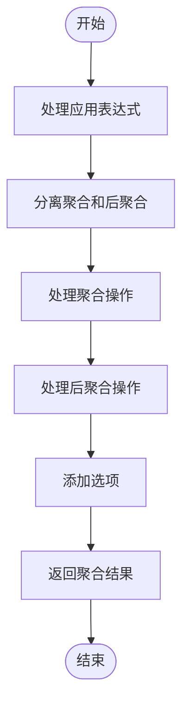
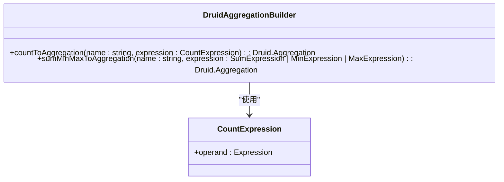
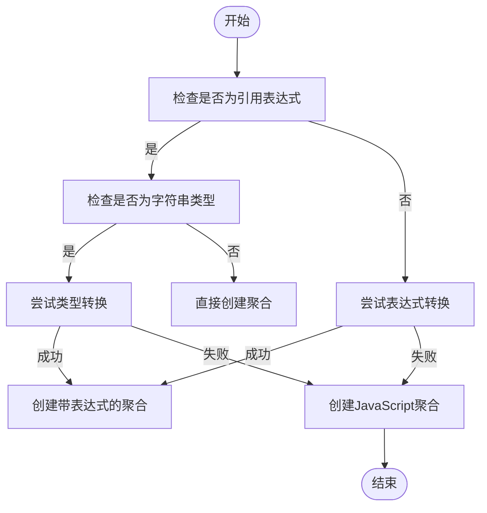
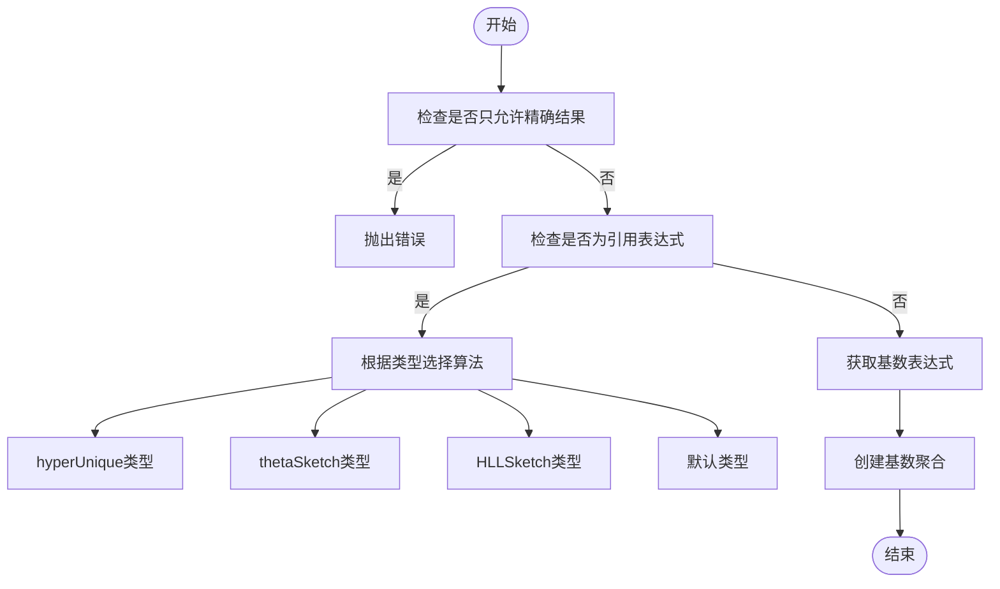
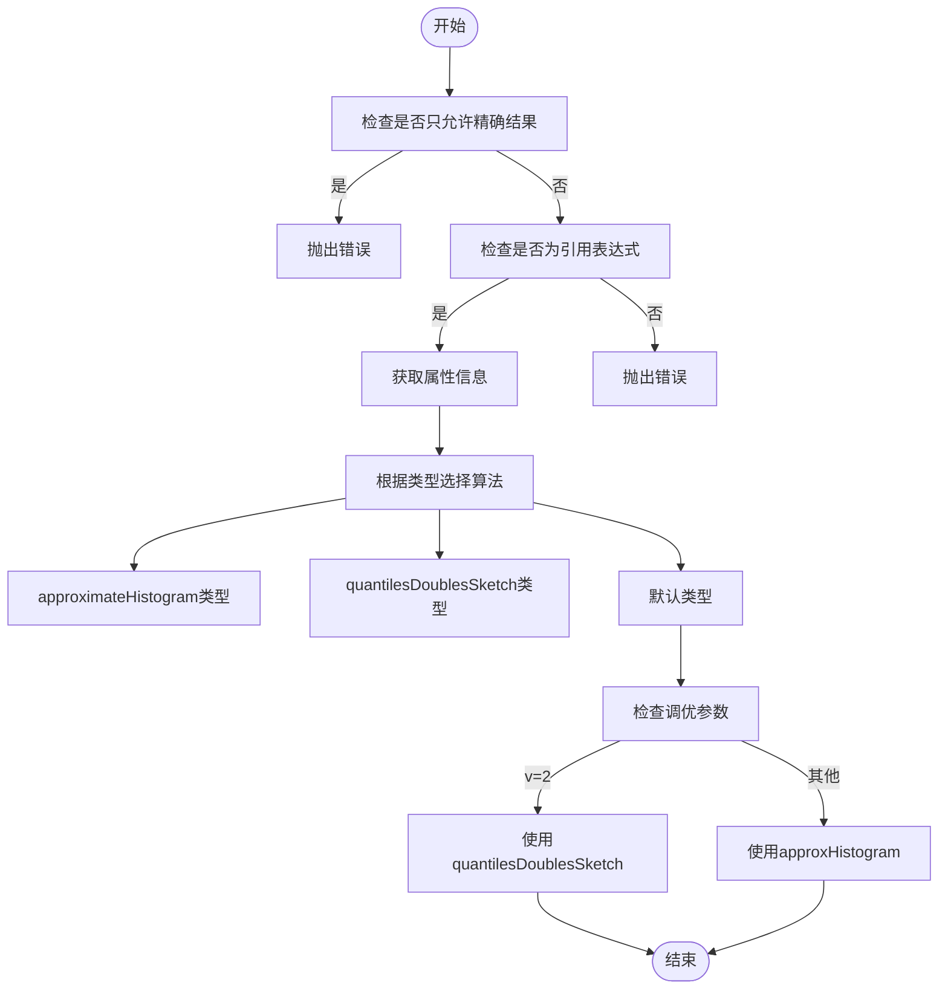
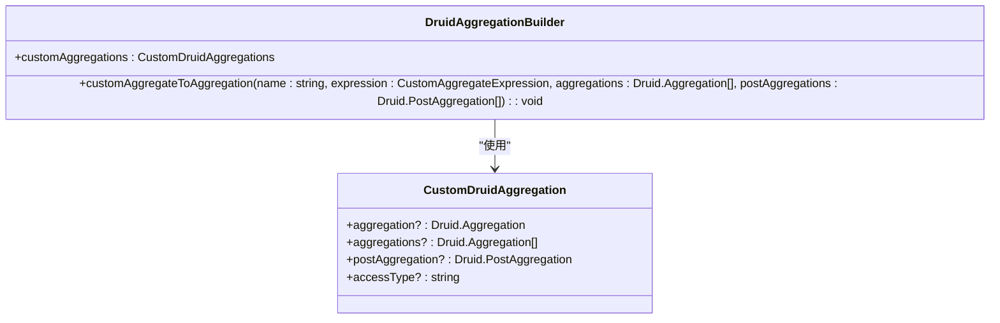
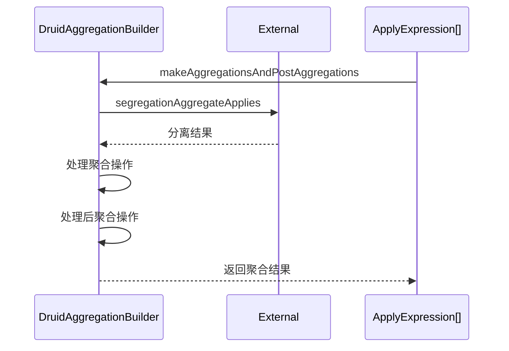
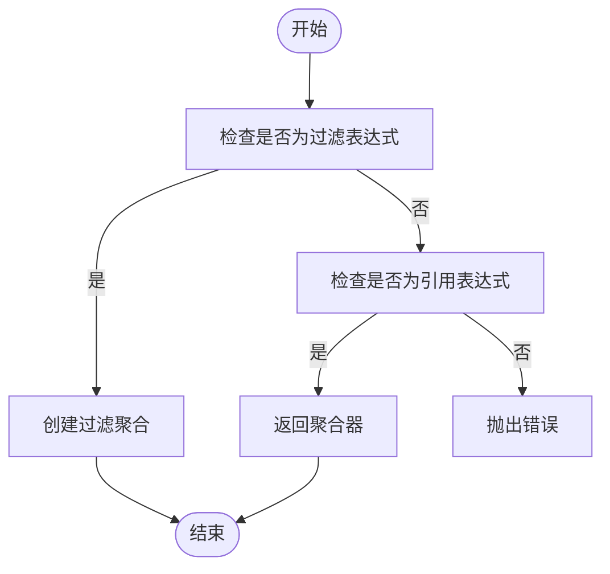
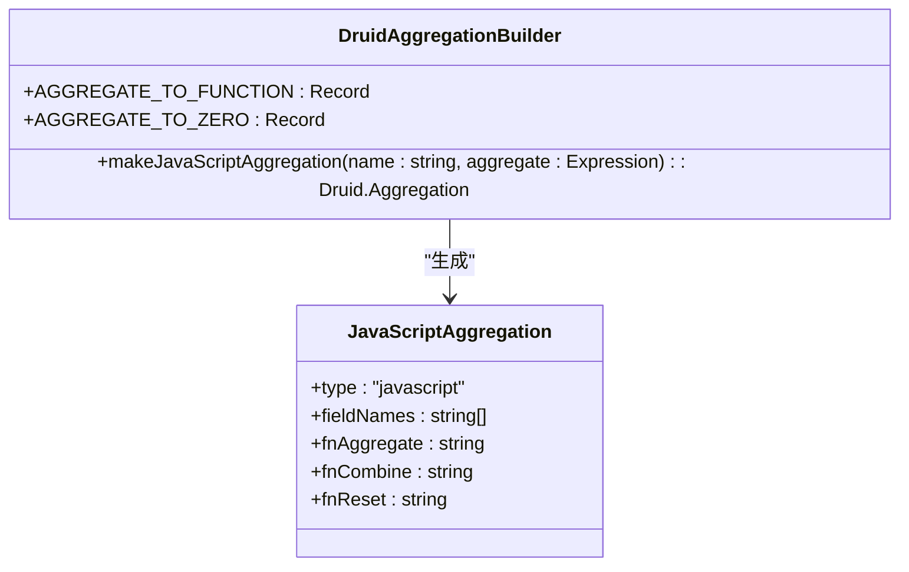
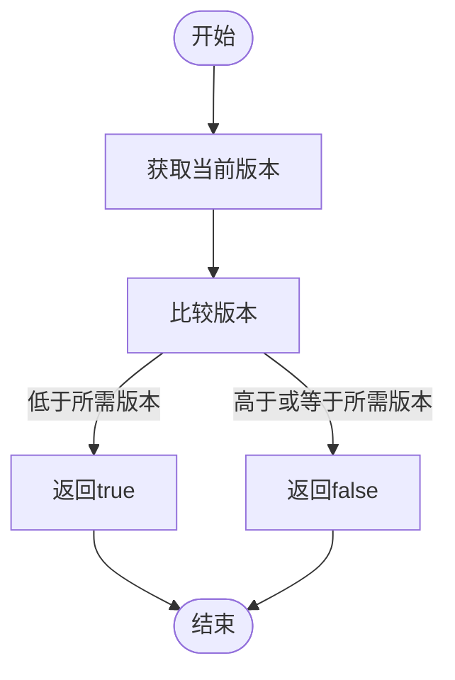

# Druid聚合构建

<cite>
**本文档引用的文件**   
- [druidAggregationBuilder.ts](file://src/external/utils/druidAggregationBuilder.ts)
- [druidTypes.ts](file://src/external/utils/druidTypes.ts)
- [countExpression.ts](file://src/expressions/countExpression.ts)
- [sumExpression.ts](file://src/expressions/sumExpression.ts)
- [countDistinctExpression.ts](file://src/expressions/countDistinctExpression.ts)
- [quantileExpression.ts](file://src/expressions/quantileExpression.ts)
- [druidExpressionBuilder.ts](file://src/external/utils/druidExpressionBuilder.ts)
- [druidFilterBuilder.ts](file://src/external/utils/druidFilterBuilder.ts)
- [attributeInfo.ts](file://src/datatypes/attributeInfo.ts)
</cite>

## 目录
1. [引言](#引言)
2. [核心聚合转换机制](#核心聚合转换机制)
3. [基本聚合实现](#基本聚合实现)
4. [复杂聚合实现](#复杂聚合实现)
5. [自定义聚合配置](#自定义聚合配置)
6. [过滤条件处理](#过滤条件处理)
7. [JavaScript聚合降级策略](#javascript聚合降级策略)
8. [版本兼容性处理](#版本兼容性处理)
9. [性能优化建议](#性能优化建议)
10. [常见问题解决方案](#常见问题解决方案)

## 引言

DruidAggregationBuilder类是Plywood框架中的核心组件，负责将Plywood表达式转换为Druid原生聚合。该类通过一系列方法实现了从高级表达式到底层聚合的转换过程，支持基本聚合、复杂聚合以及自定义聚合的构建。本文档深入解析该类的实现机制，重点阐述各种聚合类型的转换逻辑和配置方法。

**Section sources**
- [druidAggregationBuilder.ts](file://src/external/utils/druidAggregationBuilder.ts#L74-L741)

## 核心聚合转换机制

DruidAggregationBuilder类通过`makeAggregationsAndPostAggregations`方法实现聚合的构建过程。该方法首先对应用表达式进行分离，将聚合操作和后聚合操作分别处理，然后依次调用相应的转换方法生成Druid聚合和后聚合。

**Diagram sources **
- [druidAggregationBuilder.ts](file://src/external/utils/druidAggregationBuilder.ts#L127-L151)

**Section sources**
- [druidAggregationBuilder.ts](file://src/external/utils/druidAggregationBuilder.ts#L127-L151)

## 基本聚合实现

### Count聚合

Count聚合的转换通过`countToAggregation`方法实现。该方法创建一个类型为'count'的Druid聚合，并根据需要应用过滤条件。

**Diagram sources **
- [druidAggregationBuilder.ts](file://src/external/utils/druidAggregationBuilder.ts#L215-L220)
- [countExpression.ts](file://src/expressions/countExpression.ts#L1-L47)

**Section sources**
- [druidAggregationBuilder.ts](file://src/external/utils/druidAggregationBuilder.ts#L215-L220)

### Sum、Min、Max聚合

Sum、Min、Max聚合的转换通过`sumMinMaxToAggregation`方法实现。该方法根据表达式的类型和属性信息，生成相应的Druid聚合。

**Diagram sources **
- [druidAggregationBuilder.ts](file://src/external/utils/druidAggregationBuilder.ts#L222-L262)

**Section sources**
- [druidAggregationBuilder.ts](file://src/external/utils/druidAggregationBuilder.ts#L222-L262)

## 复杂聚合实现

### CountDistinct聚合

CountDistinct聚合的转换通过`countDistinctToAggregation`方法实现。该方法根据属性的原生类型，选择相应的基数估计算法。

**Diagram sources **
- [druidAggregationBuilder.ts](file://src/external/utils/druidAggregationBuilder.ts#L284-L388)

**Section sources**
- [druidAggregationBuilder.ts](file://src/external/utils/druidAggregationBuilder.ts#L284-L388)

### Quantile聚合

Quantile聚合的转换通过`quantileToAggregation`方法实现。该方法根据属性的原生类型，选择相应的分位数估计算法。

**Diagram sources **
- [druidAggregationBuilder.ts](file://src/external/utils/druidAggregationBuilder.ts#L428-L533)

**Section sources**
- [druidAggregationBuilder.ts](file://src/external/utils/druidAggregationBuilder.ts#L428-L533)

## 自定义聚合配置

### 自定义聚合实现

自定义聚合的转换通过`customAggregateToAggregation`方法实现。该方法从配置中获取自定义聚合定义，并生成相应的Druid聚合。

**Diagram sources **
- [druidTypes.ts](file://src/external/utils/druidTypes.ts#L21-L31)
- [druidAggregationBuilder.ts](file://src/external/utils/druidAggregationBuilder.ts#L390-L426)

**Section sources**
- [druidAggregationBuilder.ts](file://src/external/utils/druidAggregationBuilder.ts#L390-L426)

### 聚合和后聚合分离

聚合和后聚合的分离处理通过`segregationAggregateApplies`方法实现。该方法将应用表达式分为聚合操作和后聚合操作两类。

**Diagram sources **
- [druidAggregationBuilder.ts](file://src/external/utils/druidAggregationBuilder.ts#L127-L151)
- [baseExternal.ts](file://src/external/baseExternal.ts#L1-L1978)

**Section sources**
- [druidAggregationBuilder.ts](file://src/external/utils/druidAggregationBuilder.ts#L127-L151)

## 过滤条件处理

过滤条件的处理通过`filterAggregateIfNeeded`方法实现。该方法检查表达式是否包含过滤条件，并相应地包装聚合。

**Diagram sources **
- [druidAggregationBuilder.ts](file://src/external/utils/druidAggregationBuilder.ts#L167-L183)

**Section sources**
- [druidAggregationBuilder.ts](file://src/external/utils/druidAggregationBuilder.ts#L167-L183)

## JavaScript聚合降级策略

当无法直接转换为原生Druid聚合时，系统会降级到JavaScript聚合。这一过程通过`makeJavaScriptAggregation`方法实现。

**Diagram sources **
- [druidAggregationBuilder.ts](file://src/external/utils/druidAggregationBuilder.ts#L535-L556)

**Section sources**
- [druidAggregationBuilder.ts](file://src/external/utils/druidAggregationBuilder.ts#L535-L556)

## 版本兼容性处理

版本兼容性通过`versionBefore`方法实现，确保生成的聚合与指定的Druid版本兼容。

**Diagram sources **
- [druidAggregationBuilder.ts](file://src/external/utils/druidAggregationBuilder.ts#L734-L741)

**Section sources**
- [druidAggregationBuilder.ts](file://src/external/utils/druidAggregationBuilder.ts#L734-L741)

## 性能优化建议

1. **优先使用原生聚合**：尽量使用Druid原生支持的聚合类型，避免JavaScript聚合的性能开销。
2. **合理配置基数估计算法**：根据数据特性和精度要求选择合适的基数估计算法。
3. **避免复杂表达式**：简化聚合表达式，减少计算复杂度。
4. **利用rollup优化**：在数据已预聚合的情况下，启用rollup模式以提高查询性能。

**Section sources**
- [druidAggregationBuilder.ts](file://src/external/utils/druidAggregationBuilder.ts#L74-L741)

## 常见问题解决方案

1. **聚合转换失败**：检查表达式是否支持转换，确保属性类型正确。
2. **精度问题**：对于需要精确结果的场景，避免使用近似算法。
3. **版本不兼容**：确认Druid版本与配置要求匹配。
4. **性能瓶颈**：分析查询计划，优化聚合表达式和索引配置。

**Section sources**
- [druidAggregationBuilder.ts](file://src/external/utils/druidAggregationBuilder.ts#L74-L741)